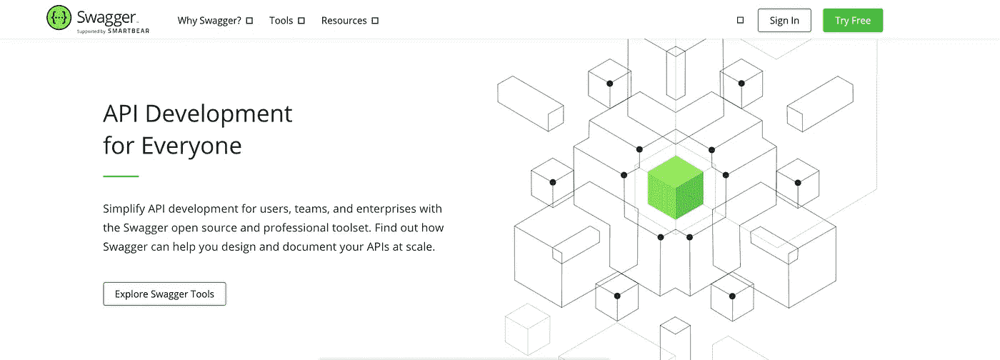

# 22 个最佳实践，让您的 API 设计技能更上一层楼

> 原文：<https://betterprogramming.pub/22-best-practices-to-take-your-api-design-skills-to-the-next-level-65569b200b9>

## 设计 REST APIs 的实用建议


图片来自 [Pexels](https://www.pexels.com/photo/man-in-red-polo-shirt-thought-a-good-idea-3779432/?utm_content=attributionCopyText&utm_medium=referral&utm_source=pexels) 的[安德里亚·皮亚卡迪奥](https://www.pexels.com/@olly?utm_content=attributionCopyText&utm_medium=referral&utm_source=pexels)

有没有因为一个糟糕的 API 而感到沮丧，在这个 API 中一切都是猜谜游戏？嗯，我有。

在这个微服务的世界里，后端 API 的一致设计是必不可少的。

今天，我们将讨论一些可以遵循的最佳实践。我们会让它简短而甜蜜——所以系好安全带！

# 首先，一些术语

任何 API 设计都遵循一种叫做`[Resource Oriented Design](https://cloud.google.com/apis/design/resources)` 的东西，它由三个关键概念组成

*   **资源:**资源是一段数据，例如**一个用户**。
*   **集合:**一组资源称为一个集合。示例:**用户列表**
*   **URL:** 标识资源或集合的位置。示例:`/user`

# 1.对 URL 使用烤肉串大小写

例如，如果您想获得订单列表。

## 不好:

```
**/systemOrders** or **/system_orders**
```

## 好:

```
**/system-orders**
```

# 2.使用 camelCase 作为参数

例如，如果您想从特定的商店购买产品。

## 不好:

```
/system-orders/{order_id} or /system-orders/{OrderId}
```

## 好:

```
/system-orders/{orderId}
```

# 3.指向集合的复数名称

如果你想得到一个系统的所有用户。

## 不好:

```
GET /user or GET /User
```

## 好:

```
GET /users
```

# 4.URL 以集合开始，以标识符结束

如果想保持概念的单数和一致。

## 不好:

```
GET /shops/:shopId/category/:categoryId/price
```

这很糟糕，因为它指向的是属性而不是资源。

## 好:

```
GET /shops/:shopId/ or GET /category/:categoryId
```

# 5.让动词远离你的资源 URL

不要在 URL 中使用动词来表达你的意图。相反，使用适当的 HTTP 方法来描述操作。

## 不好:

```
POST /updateuser/{userId} or GET /getusers
```

## 好:

```
PUT /user/{userId}
```

# 6.对非资源 URL 使用动词

您有一个只返回一个操作的端点。在这种情况下，你可以用动词。例如，如果您想向用户重新发送警报。

## 好:

```
POST /alerts/245743/resend
```

请记住，这些不是我们的 CRUD 操作。相反，这些是在我们的系统中完成特定工作的功能。

# 7.将 camelCase 用于 JSON 属性

如果您正在构建一个请求体或响应是 JSON 的系统，那么属性名应该在`camelCase`中

**不好**

```
{
   user_name: "Mohammad Faisal"
   user_id: "1"
}
```

**好的**

```
{
   userName: "Mohammad Faisal"
   userId: "1"
}
```

# 8.监视

RESTful HTTP 服务必须实现`/health`和`/version`以及`/metrics` API 端点。他们将提供以下信息。

## /健康

用一个`200 OK`状态码响应对`/health`的请求。

## /版本

用版本号响应对`/version`的请求。

## `/**metrics**`

这个端点将提供各种度量，比如平均响应时间。

也强烈建议使用`/debug` 和 `/status`端点。

# 9.不要使用 table_name 作为资源名称

不要仅仅使用表名作为资源名。从长远来看，这种懒惰是有害的。

**坏:**

**好:** `product-orders`

这是因为公开底层架构不是您的目的。

# 10.使用 API 设计工具

有许多优秀的 API 设计工具可用于优秀的文档，例如:

*   [API 蓝图](https://apiblueprint.org/)
*   [大摇大摆](https://swagger.io/)



时髦的

拥有良好而详细的文档可以为您的 API 消费者带来良好的用户体验。

# 11.使用简单的序数作为版本

始终对 API 使用版本控制，并将其移动到左侧，以便它具有最高的范围。版本号应为`v1`、`v2`等。

## 好:

```
http://api.domain.com/v1/shops/3/products
```

始终在 API 中使用版本控制，因为如果外部实体更改正在使用 API 的端点，可能会破坏它们的功能。

# 12.在您的回答中包括资源总数

如果一个 API 返回一个对象列表，总是在响应中包含资源的总数。您可以为此使用`total`属性。

## 不好:

```
{
  users: [ 
     ...
  ]
}
```

## 好:

```
{
  users: [ 
     ...
  ], total: 34
}
```

# 13.接受极限和偏移参数

在`GET`操作中始终接受`limit`和`offset`参数。

## 好:

```
GET /shops?offset=5&limit=5
```

这是因为它是前端分页所必需的。

# 14.获取字段查询参数

还应该考虑返回的数据量。添加一个`fields`参数，只暴露 API 中的必需字段。

## 示例:

只返回商店的名称、地址和联系方式。

```
GET /shops?fields=id,name,address,contact
```

在某些情况下，它还有助于减少响应大小。

# 15.不要在 URL 中传递身份验证令牌

这是一个非常糟糕的做法，因为 URL 经常被记录，而且身份验证令牌也会被不必要地记录。

## 严重的

```
GET /shops/123?token=some_kind_of_authenticaiton_token
```

## 好的

相反，用标题传递它们:

```
Authorization: Bearer xxxxxx, Extra yyyyy
```

此外，授权令牌应该是短命的

# 16.验证内容类型

服务器不应假定内容类型。例如，如果您接受`application/x-www-form-urlencoded`，那么攻击者可以创建一个表单并触发一个简单的 POST 请求。

所以，总是验证`content-type`，如果你想用默认的，使用`content-type: application/json`

# 17.对 CRUD 函数使用 HTTP 方法

HTTP 方法服务于解释 CRUD 功能的目的。

`GET`:检索资源的表示。

`POST`:创建新的资源和子资源。

`PUT`:更新现有资源。

`PATCH`:更新现有资源。它只更新提供的字段，而不更新其他字段

`DELETE`:删除现有资源。

# 18.将 URL 中的关系用于嵌套资源

一些实例如下:

*   `GET /shops/2/products`:获取 2 号店所有商品的清单。
*   `GET /shops/2/products/31`:获取商品 31 的详细信息，属于店铺 2。
*   `DELETE /shops/2/products/31`，应删除产品 31，它属于商店 2。
*   `PUT /shops/2/products/31`，应该更新产品 31 的信息；仅在资源 URL 上使用`PUT`，而不是集合。
*   `POST /shops`，应该创建一个新店并返回创建的新店的详细信息。在集合 URL 上使用`POST`。

# 19.克-奥二氏分级量表

一定要支持所有面向公众的 API 的 CORS(跨源资源共享)头。

考虑支持 CORS 允许的来源`“*”`，并通过有效的 OAuth 令牌强制授权。

避免将用户凭据与来源验证结合使用。

# 20.安全性

在所有终端、资源和服务上实施 HTTPS (TLS 加密)。

对所有回调 URL、推送通知端点和 webhooks 实施并要求 HTTPS。

# 21.错误

当客户端发出无效或不正确的请求，或者向服务传递无效或不正确的数据，而服务拒绝该请求时，就会发生服务错误。

示例包括无效的身份验证凭证、不正确的参数、未知的版本 id 等。

*   由于一个或多个服务错误而拒绝客户端请求时，请务必返回`4xx` HTTP 错误代码。
*   考虑处理所有属性并在单个响应中返回多个验证问题。

# 22.金科玉律

如果你对 API 格式化的决定有疑问，这些黄金法则可以帮助我们做出正确的决定。

*   扁平的比嵌套的好。
*   简单比复杂好。
*   字符串比数字好。
*   一致性比定制好。

就这样——如果你已经走了这么远，恭喜你！我希望你学到了一些东西。

我希望你有美好的一天！

**有话要说？通过**[**LinkedIn**与我联系](https://www.linkedin.com/in/56faisal/)

[](https://javascript.plainenglish.io/45-npm-packages-to-solve-16-react-problems-a9ab18946224) [## 45 个 NPM 软件包解决 16 个 React 问题

### 关于如何选择完美的 npm 包的深入指导

javascript.plainenglish.io](https://javascript.plainenglish.io/45-npm-packages-to-solve-16-react-problems-a9ab18946224) [](/21-best-practices-for-a-clean-react-project-df788a682fb) [## 清洁 React 项目的 21 个最佳实践

### 提高代码质量的实用建议

better 编程. pub](/21-best-practices-for-a-clean-react-project-df788a682fb) 

## 资源:

*   [https://github.com/elsewhencode/project-guidelines](https://github.com/elsewhencode/project-guidelines)
*   [https://cloud.google.com/apigee/](https://cloud.google.com/apigee/)
*   [https://github . com/Byron dover/API-guidelines/blob/master/guidelines . MD # JSON-API-specification](https://github.com/byrondover/api-guidelines/blob/master/Guidelines.md#json-api-specification)