# 2019 年 React 开发者的 22 个神奇工具

> 原文：<https://betterprogramming.pub/22-miraculous-tools-for-react-developers-in-2019-7d72054e2306>

## 增强和增强您的 React 体验

丹尼斯·布伦德尔在 Unsplash 上拍摄的照片

众所周知，React 是一个 JavaScript 库，用于构建令人惊叹的用户界面。然而，并不是每个人都在使用相同的工具，或者知道有哪些优秀的工具可以帮助 React 开发体验变得更加有趣和主动。

如果你没有用过 React，或者你的朋友可能对使用 React 感兴趣，当他们问你为什么要使用这个库时，你会怎么回答？

除了告诉他们这个库有多棒(这应该是第一件事)，我还想提到开源社区创建的工具有助于将体验带到一个全新的兴奋水平。

以下是 2019 年你可以用来构建 React 应用的 22 个工具(这个列表是按照重要性排序的*而不是*)

# 1.Webpack 捆绑包分析器

有没有想过你的应用程序的哪些包或部分占用了所有的空间？嗯，你可以用 [Webpack Bundle Analyzer](https://github.com/webpack-contrib/webpack-bundle-analyzer) 找到答案。这个包将帮助您识别占用空间最大的输出文件。

它将创建一个活动的服务器，并向您展示您的包内容的交互式树形图可视化。在您的工具包中有了这个，您就能够看到呈现的文件位于何处，它们的 gzip 大小，解析的大小，以及它们的父/子。

好处呢？嗯，你可以根据你看到的优化你的 React 应用！

这是一张截图:

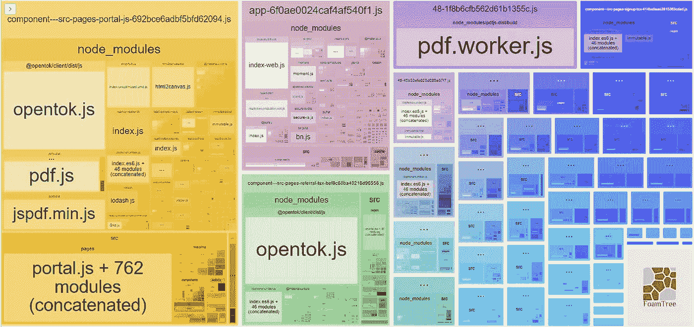

你可以清楚地看到 pdf 包在应用程序中占据了最大的空间。但它也占据了屏幕上最大的空间*。那是*非常*有用的。*

不过截图微乎其微。您还可以传递有用的选项来更详细地查看它，比如`generateStatsFile: true`，并且还可以选择生成一个静态 HTML 文件，您可以将它保存在开发环境之外的某个地方以供以后使用。

# 2.反应原型

[React-Proto](https://github.com/React-Proto/react-proto) 是一款面向开发者和设计者的原型工具。这是桌面软件，所以你必须在使用前下载并安装软件。

这是一个正在使用的软件的例子:

该应用程序允许您声明 props 及其类型，在树中查看您的组件，导入背景图像，将它们定义为有状态或无状态，定义它们的父组件，放大/缩小，并将您的原型导出到新的或现有的项目中。

不过，这款应用似乎更适合 Mac 用户，但对 Windows 用户来说也很好用。

绘制完用户界面后，您可以选择导出到现有项目或新项目。如果你选择导出到一个已存在的项目并选择你的根目录，它会将它们导出到`./src/components`，就像这样:

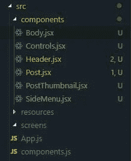

这是我们在示例中使用的一个组件的示例:

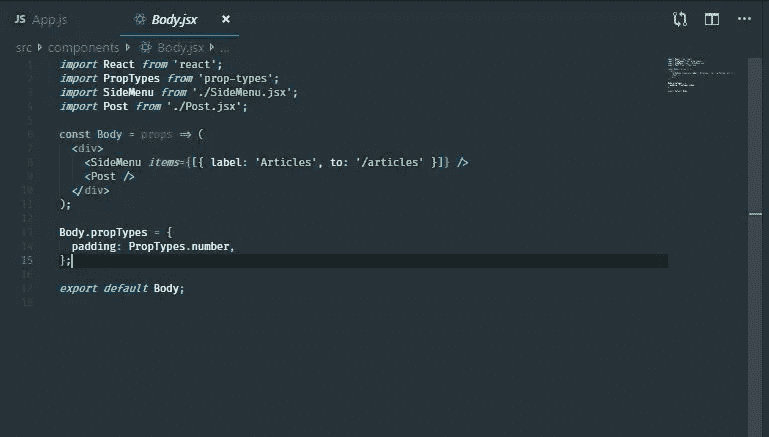

React-Proto 在 GitHub 上获得了超过 2000 颗恒星。

不过就个人而言，我认为这个应用需要更新和更多的工作，特别是随着 React Hooks 的发布。

它也不会缩小，除非你有一个可见的背景图像。换句话说，如果您导入背景图像，缩小，然后继续删除背景图像，您将无法放大，因为按钮是灰色的。

放大的唯一方法是重新导入背景图像，然后在放大后将其移除。这个缺陷改变了我对这个应用的看法，但它出现在这个列表中，因为我们在其他任何地方都没有看到这个开源的应用。

此外，开源是这个应用程序的一个优点，因为它有可能在未来成为趋势开源库列表。(他们的特色很重要，但似乎人手不足。)

# 3.你为什么渲染

[你为什么渲染](https://github.com/welldone-software/why-did-you-render)猴子补丁反应通知你可避免的重渲染。

这非常有用，不仅可以指导您修复项目的性能，还可以帮助您理解 React 是如何工作的。而且，当你对 React 的工作原理有了更好的理解，它会让你成为一个更好的 React 开发者。

您可以通过声明一个额外的静态属性`whyDidYouRender`并将它的值声明为`true`来将一个监听器附加到任何定制组件上:

只有在这样做之后，你的主机才会发出恼人的警告:

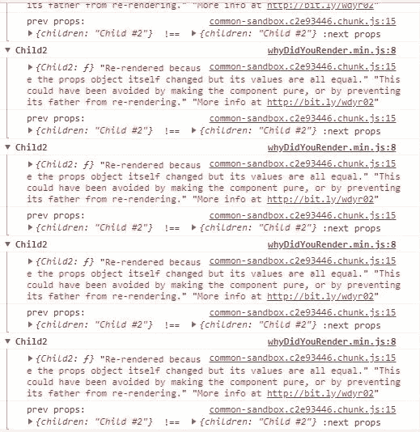

别想歪了。把它当成一件好事。利用这些恼人的消息，这样你就可以修复那些浪费的重新渲染，这些恼人的消息最终会离开你！

# 4.创建 React 应用

每个人都知道 [Create React App](https://github.com/facebook/create-react-app) 是开始开发 React 项目的最快方式(开箱即用，包含现代功能)。

还有什么比`npx create-react-app <name>`更容易的呢？

我所有关于中型构建的教程都使用了`create-react-app`的 React 接口，因为它简单快捷。

我们有些人可能不知道如何使用 CRA 创建一个 [TypeScript](https://www.typescriptlang.org/) 项目。你所要做的就是在末尾加上`--typescript`:

`npx create-react-app <name> — typescript`

这将省去您手动向 CRA 项目添加 TypeScript 的麻烦。

# 5.React 生命周期可视化工具

[React Lifecycle Visualizer](https://github.com/Oblosys/react-lifecycle-visualizer) 是一个 [npm](https://www.npmjs.com/) 包，用于跟踪和可视化任意 React 组件的生命周期方法。

与“为什么渲染”类似，您可以启用您选择的任何组件来显示生命周期可视化工具:

这将显示可视化工具，如下所示:

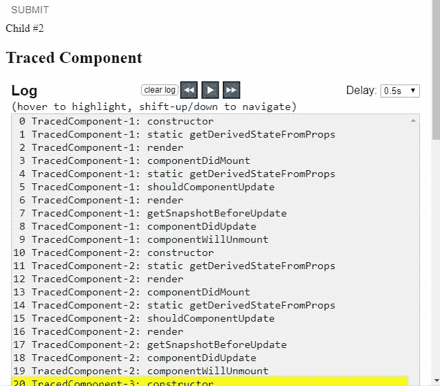

然而，这样做的一个缺点是它目前只对类组件有效，所以钩子还不被支持。(问题是*和*可能吗，因为这关乎生命周期？)

# 6.孔雀鱼

Guppy 是 React 的一个友好免费的应用程序管理器和任务运行器，运行在桌面上。

他们似乎会优先考虑 React 开发新手。但是，对于高级开发人员来说，它可能也很有用。

它为 React 开发人员经常面临的许多典型任务提供了友好的图形用户界面，例如创建新项目、执行任务和管理依赖关系。

2018 年 8 月增加了 Windows 支持，你可以放心，它是跨平台的。

这是孔雀鱼的样子:

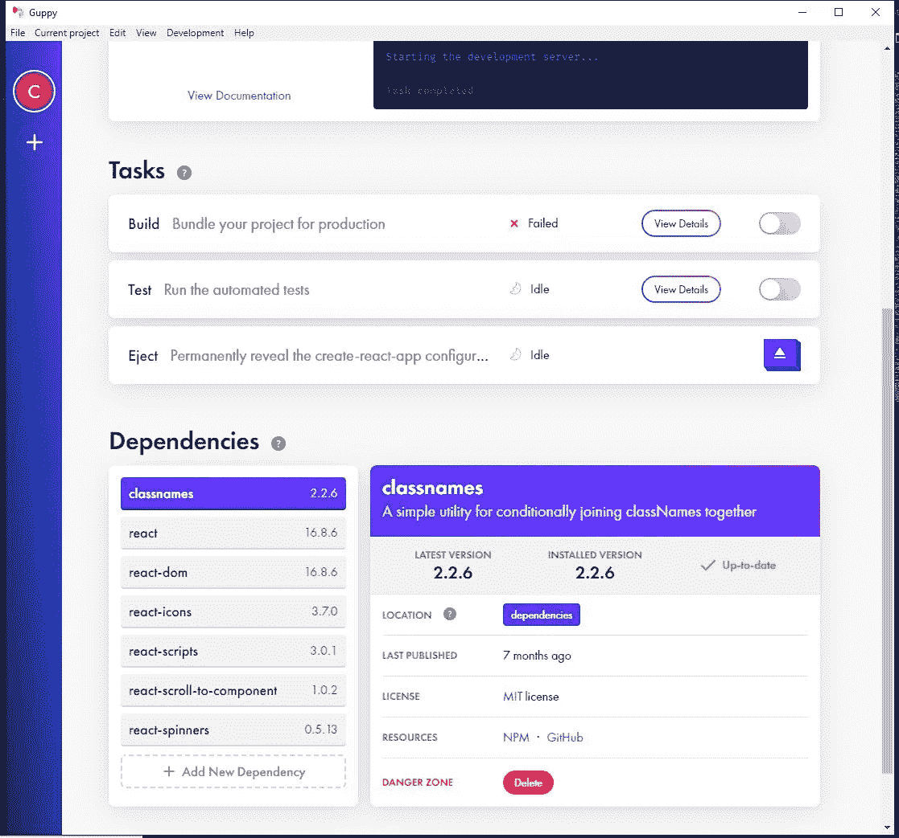

# 7.反应测试库

我一直很喜欢 [react-testing-library](https://github.com/testing-library/react-testing-library) ，因为当你在写单元测试的时候*感觉很好*。这个包提供了鼓励良好测试实践的 React DOM 测试工具。

这个解决方案旨在解决测试实现细节的问题，而不是测试 React 组件的输入/输出，就像用户看到的那样。

测试实现细节并不是确保你的应用按预期工作的有效方法。

当然，您将能够对如何获取组件所需的数据、使用哪种排序方法等更有信心。但是，如果您必须更改实现的方式来指向不同的数据库，您的单元测试将会失败，因为它们是耦合逻辑的实现细节。

这是 react-testing-library 解决的一个问题，因为理想情况下，你只是希望你的用户界面能够工作，并最终正确地呈现出来。

只要这些组件仍能给出预期的输出，你如何获得这些组件的数据并不重要。

[这里有一个示例代码](https://react-testing-examples.com/jest-rtl/)，说明如何使用这个库来放置测试:

# 8.React 开发人员工具

[React 开发者工具](https://github.com/facebook/react-devtools)是一个扩展，允许在 Chrome 和 Firefox 开发者工具中检查 React 的组件层次结构。

这是这个列表中最常见的扩展，并且仍然是 React 开发人员用来调试他们的应用程序的最有用的工具之一。

# 9.少量

除了使用组件库，比如[的 Material-UI](https://material-ui.com/) 或者[的语义 UI React](https://react.semantic-ui.com/) ，还有一个很好的选择就是 [Bit](https://bit.dev/) 。

Bit 让您探索数以千计的开源组件，并让您使用它们来构建您的项目。

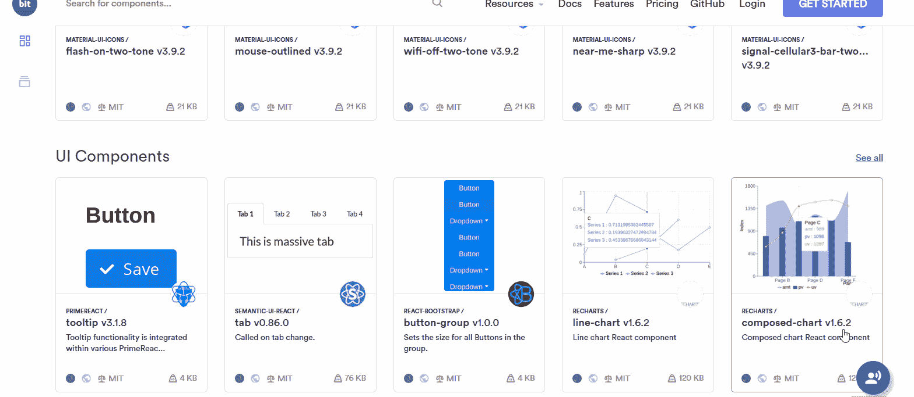

有许多不同的 React 组件可供任何人使用，包括选项卡、按钮、图表、表格、导航栏、下拉菜单、加载微调器、日期选择器、面包屑、图标、布局等。

这些都是其他 React 开发者上传的，就像你我一样。

但是，也有一些有用的实用程序，比如格式化日期之间的距离。

# 10.故事书

如果你还不知道 [Storybook](https://storybook.js.org) ，我强烈推荐你开始使用它，如果你想更容易的体验构建 UI 组件的话。

该工具启动了一个支持开箱即用的热重装的实时开发服务器，您可以在其中独立地实时开发 React 组件。

另一个好处是，您可以使用当前已有的开源附加组件，将您的开发体验提升到一个全新的水平。

例如，使用 [Storybook README](https://github.com/tuchk4/storybook-readme) 包，您可以在同一个页面上创建 README 文档，同时开发 React 组件以供生产使用。

这足以作为正常的文档页面:

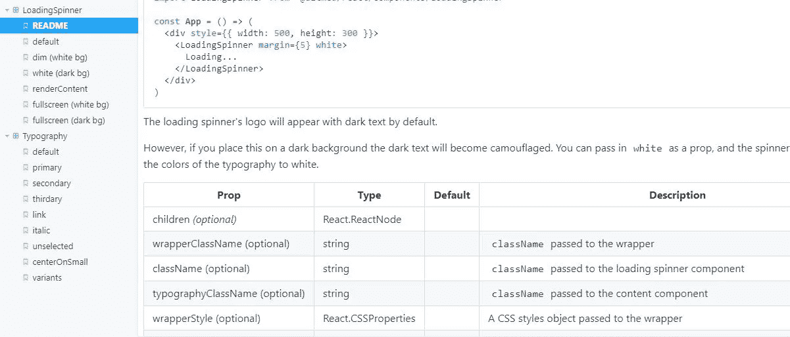

# 11.反应视力

你有没有想过你的应用程序在流程图中会是什么样子？嗯， [React Sight](https://www.reactsight.com/) 通过向您呈现整个应用程序的动态组件层次树，让您可视化 React 应用程序。

它还支持 [react-router](https://reacttraining.com/react-router/web/guides/quick-start) 、 [Redux](https://redux.js.org/introduction/getting-started) ，以及 [React Fiber](https://github.com/acdlite/react-fiber-architecture) 。

使用这个工具，您可以将鼠标悬停在*节点*上，这些节点是指向树中与它们直接相关的组件的链接。

如果您看不到结果，您可能想在地址栏中键入`chrome:extensions`，找到 React Sight 框，然后单击`Allow access to file URLs`开关，如下所示:

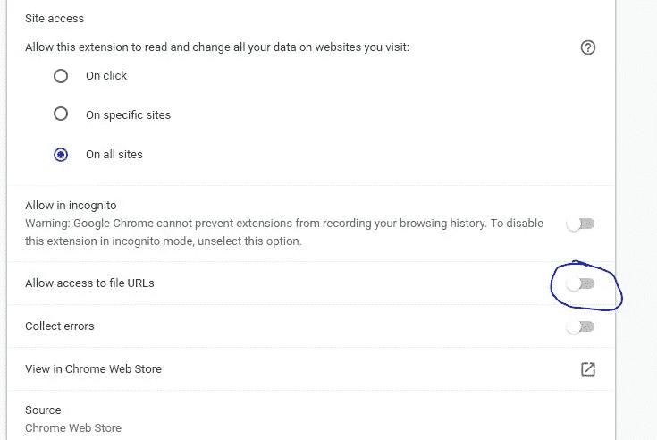

# 12.反应宇宙

[React Cosmos](https://github.com/react-cosmos/react-cosmos) 是一个用于创建可重用 React 组件的开发工具。

它扫描项目中的组件，使您能够:

1.  使用道具、上下文和状态的任意组合来呈现组件。
2.  模仿每一个外部依赖(例如 API 响应，`localStorage`等)。
3.  在与正在运行的实例进行交互的同时，查看应用状态的实时变化。

# 13.CodeSandbox

这无疑是让你的手脏起来的最好的工具之一，反应速度比眨眼还快(好吧，也许没那么快)。

这个叫做 *CodeSandbox* 的工具是一个在线编辑器，可以让你创建从原型到部署的 web 应用程序——全部从网站开始！

CodeSandbox 最初只支持早期阶段的 React，但他们现在已经扩展到库的附加入门模板，如 [Vue](https://vuejs.org/) 和 [Angular](https://angular.io/) 。

它们还支持通过创建带有常见静态站点生成器的项目来启动您的下一个 React web 项目，如 [Gatsby](https://www.gatsbyjs.org/) 或 [Next.js](https://nextjs.org/) 。

当谈到 CodeSandbox 时，有很多很棒的事情可以谈论。首先，它非常活跃。

如果您需要探索一些人们为了您的方便而正在构建的项目，很容易点击*探索*并获得大量代码示例来帮助改造您的下一个项目:

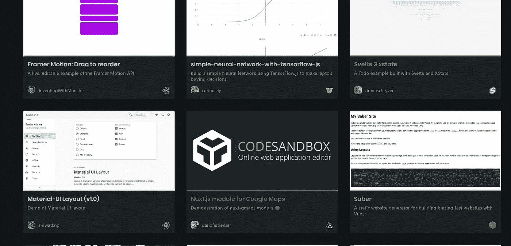

一旦你开始编辑一个项目，你会开始意识到你将要使用的实际上是 [VS 代码](https://code.visualstudio.com/)编辑器，它是*强大的*。

我很想写一整篇文章，介绍你今天可以在 CodeSandbox 上使用的所有功能，但看起来这项工作已经完成了。

# 14.反应位

[React Bits](https://vasanthk.gitbooks.io/react-bits/) 是一个 React 模式、技术、技巧和诀窍的集合，都以类似在线文档的格式编写，在这里你可以快速访问不同的设计模式和技术、反模式、样式、UX 变体和其他有用的 React 相关材料，都在同一个选项卡上。

他们有一个 [GitHub 回购](https://github.com/vasanthk/react-bits)，目前是 9923 星。

一些例子包括像 props proxying 这样的概念，在不同场景中处理各种 UX 的组合，甚至暴露了每个 React 开发人员都应该知道的一些问题。

这就是出现在他们页面上的感觉。正如你在左边的侧边菜单上看到的，有大量的信息:

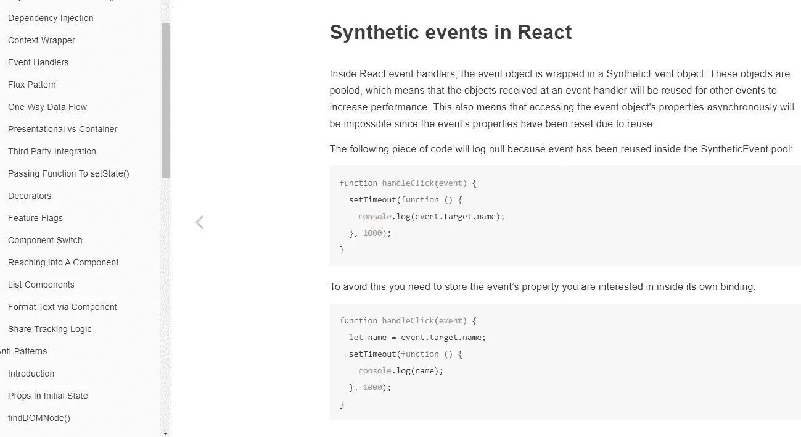

# 15.折叠

[folderize](https://marketplace.visualstudio.com/items?itemName=ee92.folderize) 是一个不到七天前发布的 VS 代码扩展。它让你把一个组件*文件*变成一个组件*文件夹*结构。您的 React 组件仍然是一个组件，只是现在被转换为一个目录。

例如，假设您正在创建一个 React 组件，该组件将文件作为道具来显示有用的信息，如它们的元数据。

元数据组件的逻辑占用了大量的行，所以您决定将它拆分到一个单独的文件中。但是，当您决定这样做时，现在您有两个相互关联的文件。

因此，如果您有一个如下所示的目录:

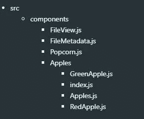

你可能想把`FileView.js`和`FileMetadata.js`抽象成一个目录结构，就像`Apples`——特别是如果你想添加更多与像`FileScanner.js`这样的文件相关的组件。

这就是 folderize 为您所做的，这样他们就可以得到类似这样的结构:

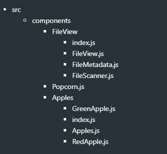

# 16.React 启动项目

这里有一个很棒的 [React starter 项目](https://www.javascriptstuff.com/react-starter-projects/)列表，你可以在一个页面上看到所有项目。所以，如果你是那种觉得同时面对一大堆选项很有用的人，那么这本书适合你。

一旦你看到一个你喜欢的启动项目，你可以简单地克隆这个库，并根据你即将发布的应用程序进行你自己的修改。

然而，并不是所有的文件都要在克隆存储库时使用，因为其中一些文件是要安装的，这就成为了项目的一个依赖项。

这使得获取更新更容易，并使您的项目更整洁。

页面看起来是这样的:

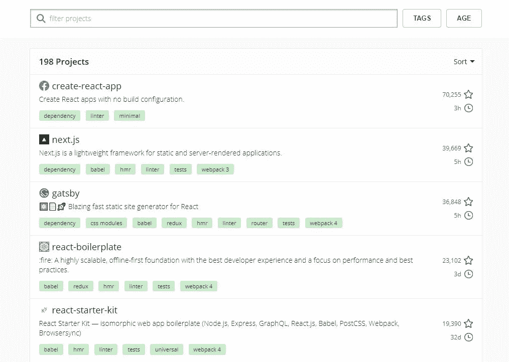

# 17.突出显示更新

这可以说是任何人的开发工具包中最重要的工具。[突出显示更新](https://reactjs.org/docs/optimizing-performance.html)是 React DevTools 扩展的一个特性，它可以查看页面中哪些组件被不必要地重新呈现:

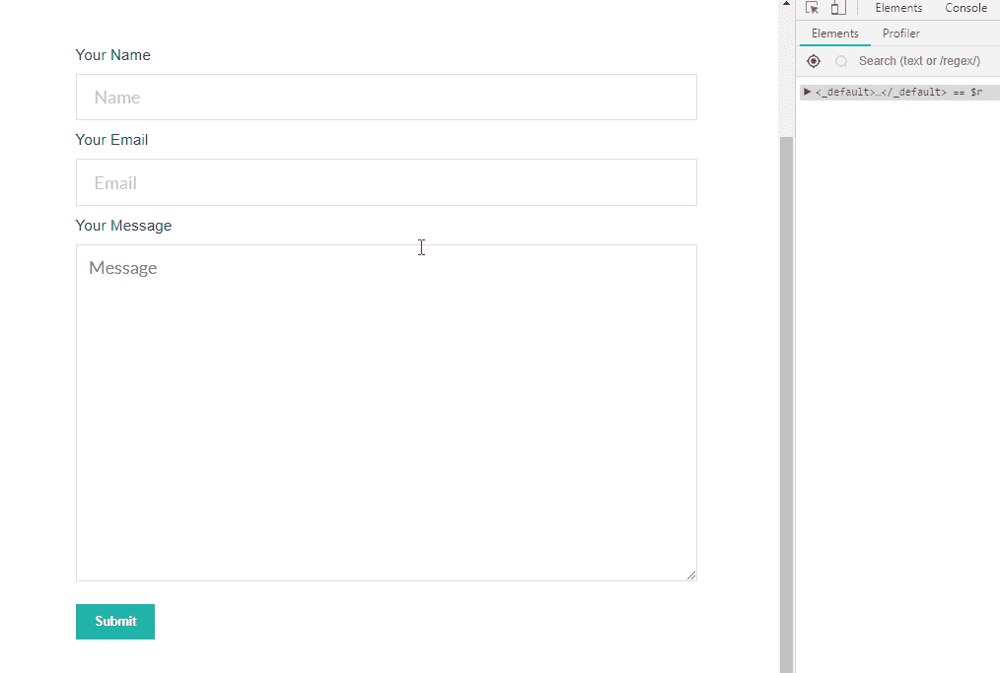

它有助于您在开发页面时发现瓶颈，并使之变得更加容易，因为它们用橙色或红色对严重的重新渲染问题进行了着色。

除非你的目标是构建一个平庸的应用程序，否则你为什么不想要这个漂亮的东西呢？

# 18.反应差异查看器

[React Diff Viewer](https://praneshravi.in/react-diff-viewer/) 是一个用 Diff 和 React 制作的简单漂亮的文本 Diff Viewer。它支持拆分视图、内嵌视图、单词区分、线条高亮等功能。

如果你试图将这一功能嵌入到你的笔记中(如 [Boostnote](https://boostnote.io/) )，并定制为更适合你的应用程序(主题颜色、文档与故事书演示的组合等)，这可能会很有用。)

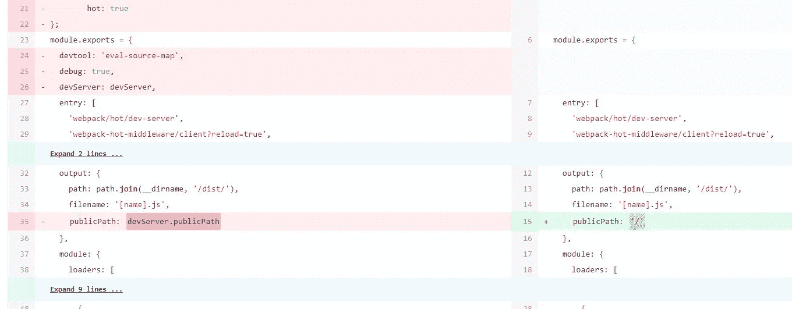

# 19.JS.coach

我最常用的寻找 React 相关资料的网站是 [JS.coach](https://js.coach/?collection=React) 。现在，我不知道为什么我没有看到很多关于这个宝石的提及，但我已经找到了我需要的任何东西。

它快速、简单、不断更新，并且总能为我的所有项目提供我需要的结果。

他们最近增加了 *React VR* tab，太精彩了！

# 20.厉害的反应

GitHub [Awesome React](https://github.com/enaqx/awesome-react) 开源库是 React 相关的牛逼东西的列表。

我可能会忘记其他网站，只通过这个链接学习 React。您会发现大量有用的资源，它们肯定会帮助您构建出色的 React 应用程序！

# 21.质子原生

[Proton Native](https://github.com/kusti8/proton-native) 为您提供一个 React 环境来构建跨平台的原生桌面应用。

它是[电子](https://electronjs.org/)的替代产品，具有一些简洁的功能，包括:

*   语法与 React Native 相同。
*   使用现有的 React 库，如 Redux。
*   跨平台。
*   本地组件。不再有电子。
*   兼容所有普通 [Node.js](https://nodejs.org/) 包。

有兴趣了解更多信息吗？阅读他们的[文档](https://proton-native.js.org/#/)。

# 22.Devhints React.js Cheatsheet

对于 React 来说，这是一个非常好的备忘单，尽管它缺少 React 挂钩。别担心，我将为 React v16.8+创建一个备忘单，敬请关注。

# 结论

这篇文章到此结束！我希望你已经在这里找到了有价值的信息，并期待在未来从我这里得到更多。