# POSIX 兼容 Shell 脚本应该避免的 24 Bashism

> 原文：<https://betterprogramming.pub/24-bashism-to-avoid-for-posix-compliant-shell-scripts-8e7c09e0f49a>

## 带示例的 POSIX 初学者指南


图片由作者使用 [Teffects blob](http://24 Bashism to Avoid for Posix-Compliant Shell Scripts) 制作。

# 介绍

Unix 可移植操作系统接口(POSIX)是由 IEEE 创建的国际标准。通过遵循 POSIX 标准，包括 Linux、macOS 和 Windows 在内的各种系统都可以执行您的脚本。

在本文中，您将了解 POSIX、它的命令以及如何使您的 Shell 脚本更符合 POSIX 的技巧。

当在 20 世纪 80 年代开发 UNIX 变体版本(System V 和 BSD 变体)时，shell 脚本的可移植性变得很困难。POSIX 标准化创建于 1988 年。每个操作系统都有不同的**默认**系统外壳，如下表所示:

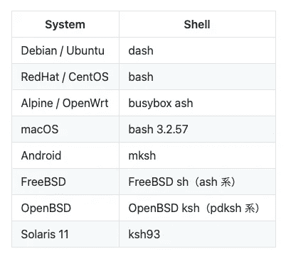

系统外壳/bin/sh 列表。

[Ubuntu 的默认登录 shell 仍然是 bash](https://wiki.ubuntu.com/DashAsBinSh) ，但是使用`#!/bin/sh` shebang 的脚本作为 POSIX dash 执行。Dash 比 Bash 体积更小，速度更快。

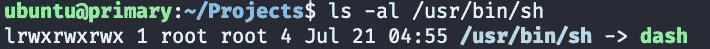

ls -al /usr/bin/sh 的输出表明它与 dash 符号链接。图片由作者提供。

POSIX 描述了应用程序和操作系统之间的契约。遵循 POSIX 之类的标准化可以让您的软件在尽可能多的类 UNIX 环境中运行。

## POSIX 外壳

由于 POSIX 是一个规范，所以不存在称为 POSIX shell 的 shell。您可以在许多 shells 中使用 POSIX 标准，例如，`dash`、`bash`、`ksh`、`mksh`、`yash`、`zsh`等。您需要知道每个 shell 都有自己的命令和选项，或者 POSIX 规范之外的不同选项。

## 所有的 POSIX shells 都有相同的命令吗？

POSIX 指定了类似 XSI 和更高版本的扩展。不同的 shells 安装不同的扩展，命令选项也可能不同。

## 在哪里可以找到规范和 POSIX 标准文档？

你可以在[Open Group Base Specifications Issue 7，2018 edition](https://pubs.opengroup.org/onlinepubs/9699919799.2018edition/) 中找到 POSIX 细节。该站点还包括一个 shell 命令参考。

## 什么是 POSIX shell 命令？

以下列表显示了所有 POSIX 命令及其说明。列表中有 [160 个命令。](https://gist.github.com/shinokada/fb2d10d8c1e02bb37ea9c9fada5ef042#file-posix-commands-cheatsheet-md)

## 我可以使用哪些工具来编写 POSIX 兼容代码？

Shellcheck 和`checkbashism`是编写 POSIX 兼容 shell 脚本的优秀工具。

## 外壳检查

Shellcheck 不会让您直接检查脚本是否符合 POSIX。但是，Shellcheck 检查是否符合`dash`外壳。Dash 的目标是与 POSIX 兼容，对于许多情况来说已经足够好了。

当您在终端中使用`shellcheck`时，您可以使用以下命令运行您的脚本:

```
shellcheck --shell=dash ./myscript.sh
```

如果使用 VS 代码编辑器，可以安装 Shellcheck 插件。它会根据您的提示发出警告，如下图所示:

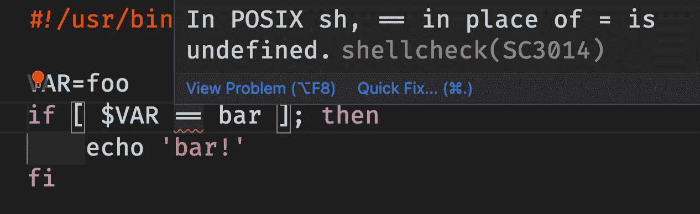

VSCode 扩展，Shellcheck，正在运行。作者截图。

## Checkbashims

`[checkbashism](https://manpages.ubuntu.com/manpages/bionic/man1/checkbashisms.1.html)`是一个检查 bashisms 的 Debian 脚本。在[安装好](https://command-not-found.com/checkbashisms)之后，你可以检查你的脚本:

```
checkbashisms ./myscript
```

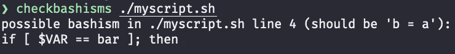

在终端上运行 checkbashisms。图片由作者提供。

# 如何运行 POSIX Shell

## 事情

按如下方式使用`/usr/bin/env sh`或`/bin/sh`进行切换:

```
#!/usr/bin/env sh
or
#!/bin/sh
```

然后运行它:

```
./my_script
```

## 破折号

dash shell 具有 POSIX 指定的特性，加上一些 Berkeley 扩展。

名称 Dash 是 Debian Almquist Shell 的缩写。Ubuntu 在 2006 年决定采用 Dash 作为默认的/bin/sh。

> " DASH 是/bin/sh 的一个符合 **POSIX 的**实现，其目标是尽可能的小。在可能的情况下，这样做不会牺牲**速度**。事实上，对于大多数任务来说，它比 bash(GNU Bourne-Again SHell)快得多。”—[http://gondor.apana.org.au/~herbert/dash/](http://gondor.apana.org.au/~herbert/dash/)

用`dash`运行您的脚本:

```
$ dash my_script
# or
$ dash my_script.sh
```

当您在脚本名称前使用破折号时，它会忽略 shebang 并为破折号设置一个 shell 环境。该脚本在 dash 环境中运行。

# 如何避免 Bashisms &非 POSIX 命令

Bashisms 是特定于 Bash 解释器的 shell 命令。POSIX 标准没有定义这些特性。

以下 24 个示例并不是完整的命令列表。它包括常见的 Bash 命令和 POSIX 标准中没有的规则。在可能的情况下，我添加了一个替代的 POSIX 代码。

## 关于本节中的示例

在这一节中，我使用 TECHIO 来运行 Bash 脚本。TECHIO 使用 BusyBox v1.31.1，运行脚本时使用 Bash。

技术环境。作者代码。

# 1.这里是琴弦

这里的文档是 POSIX 兼容的，但是这里的字符串不是。

以下示例适用于 Bash。checkbashisms 为示例的第二部分返回一个错误，因为它使用了一个 here 字符串。

[代码](https://tech.io/snippet/DEsYvl2)由作者举例说明。

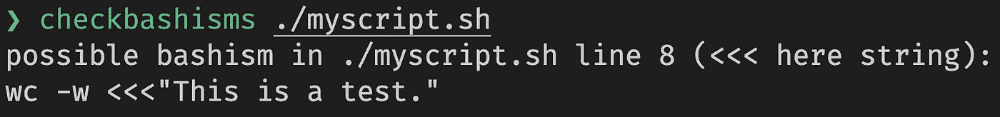

checkbashisms 的错误输出。图片由作者提供。

# 2.{}大括号扩展

大括号扩展用于在 Bash 中生成字符串。您不能将它用于 POSIX shell。

大括号扩展示例。作者代码。

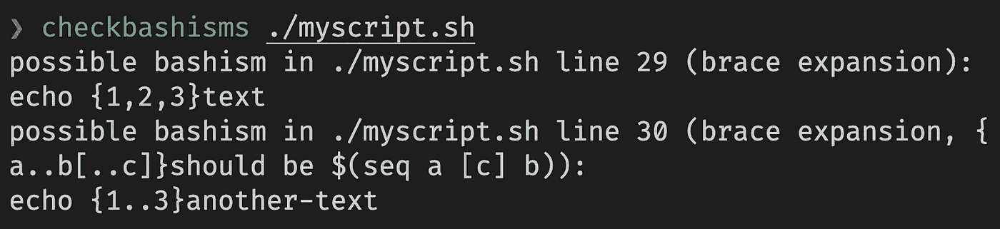

checkbashisms 的错误输出。图片由作者提供。

# 3.~对于主目录

使用`$HOME`作为 POSIX 中的主目录。POSIX 中没有定义主目录的符号`~`。

# 4.选择命令

在 Bash 中，`select`命令用于创建菜单，但在 POSIX 中没有定义。

选择命令示例。作者代码。

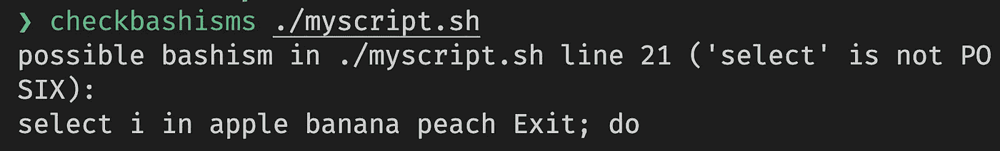

checkbashisms 的错误输出。图片由作者提供。

请改用`case`语句。

Case 语句示例。作者代码。

# 5.声明，排版命令

Bash 通过使用`declare`和`typeset`允许类类型行为。它们没有在 POSIX 中定义。定义没有这些关键字的变量。

声明示例。作者代码。

正如您在下图的第二个错误中看到的，POSIX 中没有定义该数组。

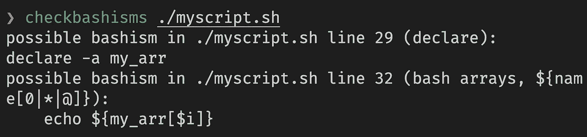

checkbashisms 的错误输出。图片由作者提供。

# 6.Function 关键字

`function`关键字在 Bash 中是可选的，但是在 POSIX 中没有定义。删除`function`关键字。POSIX shell 没有它也能正常工作。

函数示例。作者代码。

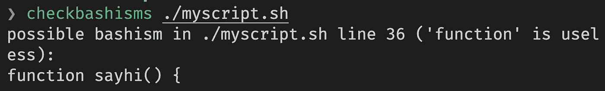

checkbashisms 的错误输出。图片由作者提供。

# 7.字母命令

`let`是一个 Bash 关键字，它允许创建一个带有简单算术求值的变量。为 POSIX shell 创建不带`let`关键字的变量。

举个例子。作者代码。

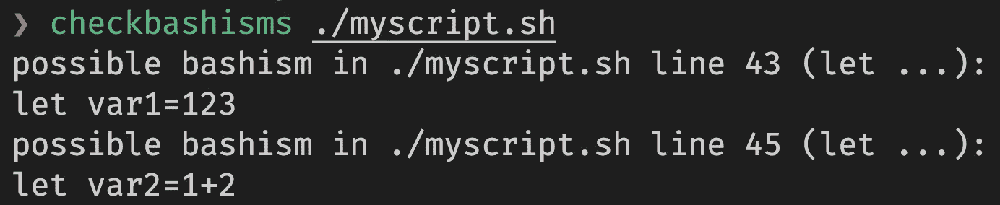

checkbashisms 的错误输出。图片由作者提供。

# 8.测试用单支架

在 Bash if 语句中，可以使用一个双括号，`[[`，命令。对于 POSIX shell，您需要使用单括号`[`命令。

使用双括号的 Bashism。作者代码。

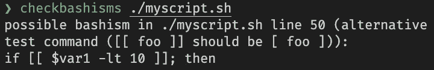

Shellcheck 的错误输出。图片由作者提供。

POSIX [作者代码](https://tech.io/snippet/qi2rccP)。

# 9.阅读选项

read 命令从标准输入中读取用户输入。使用唯一的`read -r`选项。`-p`选项是 Bashism。

带 r 和 p 选项的 read 命令。作者代码。

Shellcheck 发现`-p`在 POSIX 中是未定义的，但是 checkbashisms 不会给出错误。

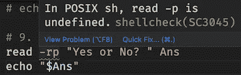

Shellcheck 的错误输出。图片由作者提供。

# 10.使用 2>&1 而不是& >重定向

重定向代码`&>`是 Bashism，没有在 POSIX 中定义。

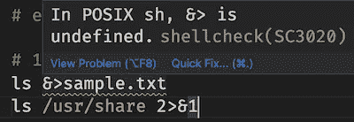

Shellcheck 的错误输出。图片由作者提供。

使用`2>&1`代替`&>`。

# 11.本地命令

声明为局部的变量是在 Bash 的函数中定义的。它在代码块中具有局部范围。

POSIX 中没有定义本地命令。不使用本地命令定义变量。

本地命令示例。作者代码。

Shellcheck 给你一个警告，但是 checkbashisms 让它通过。

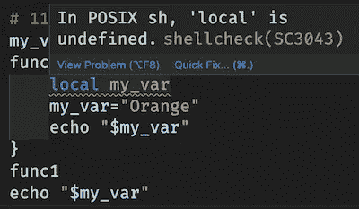

Shellcheck 的错误输出。图片由作者提供。

# 12.参数扩展

请参见 [POSIX Shell 参数扩展示例](https://medium.com/mkdir-awesome/posix-shell-parameter-expansion-explained-with-examples-31f40efedef0)了解更多细节和示例。

# 13.[ A == B ]

`==`操作符是一个 Bash 命令。使用一个等号`=`来表示 POSIX 兼容。

==和=示例。作者代码。

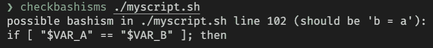

checkbashisms 输出一个可能的 bashism 警告。作者截图。

# 14.字符串索引

Bash 可以使用字符串索引从字符串中提取子字符串。

字符串索引示例。作者代码。

POSIX 中没有定义字符串索引。需要使用`cut`命令或参数扩展进行[子串处理](/27-simple-bash-scripting-tips-for-beginners-d6764c977546#01ab)。

# 15.使用。来源

当重新加载配置文件或读取外部文件时，使用`.`而不是`source`命令。POSIX 中没有定义`source`命令。

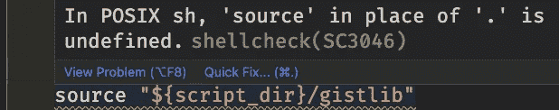

Shellcheck 的错误输出。图片由作者提供。

# 16.回声

不同的操作系统有不同的选项。如果使用回显选项，使用`printf`命令。

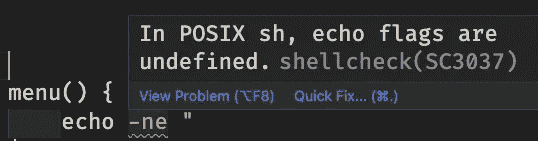

Shellcheck 的错误输出。图片由作者提供。

System V OSs 识别转义序列，如`\b`(退格)、`\t` (tab)等，但 BSD OSs 不识别。

一些 shells(包括 bash)实现了`echo -e`选项来扩展转义序列。如果您需要打印包含任何反斜杠字符的字符串，请使用`printf`命令，这是可移植的，也更可靠。

# 17\. ((…))

Bash 可以使用`((...))`测试整数。对于 POSIX 外壳，您必须使用单个支架`[`和`-gt`以及[其他操作器](/the-ultimate-programmers-guide-to-bash-scripting-2d11d4e6e978#89ad)。

整数测试示例。作者代码。

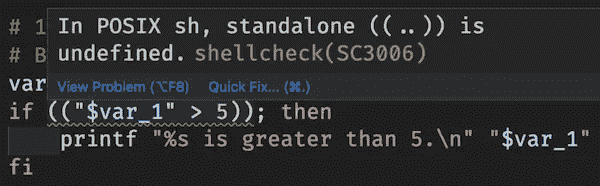

到处跑..))测试。作者截图。

# 18.排列

Bash 提供一维索引和关联数组变量。但是数组不是在 POSIX shell 中定义的。

数组示例。作者代码。

第 2–6 行:Bash 数组
第 9–11 行:如果项目没有空格，您可以使用`cut`命令剪切出一个选定的字段。
第 13–23 行:如果项目有空格，使用带有`for`语句的`set`命令。

## 复原

`unset`命令清除变量和函数的值和属性。它可以与数组一起使用来取消变量的设置。因为 POSIX 没有指定数组，所以不能使用`unset`命令来取消数组的设置。

# 19.检查字符串是否包含子字符串

您可以在 Bash 中使用一个[双括号](/the-ultimate-programmers-guide-to-bash-scripting-2d11d4e6e978#b994)来检查一个字符串是否包含子串。使用`case`语句是 POSIX shells 的另一种方式。

# 20.awk、sed 和 grep

GNU 命令有更多的扩展功能。你会发现比较[GNU awk](https://man7.org/linux/man-pages/man1/gawk.1.html)/[POSIX awk](https://pubs.opengroup.org/onlinepubs/9699919799/utilities/awk.html)、[GNU sed](https://man7.org/linux/man-pages/man1/sed.1.html)/[POSIX sed](https://pubs.opengroup.org/onlinepubs/9699919799/utilities/sed.html)和[GNU grep](https://man7.org/linux/man-pages/man1/grep.1.html)/[POSIX grep](https://pubs.opengroup.org/onlinepubs/9699919799/utilities/grep.html#tag_20_55)，

# 21.序列

`seq`命令是一个 Bash 命令。

# 22.别名-p

POSIX 中的`alias`命令没有选项，而 Bash 添加了一个`-p`选项。`-p`选项打印别名列表

```
random=$(hexdump -n 2 -e '/2 "%u"' /dev/urandom)
echo "$random"
```

# 23.阅读链接

请阅读 Readlink 的 [POSIX 替代方案](https://medium.com/mkdir-awesome/posix-alternatives-for-readlink-21a4bfe0455c)

# 24.随意

Bash 和其他 shells 有一个神奇的变量$RANDOM，它可以扩展为一个随机整数。但是在 POSIX 中没有定义。创建随机数的一种方法是组合输出进程 id 和日期值的`$$`。

随机数[示例](https://tech.io/snippet/yA15d25)使用日期和$$。作者代码。

另一个例子来自 [DashAsBinSh](https://wiki.ubuntu.com/DashAsBinSh) 。

随机[举例](https://tech.io/snippet/NrdV5KL)。作者代码。

# POSIX 中其他未定义的命令

还有更多命令没有在 POSIX 中定义。

`mapfile`、`mktemp`、`which`、`tac`、`test -a`

# 结论

你应该只用 POSIX 编码吗？命令严重依赖于它们的环境。如果您遵循 POSIX 指南，并不能保证不会出现问题。所以不要单纯依赖 POSIX。

在不同的环境中测试代码会消除隐藏的问题。使用 GNU Coreutils 是另一种解决方案。Linux 安装了 GNU Coreutils，macOS 可以用自制软件安装。

如果您必须使用与 POSIX 不兼容的依赖项，将代码与依赖项对齐可能是一个解决方案。

灵活一点！

您可以从《Arnold Robbins 和 Nelson H. F. Beebe 的经典 Shell 脚本》一书中了解更多关于 POSIX 的知识。该书于 2005 年出版，涵盖了基于 POSIX 的 shell 和实用程序。

**通过** [**成为**](https://blog.codewithshin.com/membership) **的会员，可以完全访问媒体上的每一个故事。**


[https://blog.codewithshin.com/subscribe](https://blog.codewithshin.com/subscribe)

# 参考

*   [开发到](https://dev.to/bowmanjd/writing-bash-scripts-that-are-not-only-bash-checking-for-bashisms-and-testing-with-dash-1bli)
*   [外壳命令语言](https://pubs.opengroup.org/onlinepubs/9699919799/idx/shell.html)
*   [外壳检查 SC2039](https://github.com/koalaman/shellcheck/wiki/SC2039)
*   [Bashism](https://mywiki.wooledge.org/Bashism)
*   [博客](https://qiita.com/ko1nksm/items/4a64aebd7f45e98f5def#comment-d8bf7cf5568b9409cb31)
*   [DashAsBinSh Wiki](https://wiki.ubuntu.com/DashAsBinSh)
*   [如何让 bash 脚本在 dash 中工作](https://mywiki.wooledge.org/Bashism)