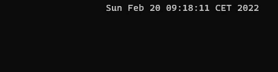
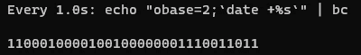
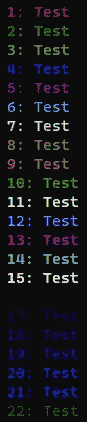
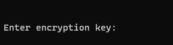
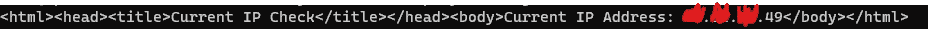
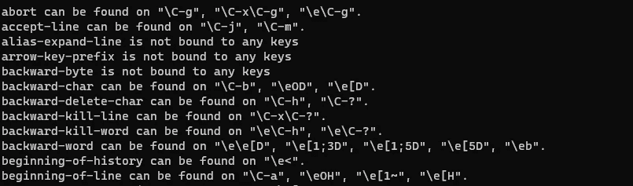
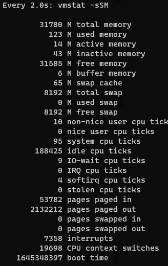
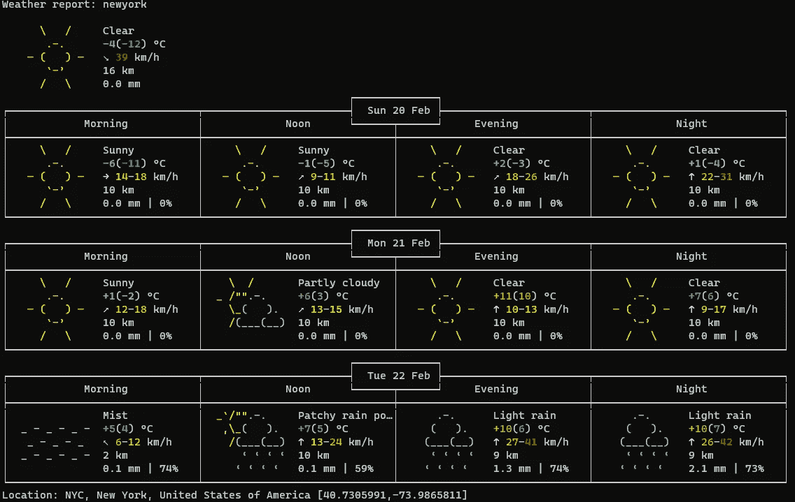

# 25 个非常棒的 Linux 命令行程序

> 原文：<https://betterprogramming.pub/25-awesome-linux-command-one-liners-9495f26f07fb>

## 在日常工作中节省时间，并从中获得乐趣


照片由来自 [Pexels](https://www.pexels.com/photo/crop-hacker-silhouette-typing-on-computer-keyboard-while-hacking-system-5240547/?utm_content=attributionCopyText&utm_medium=referral&utm_source=pexels) 的 [Anete Lusina](https://www.pexels.com/@anete-lusina?utm_content=attributionCopyText&utm_medium=referral&utm_source=pexels) 拍摄

我喜欢使用 Linux shell。shell 让您在几秒钟内完成工作，并且不需要使用任何图形环境。
在这篇文章中，我整理了 25 个我觉得特别有用或有趣的命令行程序。希望你喜欢！

## 1.通过控制台查询维基百科

```
#dig +short txt <keyword>.wp.dg.cx
#For example:$dig +short txt usa.wp.dg.cx"a. English is the official language of at least 28 states\226\128\148some sources give higher figures, based on differing definitions of \"official\". English and Hawaiian are both official languages in the state of Hawaii. [http://en.wikipedia.org/wiki/United_States](http://en.wikipedia.org/wiki/United_States)"
```

## 2.将落地钟放在右边的角落

将以下句子复制并粘贴到控制台的一行中:

```
$while sleep 1;do tput sc;tput cup 0 $(($(tput cols)-29));date;tput rc;done &
```



控制台右上角的时钟。

二进制时钟:



二进制时钟。

```
$watch -n 1 'echo "obase=2;`date +%s`" | bc'
```

## 3.安装一个临时 RAM 分区

您可以将它用作一个使用并丢弃分区。但是，一旦重新启动系统，分区和所有数据都将消失。

例如，它可以用于需要许多读/写操作来提高性能的程序或任务。

```
$mount -t tmpfs tmpfs /mnt -o size=2048m
```

上面的命令将在 tmpfs 中创建一个大小为 2048MB 的临时分区，并将其挂载到/mnt 目录下。

## 4.列出 bash 中 256 种颜色的数值

```
$for code in {0..255}; do [echo](https://linuxcommandlibrary.com/man/echo) -e "\e[38;05;${code}m $code: Test"; done
```



颜色和数值。

## 5.以 root 用户身份运行最后一个命令

```
$sudo !!
```

## 6.按名称终止进程

```
$pkill -x chrome
```

## 7.创建完整磁盘压缩映像

要在电脑上创建磁盘映像，您不需要任何第三方工具或程序。这样做就像使用命令一样简单:

if:原始磁盘，在这种情况下，sda。

```
$dd if=/dev/sda | gzip -c  > /path/to/my.disk.image.gz bs=1M
```

注意:如果你想克隆系统盘，你必须用一个实时版本来启动你的电脑，比如用 ubuntu live USB。确保没有分区是从源硬盘安装的

bs:将块大小设置为 1M。

恢复 de 系统:

```
$gunzip -c /path/to/my.disk.image.gz | dd of=/dev/sda
```

警告:使用 dd 命令时应该非常小心；它可以破坏数据。记住输入文件:<if>和输出文件:<of>的顺序。</of></if>

## 8.运行前面的命令并替换

```
$^aaa^bbb
```

## 9.限制进程的 CPU 使用率

首先，你要结 pid(进程标识号)。例如，找出 chrome 的 pid:

```
$pid of chrome
#for example: 1543
```

其次，设置您希望限制前一个进程的 CPU 使用率的百分比，在本例中为 25%。

```
$sudo cpulimit -p 1543-l 25
```

## 10.搜索先前在 BASH 中输入的匹配命令

```
$Ctrl-R <search-text>
```

## 11.每用户进程计数器

```
$ps hax -o user | sort | uniq -c
```

## 12.在当前目录的所有文件名中用另一个字符替换一个字符

您可以在 Debian、Ubuntu 及其衍生物上使用 Perl rename(其他发行版提供了不同的 rename 程序，该程序在这里没有帮助)。

```
File 1
File 2to File_1
File_2$rename -v 's/ /_/g' *
```

对于 ZSH 或 Z 外壳:

```
autoload zmv
zmv '(*)' '${1// /_}'
```

## 13.中间通过主机的 SSH 连接

```
$ssh -t reachable_host ssh unreachable_host
```

## 14.查找所有大于 5M 小于 10M 的文件

例如，用于搜索特定大小的日志文件。

```
$find / -type f -size +50M -size -10M
```

## 15.使用带有进度条的<rsync>命令进行复制</rsync>

```
$rsync -rv <src> <dst> --progress
```

## 16.检查您的计算机是 32 位还是 64 位

```
$getconf LONG_BIT
```

## 17.模拟在屏幕上打字

你可以通过控制打字速度来模拟在屏幕上打字，看起来像个黑客。

```
$echo "Lorem ipsum dolor sit amet, consectetuer adipiscing elit." | pv -qL 20
```

*   问:Quiet 根本不输出任何传输信息。
*   L: Rate-limit 速率限制每秒传输的字节数。


在屏幕上打字。

注意:您需要安装用于通过管道监控数据进度的< pv>实用程序。

```
$sudo apt install pv
```

## 18.显示进程的工作目录

注意:参见第 7 点以获得过程的 PID。

```
$pwdx pid
```

## 19.使用 vim 为文件设置密码保护

```
$vim -x file.txt
```



提示设置文件的密码。

## 20.按范围删除文件中的行

```
$sed -i <file> -re '<start>,<end>d'
```

## 21.获取我的公共 IP 地址。

```
$curl ifconfig.me$curl checkip.dyndns.org... or similars.
```



我的 IP 地址。

## 22.监控命令的进度

```
$pv a_big_file.txt | gzip > a_big_file.log.gz
```

注意:你需要安装< pv>工具。

## 23.列出所有 bash 快捷方式

```
bind -P
```



捷径。

## 24.以人类可读的方式监控内存使用情况

```
watch vmstat -sSM
```



内存使用。

## 25.空壳里的预测

```
curl wttr.in/newyork
```



wttr 纽约天气预报

## 额外:输入矩阵

```
$perl -e '$|++; while (1) { print " ." x (rand(10) + 1), int(rand(2)) }'
```


哦，我电脑里的矩阵！

如果你喜欢这篇文章，可以考虑通过我的[个人资料](https://kesk.medium.com/membership)订阅 Medium。谢谢大家！