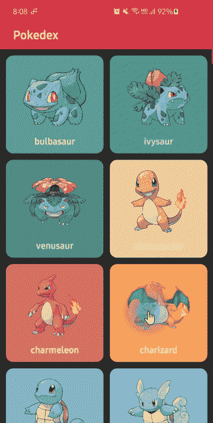
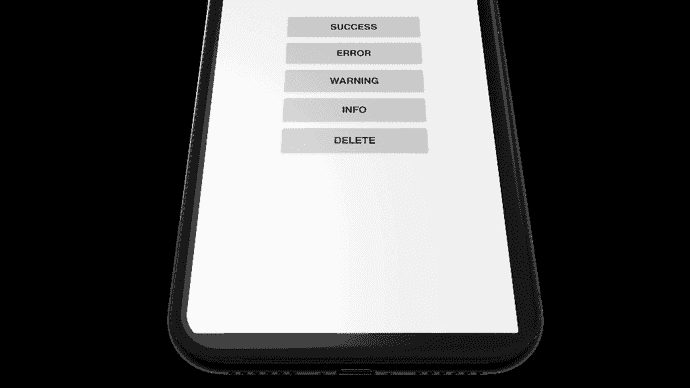
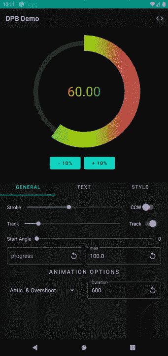
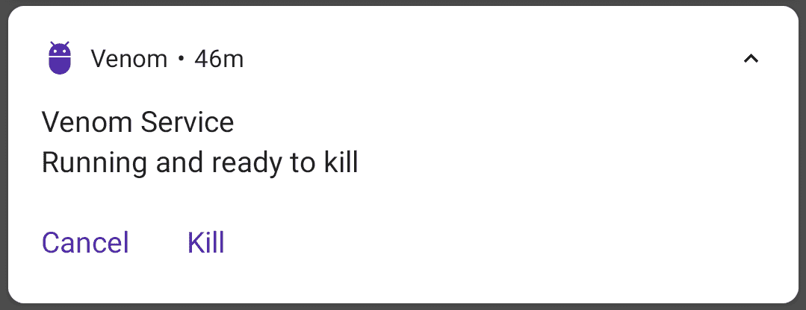
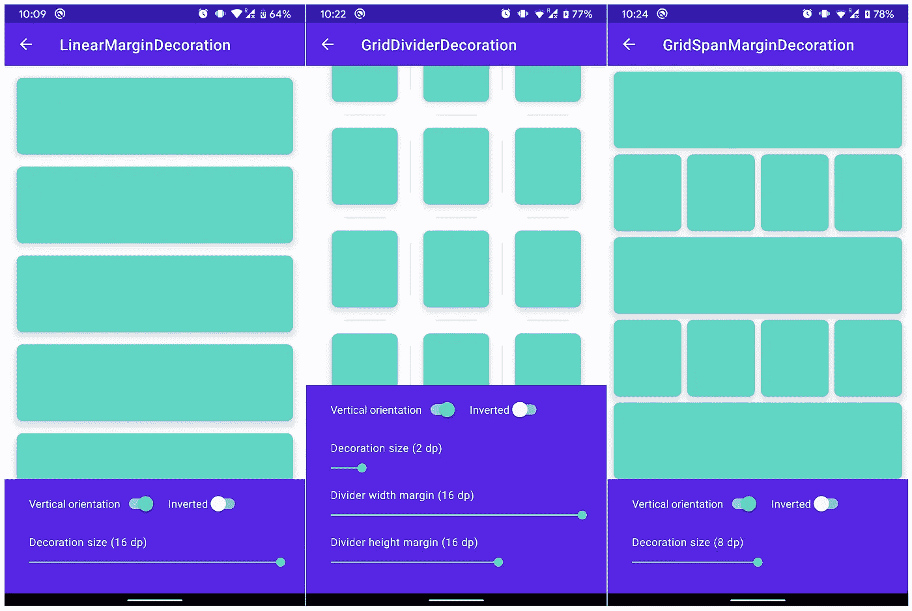
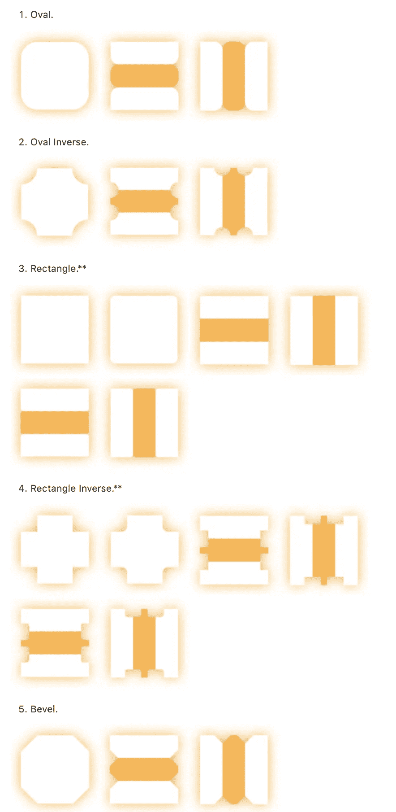
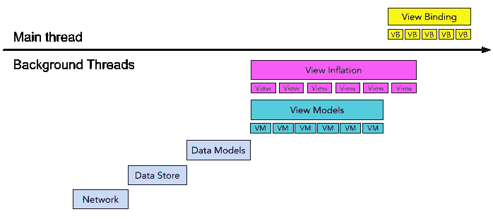

# 2020 年 25 个最佳 Android 库和项目—夏季版

> 原文：<https://betterprogramming.pub/25-best-android-libraries-projects-of-2020-summer-edition-dfb030a7fb0a>

## 2020 年上半年发布或大量更新的令人敬畏的库和项目

[杨雅筑](https://unsplash.com/@sylviasyang?utm_source=unsplash&utm_medium=referral&utm_content=creditCopyText)在 [Unsplash](https://unsplash.com/?utm_source=unsplash&utm_medium=referral&utm_content=creditCopyText) 上拍照

上半年是总结 Android 世界在激励开源库和项目方面发生的事情的大好时机。

下面，你会发现一个项目列表，这些项目真的值得检查、研究，甚至应用到你的制作或副业项目中。我们开始吧。

# 1.Pokedex

Pokedex 是一个演示项目，展示了具有 MVVM 架构和存储库模式的现代技术堆栈。

该项目显然是用 Kotlin 编写的，使用[协程](https://github.com/Kotlin/kotlinx.coroutines)加上[流](https://kotlin.github.io/kotlinx.coroutines/kotlinx-coroutines-core/kotlinx.coroutines.flow/)用于异步任务和标准网络库、OkHttp 和改型。
其实你可能会说这个和其他类似项目没什么区别。然而，有一个主要的区别。它采用新推出的匕首[刀柄](https://dagger.dev/hilt/)作为阿迪框架。所以，如果你想在真实的场景中学习 Hilt，这个项目是不错的选择。它有相当好的文档，并且是在 Apache 2.0 许可下发布的。

 [## skydoves/Pokedex

### Pokedex 是一个基于现代 Android 应用技术栈和 MVVM 架构的小型演示应用。这个项目…

github.com](https://github.com/skydoves/Pokedex) 

# 2.Kotlin 协同程序 Android 上的用例

如果你还没有开始使用[协程](https://kotlinlang.org/docs/reference/coroutines-overview.html)并且想快速掌握它，那么[这个项目](https://github.com/LukasLechnerDev/Kotlin-Coroutine-Use-Cases-on-Android)适合你。根据文档，它就像一个“游乐场项目”,在这里你可以“快速查找和使用不同的协程 Android 实现”。在`playground`包中，您可以使用直接在 JVM 上运行的协程示例。”

README 包含了大量的例子，从非常简单的单个网络请求到复杂、昂贵的计算，再到几个协同程序。真的写的很好，解释的很到位。它是根据 Apache License 2.0 许可的。

 [## LukasLechnerDev/kot Lin-Coroutine-Android 上的用例

### 🎓通过例子学习 Android 的 Kotlin 协程。🚀真实世界 Android 用例的示例实现。🛠…

github.com](https://github.com/LukasLechnerDev/Kotlin-Coroutine-Use-Cases-on-Android) 

# 3.动画按钮栏

[AnimatedBottomBar](https://github.com/Droppers/AnimatedBottomBar) 是一个可定制且易于使用的底部工具栏视图，具有流畅的动画效果。

这个图书馆值得注意。它有非常全面的文档，有许多使用示例。它在一个版本`1.0.+`中，支持 API 16+。它是在麻省理工学院的许可下发布的，所以不要忘记在你的代码中提到作者。

 [## 滴管/动画按钮栏

### 一个可定制的和易于使用的底部酒吧视图与圆滑的动画。下载游乐场 app: demo.apk 在这个…

github.com](https://github.com/Droppers/AnimatedBottomBar) 

# 4.运动吐司

[Motion Toast](https://github.com/Spikeysanju/MotionToast) 是 Android 中使用 Kotlin 的一个漂亮的多用途 Motion Toast 库。

该库提供五种吐司类型，可以定制:

*   持续时间，
*   主题(亮/暗)，
*   风格(运动或彩色运动祝酒)

文档很好，充满了例子。使用简单。它支持 API 21 +并在 MIT 许可下发布。

 [## Spikeysanju/MotionToast

### 一个使用 Kotlin 的漂亮的多用途动作吐司库😍 1.祝酒词 2。彩色运动吐司 3。黑暗…

github.com](https://github.com/Spikeysanju/MotionToast) 

# 5.骑机车者

[Cycler](https://github.com/square/cycler) 是来自[`app:light_color`(颜色)- >默认#FFFFFF](https://medium.com/u/436631fa36bc#484848</li><li id=)

[更重要的是，它支持 API 16+，版本为 1.0.1，并在 Apache 2.0 许可下发布。](https://medium.com/u/436631fa36bc#484848</li><li id=)

 [## 比特韦尔/光明进展

### 创建这个冷光动画从奥列格弗罗洛夫作为机器人图书馆。只需在布局 XML 中添加 LightProgress 视图…

github.com](https://github.com/bitvale/LightProgress) 

# 16.电晕警告应用程序

我们生活在 COVID 时代，所以在这里不能错过 [Corona Warn App](https://github.com/corona-warn-app/cwa-app-android) 。

> “这个项目的目标是基于来自[苹果](https://www.apple.com/covid19/contacttracing/)和[谷歌](https://www.google.com/covid19/exposurenotifications/)的曝光通知 API，为德国开发官方的 Corona-Warn-App。这些应用程序(适用于 iOS 和 Android)使用蓝牙技术与应用程序用户手机附近的其他手机(也安装了该应用程序)交换匿名加密数据。数据存储在每个用户的本地设备上，防止当局或其他方访问或控制数据。这个存储库包含了 Corona-Warn-App 的原生 Android 实现。请访问我们的[常见问题页面](https://www.coronawarn.app/de/faq/#android_location)了解更多信息和常见问题。”— [电晕警告应用程序文档](https://github.com/corona-warn-app/cwa-app-android)

该应用程序由 SAP 和德国电信开发人员开发。还有很棒的文档解释了这个项目的许多方面，它是在 Apache 2.0 许可下发布的。

 [## 电晕-警告-应用程序/cwa-应用程序-安卓

### 开发*文档*贡献*支持*变更日志*许可这个项目的目标是开发…

github.com](https://github.com/corona-warn-app/cwa-app-android) 

# 17.坎普套件

[KaMP Kit](https://github.com/touchlab/KaMPKit) 是一组代码和工具，旨在帮助您或您的移动团队快速使用 Kotlin 多平台。

图片来源:[https://github.com/touchlab/KaMPKit](https://github.com/touchlab/KaMPKit)

你可以把它当作一个很好的学习资源。KaMP 套件旨在帮助您克服这一主要障碍。从文档中:

> “包括什么？
> 1。Starter 应用——一款原生移动 KMP 应用，具有小型功能集。
> 2。教育资源-KMP 和科特林/本土的介绍性信息。
> 3。集成信息—如果您要将共享代码集成到现有的应用程序中，指南可以帮助您完成这项工作。”

 [## touchlab/KaMPKit

### KaMP 套件的目标是帮助您评估科特林多平台(又名 KMP)。这是一组代码…

github.com](https://github.com/touchlab/KaMPKit) 

# 18.吻我

[*Kissme*](https://github.com/netguru/Kissme) 是 Kotlin 安全存储多平台的缩写。Kissme 可以无缝集成到用 Kotlin 多平台、Kotlin/Native 和 Kotlin Android 插件构建的 Kotlin 项目中。它允许在公共代码模块中存储键值数据，而不需要任何额外的样板代码。

目前，该库支持以下平台:

*   安卓(API 23+)
*   iOS (iOS_arm64 和 iOS_x64 目标)

文档确实很全面，但是这个项目仍然是 0.2.5 版本。它是在 Apache 2.0 许可下发布的。

 [## 网络大师/Kissme

### Kotlin 安全存储多平台。在 GitHub 上创建一个帐户，为 netguru/Kissme 的开发做出贡献。

github.com](https://github.com/netguru/Kissme) 

# 19.决定性进展视图

[determine progress view](https://github.com/owl-93/Determinate-Progress-View)是一个高度可定制且易于风格化的循环进度视图。

文档中写道“它是用 Kotlin 构建的，支持大量定制选项和一种自动显示进度的便捷方式。”

您可以使用 XML 和 Kotlin/Java 函数来适应它。此外，还有一个非常强大的[演示应用](https://github.com/owl-93/Determinate-Progress-View-Demo)。README 包括所有样式化小部件的方法，以及对所有 XML 和文本属性的详细描述。你需要确认一下。该项目是在 MIT 许可下发布的，版本为 1.4.0。

 [## owl-93/确定进度视图

### 这个视图是一个可定制的确定进度视图，就像标准的 android 不确定进度条…

github.com](https://github.com/owl-93/Determinate-Progress-View) 

# 20.恶意

[Venom](https://github.com/YarikSOffice/venom) 是一个轻量级工具，它简化了 Android 应用程序的进程死亡场景的测试。

该项目旨在测试应用程序在 Android 运行时的激进行为。有时，当用户离开与其他应用程序交互时，Android 会终止后台应用程序。在这种情况下，所有活动连同应用程序范围对象和后台任务一起被销毁。此后，我们应该始终确保我们的应用程序呈现一致的界面，并针对进程死亡场景进行测试。
Venom 非常容易使用，并且有相当好的文档。它是在麻省理工学院许可下发布的。目前版本为 0.3.1。

 [## YarikSOffice/毒液

### Venom 是一个轻量级工具，它简化了 android 应用程序的进程死亡场景的测试。的…

github.com](https://github.com/YarikSOffice/venom) 

# 21.RateBottomSheet 工作表

[RateBottomSheet](https://github.com/lopspower/RateBottomSheet) 是一个库，通过提示用户在底部表格中给你的应用评分来帮助你推广你的 Android 应用。

你可能知道，谷歌为[应用内评论](https://android-developers.googleblog.com/2020/08/in-app-review-api.html)发布了新的 API。它真的很酷，但只能从 API 21 开始工作。如果由于某些原因，您不能使用这个 API，您可以尝试 RateBottomSheet 库。它支持 API 16+，设计良好。该项目包含一个示例应用程序，有写得很好的文档，并在 Apache 2.0 许可下发布。

 [## lops 功率/速率底部表

### 这是一个 Android 库，通过提示用户在 Google Play 中评价你的应用来帮助推广你的 Android 应用…

github.com](https://github.com/lopspower/RateBottomSheet) 

# 22.装饰者

[Decorator](https://github.com/cabriole/Decorator) 是一个帮助在`RecyclerView`中创建边距和分隔线的库。

这个项目的思路也是合成多个装饰，应用到`RecyclerView`上。挺有用的。更重要的是，它有非常全面的文档，并且有一个展示其用法的示例项目。
它的版本是 1.2.0，在 Apache 2.0 许可下发布。

 [## 敞篷车/装饰工

### 在 Android 中，当您使用 RecyclerViews 时，使用填充和边距的标准方式是使用…

github.com](https://github.com/cabriole/Decorator) 

# 23.CornerCutLinearLayout

[CornerCutLinearLayout](https://github.com/Devlight/CornerCutLinearLayout) 是一个很棒的库，它允许`LinearLayout`角(父和子)剪切、复杂阴影和分割线。

这个`LinearLayout`延期真的是[有据可查](https://github.com/Devlight/CornerCutLinearLayout/blob/master/cornercutlinearlayout/src/main/java/io/devlight/xtreeivi/cornercutlinearlayout/CornerCutLinearLayout.kt)。说实话，我已经很久没见过这种 Java doc 了。还有，README 很牛逼。

此外，使用可用的属性和自定义提供程序，您使用 CornerCutLinearLayout 进行的剪切可以转换为不同形状、大小等的剪切。

文档说“小部件的唯一目的是用于没有变换(如旋转、缩放、矩阵变换)的孩子。”

该项目是在 Apache 2.0 许可下发布的，版本是 1.0.1。

 [## Devlight/CornerCutLinearLayout

### CornerCutLinearLayout 扩展了 LinearLayout。它允许切割不同形状的父角，并建立适当的…

github.com](https://github.com/Devlight/CornerCutLinearLayout) 

# 24.回收中心

根据文件记载，

> ["Recycling Center](https://github.com/Snapchat/recycling-center) 是一个设计用来支持一种模式的库:使用不可变视图模型的反应式单向数据流。它将 RxJava 的反应式数据流与 RecyclerView 的高效 UI 相结合，并支持通过视图和视图模型的*部分*进行 UI 合成。”

检查这个库如何工作的最好方法是使用[示例](https://github.com/Snapchat/recycling-center/tree/main/recycling-example)并理解它是如何工作的。此外，自述文件相当不错。该项目是在 BSD-3 条款许可下发布的。

 [## snapchat/回收中心

### 回收中心是一个库，旨在支持一种模式:被动的，单向的数据流，使用不可变的…

github.com](https://github.com/Snapchat/recycling-center) 

# 25.滴答声

[TickTock](https://github.com/ZacSweers/ticktock) 是针对 Java 8+中的`java.time`API 的 JVM 和 Android 的时区数据管理库。文件上说

> “如果你想把时区数据直接捆绑到你的应用程序中，而不是依赖于当前的设备时区(Android)或者默认的`<java.home>/lib`版本(仅 JVM)，那么就使用这个库。”

这个图书馆也受到了 LazyThreeTenBp 的启发。文档很好，项目本身也很容易使用。作者[扎克·斯维尔斯](https://medium.com/u/2de084182d58?source=post_page-----dfb030a7fb0a--------------------------------)，也写了一篇关于自由党的[文章](https://www.zacsweers.dev/ticktock-desugaring-timezones/)。它是在 Apache 2.0 许可下发布的。

 [## 扎克斯威尔/滴答

### TickTock 是一个针对 JVM 和 Android 的时区数据管理库，目标是 Java . time . * Java 8 或更高版本的 APIs

github.com](https://github.com/ZacSweers/ticktock) 

# 结论

就是这样。我希望你喜欢这个列表，并且一些库或项目给了你灵感。下次见！