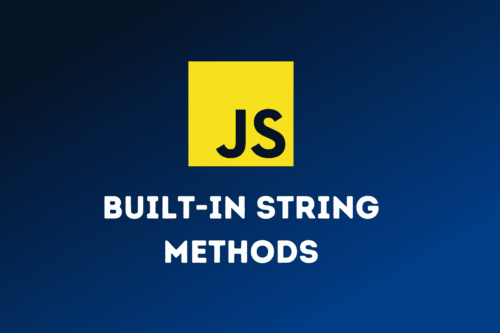

# JavaScript 中的 26 个字符串方法

> 原文：<https://betterprogramming.pub/26-string-methods-in-javascript-6957500cf03f>

## 便捷的快捷方式和提醒



图片来源:作者

在本文中，我们将了解 JavaScript 中 26 种不同的内置字符串方法。

没有必要记住 JavaScript 中所有可用的内置方法，但是通过了解哪些方法是可用的，当你需要这些方法时，你可以省去重新发明它们的麻烦。

注意:所有标题都是 MDN 文档的链接。

# [charAt](https://developer.mozilla.org/en-US/docs/Web/JavaScript/Reference/Global_Objects/String/charAt)

返回指定索引处的字符。

```
"Hello World".charAt(2); // returns "l"
// If we pass no value it defaults to an index of 0
"Hello World".charAt(); // returns "H"
// If we add an index that is undefined we get an empty string
"Hello World".charAt(20); // returns ""
```

# [charCodeAt](https://developer.mozilla.org/en-US/docs/Web/JavaScript/Reference/Global_Objects/String/charCodeAt)

返回指定索引处字符的 Unicode。

```
"Hello world".charCodeAt(2); // returns 72 for "l"
// If we pass no value it defaults to an index of 0
"Hello world".charCodeAt(); // returns 108 for "H"
```

# [串联](https://developer.mozilla.org/en-US/docs/Web/JavaScript/Reference/Global_Objects/String/concat)

连接两个或多个字符串，并返回一个连接的字符串。
这非常类似于在字符串上使用`+`操作符。

```
"Hello".concat(" world"); // returns "Hello world"
// With multiple strings
"Hello".concat(" world", " and", " other", " planets"); // returns "Hello world and other planets"
```

# [结束于](https://developer.mozilla.org/en-US/docs/Web/JavaScript/Reference/Global_Objects/String/endsWith)

检查字符串是否以指定的字符串结尾。我们可以添加一个可选的第二个参数，对字符串进行限制。

```
"Dogs are the best!".endsWith('best'); // returns false
"Dogs are the best!".endsWith('best!'); // returns true
// With second parameter for ending index
"Dogs are the best!".endsWith('best', 17); // returns true (because we picked the end of the string is at index 17)
```

# [fromCharCode](https://developer.mozilla.org/en-US/docs/Web/JavaScript/Reference/Global_Objects/String/fromCharCode)

将 Unicode 值转换为可读字符。`fromCharCode`是 String 对象上少数可用的静态方法之一。我们一直在使用的所有其他属性都被称为*实例属性*。我们通过使用`String`关键字来访问它。

```
String.fromCharCode(67); // returns "C"
// Using multiple characters
String.fromCharCode(67, 111, 100, 250); // returns "Codú"
```

# [包括](https://developer.mozilla.org/en-US/docs/Web/JavaScript/Reference/Global_Objects/String/includes)

检查字符串是否包含特定的字符串。

```
"Dogs are the best!".includes("Dogs") // returns true
// With optional starting index
"Dogs are the best!".includes("Dogs", 1) // returns false
"Dogs are the best!".includes("ogs", 1) // returns true
```

# [索引 Of](https://developer.mozilla.org/en-US/docs/Web/JavaScript/Reference/Global_Objects/String/indexOf)

返回指定值在字符串中第一次出现的位置。

```
"test one two test".indexOf("test") // returns 0
"test one two test".indexOf("x") // returns -1
// With optional starting index
"test one two test".indexOf("test", 1) // returns 13
```

# 的最后指数

返回指定值在字符串中最后一次出现的位置。

```
"test one two test".lastIndexOf("test") // returns 13
// With optional limit because search starts from index 12.
"test one two test".lastIndexOf("test", 12) // returns  0
```

# [匹配](https://developer.mozilla.org/en-US/docs/Web/JavaScript/Reference/Global_Objects/String/match)

`match()`方法检索字符串与正则表达式或字符串匹配的结果。

# [matchAll](https://developer.mozilla.org/en-US/docs/Web/JavaScript/Reference/Global_Objects/String/matchAll)

**这是 ES2020 中的一项新功能，因此请检查您的浏览器兼容性。** `matchAll`就像是类固醇上的`match`方法。它为匹配返回一个`RegExpStringIterator`。

关于迭代器的更多信息，请查看[文档](https://developer.mozilla.org/en-US/docs/Web/JavaScript/Reference/Global_Objects/String/matchAll)。

# [正常化](https://developer.mozilla.org/en-US/docs/Web/JavaScript/Reference/Global_Objects/String/normalize)

我们可以用`normalize`规范化一个 Unicode 字符串，但是这意味着什么呢？基本上，这意味着我们可以以人类可读的形式看到它。

```
"\u0043\u006f\u0064\u00fa".normalize(); // returns "Codú"
```

# [加数](https://developer.mozilla.org/en-US/docs/Web/JavaScript/Reference/Global_Objects/String/padEnd)

我们可以在字符串的末尾添加填充符，使其等于某个长度。默认情况下，我们用空白填充它，但也可以选择替换字符。

```
// Entire length is 10 after padding
"Hello".padEnd(10); // returns "Hello     "
// Entire length is 10 after padding with characters too
"Hello".padEnd(10, "*"); // returns "Hello*****"
```

# [padStart](https://developer.mozilla.org/en-US/docs/Web/JavaScript/Reference/Global_Objects/String/padStart)

我们可以在字符串的开头添加填充符，使它等于某个长度。默认情况下，我们用空白填充它，但也可以选择替换字符。

```
// Entire length is 10 after padding
"Hello".padStart(10); // returns "     Hello"
// Entire length is 10 after padding with characters too
"Hello".padStart(10, "*"); // returns "*****Hello"
```

这种填充可能看起来无关紧要，但有一个案例，一个从 npm 中提取的流行库这样做了，它被提取并基本上破坏了互联网。你可以在谷歌上搜索“左键盘事件”来了解这方面的信息。

# [重复](https://developer.mozilla.org/en-US/docs/Web/JavaScript/Reference/Global_Objects/String/repeat)

接受一个数字作为参数，按照指定的次数重复该字符串，并作为单个字符串返回。

```
"Hello".repeat(3); // returns "HelloHelloHello".
```

# [更换](https://developer.mozilla.org/en-US/docs/Web/JavaScript/Reference/Global_Objects/String/replace)

在字符串中搜索指定值或正则表达式，并返回指定值被替换的新字符串。我们可以用一个字符串替换这些值，或者传递一个函数来操作匹配。除非我们传递一个全局正则表达式，否则它只会替换第一个找到的匹配项。

```
"cat, cat, cat".replace(/cat/, 'dog'); // returns "dog, cat, cat"
"cat, cat, cat".replace(/cat/g, 'dog'); // returns "dog, dog, dog"
"cat, cat, cat".replace("cat", 'dog'); // returns "dog, cat, cat"
"cat, cat, cat, bird".replace("cat", (i) => i + "dog"); // returns "catdog, cat, cat, bird"
```

# [replaceAll](https://developer.mozilla.org/en-US/docs/Web/JavaScript/Reference/Global_Objects/String/replaceAll)

我们可以使用正则表达式或字符串来替换字符串的所有实例。我们可以用一个字符串替换这些值，或者传递一个函数来操作匹配。使用全局正则表达式时，`replace`和`replaceAll`没有太大区别。`replaceAll`只接受全局正则表达式，但是如果你给它传递一个字符串，它会自动替换该字符串的所有实例。第二个参数可以是替换每个实例的字符串，也可以是对每个实例进行操作的函数。

```
"cat, cat, cat, bird".replaceAll(/cat/g, 'dog'); // returns "dog, dog, dog, bird" 
"cat, cat, cat, bird".replaceAll("cat", 'dog'); // returns "dog, dog, dog, bird" 
// With a function
"cat, cat, cat, bird".replaceAll("cat", (i) => i + "dog"); // returns "catdog, catdog, catdog, bird"
```

# [搜索](https://developer.mozilla.org/en-US/docs/Web/JavaScript/Reference/Global_Objects/String/search)

在字符串中搜索指定的值或正则表达式，并返回匹配的起始位置。

```
"cat, dog, cat".search("dog"); // returns 5
// With a regex
"cat, dog, cat".search(/dog/g); // returns 5
```

# [切片](https://developer.mozilla.org/en-US/docs/Web/JavaScript/Reference/Global_Objects/String/slice)

提取字符串的一部分并返回一个新字符串。

```
"This is a string I want to slice".slice(27); // returns 'slice'
"This is a string I want to slice".slice(27, 28); // returns 's'
// And we can work backwards with negative values such as
"This is a string I want to slice".slice(-5); // returns "slice"
"This is a string I want to slice".slice(-5, -1); // returns "slic"
```

# [拆分](https://developer.mozilla.org/en-US/docs/Web/JavaScript/Reference/Global_Objects/String/split)

将字符串拆分为子字符串数组。我们可以给出一个可选的极限作为第二个参数。

# [始于](https://developer.mozilla.org/en-US/docs/Web/JavaScript/Reference/Global_Objects/String/startsWith)

检查字符串是否以指定字符开头，并返回布尔值。我们可以给它一个可选的起始索引作为第二个参数。

```
"Hello".startsWith("h"); // true
"Hello".startsWith("e"); // false
// With optional starting index
"Hello".startsWith("e", 1); // true
```

# [子串](https://developer.mozilla.org/en-US/docs/Web/JavaScript/Reference/Global_Objects/String/substring)

从字符串中提取两个指定索引之间的字符。第二个参数是可选的。

```
"Hello".substring(1, 4); // "ell"
// If we give no second parameter it will pick assume you have no end index.
"Hello".substring(1); // returns "ello"
```

# [toLowerCase](https://developer.mozilla.org/en-US/docs/Web/JavaScript/Reference/Global_Objects/String/toLowerCase)

将字符串转换成小写字母。

```
"HeLlO wOrLd".toLowerCase(); // returns "hello world"
```

# [toUpperCase](https://developer.mozilla.org/en-US/docs/Web/JavaScript/Reference/Global_Objects/String/toUpperCase)

将字符串转换成大写字母。

```
"Hello world".toUpperCase(); // returns "HELLO WORLD"
```

# [修剪](https://developer.mozilla.org/en-US/docs/Web/JavaScript/Reference/Global_Objects/String/Trim)

移除字符串两端的空白。

```
"   Hello world   ".trim(); // returns "Hello world"
```

# [三月](https://developer.mozilla.org/en-US/docs/Web/JavaScript/Reference/Global_Objects/String/trimEnd)

从末尾修剪空白。

```
"   Hello world   ".trim(); // returns "   Hello world"
```

# [trimStart](https://developer.mozilla.org/en-US/docs/Web/JavaScript/Reference/Global_Objects/String/trimStart)

从字符串的开头修剪空白。

```
"   Hello world   ".trim(); // returns "Hello world   "
```

你可以在这里观看视频版本。

视频描述中有所有时间戳的链接，所以你可以跳到你喜欢的部分。