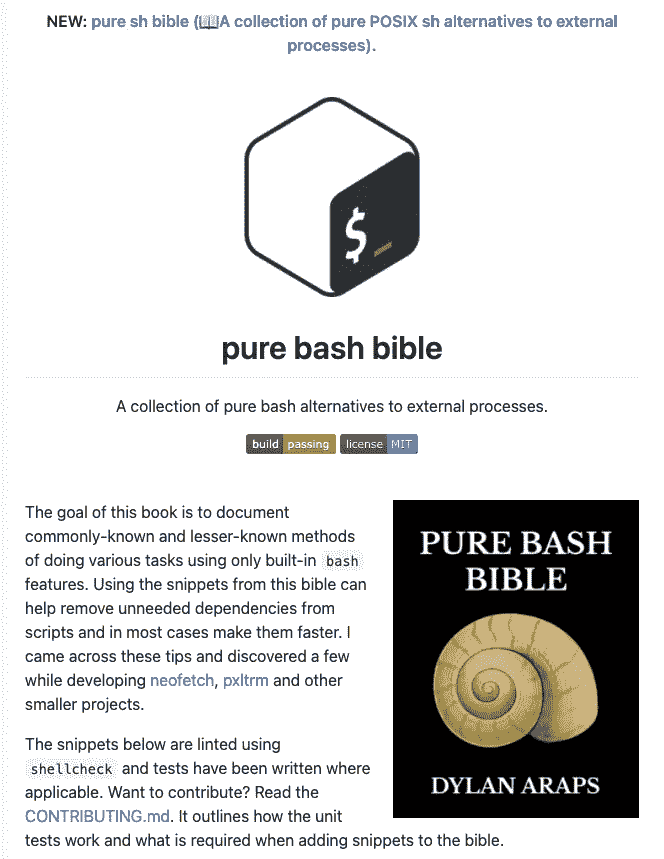

# 初学者的 27 个简单 Bash 脚本技巧

> 原文：<https://betterprogramming.pub/27-simple-bash-scripting-tips-for-beginners-d6764c977546>

## 不要害怕 Bash 脚本。看完这些提示会更容易


来自[像素](https://www.pexels.com/search/shell/)的自由图像

[更新于 2021 年 2 月 18 日。代码更改为要点并添加了链接]

```
**Table of Contents**
[Introduction](#0d60)
[1\. Clean Structure](#d44f)
[2\. Install ShellCheck on Your Editor](#fb47)
[3\. Usage Function](#2e81)
[4\. Error Messages](#5b5d)
[5\. Function Comments](#f159)
[6\. How To Concatenate String Variables](#6a6f)
[7\. How To Set a Debug Mode](#ed8f)
  ∘ [Other useful set options](#6d59)
[8\. How To Slice Strings](#1adf)
[9\. How To Make Sure Users Use a Correct Bash Version](#ce56)
[10\. How To Transform a String Case](#e5bd)
[11\. Ternary Operator-Like Statement](#191a)
[12\. How To Find the Length of a String and an Array](#b44d)
[13\. How To Unset Variables](#886b)
[14\. How To Set a Default Value](#675e)
[15\. How To Determine Your Bash Script Name](#be80)
[16\. How To Make a Variable Constant](#b2ef)
[17\. How To Find OSs](#cfb5)
[18\. How To Determine Which HTTP Get Tool the System Has Installed](#dde7)
[19\. How To Determine Which Python the System Has Installed](#e8e8)
[20\. Parameter expansion: How to Find the Script Name and Directory](#01ab)
[21\. How To Make Status Messages](#e3e9)
[22\. How To Set Locale](#4f97)
[23\. Type Hinting in Bash?](#2cb0)
[24\. Store Exit Status in a Variable](#11e9)
[25\. Using Trap for Unexpected Termination](#7715)
[26\. Don’t Reinvent the Wheel](#e226)
[27\. Subshell and Exit Status](#ad55)
[Conclusion](#b647)
[Newsletter](#a86a)
[References](#8137)
```

# 介绍

在学习了 Bash 脚本的[基础之后，您可以使用这些实践让您的 Bash 脚本看起来更专业。这里是 Bash 脚本初学者的 27 个技巧。](https://medium.com/better-programming/the-ultimate-programmers-guide-to-bash-scripting-2d11d4e6e978)

# 1.干净的结构

你的剧本必须以一声巨响开始，并描述剧本的目的。一些如何使用你的脚本的例子会对用户有所帮助。如果有必要，解释一下参数。

首先声明所有的全局变量，然后在全局变量之后声明所有的函数。在函数中使用局部变量，并将主体写在函数之后。在函数、`if`语句和脚本末尾使用明确的退出状态代码。

# 2.在编辑器上安装 ShellCheck

[ShellCheck](https://github.com/koalaman/shellcheck#installing) 是一个 shell 脚本静态分析工具。通过在你的编辑器上安装 ShellCheck，你可以避免许多初学者的陷阱。安装后，您可以在您的终端上运行它。

```
**$** shellcheck my_awesome_script
```

也可以安装在 [VS 代码](https://marketplace.visualstudio.com/items?itemName=timonwong.shellcheck)上。


VSCode ShellCheck 扩展

如果您有兴趣查看 ShellCheck 错误代码列表，请查看此[要点](https://gist.github.com/shinokada/edbe46d08d688933f3765ec573bf7d74)。

# 3.使用功能

如果您的脚本使用位置参数，请添加一个函数来解释用户如何以及哪些用户可以使用这些参数。

`$0`输出脚本名称。在上述情况下，当用户使用`h`或除`f`、`d`或`t`之外的任何字母时，将调用`usage`功能。

在网上试试这个

上面的脚本检查参数的数量是否是两个。如果不是，则显示`usage`。

您可以使用 Bash Heredoc:

# 4.错误消息

谷歌的[外壳风格指南](https://google.github.io/styleguide/shellguide.html)推荐了一个打印消息和其他状态信息的功能。

该指南建议所有错误消息都应该发送到`STDERR`，因为这样可以更容易地将正常状态与实际问题区分开来。

# 5.函数注释

所有函数都应该有注释，包括描述、全局变量、参数、输出和返回值(如果适用)。

# 6.如何连接字符串变量


照片由 [Alina Grubnyak](https://unsplash.com/@alinnnaaaa?utm_source=medium&utm_medium=referral) 在 [Unsplash](https://unsplash.com?utm_source=medium&utm_medium=referral) 上拍摄

在 Bash 脚本中，可以用不同的方式连接字符串。

[在线试试这个](https://tech.io/snippet/UjVPyWi)

请注意，在给变量赋值时，等号前后没有空格。第一个使用`+=`符号将第二个值连接到第一个值。第二个使用双引号，变量之间有一个空格。最后一个使用了花括号，因为变量`foo`后面紧跟着一个字符。

# 7.如何设置调试模式

使用`set -x`。正在设置的选项是`-x`或`xtrace`。这将在代码运行之前显示给定代码行的扩展命令和变量。

[在网上试试这个。](https://tech.io/snippet/zv4uevy)

输出是脚本执行的详细跟踪。

```
+ foo=Bash
+ '[' Bash == Bash ']'
+ echo Bash
Bash
```

很容易看出脚本是如何运行和赋值的。

## 其他有用的 set 选项

`set -e`如果命令以非零状态退出，则立即退出。

`set -u`替换时将未设置的变量视为错误。

`set -C`不允许覆盖现有的常规文件。

所以你可以在你脚本的开头使用`set -Ceu`。

使用`help set`查找关于`set`的更多信息。

# 8.如何分割字符串

您可以使用`cut -cstart-end`对字符串进行切片。

[在线试试这个](https://tech.io/snippet/NaXkJNN)

第一个将字符串从第一个字母分割到第三个字母。第二个从第二个到第四个切片。最后一个切掉了第五个字母。

参数扩展执行子串提取，`${s:off-set-index:length}`:

```
#!/usr/bin/env bashs="abcdefg"
echo ${s:0:3}
echo ${s:1:3}
echo ${s:4:1}
# output
# abc
# bcd
# e
```

偏移量从零开始。

# 9.如何确保用户使用正确的 Bash 版本

以下脚本确保用户使用 Bash 或更高版本。

```
if ((BASH_VERSINFO[0] < 4)); then
    printf '%s\n' "Error: This requires Bash v4.0 or higher. You have version $BASH_VERSION." 1>&2
    exit 2
fi
```

# 10.如何转换字符串大小写

当您读取用户输入时，输入可以是小写或大写。对于低于版本 4 的 Bash，可以使用带有`[:lower:]`和`[:upper:]`的`tr`命令将其改为大写。

[在线试试这个](https://tech.io/snippet/0PX7hOQ)

请注意，我们设置了选项`-x`用于调试。

第 4 行:读取用户输入。

第 5 行:Pipes，`|`，让您使用一个命令的输出作为另一个命令的输入。我们`cut`第一个字母，然后把它从小写转换成大写。您可以互换小写和大写的位置，从大写转换为小写。

在 Bash 4+中，可以使用大小写修改操作符。

[在线试试这个](https://tech.io/snippet/XscZ7jN)

使用这些大小写修改运算符，您可以创建函数。

[在线试试这个](https://tech.io/snippet/01T1ITM)

# 11.三元类运算符语句

Bash 没有三元运算符，但是您可以对简单的变量赋值做类似的事情。

我们可以写一个`if`语句:

```
if **[** $foo -ge $bar **]**; then
  baz="Smile!"
else
  baz="Sleep!"
fi
```

将`&&`和`||`一起使用，我们可以创建一个类似于三元语句的语句:

```
[ $foo -ge $bar ] && baz="Smile!" || baz="Sleep!"
```

[在线试试这个](https://tech.io/snippet/XOQEwsp)

# 12.如何找到字符串和数组的长度


弗勒在 [Unsplash](https://unsplash.com?utm_source=medium&utm_medium=referral) 上的照片

`${#string}`返回字符串长度，同样`${#array[@]}`返回数组长度。

[在线试试这个](https://tech.io/snippet/EMgXLsG)

# 13.如何取消设置变量

取消设置变量可以确保您没有使用预定义的变量。

在脚本的开头:

```
#!/usr/bin/env bashunset var1 var2 var3
var1=some_value
...
```

# 14.如何设置默认值

如果未设置`foo`，则`${foo-$DEFAULT}`和`${foo=$DEFAULT}`评估为`$DEFAULT`。

如果`foo`未置位或为空，则`${foo:-$DEFAULT}`和`${foo:=$DEFAULT}`评估为`$DEFAULT`。

在网上试试这个。

如果`foo` **设置为**，则`${foo+$OTHER}`和`${foo:+OTHER}`计算为`$OTHER`，否则为空字符串。

在网上试试这个。

# 15.如何确定您的 Bash 脚本名称

通过将所有 Bash 脚本添加到`~/bin`目录并将其路径添加到终端配置文件、`~/.bashrc`或`~/.zshrc`，您可以从任何目录运行它们。但是在设置脚本名之前，最好不要在其他地方使用脚本名。使用`type`或`which`命令进行检查。

```
**$** type my_script
my_script not found
**$** which which
which: shell built-in command
```

没有带`my_script`的脚本名称，但是`which`已经被占用。

# 16.如何使变量成为常数

`readonly`将变量和函数设为只读。

在网上试试这个。

第 3 行:设置一个只读变量。
第 5 行:试图覆盖只读变量。但这会返回一个错误，“第 5 行:MAX: readonly 变量”。

输出:

```
10
/Users/shinokada/bin/ex6: line 5: MAX: readonly variable
10
```

您可以输出`readonly`变量:

在网上试试这个。

# 17.如何找到 OSs

不同的操作系统有不同的命令。比如 Linux 用`[readlink](https://linux.die.net/man/1/readlink)`，macOS 用`greadlink`。

下面的例子相当简单，但是它找到了用户的操作系统并应用了正确的命令。

输出:

```
Your script path is /Users/shinokada/bin
Your OS is mac
```

# 18.如何确定系统安装了哪个 HTTP Get 工具

您的 Bash 脚本可能会使用 HTTP `GET`工具。不同的系统使用不同的工具。可以是`curl`、`wget`、`http`、`fetch`，也可以是别的。

`&>/dev/null`将标准输出流和标准误差流重定向至`/dev/null`。和`>/dev/null 2>&1`一样。

`command -v`显示特定命令的可执行文件或别名定义的路径。

# 19.如何确定系统安装了哪个 Python

同样，如果您的脚本使用 Python，您可以找到系统 Python:

# 20.参数扩展:如何找到脚本名和目录

使用`${parameter##*/}`获取文件名，使用`${parameter%/*}`获取目录路径。

在网上试试这个。

此 [Tech.io 页面](https://tech.io/snippet/I94IWEk)解释了如何使用`${parameter%word}`、`${parameter%%word}`、`${parameter#word}`、`${parameter##word}`。

您也可以使用`basename "$0"`来获取文件名。

您可以找到 Bash 脚本目录:

```
#!/usr/bin/env bashc=$0
echo "${c%/*}"
```

产出:

```
/Users/shinokada/bin
```

# 21.如何制作状态消息

你可能想告诉用户你的脚本在做什么。

如果你想输出状态信息，你应该从程序名开始。使用`$(basename "$0")`获取程序名称。应使用`echo ... 1>&2`将消息写在标准错误上。

```
#!/usr/bin/env bashprogname=$(basename "$0")
...
echo "$progname: Running this and that" 1>&2
```

# 22.如何设置区域设置

您可以找到您的语言环境:

并非所有的程序员都使用相同的语言环境。来自法国的程序员可能会使用`fr_CH.UTF-8`；来自英国的极客可能在用`en_GB.UTF-8`。为了确保用户使用正确的语言环境，您可以使用`LC_ALL`来设置语言环境:

```
LC_ALL="en_US.UTF-8"
```

# 23.Bash 中的类型提示？

Bash 脚本没有类型提示，但是您可以使用`declare`来创建变量索引数组、关联数组或整数。使用`help declare`可以找到`declare`选项。

可以用`+`代替`—`关闭属性。

在网上试试这个。

我们在第 3 行将`var1`声明为一个整数。如果您试图将其更改为字符串，就会得到一个错误(第 5 行)。但是您可以将其更改为另一个整数(第 7 行)。

在网上试试这个。

请注意，当您在函数中使用`declare`时，变量变成了一个局部变量，您不能在函数外部访问它。

# 24.将退出状态存储在变量中


[Artem Beliaikin](https://unsplash.com/@belart84?utm_source=medium&utm_medium=referral) 在 [Unsplash](https://unsplash.com?utm_source=medium&utm_medium=referral) 上的照片

不要在`if`语句中使用`$?`:

```
mkdir /tmp/tmp_dir
if [ $? = 0 ]; then
  # do something
fi
```

将退出状态存储在变量中:

下面存储了检查文件是否存在以及是否为目录的退出状态。

```
test -d /tmp/tmp_dir
test_es=$?
if [[ ${test_es} -ne 0 ]]; then  
    echo "No dir found. Exiting script!" >&2
    exit 1
fi
```

# 25.使用陷阱进行意外终止

用户可以在脚本运行时使用`Ctrl-c`终止它。如果您的脚本正在修改一个目录或文件，您需要将它恢复到原始状态。命令`trap`就是针对这种情况的。

当用户使用`Ctrl-c`时，会产生一个信号`SIGINT`。当用户终止一个进程时，它产生一个信号`SIGTERM`。您可以使用以下命令列出所有信号:

```
# Linux, from terminal
**$** trap --list
# macOS, from a script
trap --list
```

你可以在 man7.org 上找到标准信号。

`trap`命令具有`trap "do something" signal_to_trap`的形式。如果你的清理代码很长，你可以创建一个函数。

让我们捕获`Ctrl-c`信号:

```
tempfile=/tmp/myfile
cleanup(){
    rm -f $tempfile
}
trap cleanup SIGINT
```

阅读更多关于[陷阱命令](https://www.linuxjournal.com/content/bash-trap-command)的信息。

# 26.不要多此一举

如果你的目标是学习，那么你可以重新发明轮子，但是如果不是，使用来自 [pure-bash-bible](https://github.com/dylanaraps/pure-bash-bible) 的片段。pure-bash-bible 也是一个很好的学习场所。您可以在脚本中使用许多函数。这些脚本包括字符串、数组、循环、文件处理、文件路径等等。



图片来自[纯巴什圣经](https://github.com/dylanaraps/pure-bash-bible#change-a-string-to-lowercase)

# 27.子外壳和退出状态

你能找出下列代码的区别吗？

第一个返回:

```
/Users/myname/bin/ex5: line 34: no_func1: command not found
there is nothing
1
```

第二个返回:

```
/Users/myname/bin/ex5: line 34: no_func2: command not found
there is nothing
```

区别在于括号和大括号。括号使命令在子 shell 中运行，大括号使命令组合在一起，但不在子 shell 中。

因为大括号不创建子 shell，`exit`退出主 shell 进程，所以它永远不会到达运行`echo $?`的地方。

# 结论

这是您可以在下一个 Bash 脚本项目中使用的 27 个 Bash 脚本技巧。它们中的许多都很容易采用，并且使您的 Bash 脚本看起来更专业。

编码快乐！

**通过** [**成为**](https://blog.codewithshin.com/membership) **会员，可以完全访问媒体上的每一个故事。**


[https://blog.codewithshin.com/subscribe](https://blog.codewithshin.com/subscribe)

# 参考

*   [https://tldp.org/LDP/abs/html/special-chars.html](https://tldp.org/LDP/abs/html/special-chars.html)
*   [https://tldp . org/LDP/ABS/html/parameter-substitution . html # PARAMSUBREF](https://tldp.org/LDP/abs/html/parameter-substitution.html#PARAMSUBREF)

[](https://medium.com/better-programming/the-ultimate-programmers-guide-to-bash-scripting-2d11d4e6e978) [## Bash 脚本编程的终极程序员指南

### 深入探究 Bash 脚本，帮助您自动化任务

medium.com](https://medium.com/better-programming/the-ultimate-programmers-guide-to-bash-scripting-2d11d4e6e978) [](https://medium.com/better-programming/13-fantastic-learning-tools-and-resources-for-bash-scripting-51a6de98015c) [## 13 个精彩的 Bash 脚本学习工具和资源

### 您将每天使用的替代 Bash 脚本工具

medium.com](https://medium.com/better-programming/13-fantastic-learning-tools-and-resources-for-bash-scripting-51a6de98015c) [](https://towardsdatascience.com/comparing-sh-bash-ksh-and-zsh-speed-82a72bbc20ed) [## 比较上海、巴什、KSH 和 ZSH 的速度

### 获胜者去…击鼓

towardsdatascience.com](https://towardsdatascience.com/comparing-sh-bash-ksh-and-zsh-speed-82a72bbc20ed)