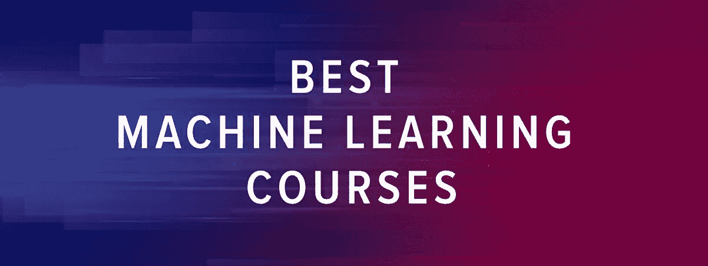
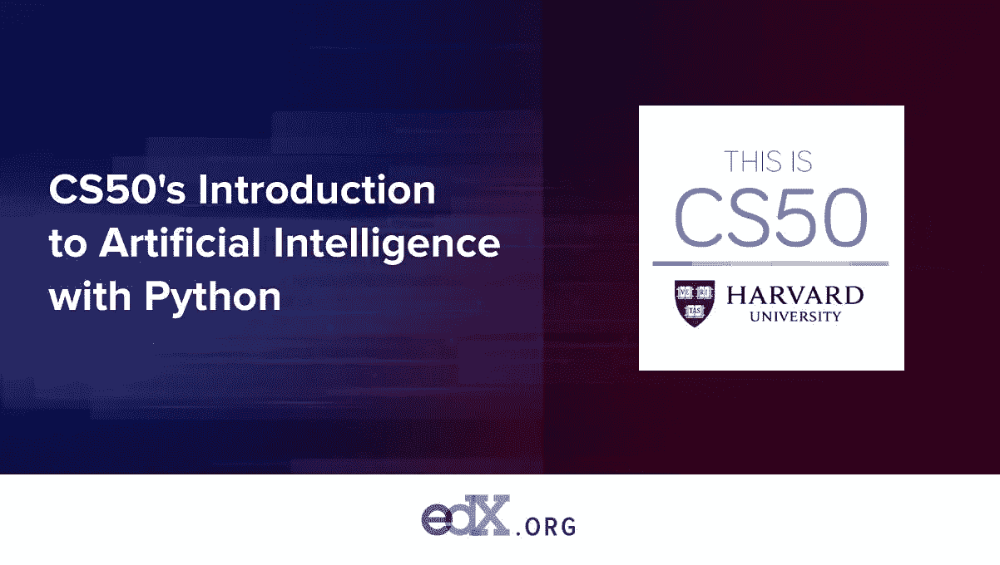
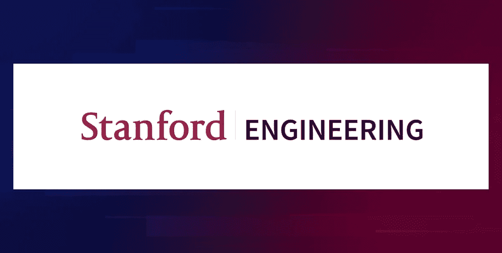
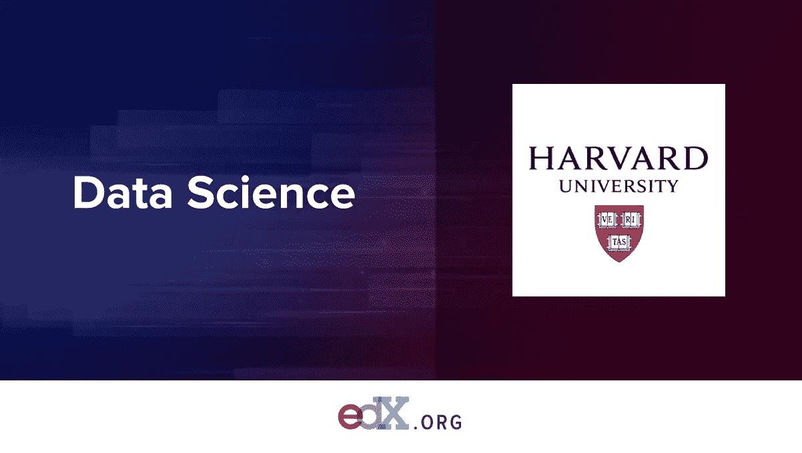
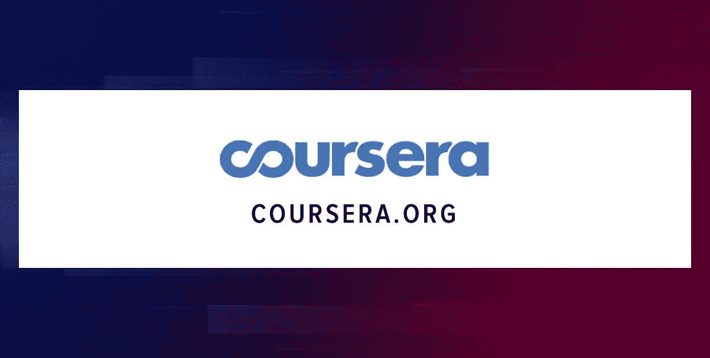
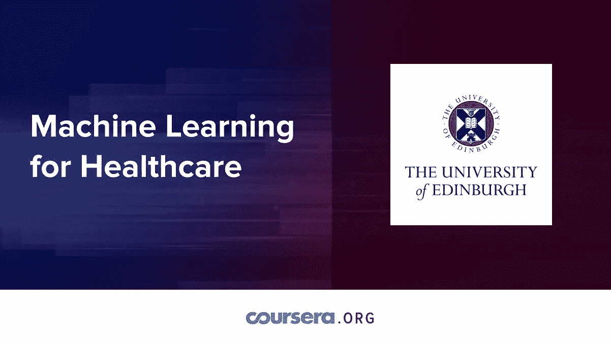
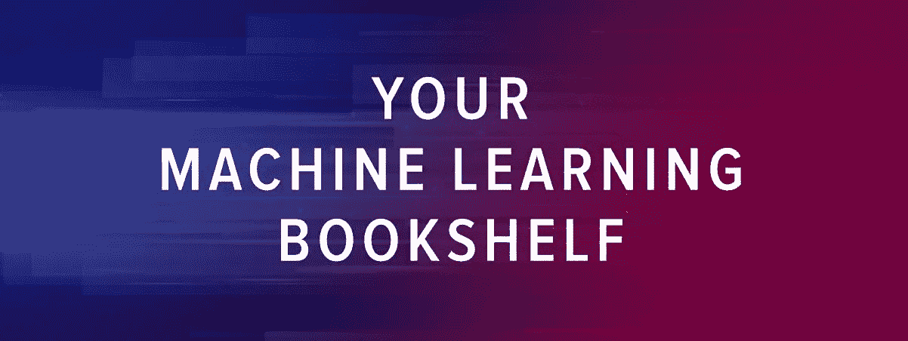
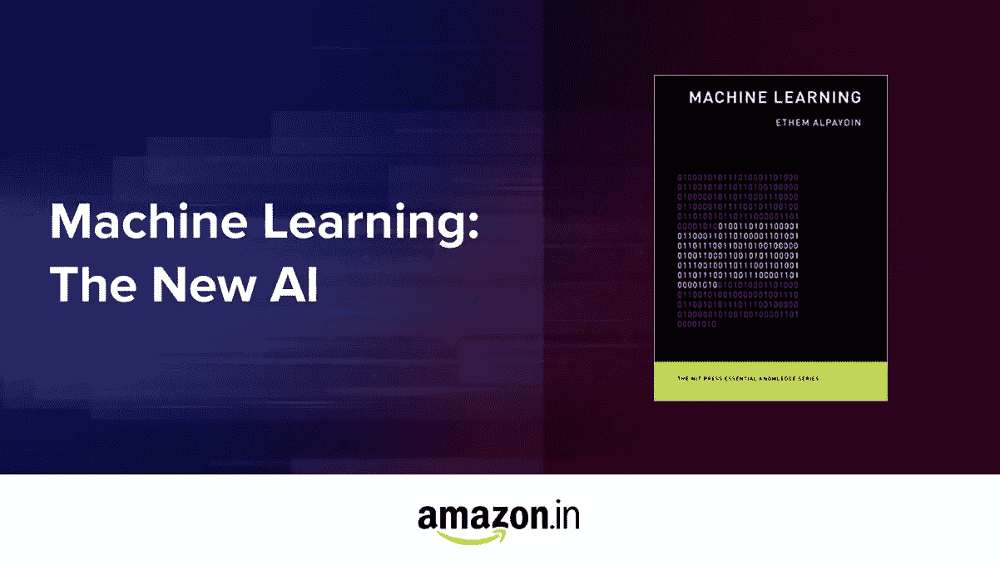
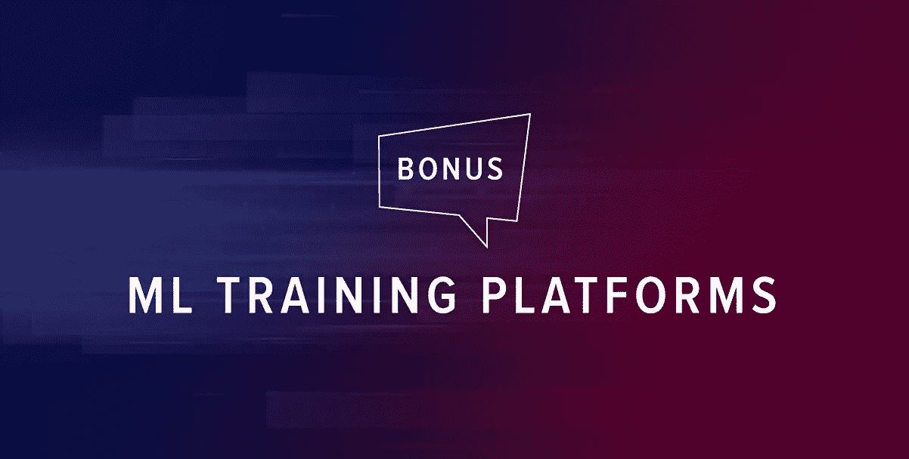
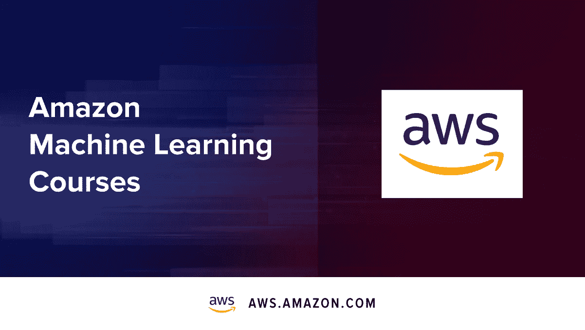

# 机器学习入门的 27 个资源

> 原文：<https://betterprogramming.pub/27-top-resources-to-learn-ml-33c7d3f9017e>

## 今天是学习新事物的好日子

若昂·赞诺在 [Unsplash](https://unsplash.com/s/photos/bookshelf?utm_source=unsplash&utm_medium=referral&utm_content=creditCopyText) 上的照片

如果你没有机器学习(ML)开发经验，也没关系。这篇文章包括入门和高级材料。给自己倒杯茶；这个帖子会很长。我们走吧。

# 最佳机器学习课程

越往前走，ML 材料越先进。你一定会找到适合你目标的东西。

# 初学者机器学习基础

## 1.人工智能的要素

对于每个想了解人工智能或 ML 如何工作的人来说，这是一门优秀的机器学习速成课程。它包含清晰的解释和大量的例子和任务来测试自己。无论你是企业主、营销人员还是非技术专家，人工智能的[元素都会让你感兴趣。](https://www.elementsofai.com/eu2019fi)

该课程由赫尔辛基大学在欧盟理事会芬兰主席的支持下制作，涵盖了初学者的机器学习基础。它旨在提高全球的人工智能意识。

## 2.CS50 用 Python 介绍人工智能

[CS50](https://www.edx.org/course/cs50s-introduction-to-artificial-intelligence-with-python) 是哈佛的一门公共课程，由 David Malan 教授，是哈佛和 EdX 上最大的课程。)人。当这么多人想听一个人谈论计算机科学时，这一定意味着什么。马兰知道如何用一种看起来迷人、有趣、易学的方式讲述复杂的事情。如果你对自己的技术能力还不太自信，并且想以有趣的方式学习机器学习，CS50 就是为你准备的。

## 3.苏格拉底的 Python 编程教程

YouTube 是许多有才华的人分享他们的内容的地方，有时你会偶然发现真正的杰作。苏格拉底是最好的机器学习 YouTube 频道之一。他们的 [Python 编程教程](https://www.youtube.com/watch?v=bY6m6_IIN94&list=PLi01XoE8jYohWFPpC17Z-wWhPOSuh8Er-)几乎和网飞一样令人着迷。

Python 是用于机器学习和数据科学项目的最流行的编程语言。这种语言有许多库，可用于后端和前端编程。有了 Tensorflow 和 scikit-learn 这样的库，你可以很容易地开始编写一个 AI 系统。所以如果你对 ML 感兴趣，掌握 Python 的基础知识是个好主意。

## 4.谷歌的机器学习速成班

这个[使用 TensorFlow APIs 的机器学习课程](https://developers.google.com/machine-learning/crash-course)是 Google 对机器学习的实用介绍。即使你对 ML 一无所知，你也能使用这份自学 ML 指南。然而，为了能够跟上，你需要有一般的编程技能和数学背景。

该课程包括一系列视频讲座、真实案例研究和实践练习，将教你如何编写机器学习算法。更多人工智能相关学习资料，请访问[谷歌教育平台](https://ai.google/education)。

## 5.ML 和大数据分析课程

要了解如何在数据分析实践中应用机器学习技术，请访问[大数据:统计推断和机器学习](https://www.futurelearn.com/courses/big-data-machine-learning)。本课程向您介绍可用于处理大型数据集和提取信息的统计和机器学习工具(如神经网络、决策树、主成分分析和聚类)。然后，可以锻炼自己的编码技能，解决现实生活中的任务。

为了更有效地学习这门课程，你需要大学本科水平的数学和统计学知识。

## 6.斯坦福大学的机器学习课程

[本课程](https://www.youtube.com/watch?v=jGwO_UgTS7I&amp=&index=1)提供了机器学习、数据挖掘和统计模式识别的广泛概述。它将教你如何使用常见的 ML 算法，并应用最佳实践来解决任务。这门课程的伟大之处在于，它包含了许多例子和真实的案例研究，将向你展示人工智能和人工智能的潜力，以及它们的许多应用。你将能够利用你所学到的知识解决许多任务，从文本识别到医学信息学和建造智能机器人。

虽然没有编程知识也可以学习机器学习，但强烈建议具有大学研究生水平的数学背景。

## 7.用 Python 进行机器学习

[IBM 教你 Python](https://www.edx.org/course/machine-learning-with-python-a-practical-introduct) 让你能用这种语言写出优秀的机器学习程序。在课程中，您将了解有监督和无监督的机器学习，发现隐藏的趋势，并获得有价值的见解。您将探索流行的 ML 算法，如分类、回归、聚类和降维，以及流行的模型，如训练/测试分裂、均方根误差(RMSE)和随机森林。该课程基于现实生活中的例子教你，并鼓励你注意机器学习技术如何改变我们每天生活的现实。

# 机器学习最佳高级课程

这些课程将让你更深入地探究机器学习的奥秘。

## 8.高级机器学习

如果你已经完成了入门课程，你可以在[这个未来学习课程](https://www.futurelearn.com/courses/advanced-machine-learning)中发现更多关于数据分析和机器学习算法的内容。

它不会让你成为一名数据科学家，但会让你更好地理解如何应用 ML 算法进行数据分析。完成本课程后，你将能够阐述一个典型的数据分析问题，并执行必要的步骤来提供解决方案。你将能够评估你的统计模型的有效性，并在不同的方法之间切换，以便更有效地解决任务。

## 9.麻省理工学院计算思维和数据科学导论

有些人认为编程仅仅是一门实用的学科，但实际上，它需要以特定的方式思考问题的能力。

麻省理工学院将向您介绍[应用于数据科学的计算思维的基本原理](https://www.edx.org/course/introduction-to-computational-thinking-and-data-4)。本课程着重于 pylab 包的绘图、随机编程、统计思维和蒙特卡罗模拟。为了有效地学习本课程，您需要具备 Python 的基础知识。

## 10.HarvardX 的数据科学

许多人梦想参加哈佛最好的机器学习讲座，但实际上没有多少人负担得起。有了这个在线专业，你几乎可以免费获得哈佛的专业证书。

它将帮助您获得基本的 R 编程技能，掌握概率、推理和建模等统计概念，并学习如何在实践中应用它们。您将熟悉实践数据科学和实现机器学习算法的基本工具。总的来说，本课程通过激发真实世界的案例研究和大量实践，让您深入了解基本的数据科学概念。课程大约需要 1.5 年完成，所以做好长途旅行的准备吧。否则，你可能会有兴趣追求 IBM 的[专业证书，时间稍短(10 个月)。](https://www.coursera.org/professional-certificates/ibm-data-science)

# 专注于某一特定领域

在本节中，您将找到更多关注机器学习应用的更具体案例的材料。

## 11.数据科学

如果你对从数据中提取知识和见解背后的方法、过程和算法感兴趣，学习数据科学。 [DataCamp](https://www.datacamp.com/) 是这样做的最佳场所之一:课程短小精悍，所以你可以在任何地方通过移动设备取得进步。该平台还提供即时的键盘练习和内置的练习模式，可以对每次练习提供反馈。甚至适合绝对的初学者。

## 12.深度学习

你知道什么是机器学习。有可能，你甚至可以教别人。是时候专注于更窄的领域了，比如深度学习。[深度学习](https://en.wikipedia.org/wiki/Deep_learning)是基于特征/表征学习的 ML 方法家族的一部分。对于热爱神经网络的人来说，[这门课程](https://www.coursera.org/specializations/deep-learning)提供了大量表达自己的可能性。

## 13.计算机视觉

学习将[深度学习算法](https://www.coursera.org/learn/deep-learning-in-computer-vision)应用于自动驾驶汽车中的索引和人脸识别、照片风格化或计算机视觉。本课程从基础开始，逐步向您介绍图像分类和注释、对象识别和图像搜索以及运动估计技术。

## 14.自然语言处理

语音助手，机器人，甚至一些安全系统都使用自然语言处理系统工作。这门面向自然语言处理的课程侧重于人机交互，特别是如何教会计算机处理、分析和执行有价值的动作(如响应或翻译)。听起来很酷，是吧？

## 15.推荐系统

你可以学习建立[推荐系统](https://www.coursera.org/specializations/recommender-systems)。这些系统根据其他用户的经验预测用户可能喜欢什么，并提供个性化的推荐。学习如何为商业和内容平台设计、构建和评估推荐系统是很有趣的。此外，在你的编程简历中加入这一技能也是不错的。

## 16.数据科学投资管理

在顶尖技术的帮助下，投资变得风险更小。这个由 EDHEC 商学院提供的[课程将向你展示如何用 Python 编写对风险管理、投资组合构建和分析以及管理你自己的投资有用的软件。您还将学习在投资决策中实施数据科学技术。](https://www.coursera.org/specializations/investment-management-python-machine-learning)

## 17.面向医疗保健的机器学习

想救人，但你是程序员？了解[数据科学在分层医疗保健和精准医疗中的应用](https://www.coursera.org/learn/datascimed)。本课程培养能够处理大量数据的专家，如基因组数据、电子病历和可穿戴设备收集的数据，以实现更好的医疗诊断。

# 你的机器学习书架

用几本关于机器学习中最相关的工具和技术的超级聪明的书来增加你的知识。

# 初学者的角落

这正是你开始机器学习所需要的。

## 18.《绝对初学者的机器学习:简明英语入门》,作者奥利弗·西奥博尔德

*《绝对初学者的机器学习》*是一本入门级别的书，然而，它教会了你很多关于 ML 的知识:从如何下载免费数据集到你需要的工具和机器学习库。这本书包含数据清理技术，回归分析，聚类，神经网络的基础知识，以及更多你需要成功开始机器学习的工具。亚马逊上[有售。](https://www.amazon.in/Machine-Learning-Absolute-Beginners-Introduction/dp/1549617214/)

## 19.《黑客的机器学习:案例研究和算法入门》,作者 Drew Conway

如果你已经有一些编程经验，但想知道更多关于 ML 和数据科学的知识，这本书就是为你准备的。它将帮助您启动机器学习。你将学习大量的例子，并获得必要数量的理论(但不要太多！).*《黑客的机器学习》*每一章都专注于具体的问题，比如分类、预测、优化、推荐。它还将教你分析不同的样本数据集，并用 r 编写简单的机器学习算法。

## 20.《机器学习:新人工智能》,作者 Ethem Alpaydin

*《机器学习:新的人工智能》*聚焦 ML 应用的基本案例。这本书指导你模式识别的机器学习算法，人工神经网络，强化学习，数据科学，以及 ML 对数据隐私和安全的伦理和法律含义。通过完成这本书，你将能够全面理解数字技术如何从数字处理主机发展到移动设备，将今天的机器学习热潮置于背景中。你可以在网上买到这本书。

# 专家角

在这个列表中，有大量的机器学习资源在等着你。

## 21.《模式识别和机器学习》，作者克里斯托弗·m·毕晓普

这本书对于在机器学习和模式识别中理解和使用统计技术是非常棒的。它提出了详细的实践练习，以保证对主题的全面介绍。书中涉及的其他领域有近似推理算法、贝叶斯方法、基础概率论介绍和基于核的新模型。

对线性代数的良好理解和一些概率方面的经验是通读这本书的先决条件。这里可以买到[这本书。](https://geni.us/3BcZ3et)

## 22.《机器学习:贝叶斯和最优化视角》,作者塞尔吉奥·泽奥多里德斯

如果你想对机器学习中的概率性和确定性方法有一个统一的观点，请阅读这篇 ML 教程。这本书介绍了主要的机器学习方法及其在统计学，统计和自适应信号处理和计算机科学中的实际应用。

所有各种各样的 ML 方法和技术都有非常详细的解释，并由例子和问题集支持，为研究者提供了对机器学习概念的深刻理解。[这个机器学习 PDF](https://iie.fing.edu.uy/~nacho/docs/libros/machine_learning_a_bayesian_perspective.pdf) 是免费的。

## 23.通过 Scikit-Learn 和 TensorFlow 进行机器实践学习，作者 Aurélien Géron

Aurélien Géron 借助两个 Python 框架(scikit-learn 和 TensorFlow)帮助您直观地理解构建智能系统的概念和工具。

您将熟悉各种技术，从简单的线性回归开始，逐步发展到深度神经网络。每章包括练习，将鼓励你应用你所学到的东西。[你可以免费下载这个机器学习 PDF](https://www.lpsm.paris/pageperso/has/source/Hand-on-ML.pdf)。

## 24.Jacob Eisenstein 的《自然语言处理》

这本教科书提供了自然语言处理的技术观点。它强调当代数据驱动的方法，并包含构建理解、生成和操作人类语言的计算机软件的方法。

这本书可以被本科生和研究生使用，也可以作为软件工程师和数据科学家的参考。读者应该有计算机编程和大学水平的数学背景。在 GitHub 上可用[。](https://github.com/jacobeisenstein/gt-nlp-class/blob/master/notes/eisenstein-nlp-notes.pdf)

## 25.机器学习的高斯过程，作者 C.E.Rasmussen 和 C.K.I.Williams

这本书提供了高斯过程的全面介绍，它提供了一个有原则的，实用的，概率的方法来学习内核机器。在过去的十年里，全球定位系统越来越受到关注，所以这本书提供了一个系统和统一的概述，介绍了他们在机器学习的理论和实践方面。

这本书包括大量的例子和练习，代码和数据集都可以在网上找到。完整版也可以在[在线](http://www.gaussianprocess.org/gpml/chapters/RW.pdf)获得。

更多关于学习 ML 的酷书的信息可以在 [Hackr.io](https://hackr.io/blog/best-machine-learning-books) 上找到。如果你有任何问题或有价值的资源，请随时发推特给我们。来分享一些知识吧！

# 奖励:ML 培训平台

## 26.亚马逊机器学习课程

亚马逊的教育平台以前只对员工开放，但现在任何人都可以免费使用。你总共可以参加 30 多门课程。内容面向初学者、中级专家和高级开发人员。

该课程从基本概念开始，并通过真实世界的例子来构建。通过优化送货路线或根据 IMDb 数据库的数据预测娱乐奖提名，你将能够先睹为快地了解 AmazonGo 和亚马逊电子商务解决方案背后的技术。

这些课程是免费的，但如果你打算建造一些东西，你需要为亚马逊用于实验室测试的云服务付费。也有可能以 300 美元的价格通过“AWS 认证机器学习——专业”认证的考试。

## 27.卡格尔

[Kaggle](https://www.kaggle.com/) 是一个国际数据科学社区，提供一些最好的免费在线机器学习课程。它为您成为数据科学家提供了大量资源和工具。Kaggle 提供的资料分为五类:新手、贡献者、专家、大师和特级大师。通过参与竞争和讨论，你提高了你的专业知识和必要的 ML 技能。

随意探索这个平台，你不会失望的。你可能想从这个关于机器学习的[介绍](https://www.kaggle.com/learn/intro-to-machine-learning)开始。如果你对自己更有信心，试着解决[重大问题](https://www.kaggle.com/c/titanic)或[预测房屋销售价格](https://www.kaggle.com/c/house-prices-advanced-regression-techniques)。祝你在成为数据科学大师的道路上好运！

# 最后的想法

ML 入门没有对错之分。可以从学习 Python 开始，或者先掌握微积分和统计学。无论你选择哪条道路，奇妙的是，通过学习机器学习，你可以接触到世界上最先进的技术之一。电脑很聪明，但还是不会自己学习。他们需要你的帮助！