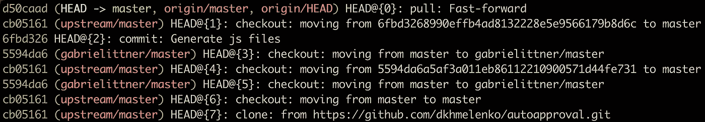

# 你可能不知道的 3 个高级 Git 命令

> 原文：<https://betterprogramming.pub/3-advanced-git-commands-you-might-not-know-fa9fdf3d9168>

## 跟踪操作历史，查找东西何时损坏，等等


乔希·卡拉布雷斯在 [Unsplash](https://unsplash.com?utm_source=medium&utm_medium=referral) 拍摄的照片。

如今，遇到没有 Git 知识的软件工程师是个例外。Git 已经成为业界如此普遍的工具，以至于你无法用它打动任何人。嗯，你可能会说你对版本控制系统一无所知，从而给别人留下深刻印象。

无论开发人员如何使用 Git(通过命令行或可用产品如 SourceTree、Tower、TortoiseGit 提供的漂亮 UI 界面)，重要的是开发人员知道 Git 的用途及其工作方式。

对于日常任务，知道如何将文件添加到 stage、提交以及从远程存储库推送和提取更改就足够了。掌握了基本命令之后，是时候探索 Git 还能提供什么了。

# 1.跟踪操作历史

您知道吗，Git 有一个对存储库执行的所有操作的日志？当您执行提交、重置基础、签出或任何其他操作时，它们都将被保存。

Git 将所有的操作历史保存在一个单独的地方，称为引用日志。它包含执行某个操作时分支状态的链接。而命令的名字是`git reflog`。



Git reflog 输出

在上面的例子中，我们可以看到命令的输出。它显示了在本地存储库上执行的所有操作。提交散列中有一个指向历史中该点的引用。

什么时候可以用？一个用例是审计。有时候事情会出错。例如，在重置基础操作中，特定的提交被意外删除。使用`git reflog`命令，我们可以找出重置操作开始的时间，并回滚到之前的状态。

# 2.发现什么时候东西坏了

有些情况下，我们必须检查一段时间内的 Git 历史，以找到引入 bug 的提交。当历史日志中只有十个条目时，这个任务看起来并不困难。但是如果团队很大，历史日志很大，这将花费很多时间。

谢天谢地，Git 为这种情况提供了一个特殊的命令。通过使用`git bisect`命令，将启动一个二分搜索法。它将检查从问题不存在到提交包含问题之间的提交的历史日志。

要开始搜索，我们需要运行`git bisect start`。然后我们在日志中提供一个起点和终点来查看。例如，我们知道提交`77beb52c`没有问题，而提交`afeb16fb`已经包含了问题。我们用以下命令来描述这一点:

```
git bisect bad afeb16fb
git bisect good 77beb52c
```

之后，Git 就可以开始搜索了。它将分割日志，并从日志中间选择提交。我们的工作是判断这个提交是否有问题。如果我们认为该提交中不存在问题，我们就写`git bisect good`。在这种情况下，起始点将转移到该提交，并且该过程在一个较小的历史日志上重复。

如果我们看到提交已经包含了这个问题，我们用命令`git bisect bad`告诉 Git。然后，提交成为新的端点，搜索进入下一个循环。

整个过程一直继续，直到单个提交停留在问题开始的地方。使用这个命令，您将能够快速分析历史日志，并追溯到问题出现的时间。

# 3.保存您的草稿

想象一下下面的场景:一个软件开发人员正在实现一个新特性。突然，他们不得不切换到一个特定的分支并做出一些改变。但是，当前的变化会带来什么呢？

首先想到的是提交修改。然而，更多的人可以在分支机构工作。做一件只做了一半的事情是不好的做法。

对于这种情况，Git 提供了一个特殊的命令:`git stash`。这个命令将工作目录保存在一个特殊的本地堆栈中。最近添加的更改总是在最上面。成功保存后的所有更改都将从工作目录中删除。

`git stash`命令类似于现实生活中的草稿。我们可以摆弄文件，做各种实验，但没人会看到它们。在任何时间点，我们都可以应用隐藏的变更并继续未完成的工作。探索新的方法而不填充大量的分支是一个很好的特性。

# 结论

给人留下 Git 知识的印象在今天很难，因为它是日常使用的工具。但是仍然有可能展示 Git 的良好知识。知道如何应用高级命令可以提高您的工作效率，并帮助您更有效地与团队协作。

你是 Git 新手吗？别担心！我准备了一个 Udemy 课程“[实用 Git:针对绝对初学者](https://www.udemy.com/course/practical-git-for-absolute-beginners/?referralCode=0EFE893B7A67E8D0D652)”。在不到 2 个小时的时间里，您将学习 Git 的基础知识以及如何应用它。让我们一起学习 Git 吧！