# 用 Python 可视化的 3 个算法运行时

> 原文：<https://betterprogramming.pub/3-algorithm-runtimes-visualized-with-python-e51441827917>

## 使用代码来可视化和确定不同算法的运行时复杂性。具有 Matplotlib 和 NumPy


JOSHUA COLEMAN 在 [Unsplash](https://unsplash.com?utm_source=medium&utm_medium=referral) 上拍摄的照片

通过使用 Python 中的可视化库和软件，我们能够确定不同算法的运行时复杂性。我们将首先回顾运行时复杂性和运行时复杂性分析的基础。然后，我们将介绍 [Matplotlib](https://matplotlib.org/) 用于可视化 2D 图和 [NumPy](https://numpy.org/) 用于计算最佳拟合线的基本用法，并通过将这些库的运行时图与已知函数(例如`y = n^2`、`y = 2^n`)的运行时图进行比较，找出如何使用这些库来确定它们的运行时复杂性。

如果您有兴趣下载本文中的代码，请访问我的 GitHub 上的[这个资源库(ch roline/visualizing runtimes)](https://github.com/chroline/visualizingRuntimes)。

# 什么是运行时复杂性？

*运行时复杂性*，更确切地说是*运行时复杂性分析*，是一种衡量算法在所需运算量增加时运行速度的方法。在我们开始可视化不同算法的运行时之前，让我们看几个基本的例子来解释这个概念。

考虑下面的`add`函数。它接受两个参数`a`和`b`，并对`a`和`b`进行加法运算。

```
def add(a, b):
    return a + b
```

当给定任意两个参数(1 和 2，2 和 3，29347 和 93648)时，运算量不变。因此，我们说算法以恒定的时间运行。

但是，现在考虑下面的`permutations`函数。它接受一个主参数`string`，并打印该字符串的所有排列。

可以想象，这个函数将比前面的`add`函数花费更长的时间；事实上，这个函数将在所谓的*阶乘*时间内运行，表示为`O(n!)`。这是因为随着`string`中字符数量的增加，寻找所有排列所需的运算次数也会成倍增加。

当直观地比较两个函数的运行时时，您会注意到它们所生成的图形有着鲜明的对比。对于`add`函数，您会观察到一条平坦的线，因为函数的输入不影响函数所需的运算次数。然而，对于`permutations`函数，您会观察到一条直线急剧上升(直线的斜率接近无穷大),因为随着输入大小的增加，运算次数会以阶乘方式增加。

既然我们已经介绍了运行时复杂性分析的基础，我们可以开始编写代码来可视化不同算法的运行时。

# 初始化

在运行任何可视化之前，我们必须首先导入必要的库并初始化它们。

*   Matplotlib 是一个创建和显示图形的库。
*   NumPy 是一个包含许多数学实用函数的库。
*   `[timeit](https://docs.python.org/3/library/timeit.html)`是一个库，我们将使用它来计算每次调用算法所花费的时间。
*   `[math](https://docs.python.org/3/library/math.html?highlight=math#module-math)`是基本的 Python 数学库。
*   `[random](https://docs.python.org/3/library/random.html)`是基本的 Python 随机化库。

# 示范

下面是演示如何使用 Matplotlib 和 NumPy 的一些代码段。

## `sum`功能

内置的 Python `sum`函数计算提供的`Iterable`的所有元素的总和。这个函数实现了一个运行时复杂度为`O(n)`的算法。

为了测试这一点，我们将使用 NumPy 库中的`linspace`方法来生成一个 iterable，它有 50 个均匀分布的值，范围从 10 到 10，000。该图虽然不是一条完美的直线，但也说明了这一点。

```
ns = np.linspace(10, 10_000, 50, dtype=int)
ts = [timeit.timeit('sum(range({}))'.format(n), number=100)
      for n in ns]plt.plot(ns, ts, 'or')
```

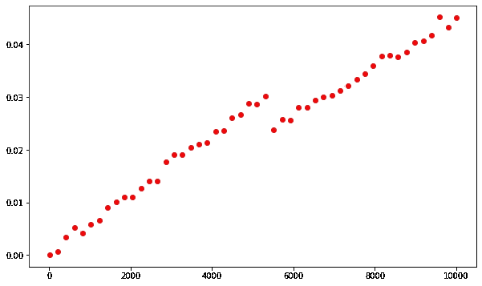

来源:作者

我们可以添加一条最佳拟合线(使用四次函数)来进一步举例说明这一点。图表永远不会是一条完美的直线，但应该很接近。

```
degree = 4
coeffs = np.polyfit(ns, ts, degree)
p = np.poly1d(coeffs)
plt.plot(ns, ts,'or')
plt.plot(ns, [p(n)for nin ns],'-b')
```

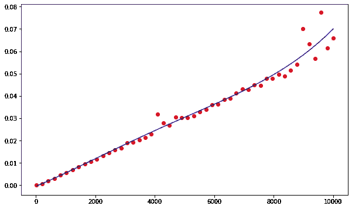

来源:作者

## 列表索引

从列表中检索一个条目(列表索引)以`O(1)`运行时复杂性运行，这意味着列表中条目的数量不会影响算法运行的时间。这在图表中是如何表示的？

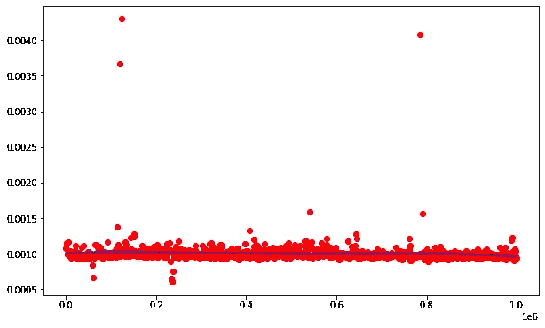

来源:作者

# 算法

现在，我们将查看由以下算法生成的图表:

*   线性搜索
*   二进位检索
*   插入分类

## 线性搜索

线性搜索的运行时复杂度为`O(n)`，将用一条近似直线来表示。

**红色曲线**演示在混排列表中搜索元素，**蓝色曲线**演示搜索列表中不存在的元素。

红色图的最佳拟合线通常小于蓝色图的最佳拟合线，因为搜索列表中不存在的元素需要遍历整个列表。

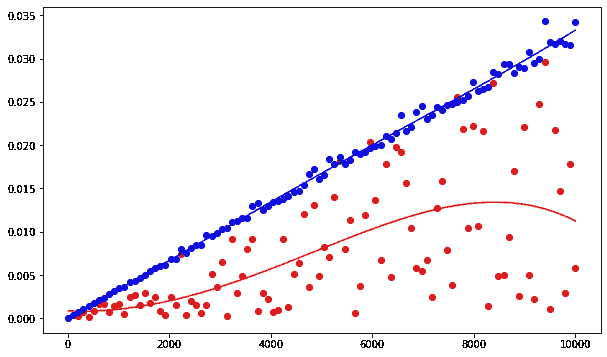

来源:作者

## 二进位检索

二分搜索法运行与`O(log n)`运行时的复杂性。

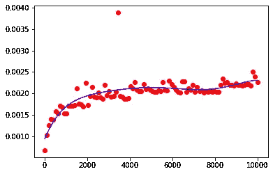

来源:作者

多次运行后，上面是近乎完美的模拟图。如您所见，存在一些异常值，在完美的模拟中，最佳拟合线与对数函数相同。

# 插入排序

插入排序有什么运行时复杂度？我们可以使用其运行时的图，并将这些图与已知运行时的图进行比较，以确定哪个是最接近的匹配。

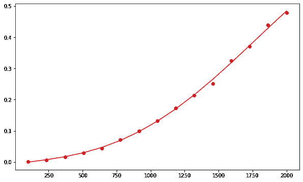

来源:作者

我们可以将该图与不同运行时的图进行比较，以最终确定哪一个最相似以及插入排序具有哪种运行时复杂性。

**红色图**代表`O(log n)`，**蓝色图**代表`O(n^2)`，**绿色图**代表`O(2^n)`。

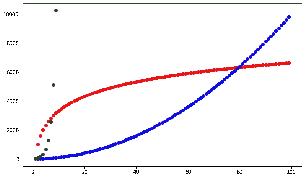

来源:作者

基于这些图表，可以安全地假设插入排序在`O(n^2)`时间内运行。

# 神秘函数运行时分析

我们可以使用神秘函数运行时的可视化来确定它们的运行时复杂性吗？

## 神秘功能#1

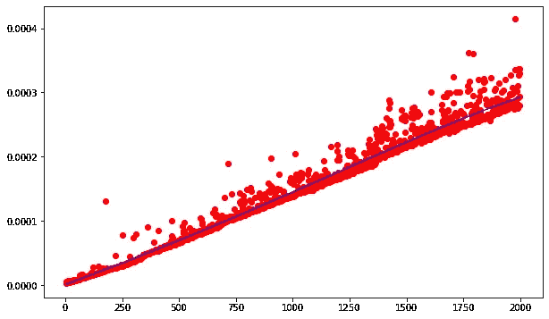

来源:作者

甚至不用将这个图与可能的运行时图进行比较，我们就可以安全地假设这个函数在`O(n)`运行时运行。

## 神秘功能#2

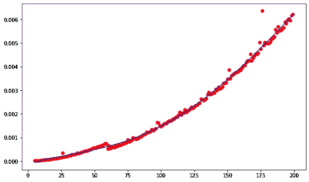

来源:作者

这个图看起来非常类似于插入排序的图，所以我们可以确定这个函数的运行时复杂度是`O(n^2)`。

## 神秘功能#3

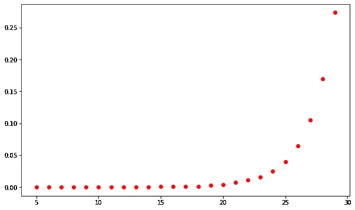

来源:作者

这个函数比前两个更模糊。显然，其运行时间必须大于`O(n)`，因为斜率随着`n`的增加而增加。让我们考虑红色**中的`O(n^2)`和蓝色**中的`O(2^n)`的运行时图。****

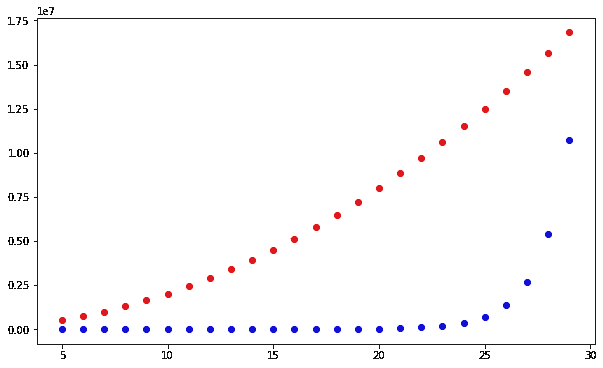

来源:作者

神秘函数#3 的运行时间的图形更类似于蓝色曲线，因此神秘函数#3 的运行时间复杂度是`O(2^n)`。

# 结论

使用这些可视化库，我们能够通过将函数和算法与已知运行时的图进行比较来确定它们的运行时复杂性(例如，将插入排序运行时的图与`y=n^2`进行比较)。除了确定运行时的复杂性，这种方法还可以用来比较不同算法的速度。只需几行代码，您就可以快速看到您选择的算法在处理大量数据时的运行速度！

# 资源

*   [Pyplot 教程— Matplotlib 3.4.2 文档](https://matplotlib.org/stable/tutorials/introductory/pyplot.html)
*   [numpy.polyfit — NumPy v1.20 手册](https://numpy.org/doc/stable/reference/generated/numpy.polyfit.html)
*   [使用递归(programiz.com)显示斐波那契数列的 Python 程序](https://www.programiz.com/python-programming/examples/fibonacci-recursion)
*   [如何在 Python 中找到给定字符串的所有可能排列？(tutorialspoint.com)](https://www.tutorialspoint.com/How-to-find-all-possible-permutations-of-a-given-string-in-Python#:~:text=To%20find%20all%20possible%20permutations%20of%20a%20given%20string%2C%20you,in%20the%20iterable%20as%20tuples.)
*   [每个程序员都应该知道的 8 个时间复杂性|阿德里安·梅希亚博客](https://adrianmejia.com/most-popular-algorithms-time-complexity-every-programmer-should-know-free-online-tutorial-course/)