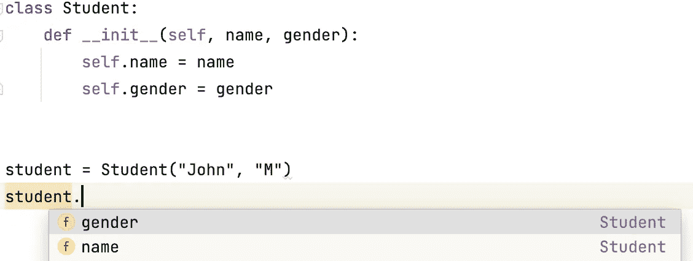
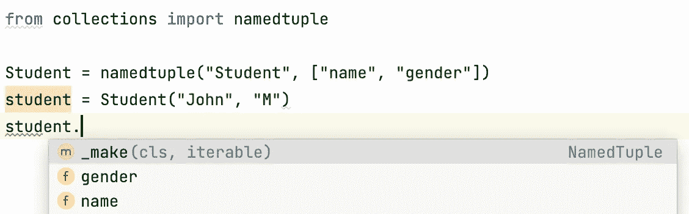

# Python 中常规自定义类的 3 种替代方案

> 原文：<https://betterprogramming.pub/3-alternatives-for-regular-custom-classes-in-python-2f2bafd66338>

## 在适当的时候使用它们


在[无刷](https://unsplash.com?utm_source=medium&utm_medium=referral)上[车头时距](https://unsplash.com/@headwayio?utm_source=medium&utm_medium=referral)拍摄

在任何项目的大部分时间里，我们都在努力定义各种类来建模我们的数据。因此，构建适当的类是使您的项目健壮和可维护的基本技术。通常，自定义类采用以下形式:

```
class CustomClass
    # the body of the class
    pass
```

然而，有几种情况下你想使用不同的东西。在本文中，我将回顾与为您的项目定义类相关的三种选择。

# 命名元组

我们知道元组是 Python 中基本的内置数据结构之一。当我们定义一个元组时，我们简单地使用括号将它的项括起来，用逗号分隔，如下所示:

```
student_data = ("John", "M")
```

作为一种内置类型，元组被设计为通用类型，以便它们可以用于一般用途。然而，这种通用性是有代价的——元组不知道它们保存的是什么数据。对于元组来说，它们不是由我们“定义”的，它们可以按照自己的意愿保存任何项目，没有任何限制。相比之下，自定义类知道它保存什么数据，尤其是属性:



自动完成提示

如上所示，在 PyCharm IDE 中，您可以看到`student`的属性被自动填充用于代码完成，因为 IDE 知道`student`可以有什么数据。

为了提供“普通”类的好处(例如，点符号)，您实际上可以创建一个基于称为命名元组的元组的数据模型:



命名元组

要创建一个命名元组，您需要从内置的`collections`模块中导入`namedtuple`函数。`namedtuple`函数可以被称为工厂函数，因为你用它来创建一个新类。具体来说，您以字符串的形式提供类名，以列表的形式提供属性。对于命名元组的实例，它知道这样的实例保存什么数据。

> **问题**:你什么时候想在常规定制类上使用命名元组？
> 
> **回答**:当数据模型作为数据容器时，可以使用命名元组，因为它们不支持可变性，这意味着你不能改变命名元组实例的属性，不像普通类的实例。值得注意的是，命名元组是元组的一个子类，所以它们的大小很小。如果需要创建许多实例，命名元组可以节省内存。

关于命名元组的更多信息，请参考我的[上一篇文章](https://medium.com/swlh/empower-a-lightweight-python-data-structure-from-tuples-to-namedtuples-ca4abddd8ef6)。

# 列举

枚举是一种技术，它涉及到创建一个类，将同一概念的相关成员保存在一起。例如，北、南、东和西是方向概念的成员。再比如，春、夏、秋、冬是季节概念的成员。

在 Python 的标准库中，enum 模块提供了创建枚举类的基本功能。我们先来看一些代码:

```
from enum import Enum

class Season(Enum):
    SPRING = 1
    SUMMER = 2
    FALL = 3
    WINTER = 4
```

如您所见，Season 类是 Enum 的一个子类，它包含四个季节。在这里，我将这四个成员大写，因为它们代表常数。然而，如果你喜欢小写，这是你的选择。每个成员都有两个重要的属性:`name`和`value`，如下图:

```
>>> spring = Season.SPRING
>>> spring.name
'SPRING'
>>> spring.value
1
```

对于这些值，您可以将它们命名为增量整数。如果要构造枚举成员，它们会很有用。假设您有一个 API，并收到一个响应 2，作为季节的值。您可以按如下方式创建成员:

```
>>> fetched_season_value = 2
>>> matched_season = Season(fetched_season_value)
>>> matched_season
<Season.SUMMER: 2>
```

enumeration 类的另一个有用的特性是支持迭代。也就是说，枚举类是可迭代的。例如，您可以通过运行以下命令来创建这些枚举数的列表:

```
>>> list(Season)
[<Season.SPRING: 1>, <Season.SUMMER: 2>, <Season.FALL: 3>, <Season.WINTER: 4>]
```

如果你想知道这四个季节的名字，你也可以用列表理解法:

```
>>> [x.name for x in Season]
['SPRING', 'SUMMER', 'FALL', 'WINTER']
```

> **问题**:你什么时候想在常规定制类上使用枚举？
> 
> **答**:当你有一组成员落在同一个概念里，就要用枚举。尽管您可以创建一个常规类，并使用类属性来保存这些成员，但默认情况下，常规类不支持迭代。此外，它没有本机属性(如名称和值)来操作这些成员。

关于枚举的更多信息，请参考我的[上一篇文章](/take-advantage-of-the-enum-class-to-implement-enumerations-in-python-1b65b530e1d)。

# 数据类别

当我说数据类时，我只是说我们正在使用`dataclass`装饰器创建一个保存数据的类。与装饰函数的典型装饰器不同，`dataclass`装饰器装饰一个类，如下所示:

```
from dataclasses import dataclass

@dataclass
class Student:
    name: str
    gender: str
```

`dataclass`装饰器是`dataclasses`模块的一部分。我们简单地把这个装饰器放在我们定义的类上面。在类的主体中，我们指定了类的属性以及它们各自的类型。

装修看起来很直白。让我们看看这些额外的功能对于`dataclass`装饰者来说是什么。

```
>>> student = Student("John", "M")
>>> student.name
'John'
>>> student.gender
'M'
```

如上所示，一个重要的事情是我们没有显式定义`__init__`方法，但是修饰后的 Student 类知道如何构造一个实例！这是因为`dataclass`装饰器使用带注释的属性(例如`name: str` & `gender: str`)在幕后为我们创建了初始化`__init__` 方法。

除了`__init__`方法之外，`dataclass`装饰器还为我们实现了`__repr__`方法，这允许我们检查实例:

```
>>> repr(student)
"Student(name='John', gender='M')"
```

值得注意的是，因为如果一个类没有实现`__str__`，那么`__repr__`就是后备。因此，如果您打印数据类的实例，您将得到相同的字符串输出:

```
>>> print(student)
Student(name='John', gender='M')
```

> **问题**:你什么时候想使用数据类而不是常规的自定义类？
> 
> **答**:当你想为一个自定义类消除一些样板文件，比如实现 __init__ 和 __repr__。如果您想在 __init__ 方法中获得更多定制的行为，dataclass 装饰器可能不是您的最佳选择。

关于枚举的更多信息，请参考我的[上一篇文章](/6-things-to-know-to-get-started-with-python-data-classes-c795bf7e0a74)。

# 结论

在本文中，我们回顾了除常规自定义类之外的三种可选方法:命名元组、枚举和数据类。它们各有利弊，您应该根据自己的需要选择合适的数据模型。不要将自己局限于常规的定制类，可能会有更好的内置解决方案适合您。

记住不要多此一举！