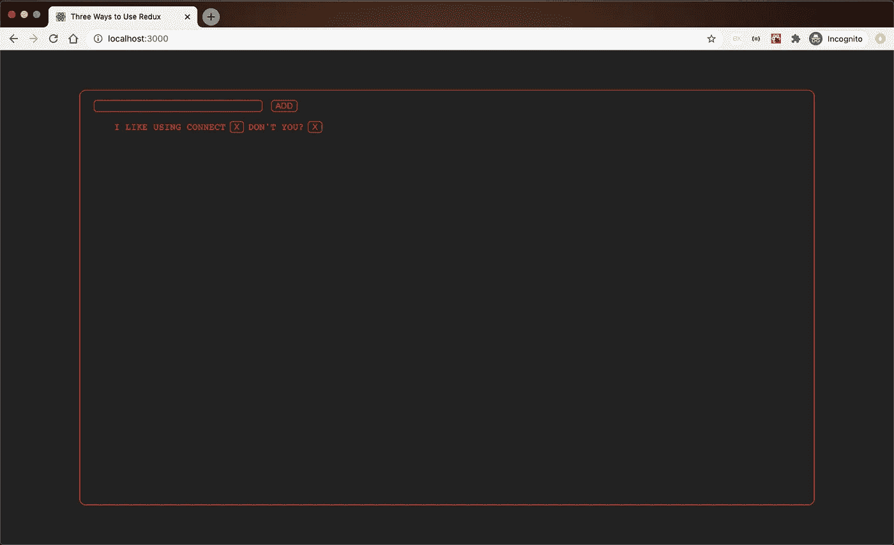

# Redux 中的 3 种状态方法

> 原文：<https://betterprogramming.pub/3-approaches-to-state-in-redux-b1835d1ab098>

## 或者，在去商店的路上发生了一件有趣的事情

最佳花蕾(图片由作者提供)

开发人员也是人，和其他人一样。

我们和任何人一样容易陷入俗套。事实上，我们更有可能。当你在一个紧张的期限内，并且你没有时间去试验你在这个项目中使用的库/框架/语言的所有闪亮的新特性时，你很容易陷入一个俗套。“以后，”你告诉自己，“我会深入研究这些文档，真正弄清楚是什么让这件事发生的。”

太多时候，“以后”不会到来，实验的动力会消退，而您将会从头到尾了解的那项令人敬畏的技术会变成您腰带上的另一个工具，您会为一组非常特定的用例拿出来。

我最大的缺点是使用了 [Redux](https://redux.js.org/) 和 [React Redux](https://react-redux.js.org/) ，这两个伟大的库用于在 React 中处理应用程序范围的状态管理。我开始和他们一起工作，我进入了一个有效的流程，我拒绝从中挖掘出路。

直到现在，那是。今天我将向大家展示三种使用 Redux 和 React 的方法。其中两种方法利用了 React Redux helper 库，另一种方法纯粹是用 Redux 和自定义 React 挂钩实现的。

好奇吗？启动你的终端，让我们开始吧。

你可以在 [GitHub](https://github.com/timmalstead/3_ways_to_use_redux) 上找到完整的代码。

# 1.准备和安装

[创建 React 应用](https://github.com/facebook/create-react-app)是脸书提供的一个伟大的工具，他也创建了 React 和 Redux，旨在在几分钟内为你启动一个正常运行的 React 应用。如果您还没有，我建议您输入以下命令进行全局安装:

`npm i -g create-react-app`

之后，通过键入以下命令创建一个新应用程序:

`npx create-react-app 3_ways_to_use_redux`

构建完成后，导航到项目的根级别并键入:

`npm i redux react-redux`

这将安装基本的 Redux 库，以及一个专门用来集成 Redux 和 React 的有用的钩子和方法库。

我保证，只要再多一点点，我们就可以开始真正的编码了。

导航到您的`src`文件夹并键入:

`mkdir redux`

这将为您创建一个文件夹来放置 Redux 逻辑。

最后，打开您的`redux`文件夹并键入:

`touch actions.js constants.js reducers.js store.js`

这将为您创建使用 Redux 的初始文件。

好吧！安装够了。启动你最喜欢的 IDE，让我们开始工作吧。

# 2.设置 Redux

先说`constants.js`。复制以下代码:

在 Redux 中，您通过动作与状态交互。动作是必须有类型属性的普通对象。最佳实践是让 type 属性是一个字符串。但是因为字符串容易出错，所以将它们作为常量调用也被认为是最佳实践。明白了吗？

我知道，太多了。我喜欢把常数想象成你行为的标题。给它们取一个简短的描述性名称，并遵循一个令人尖叫的 _SNAKE_CASE 命名约定。我们将只对我们的状态做两件事，添加和删除文章。

接下来，`actions.js`:

我们在这里所做的只是做一些传递对象的简单动作。正如我上面所说的，动作必须传递一个具有类型属性的对象。通常，他们也会传递信息。这个信息按照惯例被称为`payload`。我们将在下一步中看到如何使用该有效载荷。

`reducers.js`:

reducer 是一个指示动作如何与状态交互的函数。它需要两个参数，状态和改变它的动作。当我们开始我们的程序并且 reducer 第一次运行时，我们将为它提供一个运行的初始状态。一种常见的模式是使用编写的`switch`语句根据类型属性对动作进行排序。看到所有的小片段是如何组合在一起的了吗？

需要记住的一件重要事情是 Redux 中的状态是不可变的*。*无法改变，只能复制替换。每次我们发一个动作，reducer 都会看一下`action.type`，看如何实现。它将改变状态的一部分，并复制其余部分不变。

在返回新副本之前，我们的 reducer 将对状态进行以下更改:

*   如果类型是`ADD_ARTICLE`，reducer 将复制当前的`articles`数组，并将`payload`追加到其中。
*   如果类型是`DELETE_ARTICLE`，我们的 reducer 将过滤`articles`数组，并返回一个副本，其中包含 id 与`payload`不匹配的所有内容。

到目前为止，我们只是在用普通的 JavaScript 做一些事情。没有什么新奇的东西，没有什么特别的 Redux 魔法——只有字符串、对象、数组和一个开关。你可能会问，Redux 实际上在哪里出现？你会在我们的下一个文件中看到。

`store.js`:

我们走吧。我告诉过你 Redux 会有东西出现。我们使用 Redux 库中的`createStore`方法，用我们的 reducer 作为参数来创建一个存储，我们将它命名为`store`。

我们的商店就是我们的国家所在的地方。在我将要向您展示的两个工作流中，我们将使用 React Redux helper 库来访问存储，在第三个工作流中，我们将直接从存储中访问状态，然后编写我们自己的定制挂钩来将其交付给我们的组件。

这就是我们最初的 Redux 设置。我们接下来设置我们的组件，这样我们就有好看的东西看了，怎么样？

# 3.设置前端并启用连接

我们已经设置了 Redux 存储来处理状态，但是我们仍然需要能够在组件中添加和使用状态。

我们要做的第一件事是在应用程序的入口点包装我们的`App`组件。将以下代码复制到应用程序根目录下的`index.js`。

在我们导入`Provider`组件并使用我们创建的商店作为道具后，应用程序的任何部分都可以访问 Redux 全局状态，而不必使用道具钻取*。*这是 Redux 和其他全球状态管理系统的主要诉求。您可以在应用程序的任何部分更改和访问状态，而不必通过应用程序中不需要它的部分进行传递。

接下来，创建一个名为`Components`的文件夹，并创建名为`List.js`和`Input.js`的文件。将以下代码复制到它们中。

喔，喔，喔。这些东西是怎么回事？这是我们将 Redux 状态和动作连接到组件时必须做的额外步骤。我马上会解释更多。不过，在此之前，请将下面的代码复制到根文件夹中的`App.js`中。

在那里也创建一个名为`style.js`的文件。我喜欢这个应用程序中漂亮的亮红色，但请随意将其更改为您最喜欢的颜色。

在我们的两个新组件中，我们使用了与 React Redux 的`connect`方法相结合的`mapDispatchToProps`和`mapStateToProps`函数，将我们的 Redux 状态和动作传递到我们的组件中。为了导出它，我们创建一个高阶组件，然后将它用作默认导出。

如果您在终端中键入`npm start`，您应该会看到类似这样的内容。

恭喜你，你已经用 Redux 设置了一个 React 应用。

如果设置 Redux 需要经历很多，那是因为确实如此。自从引入钩子之后，我们有了更简单、更直接的选择来做同样的事情。我只是向您展示了连接 Redux 以作出反应的一种更老的风格，这样您就知道它看起来像什么以及它是如何工作的，以防您在查看更老的代码时遇到它。

在下一节中，我将向您展示如何使用定制钩子来连接更现代的工作流。

# 4.使用钩子在 React 中重复

在您的`redux`文件夹中，创建一个名为`selectors.js`的新文件，并复制以下代码。

这里我们创建了一个定制钩子，使用 React Redux 的`useSelector`钩子指向 Redux 状态的一部分。它将 Redux 状态作为参数，从那里，您可以将它指向您喜欢的状态的任何部分。当然，我们只有`articles`可以使用，但是在实践中，您可以拥有简单或复杂的状态。然后我们返回一个对象中的文章。这将允许我们在组件中使用钩子时析构它。如果这看起来有点迂回，不要担心，你很快就会明白我的意思。

接下来，我们必须改变一下我们的`actions.js`。

类似于我们设置`selectors.js`的方式，我们在一个自定义钩子中使用 React Redux 的`useDispatch`方法来进一步抽象我们的动作对象。这是件小事，但我喜欢。它允许我们在组件中保持我们的动作更加原子化和清晰。此外，它允许我们将重点放在前端的重要逻辑上，例如文章中的文本，而不是我们在组件中不需要真正担心的事情，例如为对象创建 id。有一个做两次事情的元素，但我觉得这是由我们的组件中的事情会有多清晰来平衡的，接下来。

`List.js`

`Input.js`

啊，那不是很好吗？看每样东西看起来多干净。看所有的东西读起来多么简单。钩子很棒，我们可以解开状态的每一部分或我们需要的每一个动作，并放弃任何我们不需要的东西。

启动`npm start`并确认一切正常。

恭喜你。您已经将您的应用程序从旧的特设工作流迁移到一个干净的、基于钩子的现代工作流。

这就是我建议在生产应用程序中设置 Redux 状态的方式。除了易于阅读之外，Redux 和 React Redux 库都经过了优化，可以在 React 应用程序中可靠、快速地工作。

也就是说，为了启发我们自己，让我们构建最后一个工作流，这次不使用 React Redux 库，只使用 Redux 方法。这样，如果您希望将 Redux 用于其他框架，甚至静态网页，您可以获得更好的理解。

# 5.反应中的冗余没有反应中的冗余

在我们之前的两个工作流中，我们从主 Redux 库中访问的唯一东西是我们的`store.js`文件中的`createStore`方法。我们与 Redux 交互的所有其他内容都来自 React Redux 库。

让我们稍微重构一下 Redux 文件。

`store.js`

在我们的存储文件中，我们将从存储对象中析构一些方法并导出它们。这些将用于替换我们在上一个工作流中从 React Redux 导入的钩子。此外，我们将不再需要默认导出，因为我们将只从存储中导出方法，而不是存储本身。

`selectors.js`

我们的选择器在实现上稍微复杂一点，但是在概念上与我们上一个工作流相同。我们正在设置一个`useEffect`钩子来监听我们从商店导出的`subscribe`和`getState`方法的状态变化。当我们的状态改变时，我们将把它设置到我们的`useState`钩子中，并用我们的`useReduxState`钩子把它导出到组件中。

是的，这有点绕弯，如果你的 linter 因为你在你的`useEffect`钩子的依赖数组中使用了复杂的表达式而对你大喊大叫，不要感到惊讶，但是它完成了工作。

## 更新

我意识到我使用了一个`useEffect`钩子和`subscribe`函数做了过多的工作。下面的代码也可以工作。

我能想到的唯一缺点是(我相信)`subscribe`在 Redux 状态有任何变化时触发，而我相信`useEffect`钩子的依赖数组正在监听状态的特定部分。如果任何人有任何关于哪个更有性能的见解，我很乐意在评论中听到。

`actions.js`

这与我们上一个工作流程几乎相同。事实上，这要简单一点，因为我们可以在这里使用`dispatch`方法，而不必解构它。

我们要做的另一件事是稍微重构一下我们的根层次`index.js`。

因为我们没有使用 React Redux 库，所以没有必要导入商店或将我们的应用程序包装在一个`Provider` HOC 中。

之后，检查以确保一切正常运行。

这就是你在没有助手库的情况下使用 Redux 所需要做的一切。不太复杂，是吧？

# 最后的想法

我们已经分解了在 React 中使用 Redux 全局状态的三种方式。首先，我们学习了如何使用`connect`函数来设置高阶组件，以映射我们的状态并分派到组件中的 props。然后我们学习了如何使用 React Redux 库中包含的钩子与我们的组件进行通信。最后，我们学习了如何在没有助手库的情况下使用状态。

我希望我已经向您很好地概述了 Redux 如何与 React 一起提供一个应用程序范围的状态管理解决方案，无论您选择如何实现它。

如果你觉得我遗漏了什么或者可以改进的地方，请在评论中告诉我。

黑客快乐！