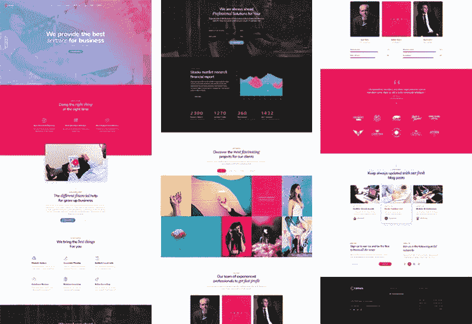
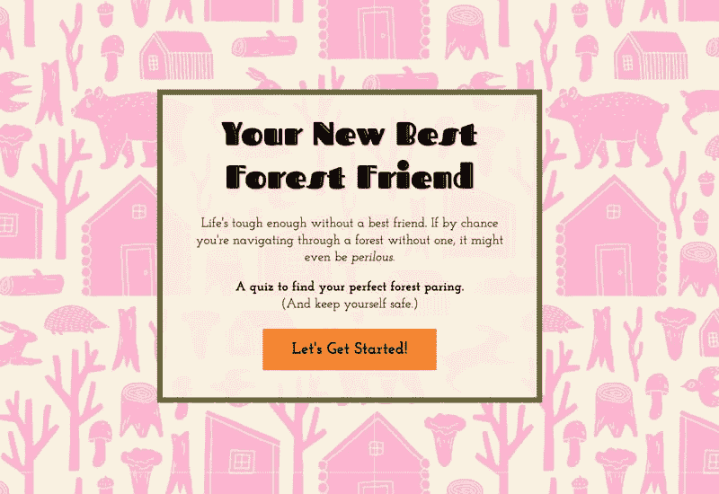
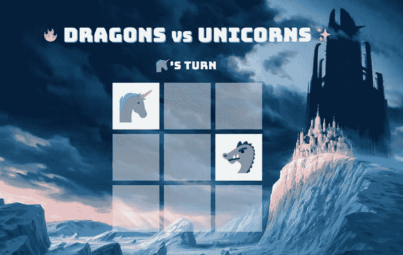
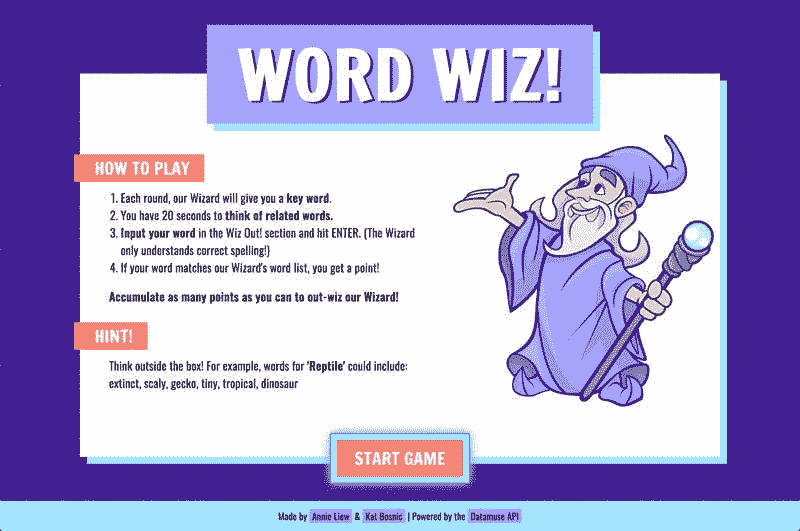
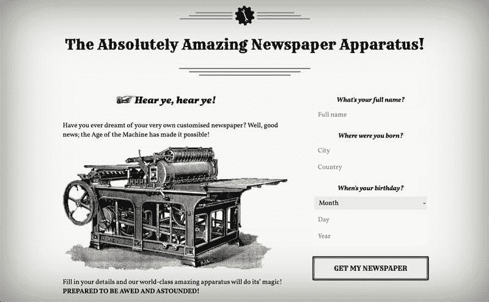

# 3 个初学者项目想法来开始你的前端投资组合

> 原文：<https://betterprogramming.pub/3-beginner-project-ideas-to-get-started-on-your-front-end-portfolio-b00dd8fc7fce>

## 被太多建议淹没了？这里有三个项目想法，你可以在通往前端精通的路上实施！


你已经听过一遍又一遍了。构建项目是提高你的技能、学习知识并最终获得令人垂涎的技术工作的最佳(或许也是唯一)方式。

有很多文章都有很多项目想法，它们都很棒，很有用。然而，有时收到这么多的信息会导致分析瘫痪，你最终什么也没做。

两年半前，我从一个前端训练营毕业，下面是我个人*建立的三个项目，它们帮助我找到了我的第一份工作，并让我走到了今天:在一家 [B2B SaaS 初创公司](https://www.usepastel.com/)担任前端工程主管。每个项目都建立在前一个项目的基础上，所以在进入下一个项目之前，确保你已经掌握了那里的概念和技能。这篇文章包含了很多技巧和资源，可以帮助你上路！*

*继续读下去，让我们开始吧。*

# *三个项目*

## *1.完全响应网站的设计*

*这是展示你的语义 HTML 的一个很好的方法，也许还可以使用 CSS 预处理程序，比如 SCSS。你可以从像[freebiebug](https://freebiesbug.com/psd-freebies/website-template)或 [Speckyboy](https://speckyboy.com/free-photoshop-psd-web-design-template/) 这样的网站获得免费的 photoshop 设计。*

*这是我在兼职网络开发课上做的一个静态设计的例子。我的学校购买了设计，我们得到了一个平面 jpg 的布局和所有必要的资产(如十六进制颜色代码和图像)。*

**

*🔗 [*这里看到我实现的克洛诺斯商务网站*](https://anniebombanie.github.io/cronus-business)*

*当你构建你的用户界面时，考虑诸如可访问性、响应性和可能的令人愉快的接触，如过渡和动画。*

*作为动画的可访问性说明，请查看`[prefers-reduced-motion](https://developer.mozilla.org/en-US/docs/Web/CSS/@media/prefers-reduced-motion)` CSS 媒体查询。这是一个被忽视但很重要的方法，你可以考虑当有太多的运动和动画时，那些经历恶心、头晕和不适症状的用户。*

*要学习的概念包括盒子模型、语义 HTML、可重用样式和实用类，以及命名约定(比如 [BEM](http://getbem.com/) )。探索通过 flex-box、绝对/相对定位、边距和网格定位元素的方法。Float 仍然存在，知道这一点很好，但是在现代 web 开发中你很少会接触到它。在你写 HTML 的时候，这也是你尝试 [Emmet](https://code.visualstudio.com/docs/editor/emmet) 的机会。*

*这里有一个简单的类比来帮助解释盒子模型。(刚开始时，我很难区分边距和填充):*

*我喜欢首先在移动设备上构建我的界面。作为块，内容堆叠在彼此之上，当布局扩展到桌面时，我可以添加 CSS 来伸缩它们。我发现这有助于我编写更少的代码，从而减少错误。知道如何写好 CSS，会省去你调试的头疼。*

*说到调试 CSS，这是我最常用的浏览器扩展之一:*

*在编写完整的布局之前，可以先构建较小的用户界面，比如 Twitter 登录表单或您喜欢的应用程序的 UI。这是一个令人难以置信的方式来适应和关注上面提到的概念。您将学习如何编写良好干净的代码和正确级联的样式。随着您的进步，您将能够更快、更直观地搭建接口。*

*我就是这样开始的。*

## *加分练习！*

*从一本杂志上取一两页，尝试通过代码重新创建布局。有些杂志非常有创意，你可以使用[谷歌字体](https://fonts.google.com)和 [Unsplash](https://unsplash.com) 的图片尽可能匹配。使用 [Lorem Ipsum](https://www.lipsum.com) (或类似的虚拟文本生成器)，这样你就不必打出所有的文本。您也可以使用 Emmet 自动[插入 Lorem Ipsum。](https://docs.emmet.io/abbreviations/lorem-ipsum/)*

## *2.一个 JavaScript 游戏*

*对于我的第一个 JavaScript 项目，我做了下面这个简单的测试。JavaScript 对我来说是如此的困惑，在我的第一个个人项目中跳入一些困难的东西可能会让我放弃。*

***你新的最好的森林朋友***

**

*🔗 [*在这里玩*](https://anniebombanie.github.io/new-best-forest-friend/)*

*你的游戏不一定要超级复杂，但是展示逻辑思维的东西是让你像程序员一样思考的好方法。你将学习如何构建和组件化你的代码，DOM 操作，渲染游戏的不同部分，以及如何使用编程函数，比如循环，if-else 语句等等。*

*尽可能地尝试自己构建，而不需要遵循教程。当你需要找出解决问题的方法时，参考文献或文章。挑战自己真的有助于培养你解决问题的能力。编写[伪代码](https://www.freecodecamp.org/news/what-is-pseudocode-in-programming/)将游戏逻辑分解成小步骤，并通过逐步解决每个部分来工作。*

*举个例子，这是我测验的伪代码。这些天来，我的伪代码可能看起来有点不同，但我是这样开始的:*

```
*/* Pseudo Code:
1\. User clicks on “Let’s Get Started” button
2\. Page scrolls down to the first question.
3\. User selects answer.
4\. Icon next to answer changes colour to show it’s been selected.
5\. User clicks on “Next” button.
6\. Page scrolls down to next question.
7\. If nothing has been selected, error output “Please pick an answer!”
8\. Repeat steps 3 - 7.
9\. User clicks “Meet my new best friend!”
10\. If user has scrolled down without selecting an answer somewhere and clicks on this button, error output “Please answer all the questions to find your new friend.” (Put required = true)
11\. Page scrolls down to show new friend, dynamically.
12\. Button underneath to re - start(clears all fields, back to top of page): “I want a new forest friend”
Logic Notes:
- Use.filter, .attr and.map to grab animals with correct name class.
- Function to say that if .bear.length > .rabbit return .bear
  - If class A.length === class.B.length return random
  */*
```

*这里有几个我制作的其他游戏:*

***龙 vs 独角兽***

**

*🔗 [*在这里玩“龙 vs 独角兽”*](https://codepen.io/anniebombanie/full/NWNEGXZ)*

***Word Wiz***

**

*🔗 [*在这里玩“Word Wiz”*](https://word-wiz.netlify.app/)*—这是一个结对编程项目，使用了一个 API，你可以进一步阅读。**

## *⚡️游戏应用创意*

*   *井字游戏*
*   *绞刑吏*
*   *随机补码发生器*
*   *记忆游戏*

*挑一个，任何一个，找一个主题，跟着它跑！*

## *3.使用 API 的东西*

*在您的开发生涯中，您几乎肯定会使用 API(应用程序编程接口)，除非您处于前端角色的最前端。*

*有许多公共 API，它们在质量、文档和组织方面都各不相同。首先，我推荐使用 RESTful APIs。 [REST(表述性状态转移)](https://en.wikipedia.org/wiki/Representational_state_transfer#Applied_to_web_services)是公司构建 API 时遵循的一套组织原则。架构风格的规则使开发人员的生活变得容易多了。*

## *⚡️ 10 初学者友好的 API*

1.  *官方笑话 API——获得一个随机笑话或 10 个笑话。还可以按类型排序！*
2.  *国际空间站在哪里？API——追踪国际空间站的位置。*
3.  *pokéAPI——对所有口袋妖怪粉丝来说都是一个好消息！*
4.  *[数字 API](http://numbersapi.com/#42) —了解关于数字的有趣事实和琐事。*
5.  *[Datamuse API](https://www.datamuse.com/api/) —一个单词查找查询引擎，对押韵和同义词很有用。*
6.  *[Shibes Online API](https://shibe.online/) —返回 Shibes 狗、猫或鸟的随机图片！*
7.  *[伪 API](https://dummyapi.io/) —提供虚假的用户数据，包括照片、评论和帖子。*
8.  *[天气 API](https://www.weatherbit.io/api) —你制作天气应用的一站式商店。*
9.  *[字典 API](https://dictionaryapi.com/) —获取单词定义、词源、音频发音、同义词、反义词等。*
10.  *[开放琐事 API](https://opentdb.com/api_config.php) —一系列跨越不同类别和难度级别的琐事问题。*

*浏览一下 API 文档，考虑一下如何显示数据。例如，如果你正在使用非常受欢迎的、记录良好的 [Poké API](https://pokeapi.co/) ，你可以构建一个应用程序来搜索和显示口袋妖怪。不要忘记考虑如何处理错误——例如，如果用户输入了错误的信息或者 API 没有返回您期望的数据。*

*至于我，除了你上面看到的使用 [Datamuse API](https://www.datamuse.com/api/) 的 *Word Wiz* 游戏，我还做了一个蒸汽朋克主题的报纸生成器，它从 [Numbers API](http://numbersapi.com/#42) 获取数据。*

***绝对神奇的报纸设备！***

**

*🔗点击这里获取你定制的报纸*

*使用 API 时，请记住以下几点:*

*   *通常你需要注册一个开发者账户，这个账户会给你提供一个 API 密匙。*
*   *您可能需要注册您的应用程序，以便他们可以确认它用于非商业用途。*
*   *每天允许的查询很可能会有限制。如果它非常有限，一个技巧是把你得到的数据保存在一个文件中，然后在你开发应用程序的时候再打开它。*

*这里有一个在使用 API 时保持头脑清醒的技巧:*

## *4.奖金！CRUD 应用程序*

**注意:虽然我构建了一些 CRUD 应用程序作为练习，但我最终没有为我的前端投资组合添加一个。这就是为什么这是一个额外的第四个项目！**

*CRUD 代表创建、读取、更新和删除。这是一个首字母缩写词，指的是使用数据库时被认为是必需的四个函数。对于这一个，我将推荐一个待办事项应用程序或它的一些变体。我认识的一个最聪明的开发人员为他正在学习的每一项新技术开发了一个待办应用程序，以适应语法。*

*待办事项应用程序听起来很无聊，所以想想你的一个爱好或者你喜欢的东西，然后个性化它。例如，我的一个朋友是鼓手，所以他的待办事项应用程序是一个乐队设备列表，以便他们在巡演时记住。另一个朋友创造了一个地方，你可以在飘向天空的气球上写下你的愿望。*

*你的应用应该能够做这四件事:*

1.  *一个新条目。添加新的人*
2.  *`READ`条目——即。从数据库中获取一个人的信息并显示在 UI 上*
3.  *`UPDATE`词条——即。更新此人的生日*
4.  *`DELETE`条目——即。删除此人*

*顺便说一下，CRUD 应用程序也使用 API。事实上，CRUD 的每个字母都完美地映射到一个 HTTP 协议方法:*

```
 *| Operation |   | HTTP Protocol |
 |-----------|---|---------------|
 | Create    | → | Post          |
 | Read      | → | Get           |
 | Update    | → | Put           |
 | Delete    | → | Delete        |*
```

*不想做待办 app？那太好了！*

## *⚡️ 6 CRUD 应用创意:*

1.  *食谱应用程序*
2.  *活动/人员管理应用程序*
3.  *读书俱乐部或图书馆应用程序*
4.  *存储系统*
5.  *电影院/电影列表*
6.  *在线商店*

*从简单的数据库存储开始，[你可以免费使用 Firebase】。](https://firebase.google.com/)*

## *额外提示！*

*对于所有的项目，从更有经验的人那里获得对代码的反馈。这是一个令人难以置信的增长黑客，以提高你的编码技能更快。*

# *总结一下*

*今天，你学习了三个前端投资组合的项目创意。这些人利用了前端开发人员职位所需的一系列技能:*

1.  *完全响应网站的设计*
2.  *有逻辑的游戏*
3.  *使用 API 的东西*
4.  *CRUD 应用程序(奖金)*

*如果你已经完成了所有这些，那么恭喜你——你应该知道 HTML、CSS、JavaScript，如何使用 API 和 JavaScript 框架，比如 React。*

*如果它看起来势不可挡，不要紧张。记住我们都从同一个地方开始；毫无经验。一步一步来，集中精力解决眼前的问题。其余的会随着你的进步而到位。正如他们所说的，吃大象最好的方法是一次一口。*

*关于其他投资组合技巧，请查看我的 Hashnode 演讲[“构建有效的开发者投资组合”](https://www.youtube.com/watch?v=F09TCltMhes&list=PLc7uHtFvhHYCTrcGOwnbiTXC5rnOZeLVX&index=9)。欢迎提出任何问题或在下面留下您的评论。我什么都看了，一定会给你回复的。祝你好运，玩得开心！*

```
***Feeling social?** [Follow me on Twitter](https://twitter.com/anniebombanie_) where I share tips, resources, and my coding journey!*
```