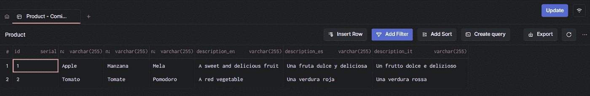
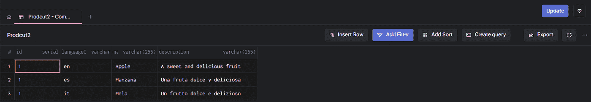
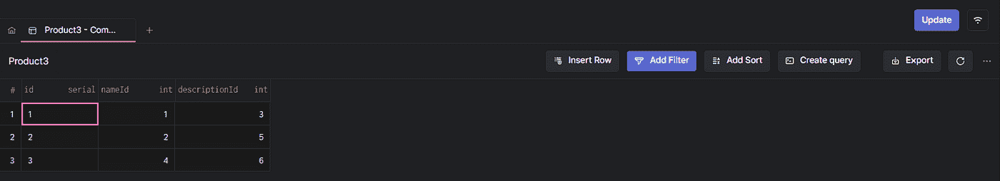

# 设计多语言数据库的 3 个最佳实践

> 原文：<https://betterprogramming.pub/3-best-practices-to-design-a-multi-language-database-80377ca33d15>

## 更轻松地存储您的数据


杰里米·贝赞格在 [Unsplash](https://unsplash.com?utm_source=medium&utm_medium=referral) 上的照片

用一个应用程序接触数百万用户是每个开发者的梦想。如果世界各地的用户都可以使用您的应用程序，那么实现这一目标将变得更加容易。因为不是所有的用户都懂英语或者你的目标语言，所以你需要把你的应用程序设计成多语言的。没有多语言数据库，这是不可能的。

设计一个可以轻松扩展到新语言的多语言数据库并不容易。这就是为什么您应该依靠最佳实践的原因。在这里，你会看到为什么你需要一个多语言数据库，三个伟大的多语言数据库设计，以及如何选择一个最适合你的。

现在让我们来学习关于多语言数据库设计你需要知道的一切。

# 你为什么需要一个多语言数据库？

你永远不知道你的项目会增长多少，你为你的朋友开发的小应用程序可能会成为数百万人使用的国际服务。如果你希望你的产品能够在国际范围内扩展，你需要设计它，以便你可以很容易地适应不同的文化和市场。这就是国际化的意义所在。

构建一个为国际化做好准备的数据库意味着设计一个可以存储多语言数据的数据库。换句话说，后端应该能够以多种语言提供数据。为此，后端应该连接并从多语言数据库中检索这些数据。

注意，让用户可以在几种语言之间切换是一个很好的特性。这对讲多种语言或非母语的人特别有用。所以，即使你的项目很小，目标是本地市场，你也应该考虑多语言数据库。毕竟，你无法预先知道你的项目会有多成功，哪些用户会使用它。现在，让我们了解一下为什么根据您的需求选择正确的多语言数据库设计至关重要。

# 为什么应该仔细设计多语言数据库

就时间和精力而言，更改数据库是一项非常昂贵的操作，因为它会引发连锁反应。修改数据库的结构包括改变与之相连的后端。这可能还需要您相应地调整依赖这些后端的前端。正如您所看到的，更改数据库结构不是一个没有后果的操作。因此，您应该设计一个可以轻松伸缩且不必频繁更改的数据库。

可以想象，设计多语言数据库有几种方法，每种解决方案都有其优缺点。考虑到数据库结构对应用程序的重要性，您必须明智地设计多语言数据库。这就是为什么你不应该从零开始，而是依靠最佳实践。

现在让我们看看一些基于最佳实践的多语言设计。

# 三种多语言数据库设计

让我们更深入地探讨我个人在为世界各地的初创公司工作的全栈 web 开发人员的经历中使用的三种多语言设计的利弊。

## 1.柱式方法

在这种方法中，多语言表中的每个字段都有几个与数据库支持的语言数量相等的列。



基于列方法的示例

具体来说，列名模板如下所示:

```
columnName_languageCode
```

**优点**

*   **简单**:容易实现。
*   **快速**:不涉及`JOIN`或慢速查询。
*   **易处理未翻译字段**:如果某个字段缺少翻译，可以直接使用`COALESCE`。比如`COALESCE(name_it, name_en)` →如果不是`NULL`则返回`name_it`，否则返回`name_en`默认值。

**缺点**

*   **难以维护**:增加一种新的语言需要更新数据库中所有的多语言表。这也意味着您需要相应地改变 ORM 映射。
*   **不可伸缩**:表格中的列数随着应用程序支持的语言数量而增加。
*   **复杂** `**SELECT**` **条件**:忘掉`SELECT *`。您需要在您的`SELECT`子句中指定每一列。

## 2.行方法

在这种方法中，每种语言对应一行。识别多语言实体的关键是以下复合主键:

```
<id, languageCode>
```



基于行方法的示例

**优点**

*   **简单**:容易实现。
*   **快速**:检索翻译内容只需要`languageCode`上的`WHERE`条件。

**缺点**

*   **复合键**:使用复合主键使得识别元素和`JOIN`查询变得更加复杂。
*   **重复内容**:为了简化起见，未翻译的列通常存储默认语言行的列中保存的相同内容。这意味着多语言表格中会有大量重复的内容。

## 3.翻译表方法

在这种方法中，多语言表的每一列都是翻译表的外部关键字。换句话说，涉及多语言字段的每个表都有一个翻译表。



一个基于翻译表方法的例子[1]


一个基于翻译表方法的例子[2]

**优点**

*   **可伸缩**:添加一种新语言不涉及数据库结构的改变。
*   **支持历史数据**:您可以使用翻译表来跟踪实体中每个字段的翻译历史。
*   **集中**:一个实体的所有翻译都存储在一个地方。

**缺点**

*   **复杂查询**:查询变得更加复杂，因为与多语言实体相关的信息分布在两个表中。
*   **慢速查询**:检索与实体相关的所有信息需要与列数一样多的`JOIN`。考虑到`JOIN`对性能的影响，这很容易成为一个问题。
*   **重复表**:它增加了你的数据库在表方面的大小。另外，您需要两个表来定义每个多语言实体。

# 对你来说最好的多语言数据库设计是什么？

如您所见，每种多语言数据库设计都有相同的优点和缺点。这意味着没有绝对的首选方法。你必须根据你的要求、需要和目标仔细选择。我个人在不同的项目中使用了这三种方法，并学到了我分享的经验。

列方法在处理大数据时特别有用，尤其是从拥有一个包含几百万行表的数据库的角度来看，当您根本负担不起`JOIN`查询或重复内容时。尽管列方法不是最具可伸缩性的解决方案，但它是处理大数据的唯一可行的设计。

另一方面，当你公司在当地市场经营的分支机构有行动自由时，逐行方法是有用的。在这种情况下，内容的重复甚至可以成为一种优势。

最后，如果您正在寻找一个优雅且可伸缩的解决方案，并且不介意性能缺陷，那么表格方法是正确的设计。表格方法最适合于您知道数据不会增长太大的项目。

# 结论

设计一个可以存储多语言数据的数据库对于帮助您的企业实现国际化发展至关重要。此外，它还允许非母语用户使用您的应用程序。更改数据库是一项复杂而耗时的操作，对应用程序架构有着不可忽视的影响。这就是为什么您应该从一开始就将数据库设计成多语言的。

在这里，您了解了设计多语言数据库的三种不同方法，研究了它们的优缺点，并详细讨论了哪种方法最适合您。

感谢阅读！我希望这篇文章对你有所帮助。如有任何问题、意见或建议，请随时联系我。

*原载于 2022 年 7 月 19 日*[*【https://arctype.com】*](https://arctype.com)*。*