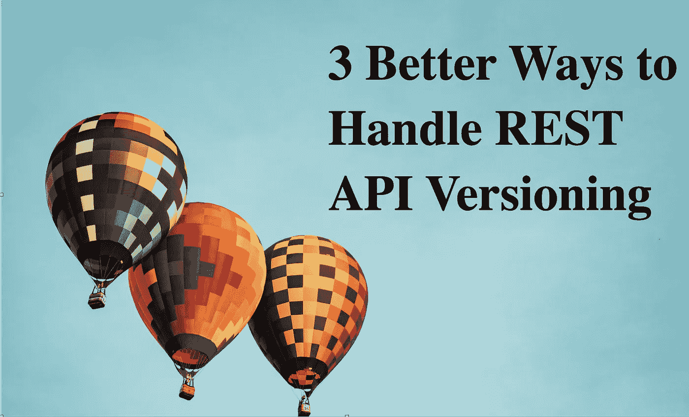

# 处理 REST API 版本控制的 3 种更好的方法

> 原文：<https://betterprogramming.pub/3-better-ways-to-handle-rest-api-versioning-d5fce2e616a7>

## 尽可能不频繁和缓慢地更新版本的技术



照片由 [Aaron Burden](https://unsplash.com/@aaronburden?utm_source=unsplash&utm_medium=referral&utm_content=creditCopyText) 在 [Unsplash](https://unsplash.com/s/photos/three?utm_source=unsplash&utm_medium=referral&utm_content=creditCopyText) 上拍摄

在我上一篇关于[设计 REST API](/restful-api-design-step-by-step-guide-2f2c9f9fcdbf)的文章中，我谈到了为 API 使用一个简单的版本控制方案。经过一段时间，我意识到无论你的版本控制方案有多简单，将消费者从一个版本转移到另一个版本总是一件痛苦的事情。

如果你环顾四周，互联网上充斥着关于 API 版本控制方案的观点。当您使用版本控制时，您需要考虑在一段时间内保持向后兼容性，直到所有消费者都转移到新版本。实现这些需要大量的精力、沟通和计划。

在本文中，我将讨论一些可以帮助您避免更新 API 版本的方法。

# 模式中的新属性

预计经过一段时间后，您将需要向您的模式添加更多的属性。在大多数情况下，添加新属性不会引入重大变化。因此，如果您只是添加新的属性，您不应该更新版本。

例如，如果您有一个如下所述的 API:

```
/v1/products{ "name" : "abc",
  "id" : 1,
  "price" : 30,
  "description" : "All good stuff about abc"
 }
```

并且您想要添加一个名为`stock`的新属性，那么您可以在不更新版本的情况下引入它:

```
/v1/products{ "name" : "abc",
  "id" : 1,
  "price" : 30,
  "description" : "All good stuff about abc",
  "stock" : 10
 }
```

这种技术确实非常流行，我很确定你们中的许多人可能已经在使用它了。

# 补丁上传

当你想提供更新能力时，建议使用`PATCH`而不是`PUT`。以防你不知道，`PUT`用于更新整个资源，而`PATCH`用于更新部分资源。

如果您正在更改模式，并且不允许`PATCH`操作，那么消费者需要更新他们的代码。另一方面，如果您使用`PATCH`操作，那么用户不需要在每次引入新属性时更新他们现有的代码。

# 平行变化模式

在许多情况下，您可能希望用 API 中的新属性替换现有属性。例如，在`products` API 中，假设您想用`stockOnHand`替换`stock`属性。因为您正在删除和引入一个新属性，所以这对您的消费者来说是一个突破性的变化。因此，在这里，您可以选择引入新版本并进行更改:

```
/v1/products{ "name" : "abc",
  "id" : 1,
  "price" : 30,
  "description" : "All good stuff about abc",
  "stock" : 10
 }
```

变更后:

```
/v2/products{ "name" : "abc",
  "id" : 1,
  "price" : 30,
  "description" : "All good stuff about abc",
  "stockOnHand" : 10
 }
```

当您引入一个新版本时，您的所有消费者都需要更新他们的代码来消费这种变化。在所有用户都没有迁移到新版本之前，您需要继续支持这两个版本。这是复杂的，并且大多数时间都消耗了 API 提供者和消费者的时间和精力。

使用并行更改模式可以避免这种情况。

正如文章[1]中所描述的，您应该明确考虑在这个场景中使用*并行变更模式*。平行变更(又名扩展-收缩)模式建议将变更分为三个阶段:

*   发展
*   移动
*   合同

在扩展阶段，除了现有的属性之外，您还要引入这个新属性:

```
/v1/products{ "name" : "abc",
  "id" : 1,
  "price" : 30,
  "description" : "All good stuff about abc",
  "stock" : 10,
  "stockOnHand" : 10 }
```

然后你向你的消费者传达这一变化。一旦他们迁移到使用新属性，您就可以删除它:

```
v1/products{ "name" : "abc",
  "id" : 1,
  "price" : 30,
  "description" : "All good stuff about abc",
  "stockOnHand" : 10}
```

通过这种方式，您可以使生产者和消费者双方的变化都比以前的情况轻得多。

并行变更模式在数据库重构和部署模式中非常流行，比如蓝绿色部署。

如果你一直在使用类似的技术，请在评论中分享它们。

# 参考

*   平行变化:[https://www.martinfowler.com/bliki/ParallelChange.html](https://www.martinfowler.com/bliki/ParallelChange.html)

```
Hey, if you enjoyed this story, check out [Medium Membership](https://deshpandetanmay.medium.com/membership)! Just $5/month!*Your membership fee directly supports me and other writers you read. You’ll also get full access to every story on Medium.*
```