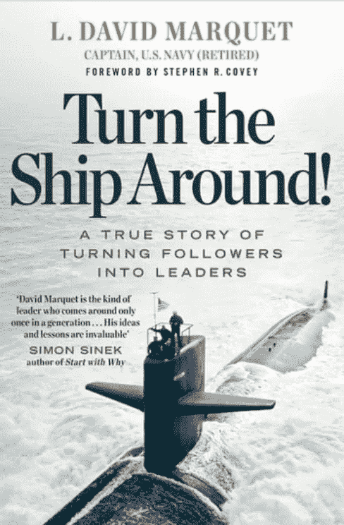
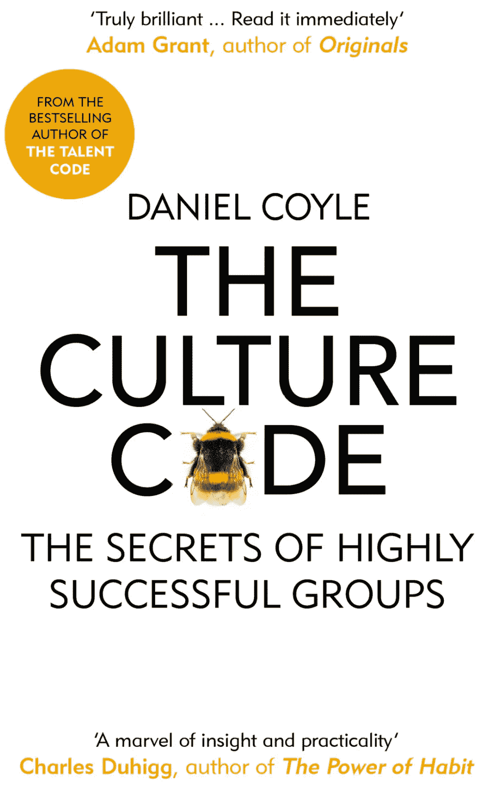

# 3 本书来提升领导水平

> 原文：<https://betterprogramming.pub/3-books-to-level-up-as-a-leader-8feb5af2265e>

## 软件工程师晋升领导职位的洞察力

每个开发人员都是从编程开始职业生涯的。他们学习软件工程的原理，如何存储数据，如何编写高效的算法。经过一段时间，他们实现了目标。每个公司都想雇佣一个有多年经验的高级开发人员。他们更快地完成入职流程，企业从第一天起就受益于他们的经验。

在某种程度上，高级开发人员达到了精通。如何在职业上成长是他们自己的决定。一些人选择新技术的不同项目，而另一些人开始提高他们的领导技能。他们想协调团队，成为他人的榜样。这不是一项容易的任务。尝试这个角色的最好方法是从书本中学习一些基础知识。以下是可以帮助你成长为领导的书籍列表。

# 让船掉头

亚马逊的封面

这本书讲述了一位前美国海军上校的真实故事。他被分配到表现不佳的船上。没人指望他会有什么变化，这在军队中是相当常见的轮换。然而，他能够在一年之内将这艘船的船员变成最好的船员之一。

你们中的一些人可能对标题有偏见，因为不是每个人都认同军队中的原则。当我们闭上眼睛，忘记发生在军舰上的事件时，我们会看到商业世界中的行为是相似的。

作者描述了如何激励团队并推动必要的变革以取得成功。他解释了当没有人再相信你时，如何赋予每个人力量。一个很好的例子是让每个人都明白每个团队成员都必须积极主动。船员们不必等待船长说什么，而是必须观察情况，并与其他人分享意图。Personel 开始以“我即将让船加速 6 英里/小时”的方式交流，而不是默默地看着船长出错。

这本书对新团队的团队领导非常有帮助。它清楚地说明了如何接近每个团队成员并了解团队动态。它还教会我们接受这样一个事实，即领导者可能得不到 100%的支持。在这种情况下，最好的解决方案是分割路径。

# 从西蒙·西内克的《为什么》开始

来自[亚马逊](https://www.amazon.de/dp/B005JZD3B4)的图书封面

西蒙·西内克于 2009 年出版了《从为什么开始》一书，此后该书成为畅销书。这是一个伟大的结合，从上面的书。你可以猜到，这本书的主要思想是“为什么”这个问题的重要性。

许多工程师在他们职业生涯的早期只是期望得到做什么的指示。“告诉我你想要什么，我会为你构建”是我从软件开发人员那里听到的最常见的回答。即使这没有多大意义，他们仍然会实现它。

作者同意这种观念必须改变的观点。我们必须停止问“什么？”或者“怎么做？”。这些都是完全合理的问题，但最主要的问题是“为什么？”。每个请求都必须以这个问题开始。比如“我们为什么要构建这个特性？”，“公司为什么要争取？”。了解原因对于解决问题至关重要。它让我们深入了解**我们需要做什么**以及**如何做**。

# 丹尼尔·科伊尔的《文化密码》

来自[亚马逊](https://www.amazon.de/dp/B019CGXU68)的图书封面

当你已经阅读了上述两本书，并且仍然渴望得到如何建立团队的想法时，丹尼尔·科伊尔的《文化代码》是最好的选择。

思考下面这个问题:如何把人民团结起来？几个人在同一个项目上工作并不一定意味着他们就是真正的团队。他们可以交付分配的任务，报告完成情况，然而我们可以听到团队并不好。

相互信任和清晰的沟通对团队的形成起着重要的作用。好的领导者如果想赢得追随者，首先要展示这种行为。领导者会将他们的信任传递给团队中的每一个人。并期望得到回报。

> “告诉我你想要什么，我会帮助你的。”

这是书中被重复多次的一句话。停止发号施令，开始通过提供帮助来拉近与队友的距离。

作者指出了很多共同的弱点。当团队中的每一个人都愿意诚实地谈论任何情况时，这就定义了一个伟大的团队。获得这样的信任需要惊人的努力，而《文化代码》一书有助于实现这一目标。

# 编后记

领导很难。我们都知道。这需要大量的努力，一旦出错，损失可能无法弥补。要成为一名优秀的领导者，这个人必须经历学习的过程。从成功的领导者那里收集建议有助于避免陷入许多人已经陷入的陷阱。如果你读过这些书，让我知道你对这个汇编的看法。