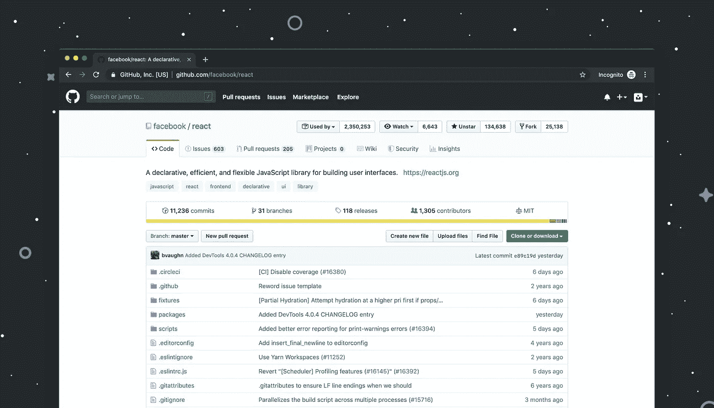
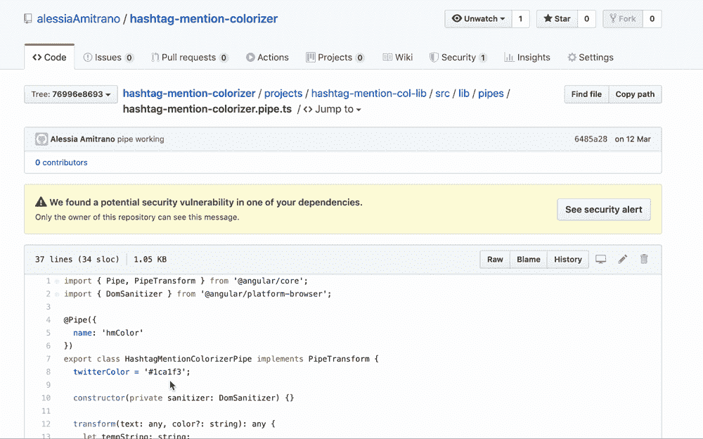
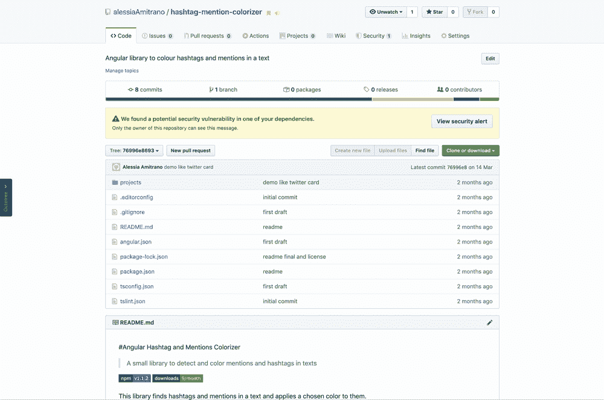
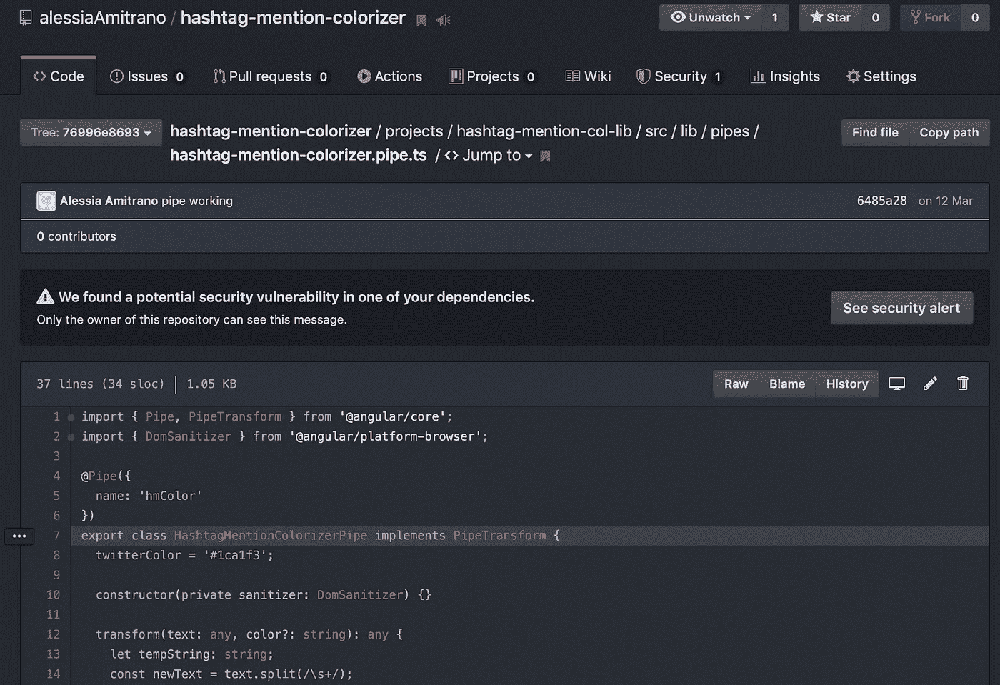

# 3 个 Chrome 扩展赋予 GitHub 超能力

> 原文：<https://betterprogramming.pub/3-chrome-extensions-to-give-github-superpowers-e993f8703ad>

## 八叉链接器、八叉树和黑暗模式

卢克·切瑟在 [Unsplash](https://unsplash.com/s/photos/git?utm_source=unsplash&utm_medium=referral&utm_content=creditCopyText) 上的照片

你每天会在 GitHub 上浏览多少次回购？作为一名 web 开发人员，我得说我的平均值至少是两倍。无论是存储我们的代码，还是探索新的项目或库，GitHub 都是各类开发者的主要参考之一。

在本文中，我将向您介绍三个 Chrome 扩展，它们改变了我使用 GitHub 的方式。

# 1.链接，链接，链接！

我在使用 GitHub 时最讨厌的就是无法点击导入、包含、或者要求语句查阅引用代码(我知道，VS 代码已经惯坏了我们！).

我们要做的是使用面包屑来尝试找到我们感兴趣的代码。如果你正在检查一个大的回购，嗯，它可能需要 10 分钟…

这就是 [OctoLinker](https://octolinker.now.sh/) 派上用场的地方！

这个奇妙的扩展读取您正在查看的源代码，通过正则表达式找到所有的导入、包含和要求，，并将它们转换成指向源代码的链接。你只需点击引用就可以访问它！

八连接器魔法！

该扩展还支持对外部库的引用。它适用于 Chrome、Firefox、Opera 和 Microsoft Edge(如果你作为开发人员有受虐倾向……)。

它适用于 web 开发中所有最常用的语言，但是它还不支持 C 系列。让我们希望它会很快，因为这是一个真正的游戏规则改变者。

# 2.一棵树和更多

我要介绍的第二个扩展是[octo tree](https://www.octotree.io/)。这个扩展有如此多令人惊奇的特性。首先，在可折叠的侧边栏中引入了回购的树形视图。

八叉树在行动

专业版有很多很棒的特性，比如树折叠、存储库缓存支持、代码审查功能和一堆黑暗主题。对于 Chrome 扩展来说，这可能有点贵，但如果你经常使用 GitHub，这可能是值得的。

至于 OctoLinker，Octotree 可用于 Chrome、Firefox、Opera 和 Safari。

# 3.生活的黑暗主题

最后一个我离不开的小扩展是 [GitHub 黑暗主题](https://chrome.google.com/webstore/detail/github-dark-theme/odkdlljoangmamjilkamahebpkgpeacp)。在黑暗模式出现之前，我会经常头疼。所以，为背景非常明亮的应用程序找到一个黑暗模式给我带来了巨大的快乐！

此外，扩展生成的语法突出显示非常好。

Chrome 的 Github 黑暗模式

说到 GitHub，这些是我最喜欢的浏览器扩展。我希望你会发现它们有用！如果你有自己的建议，请在下面的评论中分享。