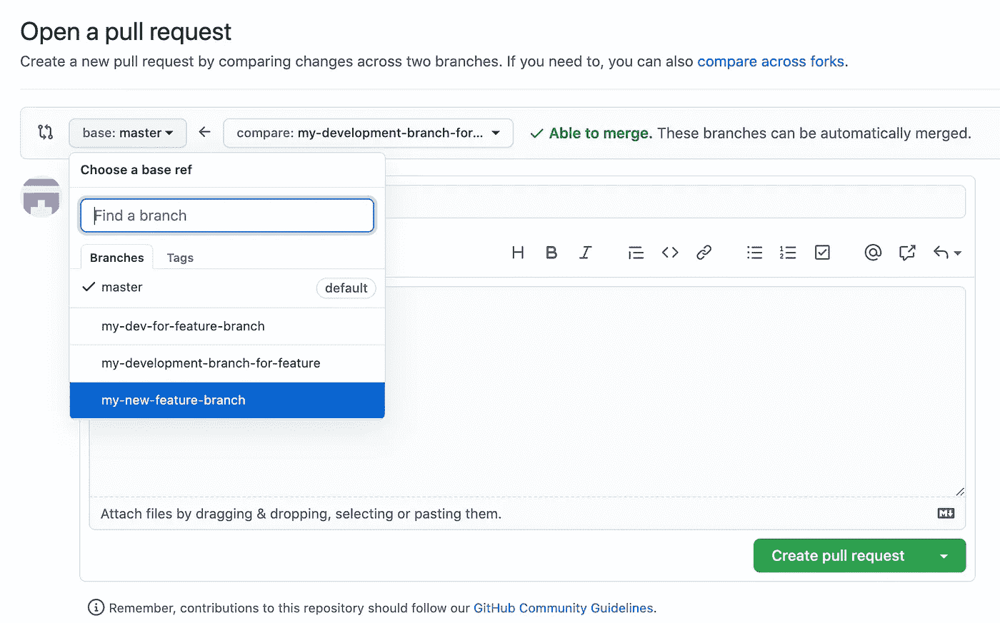

# 3 种常见的 Git 场景以及如何处理它们

> 原文：<https://betterprogramming.pub/3-common-git-scenarios-and-how-to-deal-with-them-ee83c1c1b31e>

## 重命名分支、覆盖 Git 历史和创建特性分支


在 [Unsplash](https://unsplash.com?utm_source=medium&utm_medium=referral) 上 [Brina Blum](https://unsplash.com/@brina_blum?utm_source=medium&utm_medium=referral) 拍摄的照片。

作为开发人员，我们大多数人在 Git 上花了相当多的时间来管理我们的版本控制。我们还使用 Git 与其他开发人员合作，跟踪 bug 修复、构建新特性、重构代码，等等。

在本教程中，我将与您分享您将面临或之前遇到的三种常见情况，以及如何处理它们。

# 重命名现有分支

我不知道你怎么想，但是在我工作的地方，我是根据吉拉的门票进行开发的。这意味着我的所有[拉取请求](https://docs.github.com/en/free-pro-team@latest/github/collaborating-with-issues-and-pull-requests/about-pull-requests)将根据各自的票据编号命名其相应的分支。对于拉请求的第一次[提交](https://github.com/git-guides/git-commit)也是如此(即，它从票证编号开始，后跟提交消息)。这一切都是因为[吉拉](https://www.atlassian.com/software/jira)有一个很好的 [GitHub](https://github.com/) 集成，将所有的拉请求链接到票上。

所以，这是我想讨论的第一个场景:

*   你已经开始处理一张票。
*   您已经创建了一个拉取请求，并根据票据编号命名了分支机构。
*   你发现你的票号打错了，或者这张票已经和另一张票合并了，等等。
*   您想要重命名本地分支和远程分支(假设您已经将它推送到远程存储库)。

如果这是你，让我们看看如何解决这个问题并继续前进。

## 查看当地的相关分支机构

第一步是检查您想要重命名的分支:

```
$ git checkout my-branch-to-rename
```

## 重命名本地分支

接下来，让我们将这个本地分支重命名为新名称:

```
$ git branch -m my-new-branch-name
```

您的本地分支机构已成功从`my-branch-to-rename`更名为`my-new-branch-name`。

## 将新的本地分支推到远程

为了更新我们的远程存储库，我们需要将这个重命名的分支推送到它的远程副本，这类似于我们刚刚创建一个新分支时的情况:

```
$ git push -u origin my-new-branch-name
```

完成这一步后，我们应该看到`my-new-branch-name`在远程存储库中可用。

## 删除远程分支的旧名称

如果您之前已经将`my-branch-to-rename`推送到远程，那么您应该删除它以进行清理并避免混淆:

```
$ git push origin --delete my-branch-to-rename
```

就是这样。

*注意:我知道我上面提到我需要这样做的原因是因为我的公司开发工作流程。然而，我确信这也适用于许多其他情况。在命名事物时，我们会犯拼写错误，我们会改变主意，所以我希望这是有用的。*

# 覆盖 Git 提交历史

在过去，我不得不多次覆盖我的远程分支提交历史。我不得不这样做的主要原因是因为我无意中或不知不觉地犯下了未使用的或糟糕的提交，后来才意识到这些提交是不需要的。

当需求改变时，这种情况也会发生，我只能假设这种情况随时随地都会发生。作为开发人员，我们喜欢保持东西整洁，所以我们倾向于删除不必要的东西(至少我是这样做的)。

事不宜迟，让我们看看如何清理我们的提交历史。

首先，让我们假设我们只有一个提交(最新的一个)想要从历史中删除。

## 将树重置为最新提交之前的提交

我们可以将历史倒回到当前在本地和远程的最新提交之前的提交:

```
$ git reset HEAD^
```

请注意，这被称为软重置，这意味着我们想要从历史中删除的最新提交中的更改将被保留。如果您想使用某些更改，这很有用。

如果您根本不想使用最近提交的任何更改，那么您可以执行所谓的硬重置。请注意，硬重置不会保留最新提交的更改。换句话说，他们永远离开了。

```
$ git reset --hard HEAD^
```

## 移除远程中的最新提交

到目前为止，我们所做的只是在本地重置或删除最近的提交。如果最近的提交已经被远程推送，我们也要删除它:

```
$ git push -f
```

`-f`选项也被称为`git push --force`，这意味着它将从本地分支复制所有提交，并将它们全部推送到远程对应方，删除不在本地分支中的所有提交。

在其他情况下，我们可能需要从历史记录中删除多个提交。这些步骤非常类似于删除最近的提交。让我们过一遍。

## 将树重置为特定提交

Git 记录所有已经完成的提交，并且每个提交都有一个惟一的提交 ID。要获得提交列表，我们可以这样做:

```
$ git log
```

输出如下所示:

```
commit e1cc9ff850d36adc59a50c30685fb1d9414fd9e4 (HEAD -> master, origin/master)
Author: billydh <[someemail@gmail.com](mailto:dharmawan.billy@gmail.com)>
Date:   Mon Mar 23 20:58:10 2020 +1100use then instead of flatMap when commitingcommit 8d4edb1b952cca32bebfefacb90307250a6c9891
Author: billydh <[someemail@gmail.com](mailto:dharmawan.billy@gmail.com)>
Date:   Mon Mar 2 21:05:00 2020 +1100update readmecommit 80985dd486b6af62a649b89626891ac571258146
Author: billydh <[someemail@gmail.com](mailto:dharmawan.billy@gmail.com)>
Date:   Mon Mar 2 21:01:06 2020 +1100restructure project
```

假设我们想要删除最后两次提交。我们可以这样做:

```
$ git reset 80985dd486b6af62a649b89626891ac571258146
```

这里需要提醒的是，默认情况下`git reset`会进行软复位，这意味着所有的更改都会被保留。如果你想一起删除它们，你可以在`git reset`命令中添加`--hard`选项。

下面是删除最后两次提交或`n`提交的另一种方法:

```
$ git reset HEAD~2 # replace 2 with `n` last commits you want to remove
```

## 移除远程中的最新提交

最后，我们还需要做`git push force`来覆盖远程分支中的历史:

```
$ git push -f
```

这就是你要做的。

# 创建特征分支

拥有一个将要存在一段时间的特性分支是很常见的。当我们想要构建一个新的特性，并确保它不会干扰当前产品本身的主要分支时，可能就是这种情况。

好吧，让我们直奔主题。

## 创建特征分支

首先要做的是创建特性分支本身，它的基础来自于主分支。让我们检查一下主分支，找出所有最新的变化:

```
$ git checkout master$ git pull
```

此后，我们可以创建特征分支:

```
$ git checkout -b my-new-feature-branch
```

## 为新特性创建开发分支

由于这是一个新特性，我们希望从主分支中单独开发它，所以我们需要创建基于特性分支的特性开发分支:

```
$ git checkout -b my-development-branch-for-feature
```

在这里，我们将处理新特性的更改，在本地提交它们，最后推送到远程上游分支:

```
$ touch test.txt$ git add .$ git commit -m "first feature branch commit"$ git push -u origin my-development-branch-for-feature
```

完成此操作后，它应该会给您一个链接，您可以在这里创建或查看远程存储库中的 pull 请求。继续点击链接。

在这里，GitHub 允许我选择哪个分支应该作为我的开发分支的基本参考。在这里我们可以指定我们想要将我们的变更合并到特征分支`my-new-feature-branch`而不是`master`。因此，继续选择`my-new-feature-branch`并点击“创建拉动请求”按钮:



GitHub 打开一个拉取请求

我在这里的例子使用 GitHub，但是无论你使用什么版本控制软件，它应该或多或少是一样的。

无论如何，这就是你如何创建一个特性分支并在其上开发而不影响主分支的方法。一旦特性分支准备好了，您就可以将它合并到主分支来集成新特性。

# 结论

感谢阅读。我希望我们讨论的三个场景对您有用。下次见！