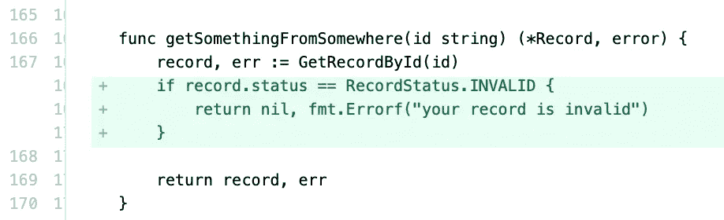
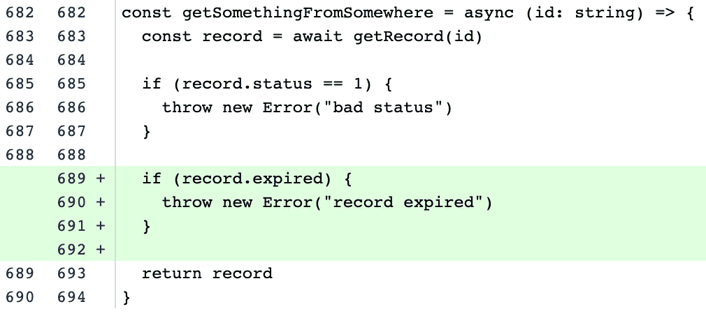

# 初级开发人员应该避免的 3 个常见习惯

> 原文：<https://betterprogramming.pub/3-common-habits-to-avoid-as-a-junior-developer-8e7e94d28a27>

## 你的上司会永远感谢你避免了这些


安德烈·波波夫在土坯上

你的上司会永远感谢你避免了这些

做一个初级开发人员很难。有新的语言要学习，有设计原则要理解，有不熟悉的挑战要克服。毫不奇怪，在学习的过程中，你可能会养成一些经验丰富的专业人士很难容忍的习惯。

作为帮助任何有前途的开发人员的一种方式，我列出了我认为每个初级开发人员都应该避免的 3 个常见习惯。通过反思我作为初级开发人员的时光，回忆什么事情最让我的老板恼火，我想出了这些项目。现在我站在另一边，管理我自己的初级开发人员，我感受到了他们的痛苦。

这个列表中没有一项与你的代码质量或者你对某项技术的了解程度有关。不熟悉一门语言或技术不是我认为的习惯。

我的清单包含了一些习惯，只要有一点自律和自我意识，这些习惯是很容易避免的。

# 1.提交巨大的拉取请求

审查拉取请求对每个人来说都是一项挑战。让它们变得特别痛苦的一个方法是审查一个有数百行新代码、新文件和大量现有变更的项目。遵循所有这些逻辑对任何人来说都是一项艰巨的任务。

怎么才能避免呢？

有时无法回避新功能的大小。如果你知道你最终的拉取请求无论如何都是巨大的，你可以把你的评论分成更小的，更容易消化的部分。

假设您的任务是创建一个新的注册页面。您从 develop 创建了一个名为`feature/new-signup`新分支。

您的注册页面有 5 个部分:

1.  UI 元素
2.  表单验证
3.  提交
4.  异步等待后端确认
5.  成功时重定向到主应用程序

您可以为每个任务创建一个新的分支，而不是将所有事情都提交给`feature/new-signup`，其中`feature/new-signup`是该分支的父分支。一旦完成，您就可以创建一个 pull 请求，将新的分支合并到`feature/new-signup`中。

如果您从 UI 元素开始，创建新的分支

```
git checkout feature/new-signupgit checkout -b ui-elements
```

将所有 ui 元素添加到您的`ui-elements`分支，提交，并向`feature/new-signup`发出 UI 元素的拉请求。请你的上级在大功能的一小部分的背景下检查你的改变。一旦它被审查、批准并合并回`feature/new-signup`，您就可以为下一个任务做同样的事情。

```
git checkout feature/new-signupgit checkout -b form-validation
```

依此类推，直到特征完成。最后，对`feature/new-signup`进行开发的拉取请求仍然很大，但是一切都已经被审查过了。

我上面描述的过程是敏捷软件开发的一部分。

更小的、更有针对性的拉取请求更有可能被挑选和审查。大的拉取请求经常成为拖延的牺牲品。

# 2.做研究前寻求帮助

我将从自己的生活中举一个非软件的例子来帮助构建这个框架。

几个月前，我的一个朋友问了我以下问题:

“嘿，杰西，我该怎么开博客？”

这个问题的措辞告诉我两件事:

1.  我的朋友不知道如何开始写博客。没问题。
2.  我的朋友可能不会坚持写博客。感觉他们不愿意在来找我之前进行基本的谷歌搜索。

提出问题的方式很能说明你为找到解决方案付出了多少努力。

每当你看到一个错误或 bug 时，不做任何自己的研究，就寻求队友的帮助，这是一个让你和团队其他成员疏远的好方法。

如果人们觉得你没有努力去研究和学习，他们很可能不想和你一起工作。我甚至看到人们为了避开冒犯者而停止进入办公室。

寻求帮助没有错。然而，初级和高级开发人员之间的一个区别因素是他们的研究能力。如果你从来没有学会如何自己找东西，你就不会进步很快。

全新的开发人员可以原谅这一点，但最好尽快戒掉这个习惯。

如果你认为你可能会这样做，我的建议是按照我的方法来戒掉这个习惯。在我把一个 bug 或错误带给另一个队友之前，我总是停下来问自己:“你真的努力自己找到解决方案了吗？”。如果答案是肯定的，请寻求帮助。如果你对答应感到不安，最好再试一次。

回到我朋友开始时的问题，让我们看看如果它包括了研究，听起来会怎么样。

“嘿，杰西，我想开一个自己的博客。我一直在网上寻找，Squarespace 和 WordPress 看起来是很有希望的起点。您是否有任何使用这两个平台的经验？”

我更有可能回答这个问题，因为我能感觉到提问者已经为自己找到解决方案付出了一些努力。一点点就够了。

当你向其他开发者寻求帮助时，你会发现同样的情绪。

# 3.忽略超出范围的错误

bug 存在于每个应用程序中，高级开发人员知道这一点，他们依靠每个人来寻找它们。这就是为什么当开发过程中明显的错误被忽略时会令人恼火，因为它与某人正在开发的当前功能无关。

我将在 Go 和 JavaScript 中给出两个例子，有人提交了代码，却忽略了附近一个明显的 bug。

## 去



第 167 行显然有一个应该处理的未处理的错误响应。

## Java Script 语言



第 685 行使用了`==`操作符。这是一个过时的操作符，并有可能在未来产生一个难以发现的错误。

如果在实际的拉式请求中看到这些示例中的任何一个，您可能会被问到:

A.请修理它

或者

B.你看到它的时候为什么不修好它？

即使您可能不是添加 bug 的人，也不是检查和批准 bug 的人，但是当您看到这样的问题时，您仍然应该尝试修复它们。“这不是我写的”或“这不是我的问题”的辩护将被置若罔闻。如果你看到了什么，做点什么。

我希望我的列表能提供信息。如果我错过了什么，请告诉我。