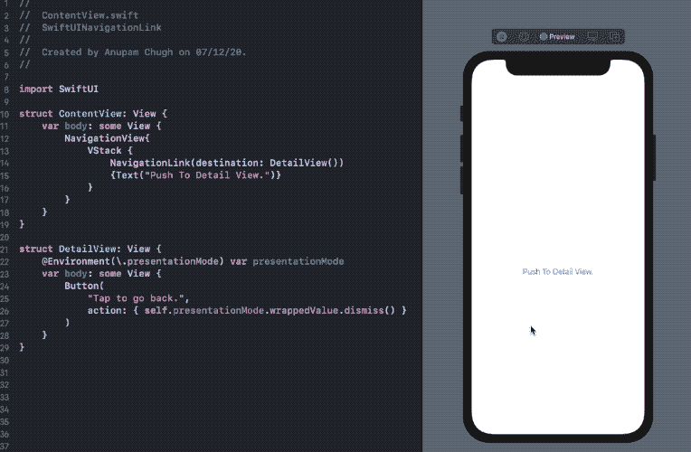
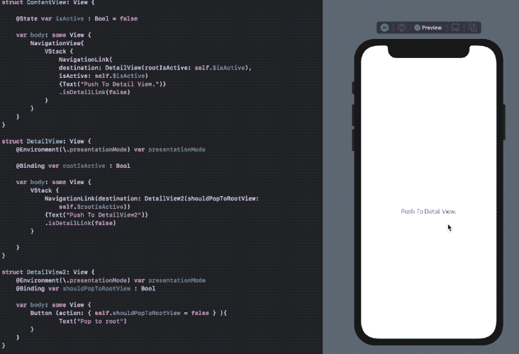
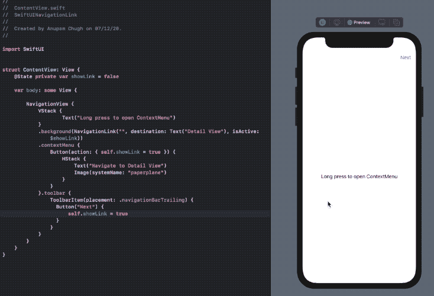

# 关于 SwiftUI 中的 NavigationLink 需要了解的 3 件重要事情

> 原文：<https://betterprogramming.pub/3-crucial-things-to-know-about-navigationlink-in-swiftui-cb15d791a55>

## 构建强大的 iOS 应用


照片由[丹钟](https://unsplash.com/@dannayyyboi?utm_source=medium&utm_medium=referral)在 [Unsplash](https://unsplash.com?utm_source=medium&utm_medium=referral) 上拍摄。

导航是任何应用程序的重要组成部分，在 SwiftUI 中，苹果引入了`NavigationLink`和`NavigationView`来让我们轻松创建路由器。

然而，SwiftUI 的第一次迭代出现了一些小问题。具体来说，导航链接中的目的地视图被立即加载。但是现在在 iOS 14 中，我们有了懒人视图——也就是`LazyHStack`和`LazyVStack`——让我们的生活更轻松。

除了使用`NavigationLink`来推送和弹出视图，你还可以做更多的定制。在接下来的部分中，我们将探索一些用例。让我们开始吧。

# 以编程方式消除视图

以下是如何在 SwiftUI `NavigationLinks`中添加目的地视图:

```
NavigationLink(destination: DetailView()){...}
```

值得注意的是，为了让一个`NavigationLink`工作，我们需要将它包装在一个`NavigationView`中。

在下面的代码片段中，我们已经做到了这一点，并展示了如何以编程方式消除`DetailView`:



`presentationMode`是存在于`Environment`属性包装器中的属性。它让我们读取诸如`isPresented`和`dismiss()`之类的值，并相应地执行导航操作。

现在请注意，默认情况下，详细视图在顶部显示了一个 back bar 按钮。如果你想添加一个自定义的后退按钮或者防止返回到上一个屏幕，你可以删除它。为此，只需在其上设置视图修改器`.navigationBarHidden(true)`。

# 以编程方式弹出到根 SwiftUI 视图

当有大量导航屏幕时，在每个屏幕上滑动或点击后退按钮并不能真正提供最佳的用户体验。幸运的是，我们可以通过利用`SwiftUI`中`NavigationLink`的`isActive`属性来避免这种情况。

目标很简单:对于像`ContentView -> View1 -> View2 -> View3`这样的导航栈，我们需要从`View3`返回到`ContentView`。

正如在这个[栈溢出帖子](https://stackoverflow.com/questions/57334455/swiftui-how-to-pop-to-root-view?noredirect=1&lq=1)中解释的，为了弹出到根 SwiftUI 视图，我们需要在每个`NavigationLink`上设置一个`isDetailLink(false)`修饰符。这样做，我们确保细节视图不会作为包含`NavigationView`的一个单独的“细节”组件出现。

下面是如何以编程方式弹出到根视图:



[源代码](https://gist.github.com/anupamchugh/f3e0c1355dffe19ca97bffc21c1aab4b)

# 在上下文菜单和工具栏中使用导航链接

默认情况下，`ContextMenu`、`Toolbar`或其他类型的视图显示中不能包含`NavigationLink`。

[这是因为](https://fivestars.blog/swiftui/programmatic-navigation.html) a `NavigationLink`符合`Hashable`协议，不像其他 SwiftUI 视图类型符合`Identifiable`。

不过，我们可以通过以下方式让上下文菜单或工具栏项按下来打开目标视图:



[源代码](https://gist.github.com/anupamchugh/0af73574cadfdca41de5387ed966d230)

# 结论

在本文中，我们看到了 SwiftUI 中`NavigationLink`的以下用例:

*   以编程方式消除视图。
*   删除默认导航后退按钮。
*   使用其他视图类型的`NavigationLink`。

这一次到此为止。感谢阅读。