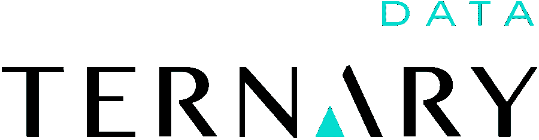

# 3 数据工程专家分享他们对数据发展方向的想法

> 原文：<https://betterprogramming.pub/3-data-engineering-experts-share-their-thoughts-on-where-data-is-headed-a9582aa2e7b2>

## 数据工程会推翻数据科学吗？

查尔斯·德鲁维奥在 [Unsplash](https://unsplash.com?utm_source=medium&utm_medium=referral) 上拍摄的照片。

2021 年已经过去了将近一半，似乎已经有数亿美元投入到了数据、数据创业公司和机器学习上。

特别是，资金也从仅仅关注数据科学和机器学习领域转向了[数据工程和数据管理领域](https://seattledataguy.substack.com/p/what-in-the-world-is-dremio-and-why)。

当然，如果你是一家基于人工智能的数据管理公司，那么我肯定你会获得大量资金。

但让我们看看其他数据专家有什么看法。

我们请来自数据世界各个部分的人提供他们对 2021 年剩余时间和即将到来的 2022 年的看法，无论是新的创业公司、技术还是最佳实践。

让我们看看他们说了些什么。

# Colleen Tartow 博士——星爆数据工程总监

图片来自[推特](https://twitter.com/CTartow)。

一段时间以来，数据工作市场发生了从数据科学到数据工程的转变。坦率地说，现在是时候了，我们知道良好的数据基础对于构建企业数据战略至关重要。数据工程师对于将各种来源的数据与报告、BI 和数据科学系统连接起来至关重要，这些系统将数据转化为丰富的商业价值。[数据工程是 2019 年技术领域增长最快的工作](https://seattledataguy.substack.com/p/are-companies-hiring-fewer-data-scientists)，2020 年开放数据工程职位增加了 40%，这一趋势今年肯定也会继续。

来源:[星爆](https://www.starburst.io/)

这种转变背后的驱动力是，企业已经意识到，没有坚实的数据基础的大型数据科学计划是不可靠的，拥抱数据驱动的决策的关键是从数据工程开始。分析工程师和数据架构师等相关工作也在增加，因为他们分别专注于缩短数据价值的时间线和构建稳定可靠的数据架构。有了坚实的数据工程基础，企业就可以在坚实的基础上实现其有价值的 BI 和数据科学计划的目标。

此外，通过利用现有系统中的传统数据和基于云的现代基础设施中的新数据，企业可以获得更加敏捷的洞察力，并以全新的方式对市场变化做出反应。Gartner 将此称为 *X-analytics* ，而像 [Starburst Data](https://www.starburst.io/) 这样的技术对于主动构建一个可以快速转向并对全球事件(比如疫情)做出反应的数据平台至关重要，而无需全新的流程或基础设施建设。X-analytics 是下一代数据工程，将把我们带入数据的未来。

# Joe Reis——三元数据公司的首席执行官/联合创始人

图片来自 [LinkedIn](https://www.linkedin.com/in/josephreis/) 。

数据工程变得越来越“企业化”这可能会让你剧烈畏缩。“企业”一词使人联想起穿着过于古板的蓝衬衫和卡其裤的不知名委员会的噩梦、没完没了的繁文缛节、瀑布式发展以及创新消亡的地方。这张图片当然令人不安，也不是我要说的。当我讨论“企业性”时，我指的是大公司可能会利用数据做的一些好事——管理、运营、治理和其他“无聊”的事情。我认为数据工程变得“企业化”是一件很棒的事情。张开双臂欢迎它！

曾几何时，数据工程师主要关注于维护复杂“大数据”工具的底层细节。这些工具通常有许多活动部件，数据工程师除了维护、灭火和其他英雄行为之外，没有时间做其他事情。结果，许多“企业级”的事情半途而废，如[数据治理](https://www.youtube.com/watch?v=2a2gEJOxEAA)，数据发现，数据质量，以及一系列其他关键的数据管理和运营实践。

来源:[三元数据](https://www.ternarydata.com/)

如今，数据工具正在抽象出“大数据”工具的大部分重担。曾经复杂的东西，比如数据管道和数据湖/仓库，已经商品化到了“即插即用”和“设置好就忘了”的程度。想想像 AWS、Google Cloud、Azure、Snowflake、Fivetran 和无数其他正在端到端简化数据堆栈的公司。虽然数据工程师仍将*设计*系统，但工程将专注于创建高价值系统，从而带来竞争优势和差异化。

由于广泛的数据工具抽象和简化，数据工程师现在有带宽开始在价值链的更高位置工作——数据管理和数据操作，等等。虽然这些实践曾经是大型企业的专利，但它们正在成为各种规模和成熟度的公司的主流。就像过去有无数公司简化“大数据”堆栈一样，现在有一批新的最佳实践、工具和公司正在处理曾经的“企业级”领域，如数据治理、数据发现、数据质量和一系列其他关键数据管理和运营实践。想想 Great Expectations(数据质量)、DataHub(数据目录)和其他许多目前致力于解决数据工程中一度被忽视的问题的项目。

随着对数据工程中“企业”问题的更多关注，数据工程师将向价值链上游移动，并解决与几年前不同类型的问题。我很兴奋地想象下一代数据工程师将在几年内解决的问题类型。“企业”数据工程现在很酷。习惯就好。

# Sergey Karayev——Turnitin STEM AI 负责人

图片来自 [LinkedIn](https://www.linkedin.com/in/sergeykarayev/) 。

Gradescope 是一个供大学教师给学生考试、家庭作业和编程项目评分的 web 应用程序。

我们有大约 12 种不同的机器学习模型在生产，从老派的图像处理到基于特征的手写编码 MLPs 和用于手写识别和文本理解的最先进的大型变压器模型。我们面临的主要挑战是“关闭飞轮”(即，将我们生产模型的监控与对其进行培训和评估的数据联系起来)。

首先，很难对模型进行适当的监控。大多数模型预测并没有以允许用户提供反馈的方式呈现给用户，所以我们在度量标准方面经常是盲目的。

第二，对于那些允许用户反馈的预测，我们必须手工开发复杂的 SQL 仪表板来计算正确的指标并指向正确的输入和预测。

第三，这些仪表板仍然存在不足，因为理想的仪表板应该能够显示丰富的数据，如图像，而现有的解决方案不允许这样做。

最后，我们的监控工具与管理和检查数据集的工具脱节，并且不容易将监控中发现的示例添加到训练或评估集中，从而改进再训练模型。仅仅为了监控和管理数据而编写定制的仪表板和 web 界面不是数据团队应该做的事情。我希望看到专门的工具很快出现，来解决这个功能差距！

# 2021 年剩余时间及以后的技术

对于 2021 年的剩余时间，有很多值得期待的事情。

我期待着看到数据工程是否真的会占据中心舞台。有大量的统计和调查显示，就就业增长而言，数据工程正在上升。

就我个人而言，我仍然看不出[数据工程](https://www.youtube.com/watch?v=LgSHaOvNodA)将如何超越成为数据科学家的“酷”因素，因为数据科学往往更倾向于占据中心舞台，而数据工程往往处于幕后。

就数据工程有多酷而言，我很乐意错了。

我们希望在 2021 年剩下的时间里，我们所有的读者不仅能看到技术的进步，还能看到个人的成长和发展。

感谢阅读，祝 2021 年下半年好运！