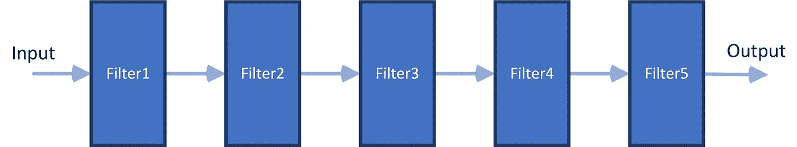
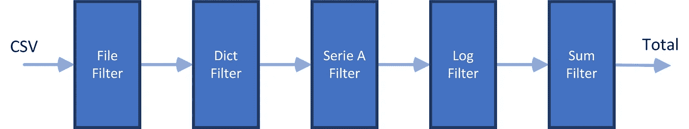
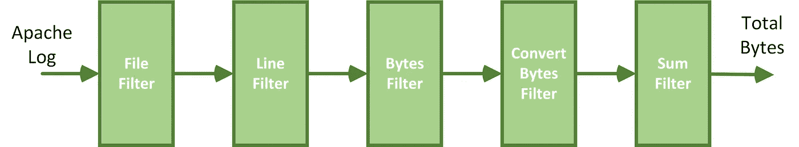
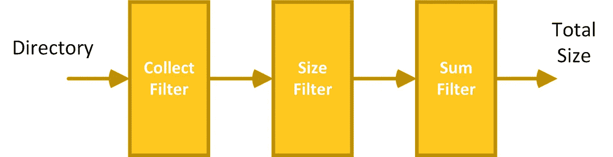

# 您可以使用 Python 生成器构建 3 个数据处理管道

> 原文：<https://betterprogramming.pub/3-data-processing-pipelines-you-can-build-with-python-generators-dc0d2019b177>

## 使用生成器在 Python 中创建数据处理管道


照片由 [maxxyustas](https://elements.envato.com/user/maxxyustas) 拍摄，版权通过 [Envato 元素](https://elements.envato.com/license-terms)获得。

自从我看了 David Beazley 关于 Python 中的生成器的演示，我就被它们迷住了。如果没看，推荐看 [Python 探索](https://www.youtube.com/watch?v=RZ4Sn-Y7AP8&t=2477s&ab_channel=PyCon2014)。

Python 生成器是一个强大的概念。您可以使用它们来创建非常高效的数据处理管道。在本文中，我将向您展示三个实际的例子。

我们将看到如何将几个过滤器串在一起创建一个数据处理管道。该管道能够处理大型数据集或数据流。使用生成器的最大好处是你不会耗尽机器的内存。

下图显示了我们想要创建的内容。我们希望通过组合一组过滤器来处理数据流。最终的解决方案应该使添加、移除或改变过滤器变得容易。



链接多个过滤器以创建处理管道。图片由作者提供。

这种管道和过滤器模式并不新鲜。它经常在类 Unix 操作系统中使用，通过组合命令来构造强大的命令行。例如，此命令行使用管道符号`|`将几个命令连接在一起:

```
$ ps aux | grep [processtokill_name] | grep -v grep | awk '{print $2}' | xargs kill
```

该模式也被描述为架构模式。例如，在*面向模式的软件架构*中，Buschmann 等人将其描述为:

> “管道和过滤器架构模式为处理数据流的系统提供了一种结构。每个处理步骤都封装在一个过滤器组件中。数据通过相邻过滤器之间的管道传递。重新组合过滤器允许您构建相关系统的系列。”

在*企业集成模式*中，Gregory Hope 写道:

> 使用*管道和过滤器*架构风格将较大的处理任务划分为一系列较小的独立处理步骤(过滤器)，这些步骤通过通道(管道)连接

有趣的是，Hope 和 Buschmann 在系统的上下文中讨论了这种模式。相反，我将使用 Python 中的三个实际例子来演示该模式。这些示例将:

*   从 CSV 文件中计算所有 A 轮融资的总和。
*   计算网络服务器传输的字节数。
*   计算文件系统中目录的大小。

我将仔细检查源代码的每一部分。如果你等不及，可以在[这个 GitHub 库](https://github.com/PatrickKalkman/python-processing-pipeline)里找到。

# 1.计算所有首轮融资的总额

在第一个示例中，我们创建了一个处理管道来计算一家公司通过首轮融资获得的资金总额。我们通过解析来自 CrunchBase 的 CSV 文件来计算总数。

下图显示了解析 CSV 文件的处理管道:



使用过滤器将 CSV 转换为总数。图片由作者提供。

Crunchbase 是一个提供投资和融资信息的平台。除了 API，他们还通过 CSV 提供数据。你必须为完整版本付费。我用的是这个[免费样品](https://data.crunchbase.com/docs/daily-csv-export)。

通过组合多个过滤器创建数据处理管道。

上面的 Python 脚本读取 CSV 文件，并返回所有 A 轮融资的总和。“首轮”融资是初创企业获得的第一笔风险资本。

在第 7 行，我们使用 Python 列表定义了管道。我把列表中的每一项都称为过滤器。我们用一个`file_filter`来打开一个文件。第二个过滤器使用 Python `DictReader`来读取 CSV。`series_a_filter`只选择 A 类型的记录。最后一个`sum_filter`对每个 A 系列记录的资金进行求和。

`log_filter`是一个过滤器，你可以把它放在管道的任何地方。它记录每个通过通道的项目。

如果我们使用`print(next(pipeline))`运行管道，我们会得到以下输出:


执行处理流水线。图片由作者提供。

## 单个过滤器

在本例中，我们看到使用了几个滤波器。每个过滤器都是使用 Python 函数实现的。过滤器的一般规则是它接受一个生成器并返回一个生成器。生成器是使用`yield`语句创建的。

让我们看看每个过滤器，并检查其实施。

## 文件过滤器

文件过滤器接受文件名列表，打开文件，并使用`yield`语句返回打开的文件。

文件过滤器

## 字典过滤器

dict 过滤器使用来自 CSV 模块的 Python `DictReader`。它创建一个读取器，将每行中的列映射到一个字典。字典的键是从文件的第一行检索的。CSV 中的第一行通常表示列名。

`dict_filter`检索一个打开的文件，并使用打开的文件创建`DictReader`。然后，它遍历所有行，并使用`yield`语句返回每一行。

字典过滤器

## A 系列过滤器

CSV 包含几种融资类型的记录，例如 A、B 和 c 系列。我们只需要 A 系列的记录。A 系列滤波器正是这样做的。它只过滤 A 系列记录。

该系列 A 过滤器

该实现对所有行进行迭代。我们通过检查列“round”是否包含“A”来确定该行是否包含 A 轮融资。

我想你已经开始看到一种模式了。每个过滤器都有一个可枚举的输入和`yield`作为输出。

## 总和过滤器

最后一个功能滤波器是求和滤波器。它负责计算首轮融资的总额。

与每个过滤器一样，它接收一个迭代器，并使用`yield`语句返回总和。

## **日志过滤器**

日志过滤器可以在每个过滤器之前或之后使用。它只做一件事:遍历传入的输入，记录条目，并使用`yield`返回条目。

用于记录项目的日志过滤器。

## 组合过滤器

最后，我们需要组合每个过滤器来创建管道。好好看看`create_processing_pipeline`函数。该函数将单个过滤器串在一起。

将单个过滤器串在一起以创建处理流水线。

# 2.计算 web 服务器传输的字节数

在第二个例子中，我们创建了一个处理管道来计算 Apache 服务器提供的总字节数。总数是通过解析访问日志计算出来的。

下图显示了解析 Apache 服务器日志的处理管道:



计算 Apache 服务器提供的总字节数。图片由作者提供。

管道的创建与前面的示例非常相似。第一个过滤器遍历访问日志的给定文件名，打开每个文件，并逐行读取。

访问日志的一行如下所示:

```
127.0.0.1 — — [10/May/2013:10:35:35 +0200] “GET /favicon.ico HTTP/1.1” 404 295
```

末尾的最后一个数字`295`表示网络服务器传输的字节数。无字节传输时，为`“-”`。

字节过滤器解析这一行并返回最后一部分。“转换字节”过滤器将字符串转换为整数。当指示`“-”`时，转换字节过滤器返回零。

最后一个过滤器，sum 过滤器，计算总字节数。

## 单个过滤器

在本例中，每个过滤器都是使用 Python 函数实现的。过滤器的一般规则是它接受一个生成器并返回一个生成器。生成器是使用`yield`语句创建的。

让我们看看过滤器并检查它们的实现。

## 文件过滤器

文件过滤器与前面的示例相同。它接收文件名列表，并使用`yield`返回打开的文件。

## 线路滤波器

行过滤器负责逐行读取打开的文件。它使用`yield`语句返回每一行。

行过滤器读取打开的文件中的所有行。

## 字节过滤器

字节过滤器拆分该行，并在行尾返回令牌。这个令牌可以是一个破折号。

```
127.0.0.1 — — [10/May/2013:10:35:35 +0200] “GET /favicon.ico HTTP/1.1” 404 295
```

字节过滤器返回传输的字节数。

它使用`rsplit`以最大`1`分割从右侧分割该行。然后我们得到两个项目。我们从索引`1`处的项目中获取字节数。

## 转换字节过滤器

转换字节过滤器负责将字节字符串转换成数字。字节字符串可以包含数字或破折号。

我使用生成器表达式而不是使用`yield`语句实现了这个过滤器。生成器表达式看起来像列表理解，但返回的是生成器而不是列表。通过在语句周围添加大括号，可以将列表理解转换为生成器表达式。

如果可用，转换字节过滤器将字符串转换成 int。

## 总和过滤器

最后一个滤波器是求和滤波器。它只是使用`yield`语句返回总和。

总和过滤器返回所有传输字节的总和。

## 组合过滤器

过滤器的组合方式与上例相同。如果我们运行该脚本，我们会得到以下输出:


执行处理流水线。图片由作者提供。

# 3.计算目录中所有文件的总和

在第三个也是最后一个示例中，我们创建了一个处理管道来计算目录中所有文件的总大小。

下图显示了计算目录中所有文件总和的处理管道:



计算目录中所有文件的总文件数。图片由作者提供。

同样，实现看起来很像前面的例子，但是使用了不同的过滤器。第一个过滤器`collect_filter`，递归地收集一个目录中的所有文件。

`size_filter`接收文件名并确定文件的大小。最后一个过滤器`sum_filter`计算总大小。

## 单个过滤器

与其他两个示例一样，每个过滤器都是使用 Python 函数实现的，该函数接受并返回一个生成器。让我们看看过滤器并检查它们的实现。

## 收集过滤器

收集过滤器负责收集目录中的所有文件。为了收集文件，我们使用`iglob`。这是一个可以递归搜索目录的函数。它返回一个生成器。

因为我想包含隐藏文件，所以我将两个`glob`函数链接在一起。第二个是搜索隐藏文件。结果是一个传递文件的迭代器。

## 尺寸过滤器

大小过滤器负责获取文件的大小。它使用`os.path.getsize()`来获取文件的字节大小。

大小过滤器以字节为单位返回文件的大小。

## 总和过滤器

最后一个滤波器是求和滤波器。它只是使用`yield`语句返回所有大小的总和。

sum 筛选器以字节为单位计算总大小。

## 组合过滤器

我们以与前面的管道相同的方式组合各个过滤器。如果我们运行该脚本，我们会得到以下输出:


执行处理流水线。图片由作者提供。

# 结论

看完这三个例子后，我希望您同意 Python 生成器是一个强大的概念。

生成器允许您从使用迭代结果的代码中分离迭代。通过一次处理一个项目，不需要将整个数据集加载到内存中。这意味着您可以处理的数据大小没有限制。

这三个例子都使用了一种通用的方法，通过 Python 函数和`yield`语句来定义和连接过滤器。利用这种结构，很容易通过修改或重新排列过滤器来构建不同的管线。

你可以在[这个 GitHub 库](https://github.com/PatrickKalkman/python-processing-pipeline)中找到例子的源代码。

感谢阅读。我希望这篇文章能给你创建自己的处理管道的灵感。请在下面留下您的回复，让我知道您创建了什么类型的管道。