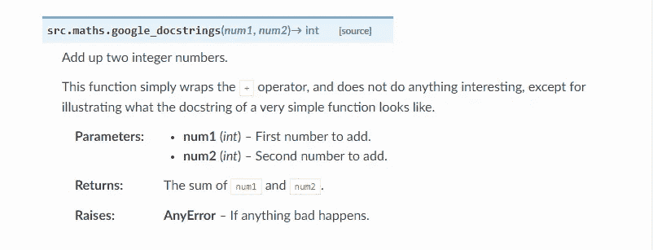
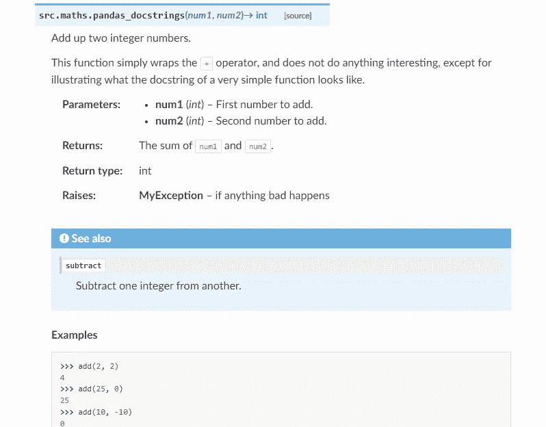
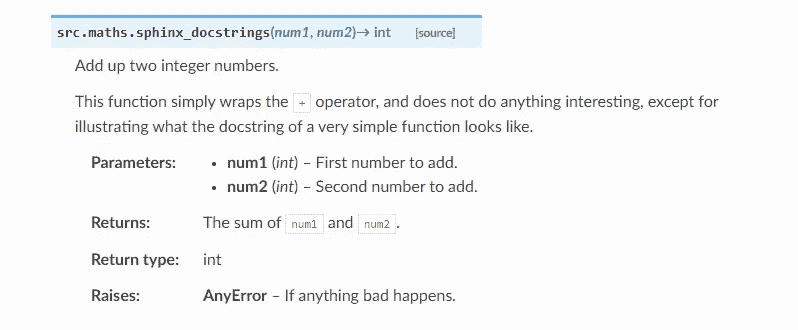

# Python 的 3 种不同的文档字符串格式

> 原文：<https://betterprogramming.pub/3-different-docstring-formats-for-python-d27be81e0d68>

## 快速浏览 Google、NumPy 和 Sphinx docstrings

[吴怡](https://unsplash.com/@takeshi2?utm_source=medium&utm_medium=referral)在 [Unsplash](https://unsplash.com?utm_source=medium&utm_medium=referral) 上拍照

Python 正成为当今流行的编程语言。对于任何编码项目，文档是增加代码可读性的最重要的部分，但同时也是最容易被忽视的部分！为了解决这个问题，Sphinx 工具派上了用场，它自动化了文档部分，如果你不知道这个工具，看看[这个](https://towardsdatascience.com/documenting-python-code-with-sphinx-554e1d6c4f6d)。

既然你知道斯芬克斯并知道如何使用它。让我们了解一下最常用的文档字符串格式，即- [Google](https://google.github.io/styleguide/pyguide.html) 、 [NumPy](https://numpydoc.readthedocs.io/en/latest/format.html) 和 [Sphinx](https://sphinx-rtd-tutorial.readthedocs.io/en/latest/docstrings.html#:~:text=The%20Sphinx%20docstring%20format,-In%20general%2C%20a&text=A%20pair%20of%20%3Aparam%3A%20and,values%20returned%20by%20our%20code.) 文档字符串格式。

# **1。谷歌文档字符串**

这种 docstring 格式是由[可汗学院](https://github.com/Khan/style-guides/blob/master/style/python.md#docstrings)推荐的，俗称“Google Docstring”。为了确保 docstring 与 Sphinx 兼容并被 Sphinx 的 autodoc 识别，在`conf.py`文件中添加`sphinx.ext.napoleon`扩展名。docstring 格式为:

Sphinx 生成的输出如下所示:

HTML 文件中的输出

如果你正在使用 VS 代码，为了让生活更简单，你可以安装这个[扩展](https://marketplace.visualstudio.com/items?itemName=njpwerner.autodocstring)。这个扩展为文档字符串奠定了样板，您只需要添加每个参数的描述。

# **2。NumPy Docstring**

这种文档格式用于主要的数据科学图书馆，如 NumPy、SciPy 和 Pandas。就像 Google 的 docstring 一样，为了让它与 Sphinx 兼容，你必须在`conf.py`文件中添加`sphinx.ext.napoleon`扩展名。docstring 的格式为:

同样的输出是:

HTML 文件中的输出

> ***Google Vs NumPy 的 Docstrings:***
> 
> 两种 docstrings 的输出看起来相似，两种风格的主要区别是 Google 使用缩进来分隔部分，而 NumPy 使用下划线。NumPy 风格倾向于需要更多的垂直空间，而 Google 风格倾向于使用更多的水平空间。对于短而简单的文档字符串，Google 风格更容易阅读，而对于长而深入的文档字符串，NumPy 风格更容易阅读。

# **3。Sphinx Docstring**

没有比老的 sphinx docstring 更好的了，这是使用的最基本的 docstring 格式，但是在视觉上有些密集，很难阅读。相同的格式为:

输出如下所示:

HTML 文件的输出

为了试验不同的格式，克隆这个库。克隆完成后，在 docs 文件夹中运行`make clean html`和`make html`，重新生成 HTML 文件。

# **结论**

除了上述格式，还有许多 docstring 格式可以用于 Python，我们在这场游戏中没有一个赢家。

所以选择你觉得舒服的格式，不要混合格式，在整个项目中坚持使用。我个人最喜欢的是 NumPy 的 Docstring！