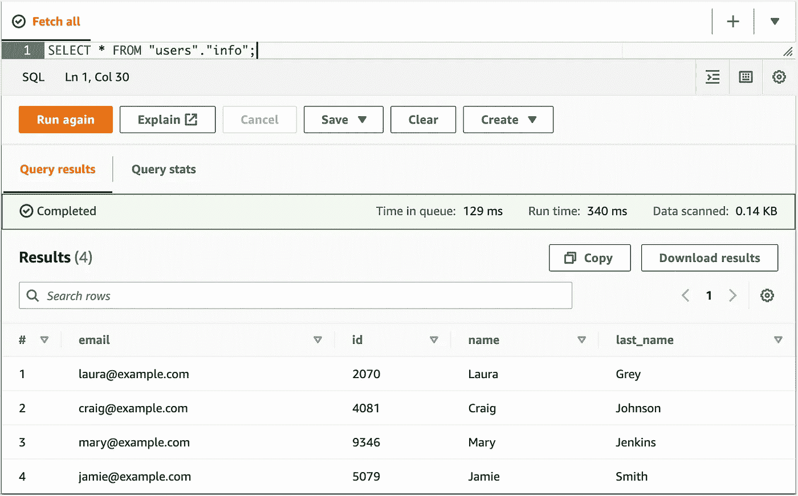

# 3 用于数据处理的简易 AWS 服务

> 原文：<https://betterprogramming.pub/3-easy-aws-services-for-data-processing-8358852af925>

## 了解如何更简单地管理云中的数据


照片由[微软 Edge](https://unsplash.com/@microsoftedge?utm_source=unsplash&utm_medium=referral&utm_content=creditCopyText) 在 [Unsplash](https://unsplash.com/s/photos/computer?utm_source=unsplash&utm_medium=referral&utm_content=creditCopyText) 上拍摄

AWS 是处理数据的强大云提供商。从数据块存储到 SQL 数据库，有多种服务可供选择。某些服务很容易开始使用，而其他服务则需要额外学习。

但是也有一些服务非常有用，同时，它们不需要学习过程。你可以自己探索或者阅读一个五分钟长的教程。我们可以开始应用它们来处理数据，并立即受益。

数据工程师和数据科学家已经在应用它们来加速业务流程。现在，轮到我们去发现它们了。

# AWS 胶水

Glue 是纯数据工程的无服务器服务。它的主要焦点是运行提取-加载-转换(ETL)作业。在将数据转移到其他部门之前，必须将其转换成合适的格式，并为进一步的工作做好准备。

AWS Glue 是数据转换的入口点。它允许配置工作流和设置作业以检索数据。我们还可以指定作业开始的时间表。

我在 Glue 中发现的极有价值的特性是爬虫。这是一个自动发现任何结构化数据的工具。类似于网络爬虫，它在 S3 中搜索数据，并将它们加载到临时表中进行分析。

将发现位于 S3 存储桶中的所有 CSV 文件。您可以稍后决定如何处理日期:导出、运行简单查询或删除。此外，您还可以指定一个时间表，以确定爬网程序启动的时间和频率。

这是一个非常好的服务，可以从 AWS 上的数据工程开始，并在早期将其集成到您的管道中。

# 雅典娜(智慧与技艺的女神)

亚马逊雅典娜是胶水的免费服务。原因如下。

一旦您的数据在 S3 上被发现并导入 Glue 的数据库，您将需要查询这些数据。Athena 允许在 Glue 中的表上运行简单的查询。

界面看起来简单直观。



雅典娜界面的屏幕截图

我们可以通过运行包括条件在内的简单查询来探索某些表的内容。但是，Athena 不适合运行复杂的连接查询。AWS 上有更好更高效的工具。

Athena 最棒的地方是你可以直接导入一个文件。在导入过程中，数据库中的表将像 Glue 一样被创建。

在使用 Athena 时，我们需要记住一些导入文件的要求。首先，该文件必须上传到 S3 桶，并放置在一个单独的文件夹中，没有其他文件。其次，文件必须是 CSV 或拼花格式。

Athena 是一个充当助手的服务，支持通过 SQL 查询文件中的数据。如果您想快速浏览 CSV 文件，就不再需要数据库了。

# DynamoDB

DynamoDB 是 AWS 上的一个无服务器 NoSQL 数据库。数据以键值格式存储。DynamoDB 的用法非常简单。可以通过 AWS 控制台、SDK 或 CLI 来查询数据。

那么为什么这个服务这么好，吸引了很多工程师呢？

DynamoDB 有很好的性能，因为它是一个无服务器和完全托管的服务。如果查询未经优化或使用复杂的筛选，则可能会降低性能。但是结合多个二级索引，可以更快地返回结果。如果你真的需要最高速度，还有 DynamoDB 加速器(DAX)。这是一个额外的缓存层，可以将性能提高到微秒级。

此外，DynamoDB 可以用作临时数据存储。由于信息是以键值格式保存的，所以我们不需要严格遵循这种格式。与关系数据库不同，我们可以保存和检索非结构化或半结构化数据。

如果您希望您的数据自动过期，DynamoDB 有这个特性。我们需要设置一个带有时间戳生存时间(TTL)的专用字段。在指定的日期/时间临近后，您的数据将被删除。一个理想的解决方案，用于转储信息，以备将来使用到期时间进行分析。

# 编后记

AWS 有 200 多项服务，而且数量还在不断增加。当您需要管理数据时，本文中的服务是一个很好的起点。在许多情况下，它们是简单且有利的。去探索它们，决定你最喜欢哪一个。编码快乐！

```
**New to AWS?**If you want to dip your toes into AWS, my book "[AWS Essentials](https://www.amazon.com/gp/product/B0BCHCYQWR)" is a great place to start with. This is the fastest way to familiarize yourself with AWS and understand the basics of cloud computing.
```