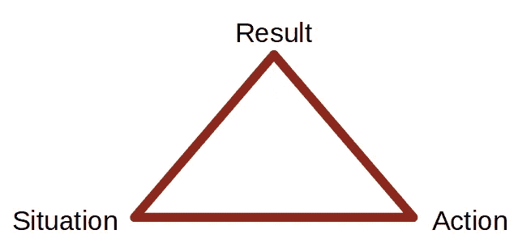

# 求职面试前 3 个简单的止汗技巧

> 原文：<https://betterprogramming.pub/3-easy-tips-to-stop-your-cold-sweat-before-job-interviews-6fc10676e9a0>

## 来自坐在桌子两端的人的建议

[朱慧珊·莫伊](https://unsplash.com/@jelizabm?utm_source=medium&utm_medium=referral)在 [Unsplash](https://unsplash.com?utm_source=medium&utm_medium=referral) 上的照片

工作面试既令人兴奋又令人恐惧。一方面，这是一个非同寻常的机会。另一方面，他们*是*一个非同寻常的机会。

你知道那种感觉:面试前两天，你觉得很自信。但是时钟每过一个小时，你的内脏就会紧张起来。

面试前 30 分钟，你坐在车里。在你面前，一座雄伟的建筑俯视着你。那里有你一直想要的工作。准备好让你抓住它，但你的思想开始破坏你的梦想。

怯场开始了。你已经这样做了很多次，但你的逃跑本能仍然试图胜过你。你发现自己在准备借口:

> 也许我应该取消…反正我也不想在大公司工作…在家里，我舒适的沙发等着再次迎接我的屁股…

但你还是进去了。

你知道这种感觉。

我敢说有了经验，事情会变得简单一些。但是在你参加面试之前戳你肚子和脚的小针永远不会完全消失。

作为项目经理，我一直坐在面试桌的两头。作为申请人，我已经参加了五次面试。那不算多；然而，我从来不需要更多，因为我 80%的时间都能得到这份工作。

我会分享我是如何准备工作面试的，以及怎样防止戳你肠子的针变成你背上的匕首。

# 让你平静下来的几个理由

让自己冷静下来，做一些自我肯定总是有用的。像“呼吸”或“你会成功的”这样简单的话就可以了。

上面提到的借口对你没有帮助，因为你知道你想要这份工作——否则，你就不会申请了。你在骗自己，你自己也知道！

## 这不是一个生死关头

但其他因素可能有助于放松你的紧张情绪。

例如，你可以告诉自己这只是一份工作。当然，这可能对你很有吸引力，但是天涯何处无芳草。

这可能不是你第一次有机会得到一份好工作，也不会是最后一次。

特别是，如果你在软件行业工作，目前确实缺乏人才，所以很多职位空缺。不要抱着决一死战的态度去参加面试。这对你的案子没有帮助。从字面上看，这不是做或死的问题。

每当你发现自己被思绪淹没时，想想重要的事情:你的家人、朋友或你的健康。无论面试结果如何，这些都不会改变。

## 你只会让自己尴尬一次

如果你害怕在面试官面前尴尬，你可以从你再也见不到这些人的事实中找到安慰。

我知道，有人说人生总会遇到两次。嗯，其他人写的歌词像“这条鱼多少钱？”。

底线是:你真的相信一个物种产生的谚语，而这个物种被[爱因斯坦](https://www.youtube.com/watch?v=lhJJsnUORhk)描述如下？

> 有两件事是无限的:宇宙和人类的愚蠢，我对宇宙也不确定。

你可能再也见不到他们了。所以，即使你最终把你的烤肉串午餐吐到了你未来老板的腿上，那也只是一次偶遇。**和**你可以给你的朋友讲一个有趣的故事。

顺便说一句，也许我们都应该更开放地看待让自己难堪的价值？

 [## 天天为难自己

### 我们把自己看得太重，以至于无法成功。

medium.com](https://medium.com/the-shortform/embarrass-yourself-every-day-de6488a2f21a) 

## 面试官也很紧张

面试官在面试中处于强势地位。所以很多申请人都觉得自己一直很酷，像黄瓜一样。

情况并非总是如此。是的，许多面试官看起来很放松，或者至少不紧张。这是定期练习技能的好处之一。

如果你一周必须面试两个人，你就形成了一个惯例。

但是，这是一个巨大的但是:许多面试官在面试前也会紧张。

> 权力越大，责任越大。
> 
> -本叔叔(蜘蛛侠)

权力的地位可能是一种负担。主管面临着寻找理想候选人的压力，这些候选人将是项目的重要资产，并且不会扰乱团队的化学反应。基于一个小时的谈话。

是的，如果你不是一个合适的人选，主管可以解雇你，但这可能会损害他们在团队中的声誉。

最重要的是，他们需要说服你加入*他们*，就像你必须说服他们雇佣*你*一样。

此外，每个人在见到陌生人之前都会有一种普遍的紧张感。

我想告诉你的是:面试官和你一样。他们和你一样紧张。听听坐在两边的人怎么说。

# 了解自己的公司

有了精神镇定剂，我们现在可以看看你能积极做些什么来帮助你的情况。

为了更好地了解你的选择，我想告诉你关于面试者我印象最深的是什么。当他们有备而来。

我不期望你知道当前的员工人数、随机数字或无聊的事实。

但是如果你知道这家公司是做什么的，它会告诉你很多关于你的动机。最近，我有一个申请人，他比几个同事更了解我们的工作。

你可以猜猜我们是否给了那个人一个报价。

每当我被邀请去面试，我总是被问到我对这家公司了解多少。

当我向面试官解释他们开发了什么产品以及我为什么对他们感兴趣时，我总能感觉到他们给我留下了深刻的印象。

你看，面试前紧张的一个主要原因是感觉没有准备好。

你不可能知道会出现什么问题。但是不管他们是否直接问你关于他们公司的情况:你总是能找到一个地方来背诵你关于公司的知识。

这可能是最简单的问题，你可以不费吹灰之力就大放异彩。稍微准备一下，你会觉得更自觉。

# 能够证明你的主张

许多人知道所有正确的时髦词汇，但没有实际经验来支持他们的大嘴巴。

许多面试官被训练以暴露空话的方式提问。

他们通过问三种问题来挑战模糊的陈述:

*   在哪种特定的**情况下**申请人可以证明自己的技能？
*   如果你在一个与其他人合作的项目中证明了这一点，那么**申请人的行动**是什么？
*   你行动的**结果或结果**是什么？

面试提问三角。图片由作者提供。

为了更清楚地说明这些问题的用法，这里有一个例子:

> 面试官:在你的简历中，你写道你在改进新流程方面有丰富的经验。你能给我们举一个你在目前工作中这样做的例子吗？(**情境**)
> 
> 申请人:是的！在我之前的公司，我们引入了一个直接从我们的吉拉票生成发布说明的过程。
> 
> 面试官:好的，谢谢你。你在这项任务中到底扮演什么角色？(**动作**)
> 
> 申请人:我负责定义总体概念并推出它。
> 
> 采访者:这个项目的结果是什么？有什么好处吗？(**结果**)
> 
> 申请人:我设法引入了这一过程，并一直沿用至今。我们能够大幅减少创建发行说明的工作量，并且质量变得更加一致。

记住这一点，仔细检查你的简历，看看你是否能用具体的情况、行动和结果来证明你所说的一切。

仅仅这三个建议可能不会让你成为冷酷无情的面试专家。但是我相信它们会让你在面试前感觉更舒服。

不要忘记:

*   你的生活不取决于这份工作。
*   了解公司的一些情况。
*   准备好支持你的主张。

话虽如此:祝你好运。现在别看书了，去找份工作吧！