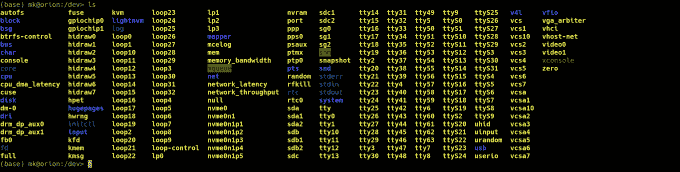
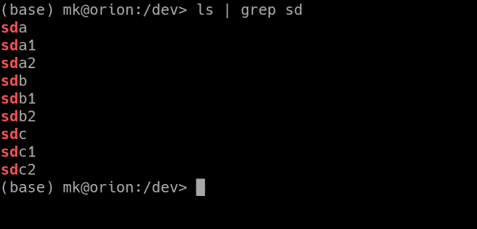
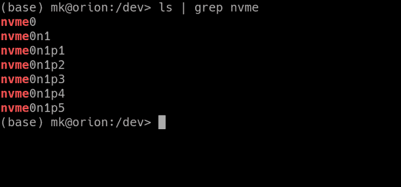
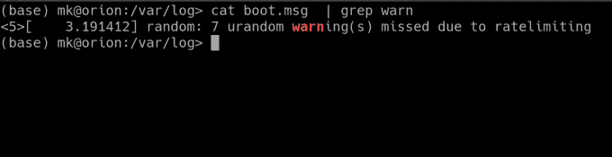
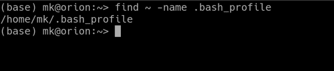
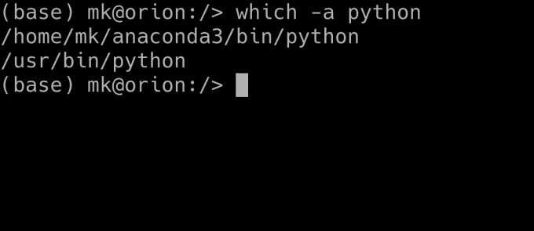

# 在 Linux 中查找文件的 3 种简单方法

> 原文：<https://betterprogramming.pub/3-easy-ways-to-find-files-in-linux-4104f62149b7>

## 找到并打开您要找的东西

作者照片。

随着您对 Linux 中的命令行越来越有经验，会出现越来越多的问题。其中之一就是如何方便有效地在 Linux 中查找文件。在本文中，我将列出在 Linux 命令行中搜索文件的三种常用方法。

# 使用 grep 按名称过滤目录中的文件

这是在 Linux 系统上查找文件(和文件夹)最简单的方法。`grep`是所有 Linux 和 FreeBSD 系统(甚至 macOS)附带的一个程序。`grep`用于使用[正则表达式](https://en.wikipedia.org/wiki/Regular_expression)过滤数据。虽然数据可以是从文件内容到从`ping`输出的任何内容，但是我将向您展示如何使用`grep`在一个特定的文件夹中查找文件和文件夹。

假设您想要列出连接到计算机的所有存储设备。如果你进入`/dev`文件夹，在里面找到`ls`，你会看到很多设备:

但我们特别在找硬盘。由于它们从`sd`开始，我们可以将`ls`输出通过管道传输到`grep`并过滤:

如果要找 SSD 设备，可以用`nvme`过滤:

如果您不熟悉`|`符号，请不要惊慌。它被称为管道操作符，它所做的就是获取第一个命令的输出，并将其传递给第二个命令。

现在你知道如何使用`grep`查找文件了。但这并没有结束！您也可以使用`grep`在文件中查找内容*。例如，您可以`cat`将一个文件通过管道传输到`grep`:*

我刚刚向您展示了`grep`的基础知识，以及如何在 Linux 中使用它来查找文件。要了解这个令人敬畏的工具的更多信息，请运行`man grep`。

# 使用查找命令查找文件

在 Linux 系统上查找文件最健壮的命令是`find`命令。它有很多特性，但是我将在这里探索最流行的用例。如果您想了解更多信息，请运行`man find`。

## 按名称查找文件

这个可能是用的最多的。要使用它，运行`find <path> -name <filename>`。例如:

## 按类型查找

有时，只查找特定类型的文件很方便。您可以为此使用`-type`参数。它需要一种文件类型，可以是以下类型之一:

*   f-常规文件
*   d-目录
*   l-符号链接
*   c-字符设备
*   b —块设备

例如，要查找系统上的所有块设备，您可以运行`find / -type b`。`-name`的说法，当然可以和`-type`一起发挥作用。

## 按大小查找

如果空间不足，可以专门在系统中查找大文件。你可以使用`-size`参数来做到这一点。它需要一个文件大小，前缀为`+`(要查找更小的文件，使用`-`)，结尾为`c (bytes), k, M, G`。例如，要查找所有大于 2 GB 的文件，运行`find / -size +2G`。

# 查找可执行文件

当您在 shell 中输入一个命令时，比如`python`，shell 会查找包含二进制文件的已知文件夹列表并执行它。有办法得到一个可执行文件的确切路径吗？当然有。

命令`which`将返回可执行文件的绝对路径。例如，下面是我电脑上的`python`实例的路径:

如果你运行`python`，它会实际执行`/home/mk/anaconda3/bin/python`。默认情况下，`which`将只返回一个主要结果。如果您想查看其余部分，请使用`-a`参数:

# 结束语

感谢您的阅读，我希望您现在已经知道如何在 Linux 系统上查找文件了。请在评论中告诉我你最喜欢的在 Linux 中搜索文件的技巧！