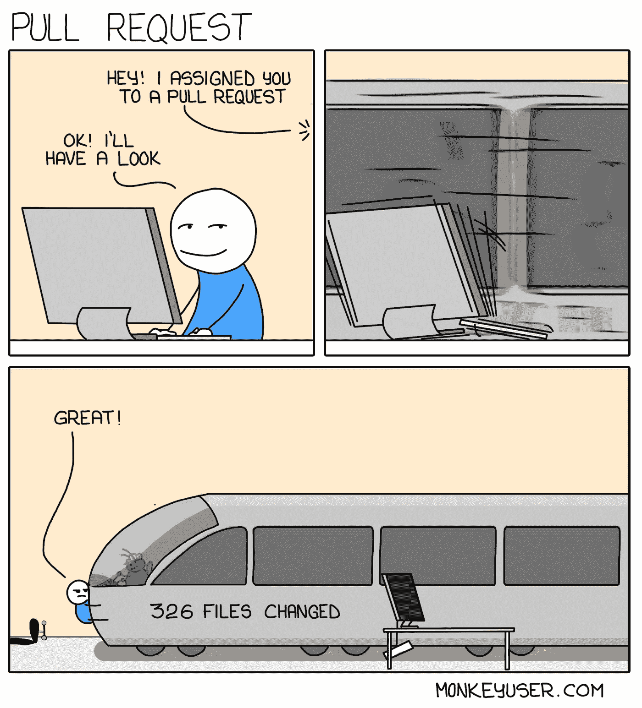

# 针对太大的合并请求的 3 个有效策略

> 原文：<https://betterprogramming.pub/3-effective-strategies-for-a-merge-request-thats-just-too-big-9a8a6d1b9351>

## 成为一名团队成员，让你的团队轻松处理合并请求


照片由[派恩瓦特](https://unsplash.com/@pinewatt?utm_source=medium&utm_medium=referral)在 [Unsplash](https://unsplash.com?utm_source=medium&utm_medium=referral) 上拍摄

对于任何资历级别的软件工程师来说，合并请求都是一个基本且关键的过程。但是当一个合并请求如此巨大，以至于你甚至不知道它的目的是什么时，会发生什么呢？初级工程师会变得不敢问问题，高级工程师可能会失去纪律，仅仅因为测试通过就批准。过大的合并请求会对团队产生严重的负面影响——这就是为什么知道如何处理太大的*先生是很重要的。*

如果做得好，合并请求可以让工程师及时了解代码库的当前状态。他们还展示了除了促进高测试覆盖率之外，如何以不同的方式解决问题，因为不同的人自然会考虑不同的测试用例。

最重要的是，**合并请求驱动架构。**是的，专门的设计会议很棒，但是设计的实现仅在合并请求中进行审查。您可能会考虑在架构会话中使用工厂模式，但是工厂模式实际上是如何用代码编写的呢？需要修改成抽象工厂吗？只有当橡胶遇到道路，你必须执行时，你才会知道这些类型的答案。

如果你学会了如何保持你的 MRs 可读性、简洁和高度协作性，所有这些好处甚至更多都可以得到。

# 1.知道什么时候一个先生已经杂草丛生

如果你甚至不确定一个过大的合并请求是什么样子的，你就不知道什么时候应该开始修改一个合并请求。这很大程度上取决于您的团队和您正在使用的代码类型。像自动生成的代码、依赖模块或元数据这样的例子只有在团队同意值得努力的情况下才应该被评审。理想情况下，当您在第一个地方创建验收标准时，您可以识别新特性或 bug 修复何时太大，但这是在一个更简单的世界中。



根据一般经验，100 行代码是合并请求的一个很好的截止，尤其是如果团队中有更多的初级工程师。超过这一点，初级工程师可能会错过简洁先生的好处。工程团队的强大取决于他们最薄弱的环节，除非你认为“10 倍编码者”不会有一天带着他们建立的所有知识离开你的公司。

如果您的团队由更多的高级工程师组成，您可以轻松地将代码增加到 300 行或更多。然而，当涉及到您正在推动的代码量时，回报会显著减少。MRs 可能过大的一个迹象可能是缺乏反馈和沟通。没有人第一次就能把所有事情都做对。合并请求可能看起来很乏味，但是它们非常值得努力。

# 决定分解大型 MRs 的团队标准

在团队中工作的最大好处之一就是每个人都可以而且应该有不同的观点和解决问题的策略。这同样适用于合并请求。一些工程师可能会认为，MRs 应该一个特性一个特性地分解，或者按照代码库的类型，或者按照团队等等。不要把这些问题留在未知中。找出差异，并大声说出来！

以下是一些关于分解合并请求的一般提示:

1.  **识别共享逻辑** —假设您正在代码中向多个服务添加健康检查。因为每个健康检查都有相同的 boiler-plate 代码，所以您将它提取到一个共享包中，供其余的服务使用。新添加的共享包非常适合个人 MR，请确保共享逻辑也经过了测试！
2.  **知道 AC 什么时候膨胀了** —如果一个特性的验收标准是为一个新的 API 添加一个新的路由基础层，那么就没有必要开始将 API 逻辑本身添加到变更列表中。那应该留给下一任先生吧:)
3.  **记录你的推理**——如果你决定将一个 MR 分解成多个部分，重要的是你要为你的队友将这些点连接起来。您可以用相同的特性名开始每个子 MR，然后用一个描述性的后缀，比如`feature/TeamX-1290_sharedInfra`。然后更新 MR 描述，以了解它与原始新特征描述的关系。
4.  **去掉无用的代码**——我见过 MRs 瞄准仍然有剩余注释的主要源代码。也可能有多余的测试，甚至只是值得花费的重构机会。作为生活的一个标准，离开营地时要比你发现时更好。

# 像高级工程师一样利用 Git 版本控制

当涉及到拆分 MR 的细节时，您希望让您的生活变得简单，并减少所需的开销。甚至不要考虑手动将文件复制回一个新的分支，你是一名软件工程师，这意味着你知道如何使用工具来简化你的工作。幸运的是，git 有一些很棒的命令可以专门用于合并请求。

我们将逐步完成我在分解 MR 时喜欢使用的工作流。代码中的最终更改可能类似于以下示例:

```
root
  ├── src
  │   │
  │   ├── client  <- Front end code
  │   │   ├── components
  │   │   │   ├── **NewComponent1.js**
  │   │   │   ├── **NewComponent2.js**
  |   |   |   └── ExistingComponent.js
  │   │   └── **index.js** <- New updates!
  │   │
  │   └── server  <- Back end code
  │       └── **app.js**  <- New updates!  
  │
  ├── package.json  <- New updates!
  ├── package-lock.json
  ├── README.md
  ├── webpack.config.js  <- Configuration for compiling front end 
  └── shared
      ├── ...
      └── **infra** <- New updates!
          └── ...
```

我们有三个地方可以拆分新的附加物。对`client`、`server`和`shared`目录进行了更改——为什么不为每个目录创建一个 MR 呢？有了 git，我们可以做到这一点！

## 为新分支签出特定文件

首先，检查您试图将代码合并到的目标分支，并运行`git pull`来验证一切都是最新的。现在，让我们假设你的先生长得太大了，叫做`feature/TheBigOne`。我们可以使用 git 从分支`feature/TheBigOne`中找到`checkout`特定的文件和文件夹，并相应地创建一个新的分支。以下是逐一列出的步骤:

```
$ git checkout main
$ git pull
$ git checkout feature/TheBigOne -- src/client/ # relative path!
$ git checkout -b feature/TheBigOne_client
$ git commit -m "adding X to change Y for client"
$ git push
```

我们可以对`server`和`shared`代码变更重复这个过程，检查特定的文件，并为每个文件创建新的分支。使用`git checkout`，我们指定我们想要从中提取的分支(`feature/theBigOne`)，将`--`添加到我们的参数列表中，并给出新更改的相对路径，例如`git checkout feature/TheBigOne —- shared/infra/`。

这个简单的过程其实对于分手一个先生来说超级快速高效，自己试试吧！

# 结论

这就是我列出的对付一个过度膨胀的 MR 的策略。归根结底，一个高质量的 MR 就是要简洁并与你的团队合作。如果你有任何建议或喜欢你所读的，请在下面留下评论！

感谢阅读。