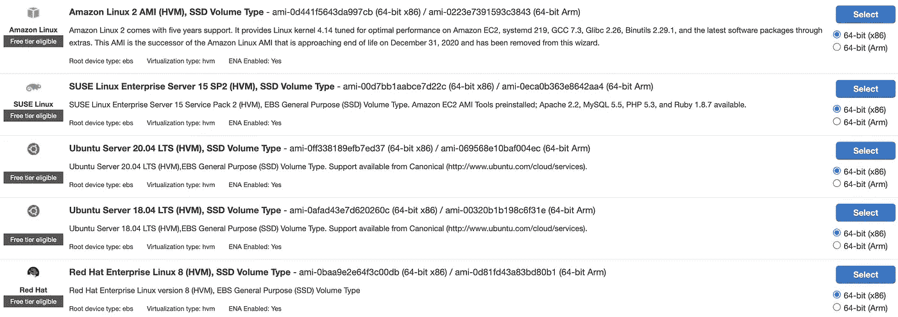

# AWS 的 3 种基本计算能力

> 原文：<https://betterprogramming.pub/3-essential-computational-powers-on-aws-86937fef742>

## 包括它们所拥有的强大功能

由 [Unsplash](https://unsplash.com/s/photos/desktop?utm_source=unsplash&utm_medium=referral&utm_content=creditCopyText) 上的[夸里奇摄影](https://unsplash.com/@quaritsch?utm_source=unsplash&utm_medium=referral&utm_content=creditCopyText)拍摄

随着云系统的发展，软件工程出现了新的趋势。云提供商不仅有存储能力，还有计算能力。如今，我们不需要物理服务器来运行我们的应用程序。一切都在云端。

如果您需要更强大的服务器，只需支付更多费用，只需几分钟，您就可以获得整个机器舰队。像断电或服务器被盗这样的担忧已经成为历史。您的解决方案将继续运行。随着安全性和弹性的提高，它变得更加方便。

Amazon Web Services (AWS)提供了一些计算资源选项来满足每个人的需求。让我们来探索它们。

# 弹性计算云

弹性计算云或 EC2 是最受欢迎的选择。这是所有计算资源开始的地方。那是什么？

简单来说，EC2 是一台物理计算机，位于亚马逊的一个数据中心。很简单，对吧？你只需在房间里放置一台服务器，然后让任何人租出去在上面运行他们的软件。这是 EC2 的主要思想。

但是我们可以想象每个人都有不同的需求。有人需要非常强大的 CPU 其他人需要内存优化的机器。有人需要不同的 Linux 发行版，有人需要 Windows 服务器。

EC2 的各种选项

因此，AWS 为您启动的每个 EC2 实例提供了许多配置。我们可以配置 CPU 能力、内存等级、可用存储、操作系统等等。这应该足以满足几乎任何应用程序的要求。除此之外，我们可以配置网络设置，并通过附加的安全组限制公共访问。

随着 EC2 实例的丰富设置，一些免费服务正在利用它们。它们是负载平衡器和自动扩展组。第一种方法将到达应用程序的请求分布在多个 EC2 实例中。第二个负责根据传入请求的数量扩大和缩小 EC2 实例的规模。这两种服务在构建现代分布式系统中起着至关重要的作用。但是它们只有结合 EC2 和对其工作原理的良好理解才有意义。

定价模型基于一段时间内消耗的资源数量。每个实例类型都有其每小时的价格。但是也可以通过提前更长时间保留 EC2 实例来省钱。如果您可以预测未来的负载，签订一年或三年的合同是更好的选择。

# 法尔盖特

容器化应用的繁荣改变了开发者运输它们的方式。工程师的机器和服务器上不同设置和环境的问题消失了。许多解决方案都在积极利用 Docker，并从中受益。

AWS 有自己的服务弹性容器服务(ECS)来有效地管理容器。我们需要指定底层配置，容器将被放置在 EC2 实例上。该服务负责在调配的服务器上部署和运行容器化的应用程序。

尽管这听起来已经足够好了，但还有更多的选择。其中之一是服务，法盖特。这是一个运行容器化解决方案的无服务器版本。有了 Fargate，软件开发人员就不用担心配置 EC2 机器了。现在，整个重点是建立一个解决方案，而不是工作设置。

> Fargate 消除了扩展、修补、保护和管理服务器的运营开销。— AWS

我们必须提供想要运行的容器，以及估计需要的内存和 CPU 数量。剩下的，法盖特会帮我们做的。在幕后，它启动 EC2 实例并负责管理它们。剥离一个容器从来都不是那么简单的。你将不得不为每小时消耗的 CPU 和内存付费。

# 希腊字母的第 11 个

AWS Lambda 是另一个令人惊叹的无服务器服务。如果你的解决方案很简单，并且可以适合一个或几个函数，那么 Lambda 就是你要找的。为什么需要整个服务器等待运行一段代码？

有了 Lambda，你可以写一段代码，它将在云中执行。我们不需要考虑供应和配置服务器，也不需要考虑系统补丁和升级。我们编写一个函数，亚马逊将为我们运行它并交付结果。这是无服务器概念的主要目的。云处理不可预测的负载，不会突然停止。

Lambda 支持目前使用的大多数现代编程语言:Python、Java、Ruby、Go、C#、Javascript。你可以自由选择。

关于 Lambda，首先想到的是它被设计成只运行简单的函数。该功能的运行时间不能超过 15 分钟，这是正确的；否则，它将超时。但是可以将多个功能链接起来，构建特定的流程。一些复杂的生产解决方案只运行在 Lambda 函数上。例如，你能想象一个没有任何运行服务器的订票系统吗？Lambda 使之成为可能。

Lambda 的定价模型基于请求数量、持续时间和消耗的内存。您只需为您使用的东西付费。但即使不用管理服务器，也要谨慎设计功能。你不想为糟糕的功能支付额外的费用。

# 最终想法

如今，云系统可以提供很多东西。有如此多的选择:从简单的存储开始，到安全和机器学习的复杂工具结束。然而，计算能力仍然是每个系统的重要组成部分。如果你想交付优秀的产品，请记住现有的选项及其特性。