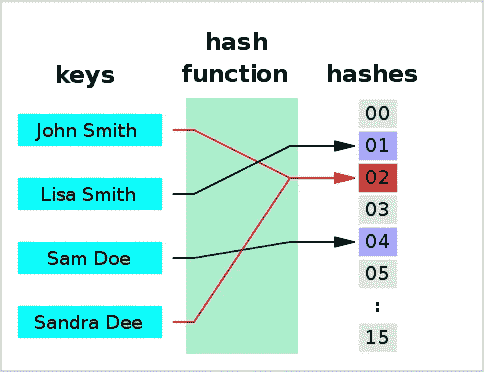

# 关于 Python 中 Hashable 的 3 个基本问题

> 原文：<https://betterprogramming.pub/3-essential-questions-about-hashable-in-python-33e981042bcb>

## 从一般讨论到具体实施


照片由[石页·康让](https://unsplash.com/@omgitsyeshi?utm_source=medium&utm_medium=referral)在 [Unsplash](https://unsplash.com?utm_source=medium&utm_medium=referral) 上拍摄

作为一种通用编程语言，Python 为各种用例提供了大量内置数据类型。

当你学会了这些基础知识，你可能会在某些时候遇到提到 *hashable* 的情况。例如，您可能会看到`dict`中的键需要是可散列的(参见下面代码片段中的一个小例子)。

另一个例子，提到了`set`中的元素需要是可散列的。

你可能想知道 hashable 到底是什么意思？哪些对象是可散列的，哪些是不可散列的？如果我们使用不可哈希的对象作为字典的键，会发生什么？诸如此类。可以问很多相关的问题。

在这篇文章中，我们将回顾一些关于 hashability 的要点，这样你将学会如何解决这些问题。最后，你可能会发现，这些问题其实一点也不难，不像你最初想的那样。

# 哪些对象是可散列的，哪些是不可散列的？

在我们开始任何机械解释之前，我们想要解决的第一个问题是，哪些对象是可散列的，哪些是不可散列的。

因为我们知道 Python 明确要求`set`中的元素应该是可散列的，所以我们可以通过简单地将对象添加到`set`中来测试对象的可散列性。成功插入表示对象是可散列的，反之亦然。

```
>>> **# Create an empty set object**
>>> elements = set()
>>> 
>>> **# The list of objects with each to be inserted to the set**
>>> items = [1, 0.1, 'ab', (2, 3), {'a': 1}, [1, 2], {2, 4}, None]
```

如上面的代码所示，我创建了一个名为`elements`的`set`变量和一个名为`items`的`list`变量，其中包含了最常用的内置数据类型:`int`、`float`、`str`、`tuple`、`dict`、`list`、`set`和`NoneType`。

我将运行的实验是将每个`items`添加到`elements`中。在这种情况下，我不会使用`for`循环，因为任何可能的`TypeError`都会停止迭代。相反，我将只使用索引来检索单个项目。

正如您在上面的代码片段中看到的，这里是实验结果的快速总结。

## **对部门问题的回答**

*   可哈希数据类型:`int`、`float`、`str`、`tuple`、`NoneType`。
*   不可隐藏的数据类型:`dict`、`list`和`set`。

如果您是 Python 编程的新手，您可能已经注意到这三种不可哈希的数据类型本质上都是可变的，而这五种可哈希的数据类型都是不可变的。

本质上，这些可变数据是其值在创建后可以更改的对象，而不可变对象的值在创建后不能更改。

数据可变性是一个独立的主题，我在之前的另一篇[文章](https://medium.com/swlh/6-things-to-understand-python-data-mutability-b52f5c5db191)中已经讨论过。

# Hashable 是什么意思？

您现在已经知道哪些对象是可散列的，哪些不是，但是可散列到底是什么意思呢？

实际上，你可能听过很多类似的与 hashable 相关的计算机术语，比如 hash value、hashing、hash table 和 hashmap。从本质上讲，它们共享相同的基本过程——散列。



哈希的一般流程([维基百科](https://en.wikipedia.org/wiki/Hash_function)，公共领域)

上图显示了散列的一般过程。我们从一些原始数据值开始(在图中称为*键*)。

有时被称为*散列器*的散列函数将执行特定的计算并输出原始数据值的散列值(在图中被称为*散列值*)。

哈希及其相关概念需要一整本书来阐明，这超出了本文的范围。然而，一些重要的方面已经在我的[上一篇文章](https://medium.com/better-programming/what-is-hashable-in-swift-6a51627f904)中简要讨论过了。

在这里，我将只强调与当前讨论相关的一些要点。

1.  散列函数应该是*计算健壮的*，使得不同的对象应该具有不同的散列值。当不同的对象具有相同的哈希值时，就会发生冲突(如上图所示)，应该进行处理。
2.  散列函数应该*一致*，使得相同的对象将总是导致相同的散列值。

Python 实现了内置的散列函数，为其对象生成散列值。具体来说，我们可以通过使用内置的`hash()`函数来检索对象的哈希值。下面的代码展示了一些例子。

如上所示，我们能够获得哈希值—— `int`和`tuple`对象的整数。

然而，`list`对象和`dict`对象都没有哈希值。这些结果与我们在上一节中对可哈希对象和不可哈希对象的区分是一致的。

## **对部门问题的回答**

*   hashable:Python 对象的一个特性，用于指示对象是否具有哈希值，这允许对象充当字典中的键或集合中的元素。

# 如何定制 Hashability？

Python 作为通用编程语言的灵活性主要来源于它对创建自定义类的支持。有了自己的类，许多相关的数据和操作可以以一种更有意义和可读性的方式进行分组。

重要的是，Python 已经进化得足够智能，使得我们的定制对象在大多数情况下都是默认可散列的。

考虑下面的例子。我们创建了一个定制类`Person`，它允许我们通过指定一个人的姓名和社会保险号来创建实例。

值得注意的是，我们使用 f-string 方法覆盖了默认的`__repr__()`函数，这将允许我们显示具有更多可读信息的对象，如代码片段的最后一行所示。

如上面的代码所示，我们可以通过使用内置的`hash()`函数来找出创建的对象`person0`的哈希值。重要的是，我们能够将`person0`对象作为一个元素包含在`set`对象中，这很好。

但是，如果我们想向集合中添加更多的`Person`实例，会发生什么呢？更复杂但可能的情况是，我们构造同一个人的多个`Person`对象，并尝试将它们添加到`set`对象中。

请参见下面的代码。我创建了另一个`Person`实例`person1`，它有相同的名字和社会保险号——本质上是同一个自然人。

然而，当我们将这个人添加到`set`对象`persons`时，两个`Person`对象都在`set`中，这是我们不希望发生的。

因为，按照设计，我们希望`set`对象存储唯一的自然人。与包含在`set`对象中的两个人一致，我们发现这两个`Person`实例确实不同。

我将向您展示我们如何使自定义类`Person`更智能的代码，以便它知道哪些人是相同的，哪些人是不同的。

在上面的代码中，我们通过覆盖`__hash__`和`__eq__`函数更新了自定义类`Person`。

我们之前提到过`__hash__()`函数用于计算对象的哈希值。`__eq__()`函数用于比较一个对象和另一个对象是否相等，并且要求比较相等的对象应该具有[相同的哈希值](https://docs.python.org/3.5/reference/datamodel.html#object.__hash__)。

默认情况下，定制类实例通过使用内置的`id()`函数比较它们的身份来进行比较(通过参考[本文](https://medium.com/better-programming/use-id-to-understand-6-key-concepts-in-python-73e0bbd461ec)来了解关于`id()`函数的更多信息)。

有了更新的实现，我们可以看到，当我们试图创建一个由两个`Person`对象组成的`set`对象时，调用了`__hash__()`函数，使得 set 对象只保留具有唯一哈希值的对象。

另一件要注意的事情是，当 Python 检查`set`对象中的元素是否有唯一的哈希值时，它会通过调用`__eq__()`函数来确保这些对象不相等。

## **对该部门问题的回答**

定制:为了在可散列性和平等性方面提供定制的行为，我们需要在我们的定制类中实现`__hash__`和`__eq__`函数。

# 结论

在本文中，我们回顾了 Python 中 hashable/hashability 的概念。

具体来说，通过解决这三个重要的问题，我希望您对 Python 中的 hashability 有更好的理解。如果适用，您可以为自己的定制类实现定制的 hashability 行为。