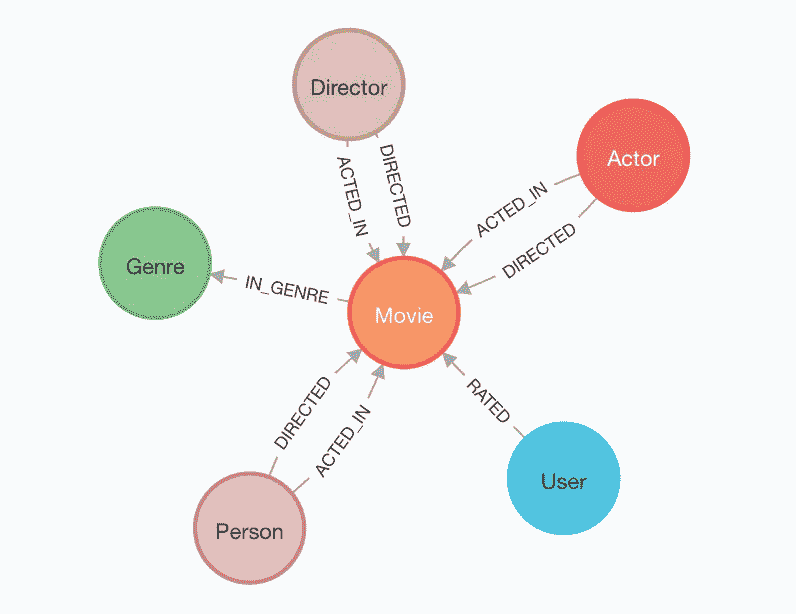

# 3 个带有火花图案框架的图案示例

> 原文：<https://betterprogramming.pub/3-examples-of-motifs-with-spark-graphframes-db873b3fdc8a>

## 在图中寻找特定的关系模式

图片来自 [Neo4j 图推荐回购](https://github.com/neo4j-graph-examples/recommendations)

## 介绍

图形分析提供了一种分析节点(实体)之间的边(关系)的好方法。Apache Spark 提供了两种处理图形数据的方法；GraphX 和 GraphFrames。GraphFrames 允许您快速创建数据的图形表示。如果你已经来自 Spark 的世界，GraphFrames [文档](https://graphframes.github.io/graphframes/docs/_site/index.html)将自己描述为:

> GraphFrames 对于数据帧，就像 GraphX 对于 rdd 一样。

在本教程的剩余部分，我将介绍什么是“motif”，基于 [Neo4j 电影数据集](https://github.com/neo4j-graph-examples/recommendations)创建一个图表，并使用“motif”查找 3 个示例。

本文的所有代码和数据都可以在 repo [这里](https://github.com/sjrusso8/graph-motifs)找到。

## 什么是“主题”？

“主题”的标准定义是*一种* ***装饰性的设计或图案*** *。*这和图表有什么关系？图表框架“主题”允许您在图表中搜索结构模式。Motifs 使用领域特定语言(DSL)来探索图形以匹配模式，并提供具有匹配模式的过滤数据帧。

motif 语言乍一看有点奇怪，但是一旦你掌握了它，它会非常有用。比如回答问题“*的一个模体，有哪些节点对是双向互相连接的？*”会是这样的`(“(a)-[e]->(b); (b)-[e2]->(a)”)`。

你可以把`(“(a)-[e]->(b); (b)-[e2]->(a)”)`理解为

> 找出节点'(a)'通过边'[e]'直接连接到节点'(b)'以及节点'(b)'通过边'(e2)'直接连接回节点'(a '的所有情况

这里的关键词是“*直接连接*”，因为主题寻找两个节点之间的方向关系。括号中的值可以不同，使用适当的标签会更有意义。这对于下面的例子来说更有意义。

## 初始化 GraphFrames 中的图形

我假设您已经运行了一个 Apache Spark 实例并安装了 GraphFrames。有更好的例子可以详细地向你展示。

我使用一个 Databricks 工作区和一个运行 Spark 10.4 LTS ML 的小型集群。Spark ML 版本在集群上预装了 GraphFrames。我在这个演示中使用的数据来自 [Neo4j 电影数据集](https://github.com/neo4j-graph-examples/recommendations)。

## 简单主题

让我们从一个简单的主题开始回答这个问题:

*“汤姆·汉克斯演过的电影都是什么，他演了什么角色？”*

motif 返回一个数据帧，其中 motif 值用作列名。列的底层字段将是包含该记录所有属性的`struct`类型字段。您可以在一个`struct`类型字段上使用 PySpark 点符号来轻松过滤和选择结果数据帧中的细节。

## 匿名边和节点

您也可以通过省略 motif 中的值来选择不返回节点或边。对于这个例子，我们将回答这个问题:

*哪些人有不止一种外向关系类型？*

这个例子通过使用函数`collect_set`将所有的关系类型组合成一个集合来聚合数据。这将返回一个数组，其中包含一个组的所有唯一值。在这种情况下，它返回特定个人的唯一传出关系类型的数组。

## 定向可变长度基序

与 Neo4j 中使用的 Cypher 语言相比，GraphFrames 的一个局限性是无法轻松创建可变长度的模式。有一种方法可以通过一些聪明的 python 编码来解决这个问题，但是结果相当笨拙。

下面的代码通过将生成的主题追加到单个数据帧中来创建一个可变长度的主题。然后使用一些列表理解来创建一个列，将特定于域的值合并成一个列。

## 结束了！

这篇文章回顾了一些有价值的使用 GraphFrames 寻找模体的特定领域的例子。我强烈建议您也探索 Neo4j 和其他专门为图形数据构建的库。

同样，所有代码都可以在 repo [这里](https://github.com/sjrusso8/graph-motifs)中获得。

感谢阅读。