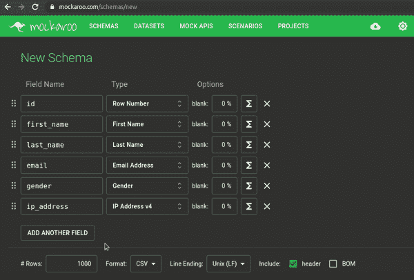
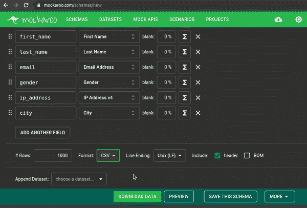
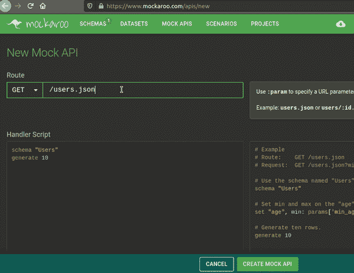
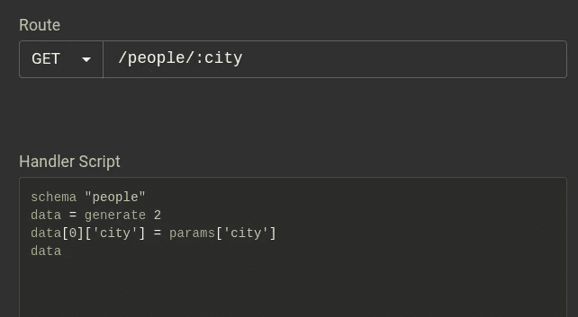
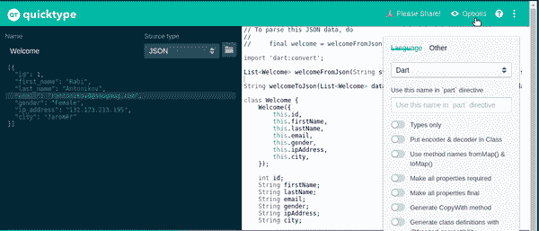

# 3 个虚拟数据生成工具，用于快速后端测试

> 原文：<https://betterprogramming.pub/3-fake-data-generation-tools-for-quick-backend-testing-1f63e19d204>

## 有用的模拟数据和 API 生成器


照片由 [Bram Naus](https://unsplash.com/@bramnaus?utm_source=medium&utm_medium=referral) 在 [Unsplash](https://unsplash.com?utm_source=medium&utm_medium=referral) 上拍摄。

测试是开发生命周期的重要部分。我们经常需要生成不同的测试数据来检查后端在不同场景下的功能。如果我们想自己创建数据，这可能会很耗时。另一个问题是数据可能有偏差，异常用例可能没有被覆盖。

在本教程中，我将向您展示一些用于虚拟数据创建、API 模仿和快速生成`JSON`类的便利资源。这样，我们可以专注于开发任务，而不是准备数据。

我们开始吧！

# 用于真实数据生成和 API 测试的 Mockaroo

Mockaroo 为你的后端测试提供了丰富的模拟数据。有免费版和高级版。免费的还不错，涵盖了所有功能。限制是最多可以有 1000 行假数据。

一个典型的用例是你的后端没有完全准备好，但是你想开始测试你的 UI。Mockaroo 允许您创建一个包含虚假数据的模式。然后，您可以模拟一个 API 端点，并开始用您选择的语言发送请求。

让我们看一个使用内置类型创建新模式的快速示例。

转到 [Mockaroo 的模式页面](https://www.mockaroo.com/schemas/new)创建一个模式:



使用预定义的类型向架构添加新行。

正如您从示例中看到的，有各种各样的类型。

单击“保存此方案”保存您的数据。您可以选择`JSON`或其他格式，如`CSV`或`XML`:



保存假数据。

根据含有非字母字符的人名来测试您的代码会很有用。

您甚至可以根据他们的[公式](https://www.mockaroo.com/help/formulas)构建自己的参考数据集。

现在，让我们看看如何模拟 API 端点。

*   确保您已经保存了您的模式。我给我的取名为`people`。
*   去 [Mockaroo 的模拟 API 页面](https://www.mockaroo.com/apis/new)创建一个假 API。您可以在`GET`、`PUT`、`POST`、`PATCH`、`DELETE`和`OPTIONS`请求之间进行选择。我就用`GET`:



保存 get people API 端点。

*   保存模拟的 API 后，在浏览器中打开生成的链接以查看结果。您也可以使用`cURL`命令来尝试。不要忘记在请求中加入你的个人信息。

另一个很酷的特性是 Mockaroo 支持 URL 参数替换。

*   首先，将`:param`添加到请求的路由中。
*   然后修改处理程序脚本，用传递给 URL 请求的参数替换该参数。

例如，让我们提供一个`:id`参数。语法如下所示:


将 id 作为 URL 参数添加。

*   我们告诉脚本生成一行，并将结果放入一个`data`变量中。
*   `id`将等于我们传递给请求 URL 的`id`参数。
*   最后，在结果中显示整个`data`行。

例如，我将把一个编号为`111`的 ID 传递给请求:[https://my.api.mockaroo.com/people/111?key=](https://my.api.mockaroo.com/people/123?key=b358a1b0)your key。

回应是:

```
{"id":"**111**","first_name":"Shaughn","last_name":"Retchless","email":"sretchless0@bbc.co.uk","gender":"Non-binary","ip_address":"168.202.195.191","city":"Ukrainka"}
```

如果您想生成更多的行，语法是什么？

数据将被简单地作为一个`array`来处理。

假设我们想向请求传递一个`city`:



添加城市作为参数。

请求:https://my.api.mockaroo.com/people/Budapest?key=你的钥匙。

回应:

```
[{"id":1,"first_name":"Darci","last_name":"Ravenshear","email":"dravenshear0@cloudflare.com","gender":"Agender","ip_address":"129.164.5.244","city":"**Budapest**"},{"id":2,"first_name":"Tymothy","last_name":"Kubiak","email":"tkubiak1@devhub.com","gender":"Male","ip_address":"34.94.118.160","city":"Warburton"}]
```

# JSONPlaceholder 用于伪数据生成和快速原型制作

JSONPlaceholder 是一个免费的在线 REST API，它有几个预定义的模拟数据集。虽然它没有 Mockaroo 那么复杂，但却非常方便。如果您想为教程或项目演示构建一个快速原型，在这个工具的帮助下，您将在几分钟内做好准备。

例如，尝试这个 URL 通过`userId`:[https://jsonplaceholder.typicode.com/users/1](https://jsonplaceholder.typicode.com/users/1)获得一个用户。

回应:

它支持`GET`、`PUT`、`POST`、`PATCH`和`DELETE`请求。

# 将 JSON 转换成代码的 Quicktype

我把这一个作为额外奖励。虽然它不是一个假的数据生成器，但它值得关注，因为它加快了我们的开发工作。

[Quicktype](https://quicktype.io/) 帮助你基于`JSON`数据生成各种语言的类。当你有一个大的`JSON`结构并想把它转换成一个类时，这是一个真正的省时器。

您可以在 Dart 这样的新语言和 Java 这样的老语言之间进行选择。

因为我已经使用 Mockaroo 创建了一些模拟数据，所以我将使用它进行演示:



用 quicktype 从 JSON 生成类。

顺便说一句，我印象深刻的是它甚至支持 [Lombok](https://projectlombok.org/) Java 库！

# 结论

在本文中，您已经看到了如何使用 Mockaroo 和 JSONPlaceholder 创建模拟数据和 API 端点。然后我们使用 quicktype 在短短几秒钟内将`JSON`转换成代码。

我希望你在未来的项目中好好利用这些工具。

如果你知道你喜欢的类似资源，请在评论中分享。

您可能还会喜欢我关于其他有用的开发技术的文章:

[](/how-to-effortlessly-adopt-microservices-using-krakend-28c265573877) [## 如何使用 KrakenD 轻松采用微服务

### KrakenD API 网关简介

better 编程. pub](/how-to-effortlessly-adopt-microservices-using-krakend-28c265573877) [](/how-to-authenticate-your-spring-boot-application-with-keycloak-1e9ccb5f2478) [## 如何使用 Keycloak 验证您的 Spring Boot 应用程序

### 关于设置 Keycloak 以保护 Spring Boot 应用程序的详细演练指南

better 编程. pub](/how-to-authenticate-your-spring-boot-application-with-keycloak-1e9ccb5f2478) 

感谢您的阅读和快乐编码！