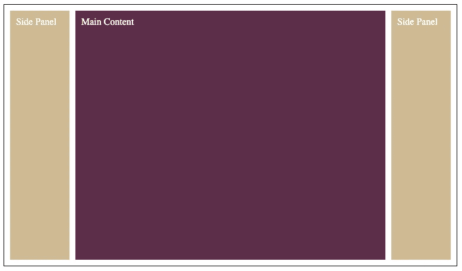
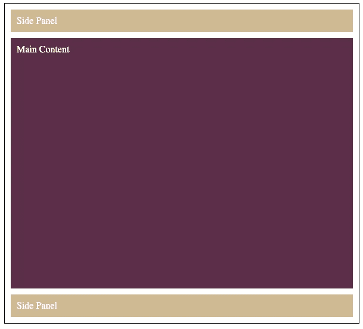
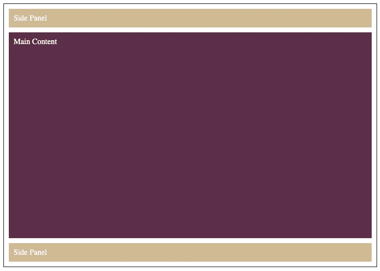
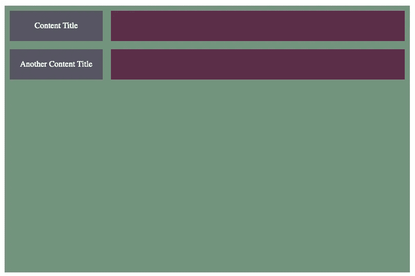

# 在任何浏览器中支持 CSS 网格的 3 种回退技术

> 原文：<https://betterprogramming.pub/3-fallback-techniques-to-support-css-grid-in-any-browser-1740454d7cdb>

## 理解 CSS 网格在生产中的使用


约翰·施诺布里奇在 [Unsplash](https://unsplash.com?utm_source=medium&utm_medium=referral) 上拍摄的照片。

CSS Grid 现在在浏览器中有很大的支持——大约 95%的支持它的基本功能。然而，有时你不能忽略这 5%,因为你可能希望你的 web 应用程序的布局在所有浏览器上看起来都很棒。您甚至可能希望使用支持较少的较新的网格特性。

我们做什么呢我们应该避免在生产中使用网格吗？我们应该忽略使用旧浏览器的用户吗？我们应该等待该功能有更好的覆盖范围吗？肯定不是。有很多后备技术可以克服这些问题。

在这篇文章中，我们将探索三个最重要的技术，它们将帮助我们从网格布局中优雅地后退。我们将根据可用的浏览器功能调整我们的网页设计。它将逐渐适应。

在深入技术方面之前，我们需要定义一个策略。拥有合适的策略是成功的关键。它会给我们方向感和一致性。

# 定义战略

Grid 最常见的用法是构建适应用户屏幕分辨率的多维布局。当网格不可用时，您应该做什么？除了网格之外，你怎样才能做出一个灵活的、有反应的布局呢？

您可以尝试通过使用 Flexbox 来复制相同的布局，但是这会添加太多的代码。此外，Flexbox 并不是为同样的目的而构建的，您可能会感到吃力。

你该怎么办？解决方案非常简单:作为退路，只需向用户呈现移动布局。只有使用过时浏览器的桌面用户才会注意到一些问题。这在你的总用户群中所占的比例非常低。该网站应该是可用的和一致的。这是一个公平的交易。

使用最新的网格特性怎么样？同样的策略也适用:尝试退回到一个体面的类似布局。

总之:我们的布局将逐步加强。使用老版本浏览器的用户将会看到一个更简单、更实用的布局版本。使用最新浏览器的用户将获得完整的 UX 体验。

让我们看看我们可以使用的三大工具。

# 1.使用 CSS 功能查询

让我们从描述这些是什么开始:

> “特性查询是使用 CSS at-rule [@supports](https://developer.mozilla.org/en-US/docs/Web/CSS/@supports) 创建的，非常有用，因为它们为 web 开发人员提供了一种测试浏览器是否支持特定特性的方法，然后提供仅基于该测试结果运行的 CSS。在本指南中，您将了解如何使用功能查询实现渐进式增强。”— [MDN 网络文档](https://developer.mozilla.org/en-US/docs/Web/CSS/CSS_Conditional_Rules/Using_Feature_Queries)

如果您曾经使用过媒体查询，您将会非常熟悉它的语法。是一样的。不是根据浏览器的视窗大小来调整布局，而是根据 CSS 属性的有效性来调整布局。

根据我们的战略:

1.  我们将使用 Flexbox 构建一个移动布局版本，并将其用作默认版本。
2.  通过使用`@supports`，我们将检查浏览器是否支持网格。如果是这样，我们将通过使用网格来增强我们的布局。

在这个例子中，由于我们只对标准的网格行为感兴趣，我们将向`@supports`查询基本的`display: grid`特性:

```
@supports (display: grid) {
  //... code here
}
```

让我们看一个完整的例子:

注意，我们并没有断言这个网格特性:`grid-template-columns`。如果浏览器不支持会怎么样？在这种情况下，Grid 将退回到默认的定位算法。它会堆叠`divs`。对于我们的例子，这是可行的，所以我们不需要任何额外的工作。

让我们看看结果。

这是桌面分辨率下支持网格的浏览器的结果:



支持网格时的布局

这是支持网格的浏览器在移动分辨率下的结果:



支持网格时的布局

这是不支持网格的浏览器在任何分辨率下的结果:



后备布局

布局没有被破坏，仍然可以被所有浏览器引擎使用和访问。只有从桌面访问它的用户才会看到不同之处。

# 2.以编程方式使用 CSS 功能查询

有时，仅仅通过 CSS 样式上的 CSS 特性查询是不可能实现您想要的。尽管它们很强大，但也有局限性。您可能希望基于浏览器功能以编程方式添加或移除元素。这是如何实现的？

幸运的是，CSS 特性可以在 JavaScript 端以编程方式调用。可以通过 CSS 对象模型接口`[CSSSupportsRule](https://developer.mozilla.org/en-US/docs/Web/API/CSSSupportsRule)`访问`@supports`。

> "`**CSSSupportsRule**`接口代表单个 CSS `@supports` `at-rule`"— [MDN 网络文档](https://developer.mozilla.org/en-US/docs/Web/API/CSSSupportsRule)

让我们看看接口定义:

```
function supports(property: string, value: string): boolean;
```

让我们在一个虚拟的例子中使用它。让我们警告用户，如果他们使用的浏览器不支持网格布局特性。千万不要在生产中这样做。这只是一个好玩的虚拟例子。

这就是我们如何有条件地检查网格是否不受支持:

```
if (!CSS || !CSS.supports('display', 'grid')) {
  ...
}
```

请注意`CSS.supports`可能在某些浏览器上不被支持，因此会进行空值检查。

让我们来看一个工作代码示例:

`CSS.supports`是一个以编程方式创建后备布局的伟大工具。如果您必须处理非常复杂的布局，您可能希望选择这种技术，而不是 CSS 特性查询。您可以使用它来创建 web 组件及其编程回退。

# 3.覆盖属性

有时候你不需要像 CSS 特性查询这样的花哨东西。您可以利用 CSS 属性的工作方式:当在 CSS 类中重新定义属性时，最后一个有效的属性将被使用。

那是什么意思？这有多酷？您可以通过覆盖 CSS 属性来定义回退:

```
#container {
  display: flex;
  display: grid; // if grid is not available this will be invalid and it will apply the previous property value: flex
}
```

我们可以用一种更简单的方式重做我们之前的 CSS 特性查询示例:

这种退路简单而强大。它在许多情况下都很有用。您不可能对所有想要使用的网格特性使用支持查询。

让我们用它来回顾一下最新的网格特性之一:`subgrid`。应该怎么用？

让我们检查一个场景，在这个场景中，我们希望将`subgrid`用于嵌套的网格模板列。这是它的要点:

```
#content {
  grid-template-columns: inherit;
  grid-template-columns: subgrid;
}
```

在本例中，当不支持子网格时，它将只继承父网格定义。这将创建一个大致相似的布局。

这只是一个简单的例子。您可以将`grid-template-columns`微调到一些固定的大小，或者在您的特定场景中最有效的大小。

以下是完整的示例:

至于结果:



子网格可用。


子网格不可用。

如你所见，结果 100%相等，但非常相似。这就是我们的目标。随着越来越多的浏览器采用`subgrid`，越来越多的用户将会看到你的布局的像素完美版本。

# 结论

Grid 和 Flexbox 旨在解决不同的场景。我们不能一直用 Flexbox 构建所有东西，因为仍然有少数浏览器不支持它。

从 Flexbox 升级到 Grid 并不意味着旧设备上的布局会突然中断。在本文中，我们探索了构建渐进式布局是多么容易和有趣。正如我们在开始时看到的，有一个如何进行的策略是非常重要的。

这些策略不仅仅意味着添加基本的网格功能。只要你提供一个合理的退路，你就可以利用像`subgrid`这样的最新特性。

我希望这能激励您在需要的时候逐步开始在生产中使用网格。你再也不用躲在 Flexbox 后面了。

## 相关文章

[](/grid-vs-flexbox-which-one-should-you-be-using-471cb955d3b5) [## Grid 和 Flexbox——你应该使用哪一个？

### 为正确的工作寻找正确的工具的旅程

better 编程. pub](/grid-vs-flexbox-which-one-should-you-be-using-471cb955d3b5) [](/top-3-css-grid-features-to-start-using-in-production-b0fe59b2e0f7) [## 开始在生产中使用的 3 大 CSS 网格特性

### 深入探究一些广泛支持的 CSS 网格特性

better 编程. pub](/top-3-css-grid-features-to-start-using-in-production-b0fe59b2e0f7)