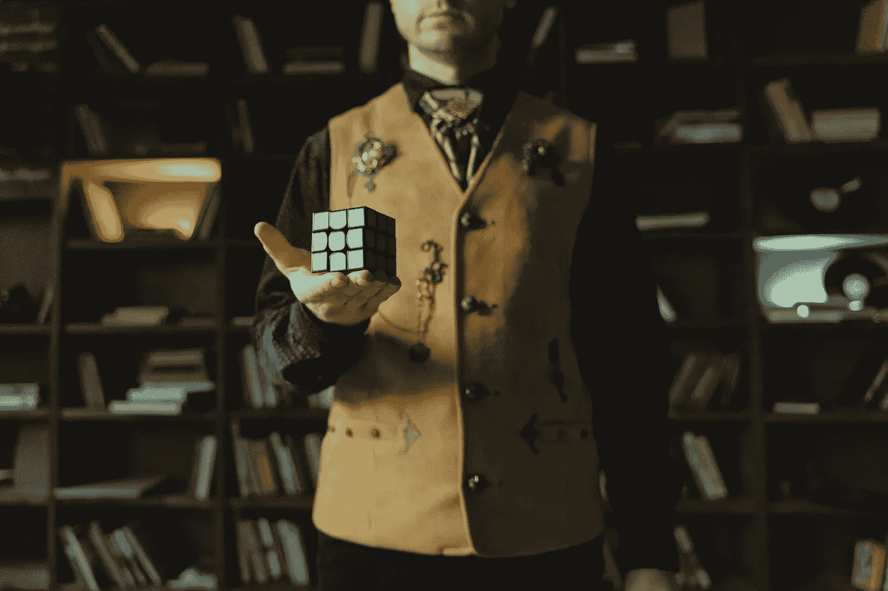
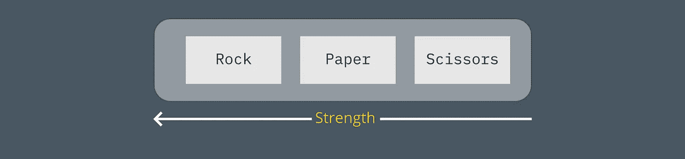

# 3 个有趣的带随机数的初级 Python 项目

> 原文：<https://betterprogramming.pub/3-fun-beginner-python-projects-with-random-numbers-df12c84a621>

## 给你的一天增添一些随意性



照片由[马体·米罗什尼琴科](https://www.pexels.com/@tima-miroshnichenko?utm_content=attributionCopyText&utm_medium=referral&utm_source=pexels)从[佩克斯](https://www.pexels.com/photo/light-fashion-man-person-6254933/?utm_content=attributionCopyText&utm_medium=referral&utm_source=pexels)拍摄。

刚开始学习 Python 的时候，很容易迷失在变量、列表、集合、`if`语句、循环中，不知道接下来该往哪里走。

学习一门新的编程语言的美妙之处在于，它能让你解决以前无法解决的问题。你的武器库中现在有了一件新武器，但是你如何使用它呢？

我已经用 Python 把图片挂在我的墙上，所以我是一个活生生的证明，你不必创建假的项目。你可以在现实生活中使用 Python 来省去你一些麻烦。事实上，我可以向你保证，如果某个工作场所的某些人学习了 Python，该公司每年可以轻松节省数千美元。

单单一门编程语言不会为你解决任何问题。你的大脑必须这么做。弄清楚逻辑是困难的部分。语言的存在只是为了支持你。

开始小项目来习惯解决问题和思考聪明的解决方案总是一个好主意。有些项目很容易把握，而另一些项目可以成长，你会后悔潜入那个兔子洞。重要的是一路学习。

让我们看几个您可以创建的项目，以便更好地理解如何使用编程来解决问题。

# 1.猜猜这个数字


Andrea Piacquadio 摄于 [Pexels](https://www.pexels.com/photo/happy-granddaughter-playing-guess-who-game-with-aged-grandmother-while-making-surprise-in-light-living-room-of-modern-apartment-3768136/?utm_content=attributionCopyText&utm_medium=referral&utm_source=pexels) 。

我们将通过一个经典的猜谜游戏来热身。在这个游戏中，电脑会猜一个随机数，玩家会试着猜这个数字是什么。

当玩家设法猜出数字时，游戏结束。

猜谜游戏的 Python 代码。作者代码。

首先我们需要导入`randint`。然后我们需要设置`max`和`min`边界，这样我们就知道我们的范围了。`Min`和`max`可以是任意两个数字(记住，我们为这个游戏选择了整数)。

我们将创建两个函数来获取计算机号和玩家号。

## 定义计算机数量(最小数量，最大数量)

该函数使用`min`和`max`范围生成一个整数。这个整数被返回，所以我们可以在游戏中使用它。

`randint(0,5)`给你一个在`0`和`5`之间的随机整数。

## player_guess(最小数量，最大数量)

这个函数询问玩家猜测的数字并返回。

## 播放()

让我们看看游戏机制。

首先，我们用我们的`low`和`high`变量定义`min`和`max`。

然后我们要求玩家和电脑的号码。

我们确保在玩家猜对之前，我们不会停止`while`循环。该表达式指出，当`player_choice`与`computer_choice`不同时，检查它是更低还是更高，并再次猜测。

由于`while`循环会一直运行，直到它们具有相同的值，所以一旦它们相同，`while`循环就会退出，我们可以打印一条成功消息。

我假设你已经开始写你的评论了，如果用户不在`low`和`high`之间输入一个*数字*，这个操作会失败。如果他们键入`‘silly goose!’`或超出范围的数字怎么办？

你是正确的。您应该检查用户错误。

在 Python 中，可以用许多不同的方法检查一个数字是否在一个范围内。以下是几个方法:

```
min_val = 0
max_val = 10
my_val = 5#1
if min_val < my_val < max_val:
    return True#2
if my_val in range(min_val,max_val):
    return True#3
if my_val>min_val and my_val<max_val:
    return True
```

您可以使用`isdigit()`并设置一个`while`循环来检查正确范围内的正确输入。如果您想了解更多关于 Python 中的输入，我已经写了一篇关于这个主题的文章:

[](/how-you-make-sure-input-is-the-type-you-want-it-to-be-in-python-521f3565a66d) [## 在 Python 中如何确保 input()是您想要的类型

### Input 返回一个字符串，但是你不希望这样，对吗？

better 编程. pub](/how-you-make-sure-input-is-the-type-you-want-it-to-be-in-python-521f3565a66d) 

## 额外挑战

如果玩家厌倦了猜测，允许他们退出。

让玩家决定猜测范围。

# 2.石头，布，剪刀


照片由[赖爷 Subiyanto](https://www.pexels.com/@ketut-subiyanto?utm_content=attributionCopyText&utm_medium=referral&utm_source=pexels) 从 [Pexels](https://www.pexels.com/photo/mother-and-son-playing-rock-paper-scissors-game-4472822/?utm_content=attributionCopyText&utm_medium=referral&utm_source=pexels) 拍摄。

这是一个流行的观点，这是有原因的。它有许多解决方案，并教你如何使用`if`语句和比较值。

我们将寻找一种方法来解决这个问题，但首先，我们想分解我们试图用伪代码解决的挑战:

1.  玩家对电脑。
2.  带有选项的界面。
3.  对照电脑检查播放器。
4.  返回胜利者状态。
5.  询问玩家是否想再玩一次。

你想先不用代码解决这个问题的原因是为了创建一个蓝图。你事先想得越多，对问题的理解就越好。解决了整个难题，并填写了不同部分所需的代码，这是一种很棒的感觉。

下面是我们最终得到的代码:

石头、布、剪刀的 Python 代码。作者代码。

## 玩家对电脑

让我们先做计算机，因为那很容易。

我们需要计算机为我们随机选择，我们将使用随机库。从从`random`进口`randint`开始:

```
from random import randint
```

你可能会问自己为什么我们不使用`random.choice()`。这样，我们可以马上得到选择，而不是一个我们以后必须使用的数字。

你是正确的。如果这是我们想要的，我们可以使用`random.choice()`，但是对于这个解决方案，我们对列表的实际内容不感兴趣。我们只对数字表示感兴趣。

通过使用数字而不是字符串，我们可以使用高于或低于来比较列表中的项目——这是我们不能用字符串来做的。

从技术上来说，你可以检查一根弦是否比另一根弦“高”或“低”，但这个游戏不行。

我们将在这个项目中使用的列表是:

```
options_list = ['Rock', 'Paper' , 'Scissors']
```

因为我们希望这尽可能灵活，所以我们希望创建一个函数来处理任何列表，并确保计算机进行随机选择。通过使用列表的长度，我们确保情况总是如此。

```
def computer_choice(content):
    computer_chose = randint(0,len(content)-1)
    return computer_chose
```

在我们的例子中，这将返回`0`、`1`或`2`。

播放器功能更高级一些，因为它需要用户界面和来自用户的反馈。

如果我们创建一个函数，其参数与我们在计算机上使用的参数相同，我们可以使用`enumerate`以一种巧妙的方式为用户打印选项。

## 用户界面(选项)

```
for index,option in enumerate(options):
        print(f'{index} = {option}')user_input = int(input('What do you choose? '))
return user_input
```

这将打印:

```
0 = Rock
1 = Paper
2 = ScissorsWhat do you choose? 0
```

同样，您可能希望检查玩家是否输入了错误的条目。

## 检查结果

现在，你可能认为我们将检查`player choice == ‘rock’`和`computer choice == ‘scissors’`并宣布玩家为获胜者。

我们要去一个更好的地方。我们想确保用户可以添加尽可能多的武器到游戏中，并确保没有代码需要重写。

如果我们考虑这个游戏提供的选项，它们有不同的优势。`scissors`比`paper`强，`paper`比`rock`强。



显示不同选项优势的图表。作者提供的图形。

这样，我们就可以利用我们的优势。如果玩家选择的物品高于电脑选择的物品，玩家获胜。

唯一的问题是`rock`比`scissors`更强，所以它结束了一个循环。我们仍然可以使用这种技术，但我们必须确保我们涵盖了玩家选择石头而计算机选择剪刀的情况——反之亦然。


石头打败了剪刀，所以我们必须考虑一个周期例外。作者提供的图形。

有了这个设置，你可以在右边添加尽可能多的武器，只要它比左边的邻居更强。

确保列表中的第一个项目赢过列表中的最后一个项目，以保持这个游戏的循环设置。

为了检查结果，我们必须寻找三样东西:

1.  播放器和电脑选的是同一个东西吗？那就是平手了。
2.  玩家是否选择了列表中比电脑更高的东西？那可能就是赢了。
3.  是不是玩家选择了列表中最高的项目，而电脑选择了最低的？如果是这样，计算机就赢了，因为力量循环。

让我们分解检查结果的代码。

## 检查结果(选项、播放器、计算机)

该函数有三个参数。`choices`代表列表，`player`以数字的形式代表玩家选择，`computer`以另一个数字的形式代表电脑选择。

如果`player`和`computer`是同一个数字，那就是平局。

然后，我们需要做的就是为玩家寻找获胜的陈述。当这些被覆盖时，我们可以返回损失，因为如果它不是平局或胜利，它确实是一个毁灭性的损失。

这处理了玩家选择石头而计算机选择剪刀的情况:

```
(player == 0 and computer == len(choices)-1)
```

如果你记得我们的列表，你可以看到索引`0`是`rock`，索引`2`是`scissors`。注意这个表达式是如何确保我们总是可以在列表中添加更多内容的。

```
options_list = ['Rock', 'Paper' , 'Scissors']
```

好的，所以如果我们选择`rock`而电脑选择`scissors`我们就赢了。然后我们需要看看我们选择比计算机更高的东西的情况:

```
player>computer
```

太好了。如果我们选择更高的，我们就赢了。但是等等，如果电脑选了`rock`而我们选了`scissors`呢？我们还有更高的物品，但是力量循环又赢了。我们必须确保我们选择了一个更高的项目*和*，计算机没有选择第一个项目。

```
not(player==len(choices)-1 and computer==0))
```

特别注意`or`和`and`。

如果您想要检查的不同实现和用法，可以将返回值更改为其他值。也许你想要`True`或者`False`。也许你想要`0`、`1`、`-1`或者别的。这取决于你。

## 设置播放逻辑

游戏逻辑相当简单:

1.  问候玩家并要求输入。
2.  获取随机的计算机输入。
3.  核对两者。
4.  询问玩家是否想再玩一次。

在 Python 中，您可以使用三个单引号通过`print`函数编写更长的消息。我们将使用它来创建我们的问候，然后我们将执行其他功能。

## 播放()

在这个过程中，我们在要求玩家输入之前创建了选项列表。然后我们添加一些打印来看看双方玩家选择了什么，最后，我们检查结果并打印出来。

为了建立一些动态游戏，我们希望确保玩家可以控制游戏。

我们通过一个`while`循环来实现这一点:

## 主()

这是一个小技巧。无论如何，我们都想在第一时间执行游戏。如果我们将用户输入设置为一个空字符串，那么`while`循环中的第一个检查将一直工作，并将我们直接扔进循环中。

当第一轮结束时，我们希望玩家选择是想再玩一次还是结束游戏。

`play_again`是我们的输入，通过将它设置为空字符串，我们确保我们总是进入`while`循环。然后我们玩游戏，并要求输入。

正如您在这里看到的，实现的唯一错误处理是`.lower()`捕捉大写字母`N`或`Y`，但是请随意确保用户输入正确。有了这段代码，除了`n`，你可以写任何东西，它会一直运行。

## 额外挑战

扩展程序，这样你可以玩三局两胜。

抓住玩家不打`y`或`n`的可能性。

允许玩家退出游戏。

# 3.掷骰子的游戏


来自[像素](https://www.pexels.com/photo/person-about-to-catch-four-dices-1111597/?utm_content=attributionCopyText&utm_medium=referral&utm_source=pexels)的[摄影记者拍摄的](https://www.pexels.com/@fotografierende?utm_content=attributionCopyText&utm_medium=referral&utm_source=pexels)

它本身并不是一个项目，但对许多其他项目来说是一个很好的起点。

在这个项目中，我们将看看如何模拟一个玩家掷骰子。然后，我们将看看如何将这些骰子存储成玩家想要保存的一堆。

如果你写了一个游戏，通过掷骰子来决定结果，这是存储结果以备后用的一种方法。

在我们的例子中，我们将使用六只眼睛的普通骰子。不管你的骰子有几只眼睛，这个程序都会工作。

代码如下:

如果我们先看一下`main()`，我们可以看到我们设置了一些对以后使用很重要的值。

```
eyes_on_dice = 6
number_of_die = 5
number_of_rolls = 3
```

这些决定了游戏的整体结构。我们需要知道我们掷了多少次骰子，骰子上有多少个眼睛/点。

接下来我们用一个`while`循环来玩。你可能会注意到计数器从`1`开始计数。这是因为我们的最后一次投掷将发生在循环之外，因为这是一次强制移动。不管你最后扔了什么，你都必须留下。

如果我们扔三次，我们在循环中扔两次，给玩家保留一些骰子的选项。然后我们扔出最后一个，并把它放入他们保存的骰子收藏中。

如果用户点击 enter，我们只需增加计数器，循环将进入下一次迭代。这样，玩家选择不保留任何骰子。

为了管理骰子滚动和保存骰子，我们使用了两个函数:`die_roll()`和`keep_die()`。

## 掷骰子(眼睛，数量)

这个函数只是返回一个随机掷骰子的列表。它需要知道骰子有多少只眼睛，以及我们在掷多少个骰子。我们使用列表理解在一行中做到这一点:

```
die_roll = [randint(1,eyes) for die in range(0,amount)]
```

## keep_die(die_list，source_roll)

玩家输入是一个带逗号的字符串。我们需要将各项分开，并将其转换为整数。我们没有*来让它工作，但是当它们都是整数时，它会更干净。*

```
split_die_list = die_list.split(',')
split_to_ints = [int(item) for item in split_die_list]
return split_to_ints
```

首先，我们拆分字符串，然后在返回新列表之前，我们使用列表理解将拆分的项转换为整数。

## 额外挑战

扩展程序，让用户决定你的骰子有几只眼睛，你掷出多少骰子，你掷多少次。

注意`keep_die()`有两个参数。为什么认为`source_roll`不用的时候会有？扩展该功能以检查玩家是否从掷出的骰子中选择了正确的数字。用户不能选择不在掷骰子列表中的数字。

如果用户在所有掷骰子都用完之前储存了所有骰子，会发生什么？能不能早点结束游戏？

# 最后的想法

当你在编程中学习新的东西时，试着寻找你可以使用新知识的领域。

创建有趣的小项目甚至可能不会有任何进展仍然是有用的，因为你会学到很多。

毕竟，作为程序员，你的大部分工作是解决问题，而不是写代码。如果你不知道你要解决的是什么，你还能写代码吗？

解决这些项目的方法也有很多。当你在做这样的项目时，一定要寻找选择。

感谢您的宝贵时间！