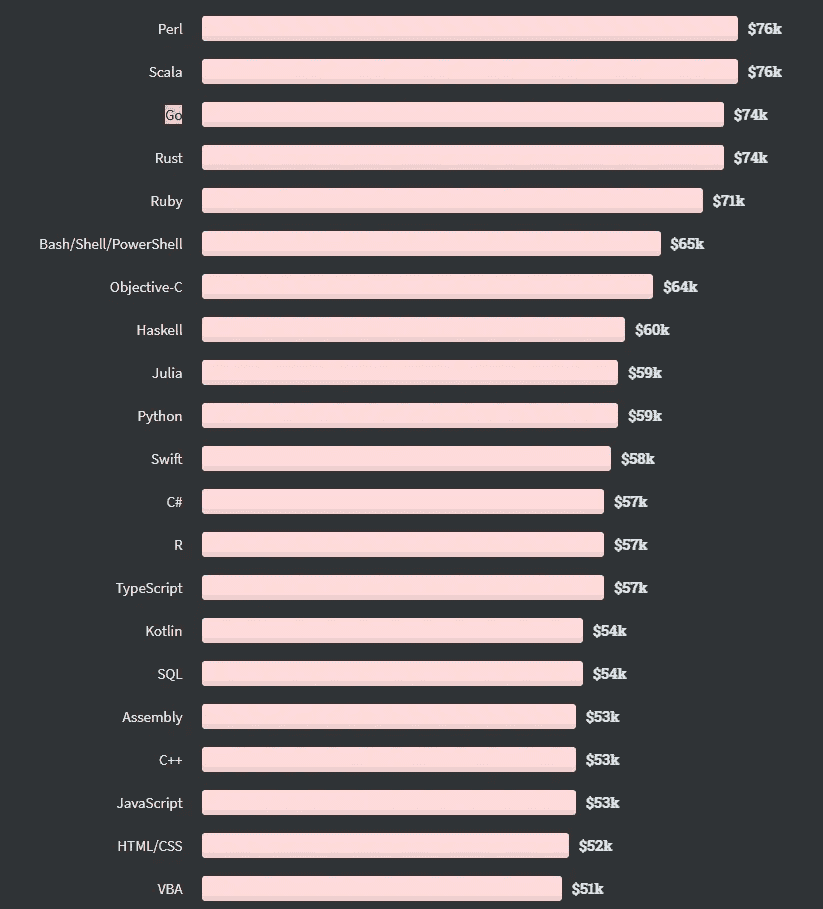
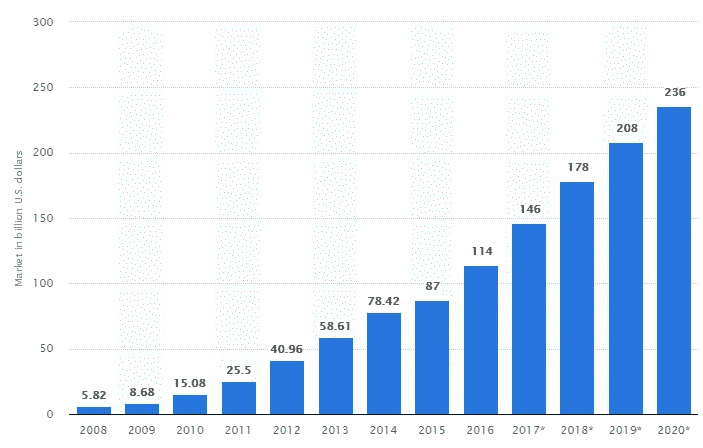

# 你应该在 2022 年到 2030 年间学习的 3 种未来编程语言

> 原文：<https://betterprogramming.pub/3-future-programming-languages-you-should-learn-between-2022-and-2030-8a618a15eca6>

## 未来几年可能主宰世界的编程语言

编程书籍。资料来源:[来自 Unsplash 的 NeONBRAND】](https://unsplash.com/photos/uEcSKKDB1pg)

在技术市场摸爬滚打了十多年后，我看到了以下三种编程语言(或框架)的巨大潜力。

# 1.Unity (C#)

> “世界上一半以上的游戏都是建立在团结的基础上的。”— [约翰·里奇泰洛(Unity 首席执行官)](https://techcrunch.com/2018/09/05/unity-ceo-says-half-of-all-games-are-built-on-unity/)

是的，不仅仅是我们经常看到的游戏，Unity 还是世界上创建*互动、3D 和实时内容*的领先平台，例如:

*   游戏(安卓、iOS、PC、任天堂、PlayStation)
*   互动体验(增强现实和虚拟现实)
*   汽车和运输(车辆零件和设计超现实)
*   制造(机器人模拟)
*   电影、动画和电影艺术(实时电影渲染)
*   建筑、工程和施工。(建筑物、建筑设计和虚拟建筑环境的 3D 体验)

所以，如果你现在开始学习 Unity (C#)，你就有机会加入上面*任何一个爆发式增长的行业*。

它可以在 30 个平台上运行，比如安卓、iOS、Windows、任天堂 Switch 和 PlayStation。

2012–2021 年全球游戏市场收入。来源: [Newzoo](https://newzoo.com/)

> 在过去的 10 年中，仅全球游戏市场就以 11%的复合年增长率(CAGR)增长。

72 法则的公式。来源: [Investopedia](https://www.investopedia.com/terms/r/ruleof72.asp)

基于 72 法则，以同样的增长率，目前的游戏市值将在未来 6.55 年*翻倍。*如果只单纯基于游戏行业，对 *Unity 框架相关程序员的需求会急剧增加。*

学习 Unity 可以为下一次技术演变做好准备——3D、AR 和 VR 中的一切。这种语言和框架很容易用来开发你的第一个游戏或 3D 游戏化应用程序。在 YouTube、Udemy 和许多其他平台上有很多教程。

当然，Unity 还有一个更高端的替代品:Epic Games 的虚幻引擎。请注意，虚幻引擎比 Unity 的学习曲线更陡，学习资源更少。

# 2.颤动(飞镖)

谁不想只用一个代码库将自己的应用发布到尽可能多的平台上呢？Flutter 2.0 允许开发者在 Android、iOS、桌面和 Web 上发布他们的应用。

> 它可以在所有设备上运行:手机、电脑和任何有浏览器的设备。

是的，像 Java for Android 或 Swift for iOS 这样的本地语言可能更有效。但是你能想到的所有类型的功能，你都可以在 Flutter 中实现。对于 Dart 不支持的需求，您可以插入 Java 或 Swift 代码。

Flutter 是 React Native 的竞争对手。就速度、复杂性和社区而言，它们几乎处于同一水平。

但如果我们根据受欢迎程度来比较它们，截至 2021 年 7 月 1 日，Flutter 在 Github 中有 124，000 颗星，而 React Native 有 96，400 颗星。我们可以有把握地说，Flutter 已经取代 React Native 成为当今开发者最喜欢的移动应用跨平台框架。

# 3.戈朗

围棋是谷歌设计的[。你应该学习 Golang，因为:](https://stackoverflow.blog/2020/11/02/go-golang-learn-fast-programming-languages/)

*   它是市场上最快的语言之一，因为它被编译成机器代码。
*   由谷歌支持。
*   很好学，有很大的社区。
*   非常适合 DevOps、后端开发和全栈开发人员。
*   简单明了的语法。
*   全球排名第三的中位薪酬。

2020 年堆栈溢出开发者调查。来源:[堆栈溢出](https://insights.stackoverflow.com/survey/2020#technology-what-languages-are-associated-with-the-highest-salaries-worldwide)

Golang 旨在支持高并发性、可伸缩性、多线程和卓越的性能。它与云、DevOps 和容器 100%兼容。开发人员经常将 Go 用于与 DevOps 相关的项目，如 Kubernetes 和 Docker。许多大公司如谷歌、Dropbox、优步和 Twitter 都使用 Golang，因为它简单快捷。

2008 年至 2020 年公共云计算市场的总规模(以十亿美元计)。来源: [Statista](https://www.statista.com/statistics/510350/worldwide-public-cloud-computing/)

随着公共云计算市场的快速扩张，对 **DevOps 相关人才的需求将逐年增加**。由于 Golang 与后端开发和 DevOps 兼容，您可以利用云、移动应用、游戏和系统市场规模的快速扩张。

# 包扎

不管怎样，我相信你们大多数人已经在使用 PHP、Nodejs、Java 或 Ruby 等编程语言了。辅修另一门编程语言/框架可以促进你的职业生涯。

了解为什么掌握多种编程语言是程序员职业生涯中的一个好举措:

 [## 作为一名程序员，如何让你的工资翻三倍 X3

### 你可以采取 10 个行动来提升自己，成为行业想要的 5%高薪程序员，并让你的收入翻三倍…

eddygte.medium.com](https://eddygte.medium.com/how-to-triple-x3-your-pay-as-a-programmer-302ee1cbce52) 

上面提到的三种语言有着巨大的潜力，你可能会受益于科技各个领域的快速发展。如果你对我们应该学习哪种编程语言有任何建议或意见，请在下面的评论中告诉我。