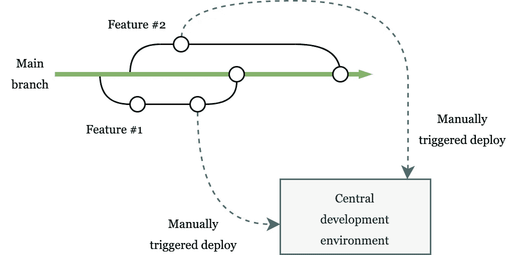
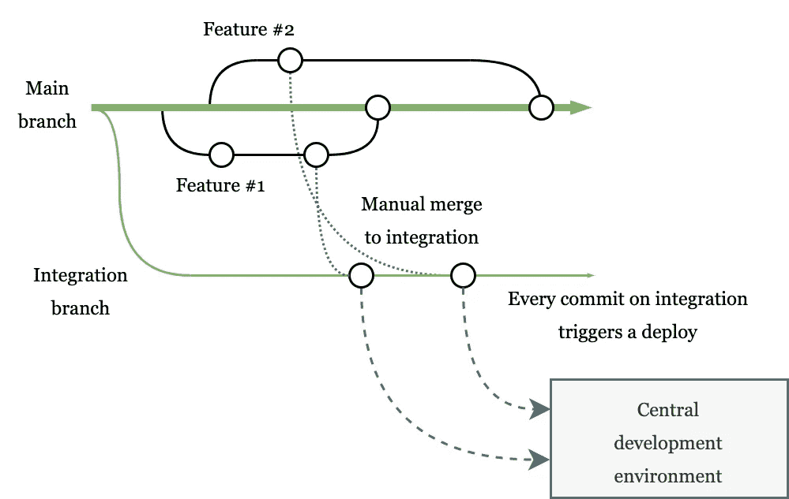
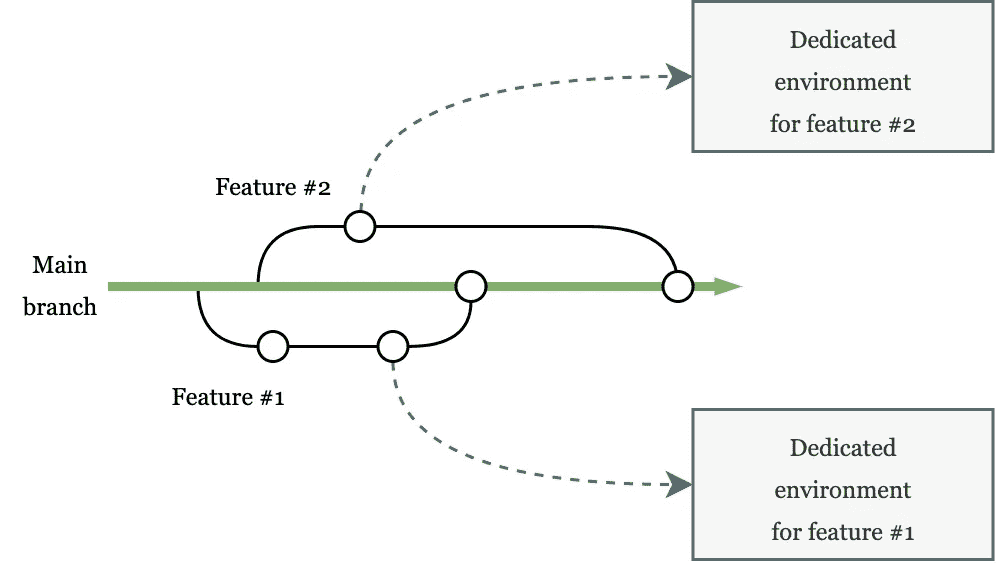

# 3 Git 工作流展示未完成的工作

> 原文：<https://betterprogramming.pub/3-git-workflows-to-showcase-unfinished-work-a651e5116819>

## 利用分支优势成功进行演示

米克·豪普特在 [Unsplash](https://unsplash.com) 上拍摄的照片。

当开发软件时，你最终需要向世界展示你的工作。但是在这之前，通常会有一个评审过程，在这个过程中，有人(例如，测试人员、产品所有者或利益相关者)想要评审您构建的东西。根据他们的反馈，你可以改进你的工作，直到达到一个让每个人都满意并接受改变的程度。

但是，如何才能让人们看到你的工作并提供反馈呢？让我们看看三种不同的方法来帮助你展示未完成的工作。

# 独奏工作流程

独自开发软件产品会让事情变得简单。您对您的工作有一个很好的概述，您可以一个接一个地挑选用户故事，当您的工作被评审时，您可以将变更发布到一个中心开发环境中。理想情况下，您可以利用 CI/CD 设置来帮助您构建、测试和发布新版本，而无需人工干预。

Git 工作流实现了一个连续的部署和审查过程。作者照片。

部署新版本后，您可以验证功能并寻求反馈。与此同时，在评审未决时，您可以从新的特性分支开始处理另一个用户故事。

当评审完成并且有反馈需要解决时，您就可以实现所请求的变更，从您的特性分支发起一个新的发布，并将一个新的版本部署到开发环境中。在您和审阅者最终确认一切正常后，您可以通过将功能分支合并到主分支来完成更改。

但是，当对您实现的第一个特性的反馈还没有到来，而您挑选的下一个用户故事已经准备好进行测试并展示给产品所有者和利益相关者时，会发生什么呢？当然，您可以从您的新特性分支进行部署，但是这将覆盖当前从另一个分支部署到中央开发环境中的变更。

一个解决方案是为每个单独的变更创建单独的环境。这就是多环境审核工作流的内容，我稍后将对其进行描述。但是还有一个更简单的解决方案，叫做集成分支工作流。

# 集成分支工作流

当一个团队有多个开发人员时，通常会同时处理多个用户故事。此外，由于外部延迟，单个用户情景的审查过程可能需要更多时间。因此，需要同时将多个待定的变更部署到开发环境中，以便可以同时执行评审。

集成分支的概念可以对此有所帮助。这个想法是，您所有准备好被评审的未决工作被合并到一个集成分支中。然后，根据在 CI/CD 管道中配置的触发器，这个分支被自动部署到中央开发环境中。

Git 工作流支持变更的同时评审。作者照片。

这个集成分支永远不会合并到另一个分支中。只有来自特性分支或主分支的内容应该被合并到集成分支中。有时会有内容被合并到集成分支中，这些内容将不会被接受、过时或者不再相关。因此，一个好的方法是定期删除集成分支(例如，在每个 sprint 的开始)，并基于主分支创建一个新的集成分支。任何仍然悬而未决的工作都可以手动合并到集成分支中，这样团队就可以从头开始冲刺了。

# 多环境审查工作流程

当需要独立地测试单个用户故事时，独立于任何其他未完成的工作，您可以使用多环境评审工作流。这个工作流程与 Solo 工作流程非常相似。主要区别在于，它使用自动化来创建临时环境，并将各个分支的变更部署到这些环境中。然后可以单独审查变更。在一个变更被接受并合并到主分支之后，这个特定变更的临时环境可能会被破坏。

Git 工作流使用专门的评审环境。作者照片。

当你有一个相对简单的设置时，比如一个静态网站，有现成的解决方案可以简化这个工作流程。例如， [Netlify](https://www.netlify.com) 有一个特性，使用唯一生成的 URL 自动构建分支并部署到临时预览域。为了确保搜索引擎爬虫不会索引这个预览站点，Netlify 为每个响应添加了一个自定义标题:`x-robots-tag: noindex`。

当您有一个更复杂的设置时，Netlify 提供的方法是不够的。您可能需要部署多个应用程序，初始化相关服务，并为您的数据存储提供测试数据。Docker、CI/CD 等工具以及 AWS 和 Azure 等云托管平台的 API 可以帮助您为应用程序构建按需环境。因为这种方法会很快变得非常复杂，所以它并不适合每个团队和组织。

在走这条路之前，您应该清楚地定义您的体系结构中的瓶颈和挑战，并决定优势是否超过实施和维护这样一个多环境解决方案的投资。

# 结论

根据我的经验，集成分支工作流对大多数团队来说是一个安全的赌注，因为它结合了同时评审的优点，而没有部署和维护多个环境的复杂性。

无论您实施什么工作流，您都应该努力实现与您的流程和组织相一致的审阅工作流。这将提高您团队的效率，并有助于交付高质量的软件。