# 3 个有用的 GitHub 回顾技巧

> 原文：<https://betterprogramming.pub/3-helpful-github-review-tips-fb6f1283839d>

## 改进审核过程的技巧


凯文·Ku 在 [Unsplash](https://unsplash.com?utm_source=medium&utm_medium=referral) 上的照片

Git 和 GitHub 是非常强大的工具，它们让我们开发人员的生活变得更加轻松。然而，因为 GitHub 有如此多的特性，所以使用起来会让人不知所措，你很可能还不知道这个工具的所有细节。

我还不知道它所有的功能，每天都在用！

在 GitHub 上查看 pull 请求时，我有一些小发现，它们真的帮了我很大的忙，我想在这里与你分享。

# 1.分割差异视图

当您在 GitHub 上查看一个 pull 请求时，默认设置是在一个统一文件中显示代码差异。现有的和新的代码被挤在一起，现有的在上面，提议的更改在下面，如下面的截图所示。

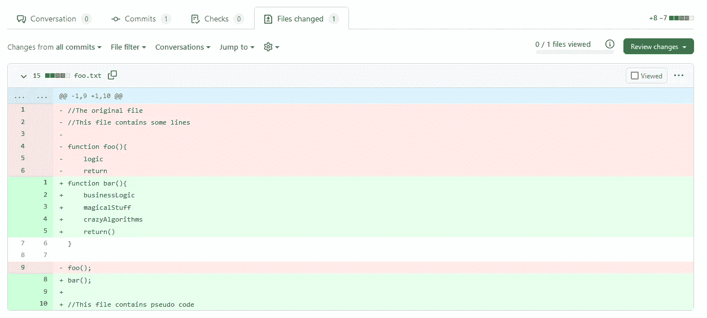

GitHub 拉式请求审查中的统一差异视图

然而，许多 ide 经常并排显示不同之处。对于一些开发者来说，这样的观点更容易理解。就我个人而言，当我处理合并冲突时，我非常喜欢拆分视图。幸运的是，GitHub 还可以在一个分割视图中描绘出差异，如下图所示。

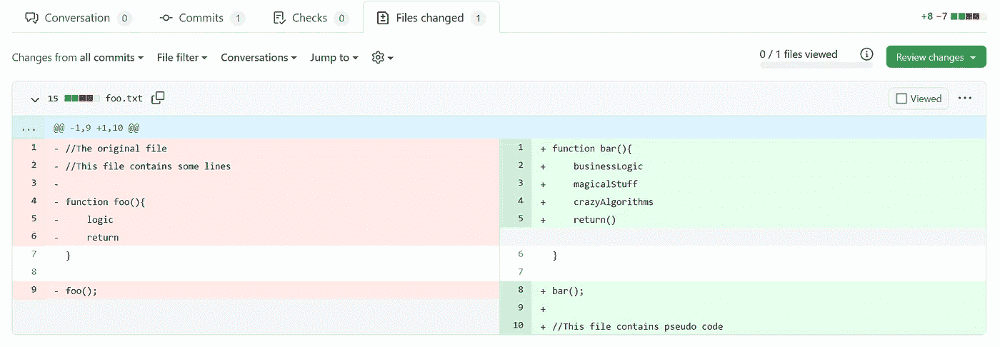

GitHub 拉式请求审查中的拆分差异视图

为了在两种不同的视图之间进行选择，您只需单击小齿轮图标，如下所示:

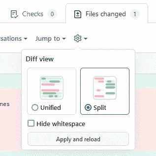

查看模式设置

# 2.仅显示最新的更改(自上次审阅以来的更改)

一旦拉请求的作者对他们的代码进行了调整，在有人第一次评审之后，请求第二次评审是很自然的。

GitHub 友好地指出哪些文件在你最后一次使用黄色的*过时的*标签查看后被修改了。这会让你知道再看一眼它们。

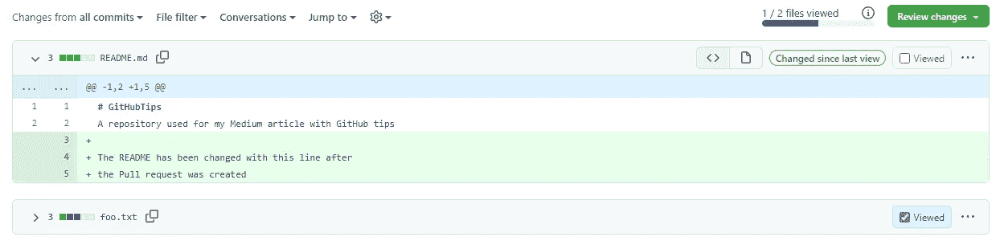

然而，默认情况下，GitHub 并不仅仅显示最新的变化(自您上次查看以来引入的变化)。这可能很难弄清楚这次到底发生了什么变化。

如果您只想查看最新的更改，您可以通过下拉菜单中的*更改来选择此选项。*

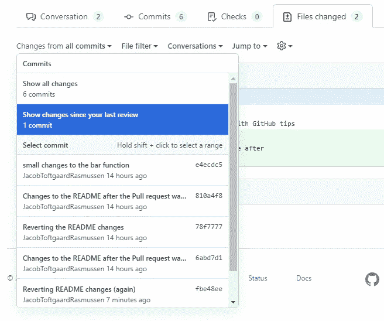

当有许多差异时，这可能是有帮助的，正如您在上面的截图中看到的，如果您想要查看来自特定提交的更改，您也可以这样做。

此外，如果一个新的提交被推送到一个分支，该分支当前正在被检查，GitHub 将检测到这一点，并在*文件已更改*选项卡的正下方显示一个小的*刷新*按钮。单击此按钮将使用最新提交的更改更新视图。

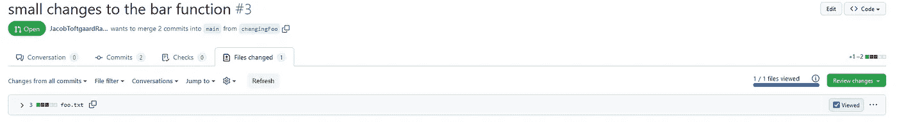

提交现有拉取请求时的刷新按钮

# 3.建议更改

很多人不知道的一个很好的特性是，当评论一个拉请求时，可以选择修改代码。

如果您在 GitHub 上查看 Pull 请求时将鼠标悬停在某行上，该行的开头会出现一个带有白色加号的蓝色小方块。单击此处，您可以对该行进行注释。也可以按住鼠标键向下拖动选择多行。在下面的截图中，我已经向下拖动选择了第 2 行和第 3 行。

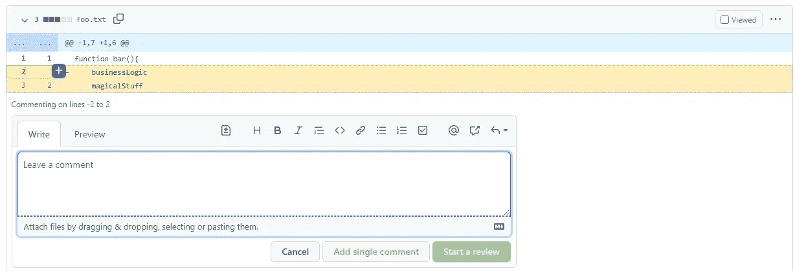

这将出现注释窗口，您可以在其中添加注释。

但是您也可以给出一个代码建议，然后作者只需单击一下就可以实现它(您将在后面看到)。

要插入建议，请单击小文件图标，如下所示:

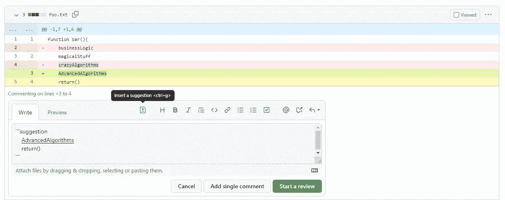

这将自动为建议插入必要的模板代码。

您可以在`suggestion`标记和最后三个`````标记之间编写您想要的代码。然后你可以点击*开始评论*按钮或者*添加单条评论按钮。*

完成评审后，选择*请求修改*，如下图所示:

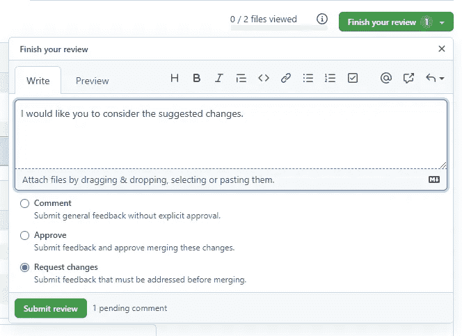

这样，作者将被告知存在请求的更改。

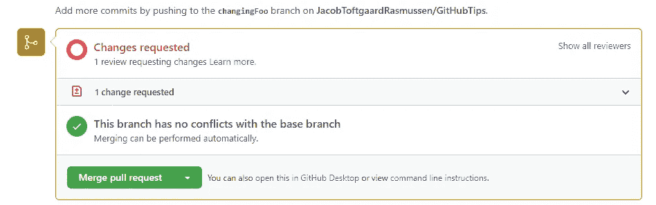

当作者查看评论(以及您提议的更改)时，他们将能够点击*提交建议*按钮，然后代码将被更改。无需进行新的提交和推送。

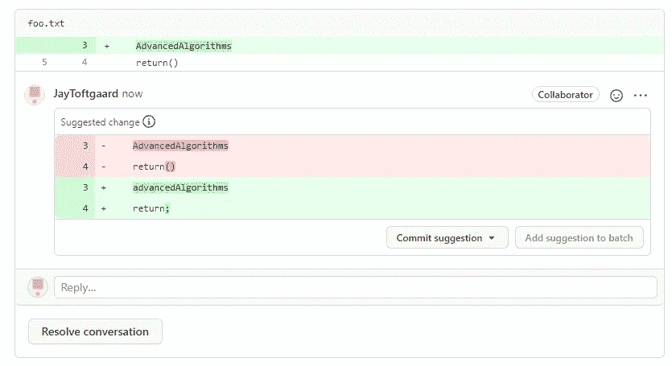

如果有一些你们都同意的事情，并且是一件需要改变的小事，这可以节省时间。

我希望这三个建议对你有用。我知道我有，我每天都在用。

如果您有任何问题或意见，请随时联系我。我很想听听你的意见！

一如既往，

*坚持学习。
—雅各布·托夫特加德·拉斯姆森*