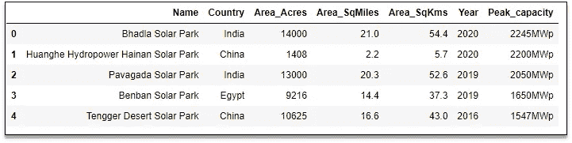
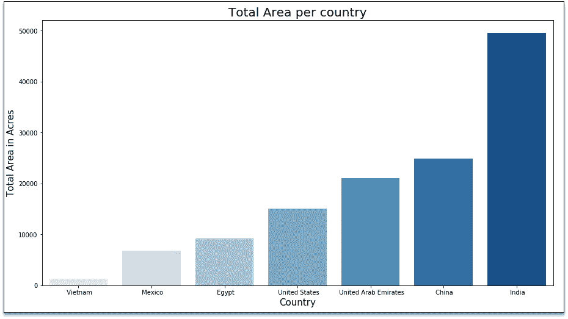
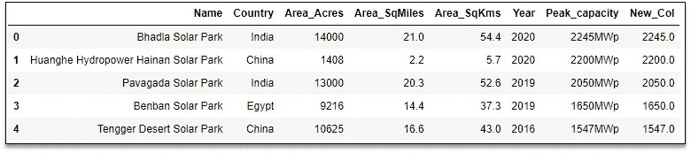
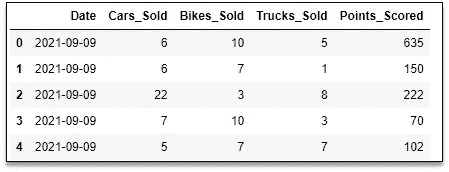
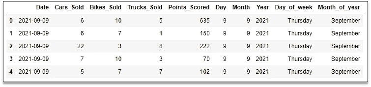

# 3 面向数据分析师的如何使用 Python 代码片段

> 原文：<https://betterprogramming.pub/3-how-to-python-code-snippets-for-data-analysts-6a9b850c254d>

## 了解如何使用 Python 简化和加速数据分析项目


由[凯利·西克玛](https://unsplash.com/@kellysikkema?utm_source=unsplash&utm_medium=referral&utm_content=creditCopyText)在 [Unsplash](https://unsplash.com/s/photos/idea?utm_source=unsplash&utm_medium=referral&utm_content=creditCopyText) 上拍摄的照片|由作者编辑

现成的代码片段在数据科学项目中非常方便。在接下来的三分钟里，您将学习使用 Python 的三个代码片段。

您可以简单地将这些代码块复制并粘贴到您的项目中，以保持简单并提高分析速度。这样，您可以利用宝贵的时间来解释分析结果。我们开始吧！

# 如何使用 Seaborn 可视化数据

使用这个代码片段可以毫不费力地将数据可视化。只需复制并粘贴到您的项目中，并享受富有洞察力的可视化。

有了榜样一切都好。因此，我将使用来自 [20 家最大太阳能发电厂](https://data.world/makeovermonday/2021w37)的数据。为了处理这些例子，我修改了数据。从我的 [GitHub repo](https://github.com/17rsuraj/data-curious/blob/master/TowardsDataScience/20-Solar-PowerPlats.xlsx) 下载数据。

让我们从将数据导入熊猫数据帧`df`开始。

```
# Import the required libraries
import pandas as pd
import matplotlib.pyplot as plt
import seaborn as sns
%matplotlib inline# Read the data in Pandas DataFrame
df = pd.read_excel("20-Solar-PowerPlats.xlsx")
df.head()
```

数据看起来像这样:



前五行熊猫数据框|作者图片

下面是您正在寻找的代码片段:

输出是:



Seaborn 的条形图|图片由作者提供

只需将该代码片段复制并粘贴到您的代码中，然后添加您想要绘制的数据。你永远不需要考虑调色板、字体、字体大小和图形大小。

此外，这个代码片段很容易*扩展*。实现最基本的语法可以让你灵活地随时改变字体大小、支线剧情的数量、图形大小和可视化类型。

寻找标准的 Python 文档？给你:

1.  [设置 Matplotlib 图](https://matplotlib.org/stable/api/_as_gen/matplotlib.pyplot.subplots.html?highlight=matplotlib%20pyplot%20subplots#matplotlib.pyplot.subplots)
2.  [Seaborn 中的所有数据可视化](https://seaborn.pydata.org/examples/index.html)

# 如何将带有数值的字符串转换成数字

这个 Python 代码片段将带有数值的字符串转换为数字。根据您的项目需求，它可以转换为 float 或 int。

当您注意到上例中 DataFrame 的最后一列`Peak_capacity`时，它包含数字值，后跟字母字符`MWp`。这使得整个值成为一个字符串或对象。

使用这个代码片段，去掉额外的字符并提取数值以增强您的分析。

```
for row in range(len(df)):
    if 'MWp' in df.loc[row, 'Peak_capacity']:
        df.loc[row,"New_Col"] = float(df.loc[row, 'Peak_capacity']
                                      .split('MWp')[0])
    else:
        df.loc[row,"New_Col"] = float(df.loc[row, 'Peak_capacity'])
```

我在现有的`DataFrame`中增加了`New_Col`作为另一个栏目。在下图中，你可以看到该列中的值是从列`Peak_capacity`中提取的。



[将带有数值的字符串转换为数字](https://towardsdatascience.com/five-must-know-string-methods-in-python-e97925d12eec) |图片作者

我只是在 Python 中使用了字符串操作方法来消除字符串中不需要的字符。根据字符串中不需要的字符，可以使用不同的方法提取数值。

# 如何从 Pandas DataFrame 的 Datetime 列中提取日、月、年

处理时间戳数据是另一项有趣但有时复杂的任务。

使用这个代码片段，您可以提高您的分析。当你读取熊猫数据框中的数据时，你所需要做的就是复制并粘贴这段代码。

我目前正在做一个销售活动项目，这里的[是数据。](https://github.com/17rsuraj/data-curious/blob/master/TowardsDataScience/Sales_Data.xlsx)

```
import pandas as pddf =pd.read_excel("Sales_Data.xlsx")
df.head()
```

每行代表每个销售经理在每个日期售出的汽车数量和得分。



销售活动数据|按作者分类的图片

使用下面的代码片段从列 Date 中提取日、月、年、日名称和月名称。

```
df["Day"] = df["Date"].dt.day
df["Month"] = df["Date"].dt.month
df["Year"] = df["Date"].dt.year
df["Day_of_week"] = df["Date"].dt.day_name()
df["Month_of_year"] = df["Date"].dt.month_name()
df.head()
```

简单！我使用访问器`dt`来访问列`Date`中值的日期时间属性。



从熊猫数据框列中提取日、月、年|作者图片

熊猫数据帧中包含日期时间数据的列必须是数据类型`datetime64[ns]`。这是使用访问器`dt`的唯一标准。

您有字符串形式的日期时间值吗？？别担心。[这里有一个快速修复](https://towardsdatascience.com/change-column-data-type-in-pandas-954d7acdef1d)来改变 Pandas 中的列数据类型。

还可以探索 [***省时的 Python 窍门。***](https://towardsdatascience.com/3-time-saving-python-tricks-a017f4215aeb)

感谢您的阅读和宝贵时间！