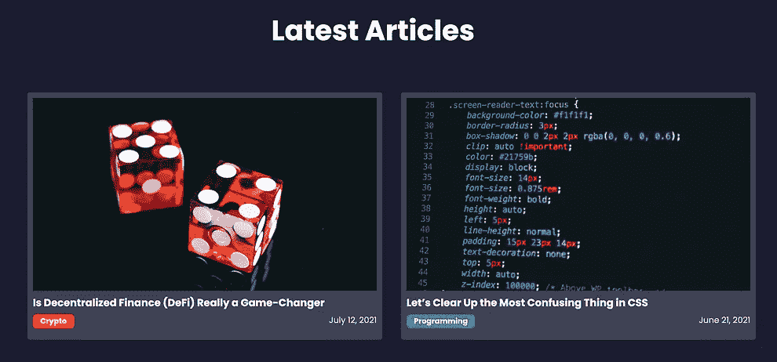
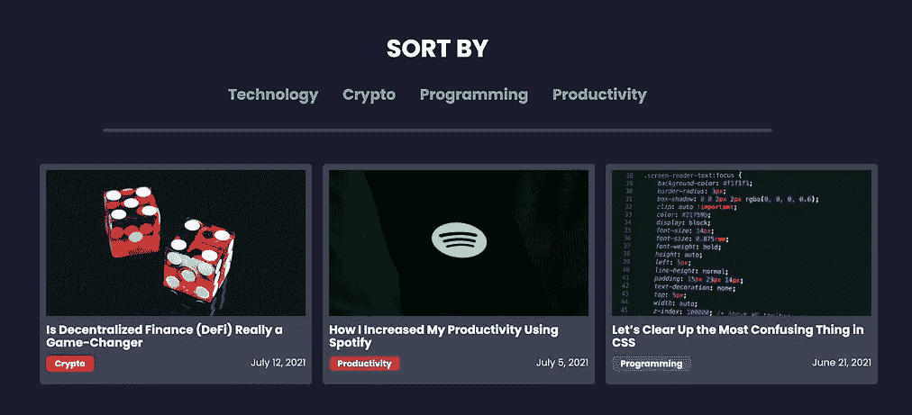
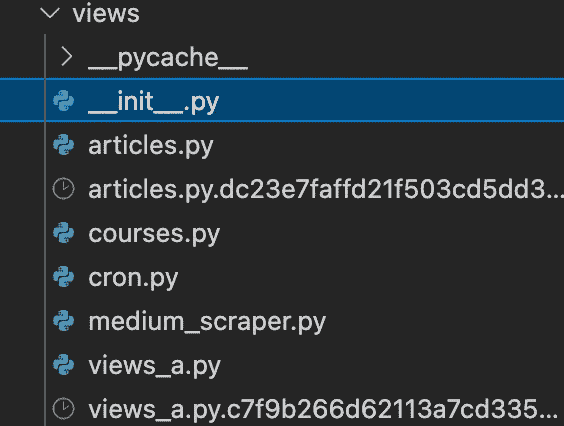

# Django 开发人员犯的 3 个大错误

> 原文：<https://betterprogramming.pub/3-huge-mistakes-django-developers-make-9fe588540088>

## 以下是如何更好地优化 Django 代码的方法


鸣谢:作者

Django 是一个非常有趣的框架，因为它允许你用 python 作为后端来创建 web 应用程序。不仅如此，它还可以处理大部分数据库的东西，这样我们就不用担心表了，至少对小应用程序来说是这样，我们可以专注于晚餐。

尽管 Django 是一个非常有用的框架，但它有一个陡峭的学习曲线，可能会吓到初学者，让他们无法自拔——我希望你能理解我的笑话。

在这篇文章中，我将向您介绍一些最好的 Django 特性和实践，让您的生活变得更加轻松。

# 1.重复模板代码

Django 为您提供了许多不同的方法来重用您的代码，并使您的代码更加高效和可读。其中一个特性是 Django 的**模板标签和过滤器。**

它允许你在 HTML 文件中编写逻辑并显示相关数据。有许多[内置的标签和过滤器](https://docs.djangoproject.com/en/3.2/ref/templates/builtins/)但是你也可以创建你自己的。

一个这样的标签是`include`，它允许我们重用我们的 HTML。以下是我如何在我的网站上使用它:



左:我主页上的最新文章。右:我的文章页面上的所有文章

我想在“主页”和“文章”页面上展示我的最新文章。

由于文章卡片的设计保持不变，解决这个问题的最好方法是创建一个通用的 HTML，并使用 include 在两个页面上重用它。下面是它在代码中的样子:

index.html—显示文章的代码片段。我从 views.py 文件中获取文章数据

正如你在上面的代码中看到的，我正在遍历由`views.py`文件传递的所有文章，对于每一篇文章，它都在创建``来添加想要的 HTML。(在下一个示例中，我们将看到 views.py 文件如何传递这些数据)使用 include 的语法如下所示:

```
 
```

`with`关键字是可选的，当你需要向你的 HTML 传递参数时使用它。要传递字符串参数，把它放在`“”`里面，或者你也可以传递变量。

article.html—所有文章卡片的通用 HTML 文件

以上代码是我的文章卡。在第一行，我使用``来访问静态文件，即任何 CSS、JS 或图像文件。要使用从`include`标签传递的参数，您必须将参数名放在`{{}}`中，比如— `{{ argument_name }}`

这就是如何重用你的 HTML。现在让我们看看基于类的视图，这些视图经常被忽略或者不为新的 Django 开发者所知。

# 2.使用基于功能的视图

首先，我想澄清一个误解，即基于类的观点(CBV)比基于功能的观点(FBV)更好:它们不是。

这取决于用例，两者各有优势。我在本文中添加了 CBV，因为它们允许您删除代码中的冗余，而 FBV 经常会出现这种情况。所以，了解 CBVs 是有好处的。

如果你曾经创建过任何 Django 项目，你一定知道 FBV。它们易于创建和阅读，但在可重用性方面就不那么好了。

Django 为您提供了通用视图，您可以将其继承到自己的视图类中，并覆盖其内容。所以大部分东西都已经为你创建好了，你只需要定制它们来满足你的需求。以下是我在博客中使用它的方式。

views.py 文件的片段

`ListView`是最常见的泛型类之一，用于列出数据库中的所有项目。要使用它，只需在您的`views.py`文件中创建一个类，并从 `django.views.generic import ListView`继承该类。

在最简单的情况下，您只需要创建一个`model`变量，其他的事情都会处理好。默认的模板名称是`“model_name”_list.html`，但是当然你可以像我上面做的那样改变它。

要进一步定制它，您可以覆盖这些函数。在我的例子中，我想按日期或标签对文章进行排序，然后将它们分成三个块，用于模板文件中的三个列。下面是如何在你的模板文件中使用`article_data`。

articles.html 片段

在前面的例子中，我们看到了如何使用 include 重用模板。该模板从 out `article_data`变量的`left` `right`和`middle`中获取数据。但是，不是这样。为了使用 CBV，我们需要在我们的`urls.py`文件中做一件事。

为了简化这个例子，我编辑了我的 urls.py 文件

我们首先需要导入我们的类，然后用`.as_view()`函数在`urlpatterns`中使用它。这是因为 Django 的 URL 解析器希望将请求和参数发送给函数，而不是类。你只需要使用`.as_view()`函数，Django 会处理剩下的事情。

# 3.大型 views.py 文件

`views.py`文件包含了我们的大部分逻辑，因此它可以增长到数百行代码。这使得调试更加困难，代码更难阅读。以下是如何在不破坏代码的情况下破坏文件。



视图文件夹的屏幕截图

创建一个名为 views 的文件夹，并在其中创建一个名为`__init__.py`的文件。现在，您可以分解 views.py 文件，并将它的每个类或函数放入不同的文件中。

在我的例子中，我为所有的 cbv 使用了`views_a.py`文件，并且为每个操作创建了更多的文件。

如果您已经将原始 views.py 文件中的函数和类拆分成多个文件，那么将这些文件中的所有内容导入到您的`__init__.py`文件中，如下所示:

__init__。巴拉圭

在上面的例子中，我实际上不需要导入除了`views_a`以外的任何东西。这是因为我将在`urls.py`文件中使用的所有视图对象都在`views_a`中。

但是，如果您将它们分成多个文件，您需要像上面显示的那样导入每个文件:

urls.py

最后，输入`from .views import *`来导入所有的视图对象。

# 结论

这一次到此为止！我希望它能让你的 Django 代码至少提高 2 倍。

*如有疑问或建议，可通过我的* [*社交*](https://y.at/%F0%9F%92%BB%F0%9F%8E%A5%E2%9C%8D%E2%98%95) *联系我。*