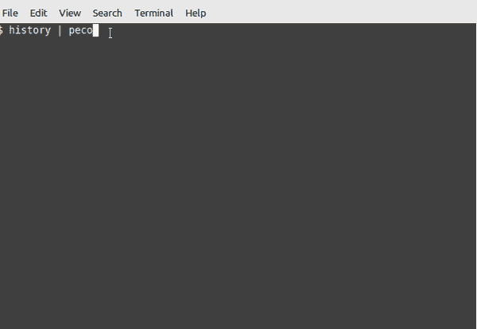
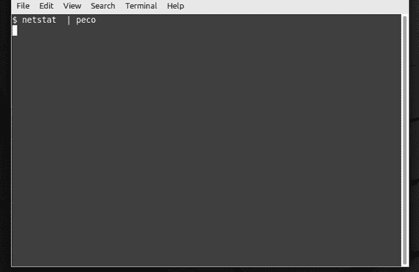
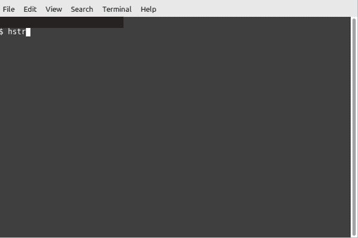
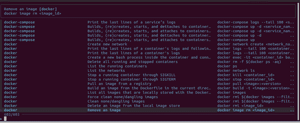
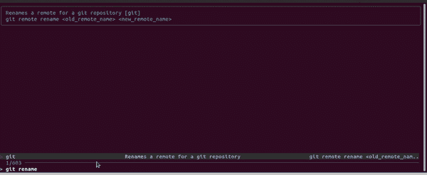

# 3 个用于 Linux 的交互式命令工具

> 原文：<https://betterprogramming.pub/3-interactive-command-tools-for-linux-394ab0784247>

## 用最简单的方法处理 Linux 命令


Karl Pawlowicz 在 [Unsplash](https://unsplash.com?utm_source=medium&utm_medium=referral) 上拍摄的照片

记住 Linux 命令很有挑战性。我们熟知那些我们用来完成日常任务的东西。我们往往会忘记过去执行的长命令和脚本。

最好能知道我们在找什么。这样，我们可以专注于完成我们的任务，而不是试图记住命令。

我收集了三个方便的工具来帮助您使用 Linux 命令。您将很容易完成这样的任务:从历史中找到一个命令，直接从备忘单中执行一行程序，等等。

我们开始吧！

# 1.徐伟贤

徐伟贤是一个简单易用的交互式过滤工具。和`grep`差不多，但是功能更强大，因为你可以一边搜索一边打字。

徐伟贤在许多用例中都很方便。假设您想要搜索文件、日志、进程等。你不必记住复杂的命令组合。结合初级命令(如`ls`、`history`、`find`等)就足够了。)同`peco`。然后在输入时开始过滤结果。

## 装置

要在 Ubuntu 上安装该工具，请运行以下命令:

```
sudo apt-get install peco
```

*查看* [*文档*](https://github.com/peco/peco#installation) *了解更多安装选项。*

## 演示

让我们过滤历史记录，找出我们过去执行了哪些`curl`命令。看起来是这样的:



将 peco 与历史结合使用

您可能已经注意到，它支持`AND`风格的查询。我在`curl`命令后输入“medi”，它过滤了科尔[https://medium.com](https://medium.com)。这样，您可以更快地获得更准确的结果。

要退出查询提示，按`Ctrl + C`。

让我们看另一个例子，我们将`peco`与`nestat`结合起来过滤端口:



带 peco 的 netstat

如果您不确定您正在寻找哪个过程，这可能是有用的。您可以交互地查询流程。

徐伟贤支持以下过滤器类型:`IgnoreCase`、`CaseSensitive`、`SmartCase`、`Regexp`和`Fuzzy`。默认的是不区分大小写(`IgnoreCase`)。要更改它，运行带有— initial-filter 选项的`peco`。

# 2.HSTR

HSTR 让搜索你的指挥历史变得轻而易举。这是历史中的`bash` / `zsh`命令补全的改进版本。

它不仅可以帮助您找到以前使用过的命令，还可以让您将命令标记为收藏夹。这样，你就不用担心输入长命令或记忆它们了。

## 装置

要在 Ubuntu 上安装 HSTR，请键入以下命令:

```
sudo apt-get install hstr
```

*查看* [*安装指南*](https://github.com/dvorka/hstr/blob/master/INSTALLATION.md) *了解其他发行版。*

## 演示

在终端中键入`hstr`或`hh`开始搜索。

筛选器可以区分大小写，也可以不区分大小写。要在选项之间切换，按下`Ctrl + T`。

例如，像这样搜索`pip3`历史:



使用 hstr 搜索命令

要退出`hstr`，按下`Ctrl + C`。

一个强大的功能是能够将命令标记为收藏夹。标记所需的命令并按下`Ctrl + F`。下次，您可以使用`-f`选项查看保存的命令。

`Ctrl + R`组合键将命令从收藏夹中移除。

有时候，我们不想在历史中看到具体的命令。我们可以将它们添加到黑名单中，这样`hstr`就不会显示它们。首先，我们需要启用以下选项:

```
export HSTR_CONFIG=blacklist
```

然后，我们可以添加一个以尾随空行开始的命令列表:

```
nano ~/.hstr_blacklist
cd
pwd
ls
```

显示列入黑名单的命令:

```
$ hstr --show-blacklist
```

Hstr 是高度可配置的。查看这些[示例](https://github.com/dvorka/hstr/blob/master/CONFIGURATION.md#examples)获得更多创意。

# 3.娜比

Navi 是一个交互式工具，可以让你从备忘单中执行一行命令。您可以编写备忘单，或者使用 Git 存储库中现有的备忘单。注意，文件应该是`.cheat`格式。例如，检查[这个回购](https://github.com/denisidoro/cheats/tree/master/network)。

当你不想记住复杂的命令时，Navi 很有用。它教了很多方便的一句话。这样，你可以用更少的输入来完成你的任务。

## 装置

在本例中，我将使用`curl`安装 Navi:

```
bash <(curl -sL https://raw.githubusercontent.com/denisidoro/navi/master/scripts/install)
```

*注意，Navi 需要*[*fzf*](https://github.com/junegunn/fzf.git)*工具。如果您还没有它，请按照以下步骤从 Git 安装:*

```
git clone --depth 1 https://github.com/junegunn/fzf.git ~/.fzf
~/.fzf/install
```

## 演示

Navi 默认没有任何作弊器。所以，我们再补充一些:

```
navi repo add https://github.com/denisidoro/cheats
```

在你的终端键入`navi`，开始搜索命令:



使用 navi 搜索命令

从示例中可以看出，它知道数百个现成的命令。

如果你想删除一个 docker 图片，它会显示所有当前的图片，所以你甚至不用搜索。只要选择一幅图像，按下`Enter`，它就会立即执行`docker rm [image]`命令。

Navi 还允许您为要运行的命令配置参数。假设您想要重命名一个 Git 存储库。从交互提示符中找到所需的`git`命令，并填写参数:



使用 navi cheat 命令重命名存储库

如您所见，这个工具既健壮又方便。

本指南向您介绍了一些功能强大的 Linux 工具来轻松管理命令。

现在，您知道了如何查询命令、更有效地过滤历史记录以及直接运行一行程序。

我希望你喜欢这篇文章。你可能也会喜欢我的相关文章:

[](/cheat-sh-the-ultimate-multi-language-cheat-sheet-8e97c16407aa) [## Cheat . sh——终极多语言备忘单

### 介绍 cheat.sh，一个强大的语法和代码片段搜索引擎

better 编程. pub](/cheat-sh-the-ultimate-multi-language-cheat-sheet-8e97c16407aa) 

感谢您的阅读，下次再见！