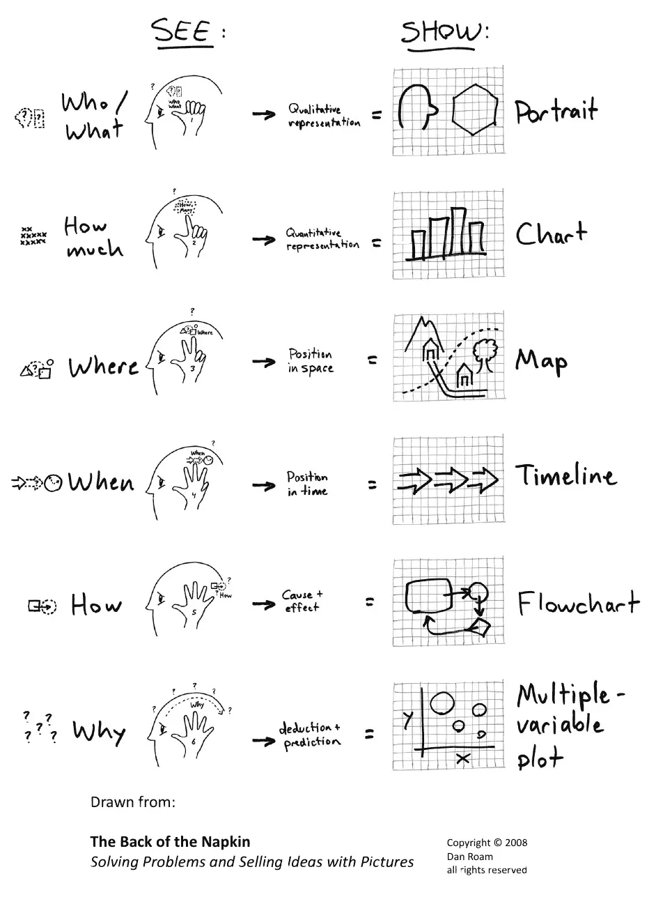
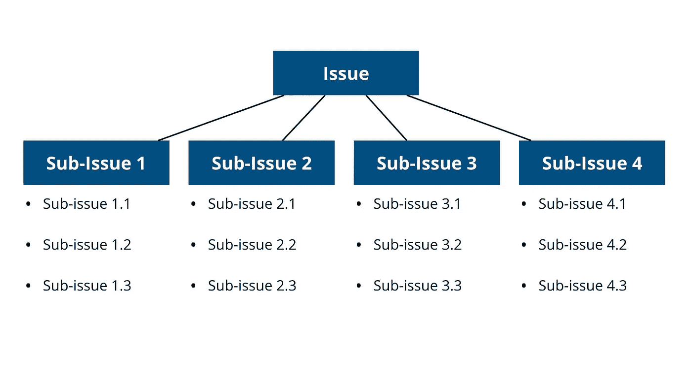
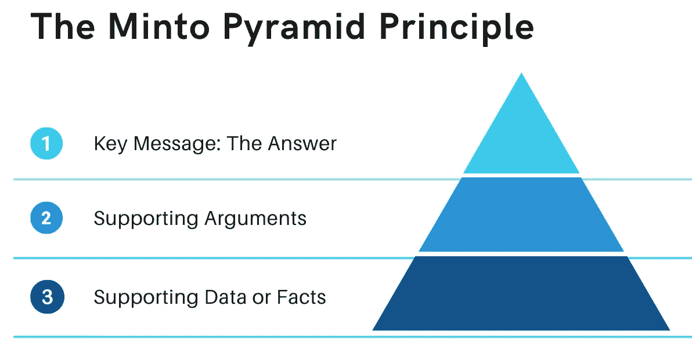

# 帮助我成为技术顾问的 3 个关键概念

> 原文：<https://betterprogramming.pub/3-key-concepts-that-helped-me-thrive-as-a-tech-consultant-1f9a1f821932>

## 在一个艰苦的行业中培养软技能

micha Kubalczyk 在 [Unsplash](https://unsplash.com?utm_source=medium&utm_medium=referral) 上拍摄的照片

在四大咨询公司工作了漫长的一周后，我在六个月前开始担任云工程顾问，我定期与我的教练通电话，他是我目前工作公司的一名经理。令我惊讶的是，他告诉我，我被提名为潜在的最佳演员。

上周我们的团队发生了一些变化，包括一名高级开发人员离开了我们的项目。随着我们的编码冲刺接近尾声，许多责任落在了我身上。我设法交付了，在最后一刻完成了我们的项目，并被要求在 77 人(包括客户)面前演示。我成功了。

尽管演示总是很激烈，我总是感到非常不自在，但我还是得到了同事们的赞扬。再加上我是最佳表现者的亚军，这让我重新思考我适应这种紧张工作环境的程度。我决定把我用来帮助我在激烈的情况下茁壮成长的三个原则整理成文。

# 用图片思考和交流

加入我的咨询公司后，我读的第一本书是《餐巾纸的背面》(Back of the Napkin)，这本书通过简单的图片向读者传授了一个简单的框架，人们可以通过这些图片(如标题所示)在餐巾纸的背面画出问题并制定解决方案。

这种方法的好处是很容易用很少的开销开发一个集体愿景。在大约需要画六张照片的时间内(就像下面显示的一样简单)，这个框架的用户可以充分理解手头的问题以及解决问题所需的步骤。

这本书让我们通过动手实践学习一个用图片交流的框架。在这个练习中，我们用图片回答了六个不同情况下的问题:谁，什么，何时，何地，多少，如何。

通过我在这里学到的原则，我很快诊断出手头的技术问题，将它们传达给我的同事，并设想一个解决方案，我们每个人都有一个模块化的任务要完成。当我独自工作时，这个框架也很有帮助。我强烈建议选择一个商业话题，并尝试为自己引出谁、什么、何时、何地、多少、如何。当一个团队试图设想一个解决方案时，这项技能将会派上用场。

Dan Roam 的照片来自“餐巾纸的背面”《餐巾背面》中的一个例子每个问题都有自己的图片类别——例如，“谁”通常可以用一幅肖像来回答。

# MECE 校长

这一原则由麦肯锡的芭芭拉·明托提出，发音为“我看”，也是我经常用来解决工作中问题的另一个策略。MECE 代表“互斥集体耗尽”，有助于诊断构成更大问题的许多子组件。

MECE 原则是一种方法论，允许人们使用它来列出一些独立的(相互排斥的)问题，并抽象出一个单一的集体耗尽的问题，从而创建一个问题树。

照片来自 HackingTheCaseInterview.com。此处链接:[thinkific.com MECE 原则:MECE 框架终极指南](https://hackingthecaseinterview.thinkific.com/pages/mece)。

这种框架在软件工程领域有两个主要的好处:首先，它将问题分解成易于管理的子问题，这些子问题通常有简单明了的解决方案。此外，抽象出一个集体疲惫的主题可以给用户在解决问题方面一个大致的方向和指导。例如，一个关于“糟糕的软件设计”的集体详尽的主题可能会引导程序员将设计模式作为一种解决方案或者去除代码味道。使用这一框架对于确定行动方针至关重要。

# 明托金字塔校长

对我来说，金字塔原则是与客户直接沟通的关键。作为一名软件开发人员，我发现我们经常发现自己在使用完全相反的东西——所以这一点尤其重要。

照片来自 sketchbubble.com。这里链接:[金字塔原理 PowerPoint 模板— PPT 幻灯片| SketchBubble](https://www.sketchbubble.com/en/presentation-pyramid-principle.html)

当面对回答客户关心的问题时，你总是要从提供一个简洁的答案开始。能够清楚地传达一个答案会让人们放松(他们不会觉得他们被 BSed)，并且它会为进一步的讨论奠定基础。

然后，答案将会得到大量支持论据的支持，这些论据有助于巩固你的主张的合法性，最后是支持这些论据的客观数据。像我这样的软件开发人员(甚至可能是你)倾向于从“自下而上”开始——展示所有的数据，并引导人们完成他们的思考过程。

这带来了问题，因为不是所有人都喜欢依赖数据驱动的思维，以这种方式组织讨论可能会让他们紧张。有些人可能会发现自己从一开始就得出自己的结论，而你可能需要花时间说服他们。其他人可能只是想要一个直截了当的答案。先从答案开始很关键。

依靠这三个原则:通过绘画思考和交流，MECE 和金字塔原则帮助我在一个充满活力的工作环境中茁壮成长，在这个环境中，沟通和协调至关重要。

希望它能帮助你们中的一些人从事技术咨询工作。