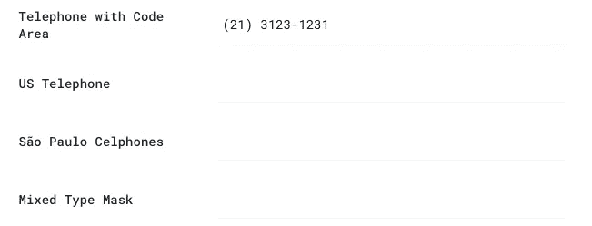

# 安装软件依赖项之前需要回答的 3 个关键问题

> 原文：<https://betterprogramming.pub/3-key-questions-to-answer-before-installing-software-dependency-e78e111e90c>

## 改变软件是很难的。以下是如何做的

帕特里克·托马索在 [Unsplash](https://unsplash.com?utm_source=medium&utm_medium=referral) 上的照片。

你看到一个新的闪亮的东西，你想要它。同样的行为也发生在软件上。每天，我们都会得到新的库和框架。其中一些只是炒作，对你的项目没有任何价值。

看看 2019 年前端场景的状态:

 [## JavaScript 2019 的状态:前端框架

### 发现今年最流行的 JavaScript 特性和技术。

2019.stateofjs.com](https://2019.stateofjs.com/front-end-frameworks/) 

你必须对依赖性没有偏见。问自己以下问题:

*   整合新图书馆的目的是什么？
*   会提高性能吗？
*   会不会成为其他团队成员的负担？

我最近有机会将[电话号码屏蔽](https://igorescobar.github.io/jQuery-Mask-Plugin/)添加到一个项目中。以电话屏蔽依赖为例，让我们进入实际问题。

# 1.依赖带来了什么好处？

创新代码可能成为遗留或未使用的代码。想想 [YAGNI](https://martinfowler.com/bliki/Yagni.html) 原理。

新的发展是特定的问题集。Angular 为企业 SPA 解决问题。React 为过渡到 SPA 的应用解决问题。使用现有的代码，大部分都不是针对你的问题集的。

添加压缩代码或编译脚本的库是必不可少的。省去了我们写几行代码的库是没用的。

想想未来的后果。使用库来修补某些东西可能会导致遗留或废弃的代码。

> "提醒:任何从未使用过的扩展点不仅仅是白费力气，还很可能成为你的绊脚石."— [@jeremydmiller](https://twitter.com/jeremydmiller/status/568797862441586688?lang=en)

电话号码屏蔽为最终用户带来更好的 UX。用户在输入电话号码时会得到帮助。屏蔽现在可以在您键入时格式化数字，并通过流畅的电话号码输入改进用户界面。

来源:[https://igorescobar.github.io/jQuery-Mask-Plugin/](https://igorescobar.github.io/jQuery-Mask-Plugin/)

# 2.添加依赖项需要多长时间？

为了将这个库用于项目，我们首先进行了一个 [PoC](https://en.wikipedia.org/wiki/Proof_of_concept) 。我们在电话号码屏蔽概念验证方面遇到了各种问题(例如，特定国家的验证是错误的，推广需要几天时间)。

进行 PoC 有助于尽早发现问题，并正确估计集成新的依赖项需要多长时间。

创建 PoC 后，我添加了文档，列出了我的解决方案的所有问题和备选方案。团队成员发现了它，并改进了现有的实现。

# 3.工作将来会有回报吗？

没有未来的好处，就没有理由添加新代码。考虑一下什么会改善你的依赖性。

我们没有电话验证。信件是允许的，但是我们没有标准的电话验证。添加电话号码屏蔽减少了修复漏洞所需的工作。标准电话验证也包括在内，所以我们也减少了这方面的工作。

# 结论

考虑你给这个项目带来了什么。添加新的依赖项会导致更多的混乱。仔细考虑，编写一个概念验证功能，并检查替代的依赖关系。

将此演示给其他团队成员，并为其创建一个文档页面。谈论它，向团队提出问题和顾虑。

感谢阅读！