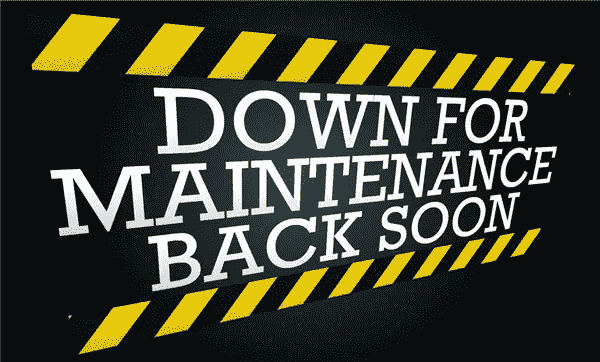
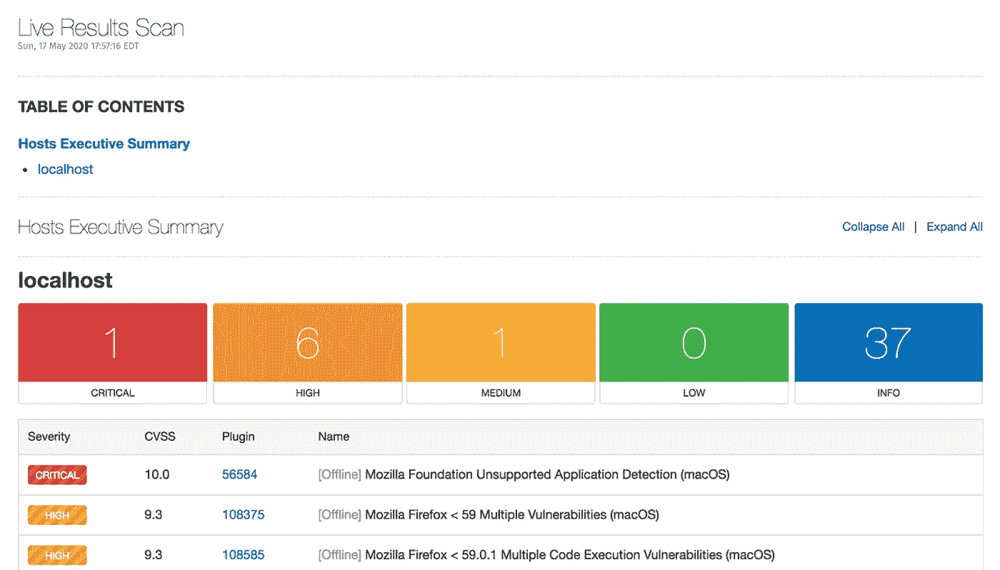

# 所有 Web 应用程序开发人员的 3 个关键安全概念

> 原文：<https://betterprogramming.pub/3-key-security-concepts-for-all-web-application-developers-d4f55c439302>

## 为什么每个计算机科学家都应该知道计算机安全的基础

来源:[https://ozkiwi 2001 . org/2018/02/移民-计划-系统-维护/](https://ozkiwi2001.org/2018/02/immigration-planned-system-maintenance/)

# 为什么网络安全很重要

7 月 8 日星期五，加拿大最大、最可靠的电信提供商罗杰斯公司关闭了全国互联网服务一整天。不仅在家工作的个人受到影响，整个企业和公共基础设施也受到影响。包括借记卡交易在内的许多银行服务全天关闭。这显然是一次高影响停机。

当天晚些时候与朋友交谈时，我开玩笑地说，我经历的上一次中断是我家附近一只可怜的松鼠咬断电线的结果(可怜的家伙)，在此之前，匿名子公司破解了索尼的 PlayStation 网络，使其瘫痪了一整年。

我很快得到的回应是，只有数据泄露才会导致加拿大全国范围的停电，因为加拿大的整个网络不可能通过一只松鼠可以访问的单一线路传输——这就是我轻松的评论。他们很快猜测，这是俄罗斯人对我们支持乌克兰或其他民族国家行为体的报复。

虽然我不想猜测是谁、什么和为什么，至少在本文中不想，但我相信这个例子说明了一个健壮的网络和相关软件在确保我们数据的可访问性(以及完整性/机密性)方面的重要性和影响。

然而，数据安全不仅限于确保我们的网络得到加强的工程师和程序员。随着网络钓鱼和社会工程事件的不断增加，网络安全正慢慢成为每个人的责任。此外，众所周知，设计安全比在生产中实施控制要便宜得多，也更有效。

从这个意义上说，网络安全是每个人的责任。但是因为程序员只需付出很少的额外努力就能产生最大的影响，所以程序员可以做的三件事将在下面讨论。

# 运行漏洞扫描工具

诸如 Nessus 甚至 NMAP 这样的漏洞扫描器提供了最大的性价比。截至 2021 年，过时和易受攻击的软件在 OWASP 的十大漏洞列表中排名第六。简单地运行一个扫描器并更新相应的软件是一种非常简单的方法，可以在常见的高影响 bug 进入生产之前对其进行修补。此外，在今天的敏捷环境中，补丁发布过程和相应的管道可以完全自动发生，不需要程序员的额外劳动。

Nessus 截图。来源:https://www.tenable.com/products/nessus/nessus-professional

# 净化输入

在 OWASP 的 2021 年顶级漏洞列表中，排在第三位的是代码注入。恶意用户可以将 javascript 或 SQL 代码放入输入字段，并让服务器代表他们执行数据。这可能导致敏感数据泄露和无数其他安全漏洞。然而，修复通常很简单，让编码人员参数化 SQL 查询或净化输入，并确保输入作为文本而不是代码传递给服务器。据 OWASP 称，94%的应用程序都有某种形式的注入，这种微小的变化会产生非常大的影响。

2017 年和 2021 年 10 大榜单。此处列出详细信息的来源:【https://owasp.org/www-project-top-ten/ 

## 适当的访问控制

坐在 OWASP 的第一把交椅上的是被破坏的访问控制。这意味着最终用户和系统管理员都可以访问他们本不应该访问的数据。与任何其他类型的漏洞相比，这种类型的安全缺陷在更多的应用程序中出现，并且具有最大的潜在影响。

通过默认拒绝对资源的访问和创建模型访问控制来强制记录所有权，而不是接受用户可以创建、读取、更新或删除任何记录，可以解决这类 bug。虽然这种类型的修复需要多一点的开销，但它只需要正确地完成一次，就会对整个应用程序产生影响，并防止最大的攻击媒介阵列。

## 网络安全——人人有责

一些小的修正，比如上面提到的，会对我们整体使用的软件产生很大的影响，让我们所依赖的网络变得更容易访问。通常，网络安全被视为硬推销，因为预防性药物似乎没有必要，直到往往为时已晚。

现在，我们对全国范围内的停电仍然记忆犹新(希望这是一只严格吃光纤的啮齿动物造成的)，我希望我们都可以花一点时间来思考我们可以对我们的软件做出的一些非常小的改变，这些改变对安全性有非常大的影响。