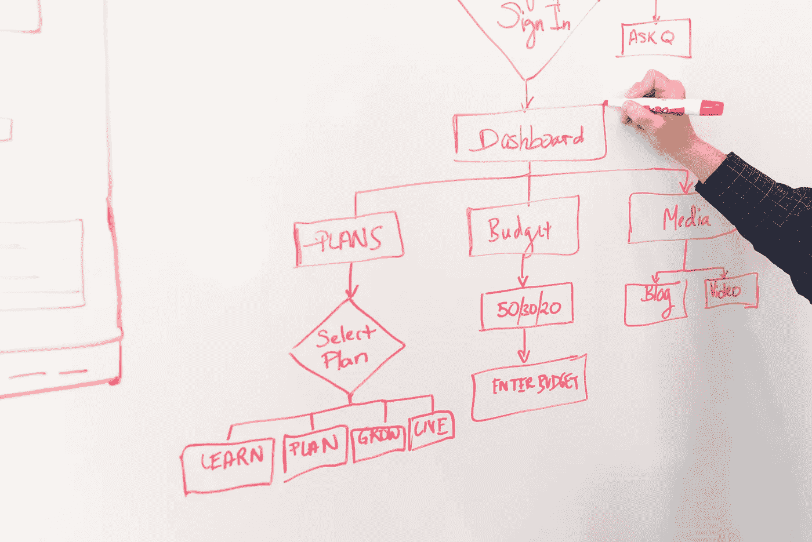

# 构建优秀的软件设计需要牢记的 3 个关键原则

> 原文：<https://betterprogramming.pub/3-keys-experienced-software-engineers-use-to-evaluate-designs-bde2a3546100>

## 支持您的软件是一件痛苦的事情吗？

克里斯蒂娜@ wocintechchat.com 在 [Unsplash](https://unsplash.com/?utm_source=unsplash&utm_medium=referral&utm_content=creditCopyText) 上的照片

经验丰富的软件工程师在维持工作多年后会学到好的软件设计。

当你在几年的时间里不得不向现有的代码库添加许多功能时，你就会知道在一个好的设计中应该寻找什么。更好的是，当你彻底抛弃旧的解决方案，用新的替代它。伟大设计的关键在于它是否经得起时间的考验。

伟大的设计必须是可扩展的、可维护的和可用的。

# **1。可扩展性:支持可能添加的更多类型的东西有多容易？**

找出可能需要扩展的东西，并在设计中为其做好计划。

项目通常类似于通用函数。有几个地方你需要支持更多类型的类似东西。

例如，我建立了一个图像处理管道，我们需要支持在应用程序中为不同的产品编码图像，并为每个用例编码不同的大小。

我们有两个需要通用的自由度:不同用例的图像和不同的图像大小。我们必须不断增加新的使用案例和规模。因此，设计必须尽可能地让它更容易适应。我们通过使该层可配置来做到这一点。

弄清楚你的设计的哪些部分可能需要在未来支持新的用例。然后使该部分可配置。

有一个反模式需要避免:不要过早地过度优化配置层。

太多时候，我认为工程师倾向于让他们的配置活在一些配置语言中，比如 yaml 或 thrift。但实际情况是，他们定义了这个庞大的规范，其中只有一半的初始属性被实际配置——其余的通常保持不变。

我所提倡的是首先将配置保存在代码中(不管怎样，你正在将 YAML 文件解析成代码，对吗？)，然后在六个用例之后把它变成一个合适的配置文件——不要忘记文档！

好的设计能在你可能会添加更多东西的地方经得起未来的考验。

# **2。可维护性:当问题出现时，调试问题的容易程度如何？**

我敢打赌，在一个系统的整个生命周期中，花在调试上的时间比花在构建上的时间要多。

优秀的设计让调试变得容易。团队中的任何人都可以进行调试。

当一个系统建立起来后，你很可能会有一个随叫随到的人在那里处理出错的事情。高级工程师也知道他们可能会很快转移到其他项目，他们不会总是在那里帮忙。

你如何使一个系统易于维护？

它必须使用简单的设计。你的设计越出人意料，人们就越难跟上进度。你应该使用你工作的地方最常见的设计。如果你试图逆潮流而动，往往会导致混乱。(我是罪魁祸首)

重用在你的公司中被很好使用的组件——不要试图使用新技术，你最好使用公司其他部门支持的。

如果您使用其他团队支持的技术，您就少了一个需要考虑的组件。

# **3。可用性:你的客户、其他团队或项目与你的设计整合的难易程度如何？**

你的项目并不存在于真空中——其他人需要使用它。

一旦你的系统上线，你将会花更多的时间帮助其他人使用它，就像你调试它一样。减少你花在解释它如何工作和如何使用的时间是为其他事情争取时间的最简单的方法。

你如何设计可用性？

与可维护性非常相似，它应该遵循人们在你的公司如何构建东西的惯例。你的 API 接受公共对象吗？你和其他人使用同样的框架吗？

通过另一个团队的人为了集成需要做多少工作来评估你的设计。他们能用他们有的调用你的 API 吗？设置一个东西需要几个步骤？

一旦你的项目成熟，最重要的事情之一就是:你的团队需要投入多少来建立一个新客户？

2002 年，杰夫·贝索斯发布了他臭名昭著的 API 命令，要求所有的服务都应该是自助的:团队必须通过 API 相互交流。

如果你有很多客户，你需要确保他们很容易加入进来。

一个必然的结果是，你的客户越少，你花在自助设计上的时间就越少。