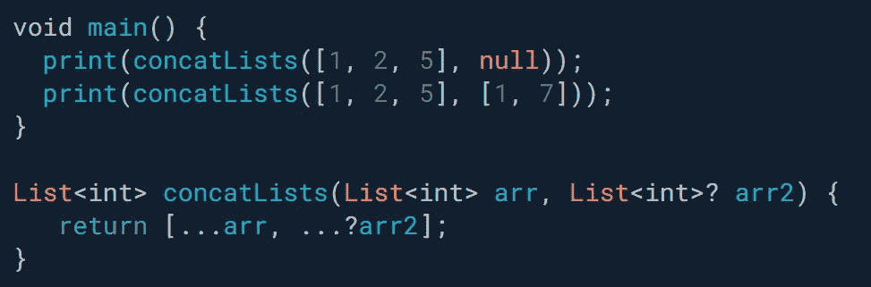
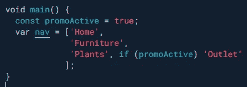
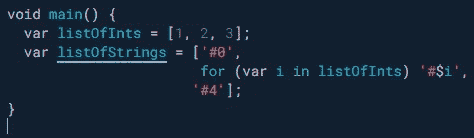
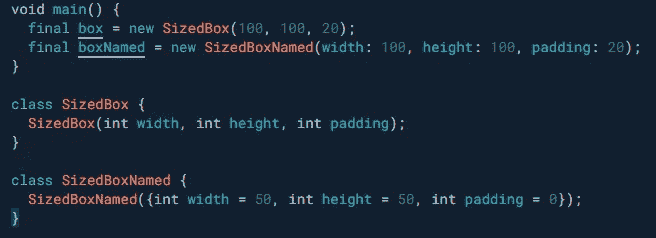
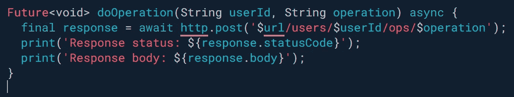

# 您在 JavaScript 中错过的 3 种 Dart 语言结构

> 原文：<https://betterprogramming.pub/3-language-constructs-from-dart-that-you-are-missing-out-on-in-javascript-23c53cb767a>

## Dart 最初被设计成转换成 JavaScript。然而，它从未胜过 TypeScript

由[卡桑德拉·德雷](https://unsplash.com/@cass_?utm_source=medium&utm_medium=referral)在 [Unsplash](https://unsplash.com?utm_source=medium&utm_medium=referral) 上拍摄。

随着最近的[扑](https://flutter.dev/)炒作，[镖](https://dart.dev/)获得了不少关注。Dart 最初是由 Google 设计和实现的，作为一种可以转换成 JavaScript 的语言，反之亦然。然而，它并没有在这方面取得太多进展，TypeScript 无疑成为了行业标准——这可能也是因为它是 JavaScript 的超集，而不是一种全新的语言。

然而，Dart 现在随着 Flutter 再次崛起。这里有三种非常酷的语言结构，您可以在 Dart 中使用，但在 TypeScript 或 JavaScript 中是不可能的。

# 条件扩散算子

这绝对是我的最爱，超级优雅，虽然写的时候只有 Dart ≥2.90。当您想要展开可能未定义的 iterable 时，可以使用条件展开运算符。它基本上是你希望传播的 iterable 的可选链接。考虑下面的例子，分别具有*【1，2，5】*和*【1，2，5，1，7】*的输出:

Dart 中的条件扩散运算符。

# 集合 if 和集合 for

这是一个一开始让我震惊的构造。用 Java 和 JavaScript 编程了这么长时间，`collection if`和`collection for`刚开始看起来很奇怪。但它们绝对可读性很强，非常有意义。让我们看一个为导航构建数组的示例:

Dart 中的集合。是的，这可以编译！

与`collection if`类似，您可以使用`collection for`将值插入列表:

Dart 中的集合

# 命名参数

您是否曾经阅读过一段代码——特别是一个函数调用——并想知道传入的参数实际上是做什么的？特别是在旧代码库中使用幻数或字符串的情况下，这可能是一个相当大的挑战，通常需要您将鼠标悬停在函数上以查看签名，以便能够理解传递的参数。

优势还不止于此。例如，您可以在签名的开头使用可选的命名参数，这样您就不会局限于将可选的函数参数放在末尾。

不幸的是，JavaScript 和 TypeScript 不提供命名参数。下面，你会发现一个例子，它展示了他们使代码更具可读性的能力。命名参数在 Dart 中使用得相当频繁(如果您使用过 Flutter，您肯定见过很多例子)。它们使您的小部件构造器非常优雅和可读。在不知道函数或构造函数的签名的情况下，您将确切地理解您传递给小部件的数字的含义。

在下面的例子中，当你只看 main 函数中的代码时，main 中的哪一个调用更具可读性？

Dart 中的命名参数

# 奖励—更好的字符串插值

我一直想知道字符串插值的意义是什么。如果无论如何我都必须使用花括号，我并没有节省太多的字符。我还不如用串联。

在我看来，Dart 以一种更好的方式解决了这个问题。这可能是因为他们不需要考虑向后兼容性。在 Dart 中，除了我们喜欢的双引号和单引号之外，您实际上不必使用不同的字符来使用字符串插值。最重要的是，您可以简单地使用`$`符号，而不必将您的标识符括在括号中。

这只在处理单个标识符时有效，但这是我经常遇到的情况，并且在 Dart 中使用字符串内插时使我的生活变得更容易。

这里有一个例子:

Dart 中的字符串插值

我希望您能够对 Dart 提供的很酷的语言特性有所了解。如果您想了解更多，请考虑咨询 [Dart 的官方语言之旅](https://dart.dev/guides/language/language-tour)。

感谢阅读！