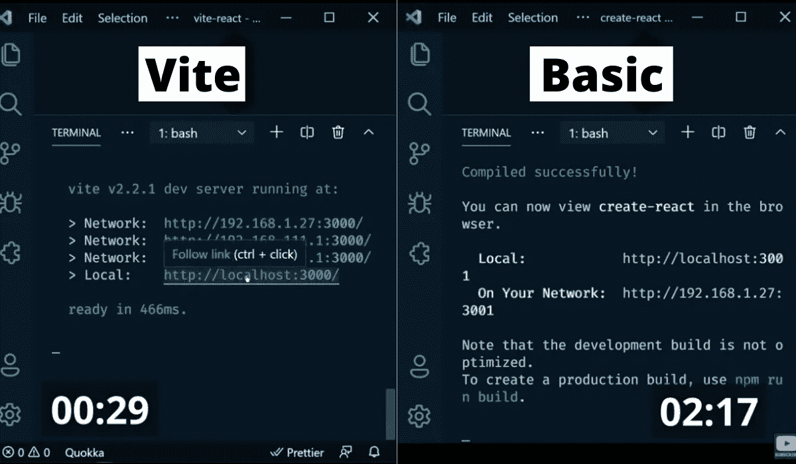
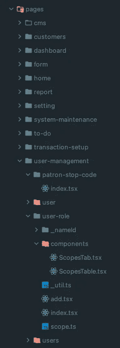
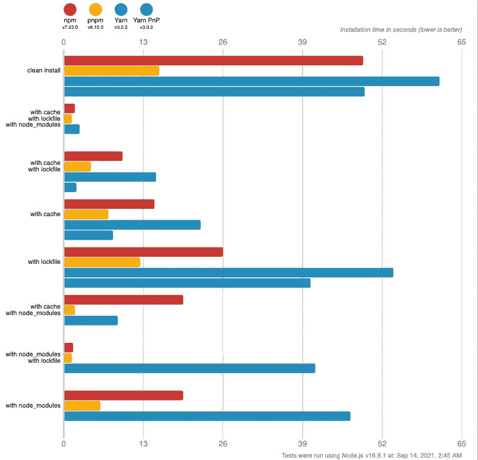
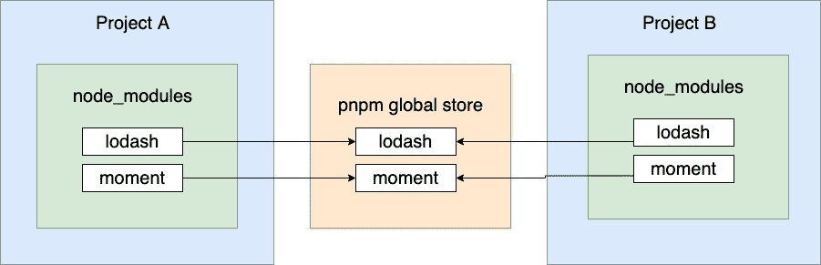
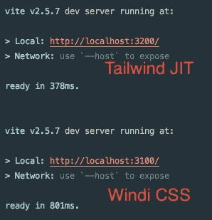

# 我在大多数 JavaScript 前端项目中使用的 3 个库

> 原文：<https://betterprogramming.pub/3-libraries-i-use-in-most-javascript-frontend-projects-555387be69c>

## 提升您的 web 应用程序的性能


克里斯·利维拉尼在 [Unsplash](https://unsplash.com?utm_source=medium&utm_medium=referral) 上的照片

我使用的是 2019 款 Macbook Pro，尽管该机器是开发人员的野兽，但我厌倦了在工作时间盯着纺车。

当热重装变得很慢时，mac 就滞后了，需要我经常做家务。最终，我玩了几个库，它们成了我的救星——我现在在我的大多数前端 JavaScript 项目中使用它们。

# 1.维特伊斯

我上个月接手了一个遗留的 React 项目，它有很多重复和冗余的代码。

该项目将 1 号地块用作捆扎机，启动和热重装需要很长时间。更糟糕的是，缓存消耗了我的 *~500MB* 磁盘空间！直到快没空间了我才注意到。每次我需要在`routes.tsx`中查找相应的文件时，它在`routes.tsx`中有超过 500 行。麻烦！稍后我将向你展示我如何自动生成路线，从 500 多行到 50 行！

我决定用 [Vite](https://vitejs.dev/) 来代替，因为它让我感觉我是当今最快的开发者！

所以这里的问题是:

## 为什么是 ViteJS？

假设您正在为一个大规模项目编码，开发服务器可能需要几分钟才能启动，对于热模块重新加载(HMR)，有时需要几秒钟才能在浏览器中反映出来！这两个问题都影响着开发人员的情绪和生产力。

某些依赖项太大，无法处理。Vite 正在使用`esbuild`来预捆绑依赖项。`Esbuild`用 Go 编写，编译成原生代码，所以比基于 JS 的捆绑器编译快 10 倍—100 倍。

当你编辑非普通的 JavaScript 文件时，它不会同时加载所有的源代码。这是 ESM 最好的部分之一，代码拆分！


基准测试由[埃文·华莱士](https://twitter.com/evanwallace/status/1314121407903617025)



截图来自 [codeSTACKr 的 Youtube 视频](https://youtu.be/LQQ3CR2JTX8?t=420)

`npm init vite` vs `npx create-react-app`。看出区别了吗？一旦你尝试了，你会上瘾的！Vite 的插件扩展了 Rollup 的插件接口，可以用 rollup 的配置来配置 Vite。

## 自动生成路线



文件夹结构

## **解释**

Vite 有一个名为`import.meta.glob`的内置函数可以导入多个模块，它正在使用`[fast-glob](https://github.com/mrmlnc/fast-glob)`。

我从以扩展名`.tsx`结尾的目录`pages`中导入所有模块，忽略名为`components`的目录和其中的文件，因为`components`包含私有组件。

如果文件名以`_`开头，以`tsx`结尾，URL 参数的`_`将替换为`:`。

你可以在的[测试你的 glob。](https://globster.xyz/)

# 2.PNPM

由于我的 Macbook 空间不足，删除各个项目中现有的`node_modules` 还不够！我必须寻找另一种解决方案。最终，我找到了 PNPM。



基准来自 [PNPM](https://pnpm.io/benchmarks)

PNPM 不仅速度快，而且节省空间！当你使用 NPM 或纱线时，如果你有 10 个项目使用`lodash`和`moment`，你将安装 10 次`lodash`和`moment`。

PNPM 将把依赖项安装到一个全局存储中，并且文件是从项目中硬链接的。这意味着如果你有 10 个使用 1MB 的`foo`的项目，它只消耗 1MB 的磁盘空间，而不是 10MB，对于相同版本的`foo`！



PNPM 全球商店解释

PNPM CLI 非常类似于 NPM 和纱。它还内置了对 monorepos 的支持。是时候告别`[lerna](https://lerna.js.org/)`了吗？我自己没试过。我现在不能评论任何事情。

我发现的唯一缺点是，PNPM 不符合阿尔派的码头工人形象，但这没什么大不了的。

# 3.Windi CSS



[回购的结果](https://github.com/antfu/vite-windi-tailwind-jit-compare)

[WindiCSS](https://windicss.org/) 和 [Tailwind JIT](https://tailwindcss.com/docs/just-in-time-mode) 是两个不同的东西。Windi 是由热情的开发者基于社区的，而一家公司支持 tailwind。据我所知，JIT 比 Windi 慢，但是现在 JIT 比 Windi 快多了。

然而，WindiCSS 比 Tailwind 提供了一些额外的功能。查看此[链接](https://windicss.org/features/)了解其特性。

WindiCSS 的团队还没有开始开发 JetBrain 的插件。所以，如果你需要自动完成，你需要安装 tailwindcss 的依赖项并使用官方插件。

我最喜欢 Vite 插件的一个特性是如下图所示的`attributify`模式:

```
// Snippet from [https://windicss.org/posts/v30.html#attributify-mode](https://windicss.org/posts/v30.html#attributify-mode)// windi.config.ts
export default {
  attributify: true,
}// magic below
<button 
  bg="blue-400 hover:blue-500 dark:blue-500 dark:hover:blue-600"
  text="sm white"
  font="mono light"
  p="y-2 x-4"
  border="2 rounded blue-200"
>
  Button
</button> // OR // windi.config.ts
export default {
  attributify: {
    prefix: 'w:',
  },
}// magic below<button 
  w:bg="blue-400 hover:blue-500 dark:blue-500 dark:hover:blue-600"
  w:text="sm white"
  w:font="mono light"
  w:p="y-2 x-4"
  w:border="2 rounded blue-200"
>
  Button
</button>
```

感谢阅读。

# **参考文献**

*   [ViteJS](https://vitejs.dev/)
*   [PNPM](https://pnpm.io/)
*   [WindiCSS](https://windicss.org/)
*   [尾翼 CSS](https://tailwindcss.com/)