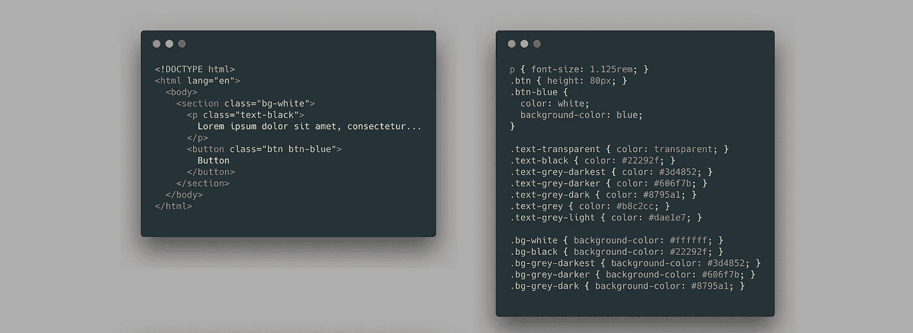
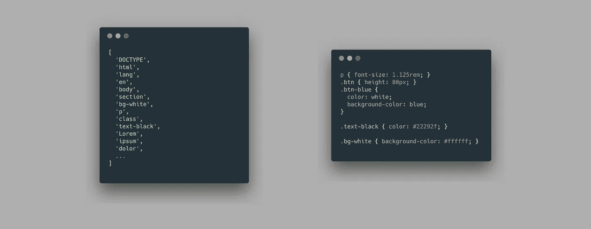

# 3 个库来移除未使用的 CSS

> 原文：<https://betterprogramming.pub/3-libraries-to-remove-unused-css-f09ffc9777da>

## 以及为什么你会使用一个库来完成这个任务

潘卡杰·帕特尔在 [Unsplash](https://unsplash.com?utm_source=medium&utm_medium=referral) 上的照片。

[2020 年 CSS 调查状态](https://stateofcss.com/)有一个部分专门针对实用程序库。在那一节中，问题是关于 StyleLint、PurgeCSS 和 PurifyCSS 的用法。其中两个库用于移除未使用的 CSS。作为 PurgeCSS 的作者和 PurifyCSS 的贡献者，我想花一点时间来解释那些库可以解决什么问题，并比较三个最流行的库来做这项工作。

# 为什么需要一个库来移除不用的 CSS？

像每个库一样，它们的使用依赖于用例，在有些情况下使用它们是没有意义的。本文中库最常见的用例是用 CSS 框架移除未使用的 CSS。

## CSS 框架

我过去使用 Bootstrap 的经历并不愉快，主要是因为我想为小型网站使用 CSS 框架。它们最终总是变得臃肿——尤其是对于单个静态页面。Bootstrap 提供了在网站上选择你将用来下载他们的 CSS 框架的精简版本的可能性。开发者体验很差。

相比之下，TailwindCSS 可以选择使用 PurgeCSS 来自动移除未使用的 CSS。当使用 TailwindCSS 时，你很少问自己是否应该考虑另一个框架来精简你的网站。您很少需要更改设置来停用规则。

## 传统网站

另一个用例是失去控制的遗留站点。虽然您可以要求开发人员来清理随着时间的推移积累的 CSS 混乱，但是您可以首先使用这个工具来采取主动。这些库会立刻给你的网站增加价值，并帮助你识别那些没有使用的 CSS。

## 关键页面

一些公司有不同的团队负责网站的多个部分。一个团队可以负责主应用程序页面，另一个团队负责注册和支付页面，另一个团队负责设置和管理页面。

在这些情况下，团队之间并不总是能看到代码。他们可能会选择一个通用的 CSS 框架，而不从其中删除任何 CSS 来利用缓存。但是关键页面还是应该有例外。

只看一次并需要高加载性能的页面，如注册和支付页面，可以使用这些库从框架中删除未使用的 CSS，并在最后的注册步骤中预加载完整版本。

# 概述和比较

## 采购

 [## 全人类/purgecss

### 当你在建立一个网站的时候，你可能会使用一个 CSS 框架，比如 Bootstrap，Materializecss…

github.com](https://github.com/FullHuman/purgecss) 

PurgeCSS 是这样工作的。首先，我们看我们网站的内容。除了我们的风格，它将是一切。对于一个简单的项目，它可能是 HTML 和 JavaScript 文件。我们想从这个内容中得到一个可以在 CSS 中使用的选择器列表。查看下图，我们可以看到选择器的位置:

初始 HTML 和 CSS 文件

一旦我们有了名单，主要过程就开始了。我们使用 PostCSS 解析 CSS 文件。然后，我们遍历抽象语法树(AST)。我们看一下每个规则，并分析组成它的选择器。如果我们注意到一个选择器不在列表中，这意味着它没有被使用，我们删除了这个规则。

在上面的 CSS 文件中，PurgeCSS 遍历规则，从`p`开始。它在列表中看到了`p`，因此决定不删除它。对于`text-transparent`，它在列表中看不到，规则被删除:

感知选择器(左)/CSS 输出(右)

PurgeCSS 提供了创建提取器的可能性。提取器是一个获取文件内容并提取其中使用的 CSS 选择器列表的函数。它允许更精确地删除未使用的 CSS。

您可以为每种文件类型指定要使用的提取器，从而获得最准确的结果。但是使用特定的提取器是可选的，您可以依赖默认的提取器。

## 纯化 CSS

 [## 纯化 css/纯化 CSS

### 一个接受内容(HTML/JS/PHP/etc)和 CSS 的函数，只返回使用过的 CSS。PurifyCSS 不修改…

github.com](https://github.com/purifycss/purifycss) 

PurifyCSS 的工作方式与 PurgeCSS 类似。它分别分析文件、内容和 CSS。它可以处理任何文件——不仅仅是 HTML 或 JavaScript。

但是 PurifyCSS 的主要缺陷是缺乏模块化。与 PurgeCSS 相比，它本质上定义了一个不能更改的提取器。PurifyCSS 的提取器提取每个单词，并基于一些用例。

我们以`.hello-world`为例。PurifyCSS 的提取器是为 JavaScript 设计的，可以将字符串连接起来形成一个类名。出于这个原因，它会将`hello`和`world`视为使用的类名，而不是`hello-world`。

因为每个单词都被认为是一个选择器，所以很多选择器都可能被错误地使用。它也不能处理实用 CSS 框架经常使用的特殊字符。

## UnCSS

 [## 联合国会议服务/联合国会议服务

### 从 CSS 中移除不用的样式。通过在 GitHub 上创建一个帐户，为 uncss/uncss 开发做出贡献。

github.com](https://github.com/uncss/uncss) 

UnCSS 以不同的方式处理这个问题。它不是分析文件，而是试图运行你的网站并在你的 CSS 文件中寻找选择器。正如它的自述文件中所指出的，UnCSS 首先用 jsdom 加载文件，然后执行 JavaScript。这样，它可以与没有 HTML 的 React 单页面应用程序一起工作。

然后，PostCSS 解析所有的样式表。UnCSS 查看样式表中定义的选择器列表，并在网站上运行`document.querySelector`。如果函数没有找到选择器，它将从 CSS 中移除。

由于其 HTML 模拟和 JavaScript 执行，UnCSS 有效地从 web 应用程序中移除了未使用的选择器。

但是，它的模拟在性能和实用性方面是有代价的。要从 Pug 模板文件中移除未使用的 CSS，您需要将 Pug 转换为 HTML，并在 jsdom 中模拟页面。在这一步之后，UnCSS 可以在每个选择器上运行`document.querySelector`。

这个过程的另一个问题是，在一些常见的用例中，元素最初不会出现。你可能需要点击网站上的一个按钮来让一个模态出现或者让另一个部分出现。

使用 UnCSS，您可以点击网站上的元素。但是它造成了维护负担。您可以将其视为创建一个小型 Cypress/Selenium 测试来检查您的应用程序并发现所有隐藏的部分。

目前，对于某些情况，UnCSS 可能是删除未使用的 CSS 的最准确的工具。如果您不使用服务器端渲染，并且有一个简单的包含 HTML 和 JavaScript 的单页网站，它应该可以正常工作，并且在 CSS 大小方面优于 PurgeCSS。

# 资源

 [## PurgeCSS 2.0

### 移除未使用的 CSS

medium.com](https://medium.com/full-human/purgecss-2-0-c0e812e6c4f6)  [## 比较|采购

### PurgeCSS 并不是唯一一个移除未使用 CSS 的工具。下面你会发现 PurgeCSS 和其他两个的比较…

purgecss.com](https://purgecss.com/comparison.html)