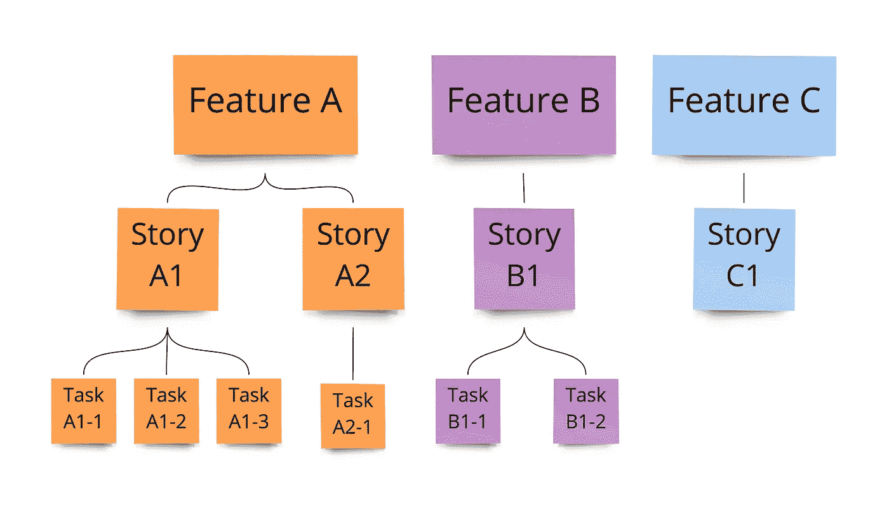
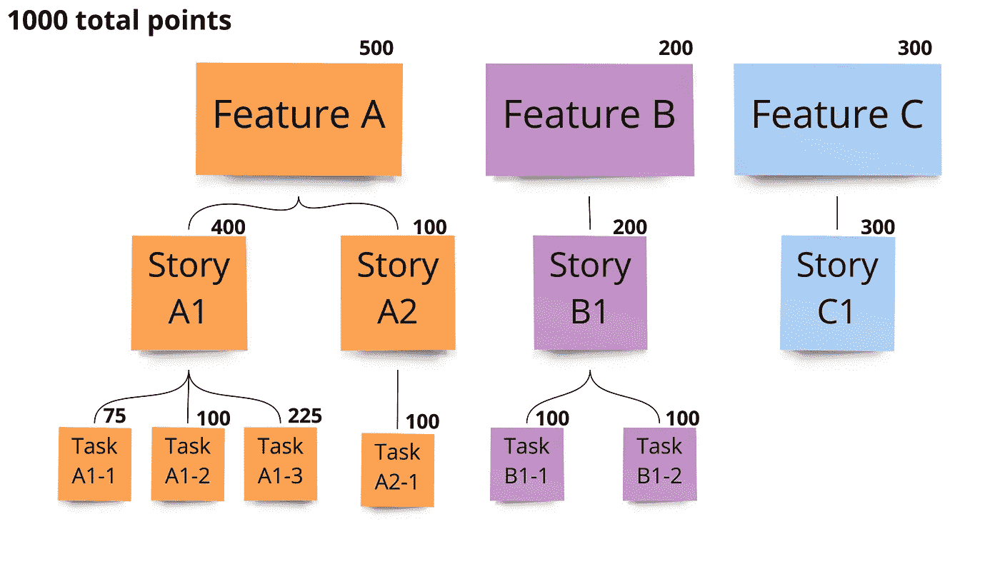
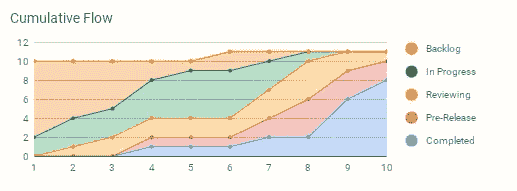

# 工程团队成功的 3 个衡量标准，而不是速度

> 原文：<https://betterprogramming.pub/3-metrics-for-engineering-team-success-other-than-velocity-5df9d79dbff9>

## 看过去的速度

Jo Szczepanska 在 [Unsplash](https://unsplash.com/s/photos/project-management?utm_source=unsplash&utm_medium=referral&utm_content=creditCopyText) 上拍摄的照片

> **更新**:我为 [PyOhio2022](https://www.pyohio.org/2022/) 做了关于这个话题的演讲。视频可从[这里](https://www.youtube.com/watch?v=-qpCJqQByx0)获得。

如果您在敏捷软件开发环境中工作过，您可能对测量团队速度的想法很熟悉。

速度是一个可以用故事点或小时来衡量的度量，它可以帮助回答团队是否以稳定的速度工作，以及给出团队在一次迭代中可以交付多少工作的想法。

例如，如果一个团队在过去的几次冲刺中保持了平均 25 分的速度，你可以假设他们会保持一个相似的速度，只要没有大的变化(新的项目或工具，改变团队成员，等等)。).虽然其他因素可能会发挥作用，这意味着他们将需要大约 4 次冲刺来完成一个估计包含 100 分用户故事的项目。

速度对于许多软件团队来说是一个重要的度量标准，但是以我的经验来看，它通常是管理的最重要的度量标准——通常是以错过故事的其余部分为代价的。

这里有一些在查看您团队的数据时要考虑的其他软件指标。

# 获得的商业价值

也许你遇到过这样的情况，你的团队有一个高的、稳定的速度，工作正在完成，但是你的客户(或者你的销售团队)没有看到增加到系统中的东西的价值。

有时这可能意味着你的团队正在关注不总是可见的技术债务或小的 bug 修复——这两者都是好事情！然而，你要确保平衡你的重构工作和给你产品的利益相关者带来价值的工作。

一种方法是在你的每个故事中使用**获得的商业价值** (EBV)。要使用这一指标，你必须在总分值中为你的产品的每个优秀故事分配一个分值。

举个例子，假设你的产品路线图上有 3 个即将到来的特性:特性 A、特性 B 和特性 c。每个特性都是由一个更小的用户故事子集组成的，但是它们有不同的复杂性。

特征及其子部分

与你的利益相关者一起工作，你决定多少点是可用的。这可以是一个任意的数字，但是你可以让它足够大，这样你就不会以半分结束。对于这个例子，我们将使用 **1000 点**。

现在，您的涉众检查并为各种工作项分配分值。根据完成每项任务会给企业带来多少价值，将分数分配给最小的工作单元。每一项的父值都是其子值的总和。

分配了值的特征及其子部件

在这个例子中，很明显，团队应该从功能 A 开始，然后是功能 C，然后是功能 b。但是，也可能是这样的情况，因为故事 A1 释放了功能 A 的大部分价值，所以故事 A2 可以推迟到功能 B & C 完成之后。

与 velocity 非常相似，EBV 可以帮助您创建燃耗/燃尽图，但不仅仅是工作点，您还可以看到交付了多少产品价值。

使用 EBV 的一个缺点是，它需要一个有知识的涉众来分配故事的价值，以积极地参与开发过程。代替一个积极的利益相关者，你可以尝试使用 [MAUT 技术](/out-of-control-backlog-try-prioritization-using-the-maut-technique-642b2c5761a6)给你的故事分配一个分数，以确定相对优先级。

# 研制周期

> **更新**:这个故事之前报道了这个指标为周期时间，但是我在这里描述的更接近于交付时间。周期时间是您团队流程的吞吐量(不包括积压工作或其他团队花费的时间)，是整个交付周期的一部分。感谢[累积流量](https://medium.com/u/1a694daf20c3#5，它只用了 2 周就完成了。
<h1 id=)
> 
> [如果你的团队在每一次冲刺中都取得了 25 分，那么在冲刺的最后两天，完成的分数会平稳地增加吗？或者这个数字会神奇地从完成的 3 分增加到 25 分？理想情况下，点数会在整个冲刺过程中增长，但是通过检查项目的**累积流程**，您可以帮助识别过程中的瓶颈。](https://medium.com/u/1a694daf20c3#5，它只用了 2 周就完成了。
<h1 id=)
> 
> [累积流程图一开始可能会令人困惑，但是可以提供很多有用的信息。我们以下面的 sprint 为例。这个表显示了在 sprint 的任何一天，每个状态下有多少个故事。(注意，本来有 10 个故事，但是在冲刺的第 6 天增加了第 11 个故事。)](https://medium.com/u/1a694daf20c3#5，它只用了 2 周就完成了。
<h1 id=)
> 
> [累积流程图的原始数据](https://medium.com/u/1a694daf20c3#5，它只用了 2 周就完成了。
<h1 id=)
> 
> [在上表中，团队有五个过程桶:Backlog、process、Reviewing、Pre-Release 和 Completed。随着 sprint 的进展，工作项目从待办事项列表中移出，并最终完成。下面的累积流程图用图表显示了这一点。](https://medium.com/u/1a694daf20c3#5，它只用了 2 周就完成了。
<h1 id=)
> 
> 
> 
> [使用 Scrumage 的](https://medium.com/u/1a694daf20c3#5，它只用了 2 周就完成了。
<h1 id=) [Google Sheets 模板](https://scrumage.com/blog/2012/10/sprint-burn-down-template-with-instructions/)创建的累积流程图
> 
> 这个图表能告诉我们关于这次冲刺的什么？
> 
> *   在任何一天，我们都可以看到工作项是如何分布的。例如，在第 6 天，很容易看到我们完成了所有 5 个阶段的工作，并且大部分工作正在进行中。
> *   由于审查和预发布都相当窄，后面的队列越来越宽，这可能表明存在瓶颈，尽管您应该与其他 sprint 数据进行比较以确定这一点。
> *   带的宽度可以告诉你物品在某一状态下花费了多长时间，并帮助你确定总周期时间的最大组成部分。
> 
> 累积流程与其他指标(如周期时间或交付时间)配合得很好，因为它可以让您看到流程的哪些部分花费了最多的时间。这允许你瞄准问题区域；如果“测试”是过程中花费时间最多的部分，也许您的团队会从额外的测试工程师中受益。
> 
> # 放弃
> 
> 1.  对于大多数有意义的软件度量，团队必须保持稳定。这意味着您不能添加或删除团队成员，或者让一个团队花了一年的时间在栈 A 上工作，然后突然分配他们在栈 B 上工作，并期望相同的结果。
> 2.  最有用的度量标准可能会根据团队的职能而变化。如果您有一个主要从事缺陷解决的团队，他们的优先级(以及他们的度量标准)将会与一个主要关注交付新的特性和功能的团队有所不同。
> 3.  所有的指标都有优点和缺点，并且有不同的方法来解释数据。这就是为什么使用不同的指标来获得对团队中发生的事情的不同看法是好的，并且不要太依赖任何单一的指标。

我希望这能对你有所帮助，我很想知道在你的开发团队中你是否有一个最喜欢的度量标准。