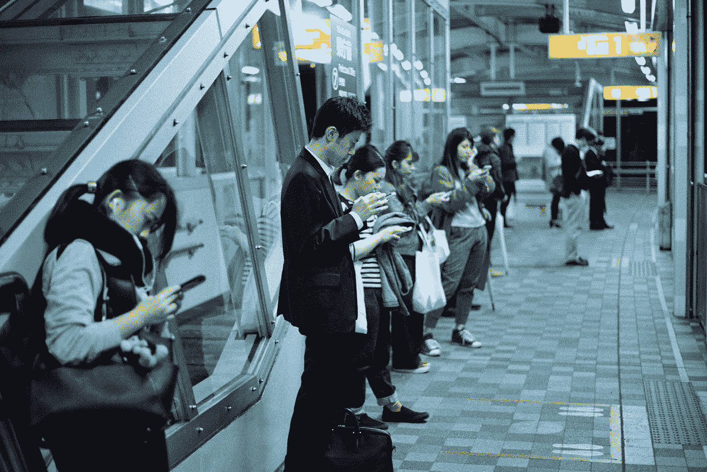
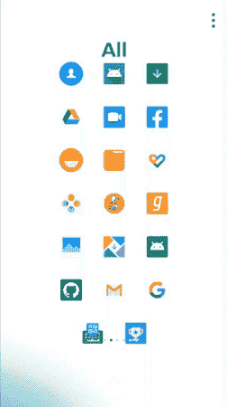
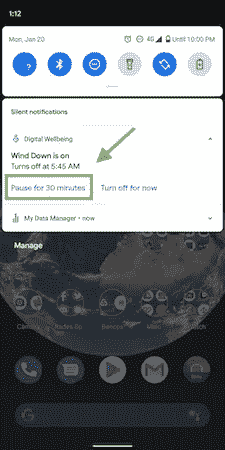
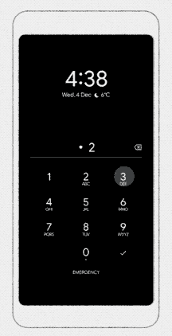
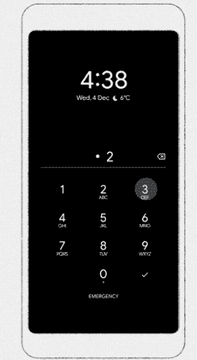
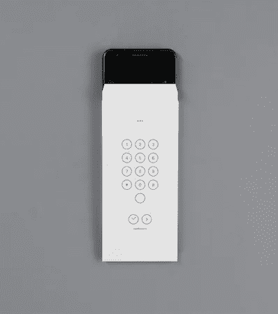

# 3 个新的谷歌应用程序帮助你集中注意力

> 原文：<https://betterprogramming.pub/3-new-google-apps-to-help-you-focus-71d6ded6fd01>

## 通过三个新的实验性应用程序，谷歌旨在抑制智能手机成瘾并改善数字福祉

由[延斯·约翰森](https://unsplash.com/@jens_johnsson?utm_source=medium&utm_medium=referral)在 [Unsplash](https://unsplash.com?utm_source=medium&utm_medium=referral) 上拍摄的照片

现在比智能手机更容易放人。技术是我们生活中不可或缺的一部分。我们依靠它。

通过数字福利工具和应用程序，谷歌努力利用技术来提高你的生产力和注意力，最大限度地减少智能手机引起的分心。

数字福利告诉我们，我们使用手机太多了。它旨在帮助我们在生活和智能手机之间找到平衡。

数字福利的理念不是告诉你少用手机。相反，通过一系列指标和功能，如免打扰、放松和聚焦模式，它旨在使我们与智能手机的交互更有意义，更省时。

在我们谈论谷歌最近为数字福利发布的新功能和实验性应用之前，让我们看看它已经在商店里有什么。

# 数字健康仪表板

所有 Android Pie 和更高版本的设置应用程序中都提供了数字健康仪表板。

仪表盘显示智能手机的使用指标——解锁次数、通知、屏幕时间，还可以让你为不同的应用程序设置截止时间。

除了这些指标之外，放松模式允许我们指定每天的就寝时间表，超过该时间，屏幕颜色将变为灰度。这个功能以一种有趣的方式混合了请勿打扰和夜间照明模式。

启用聚焦模式可以让您暂停某些让您分心的应用程序一段时间。

# 过去的数字健康应用

在过去的一年里，谷歌的创意实验室团队在数字福祉实验计划下推出了几个应用程序。在令人难以置信的 UX 和设计的支持下，这些实验性的应用程序都努力通过创新的概念来减少手机的使用。

## [**邮箱**](https://play.google.com/store/apps/details?id=com.digitalwellbeingexperiments.postbox)

这个 Android 应用程序旨在通过保存所有通知来最小化我们的分心。它允许我们选择一天中希望接收通知的次数，并在我们指定的时间相应地发送通知。

## [荒岛](https://play.google.com/store/apps/details?id=com.digitalwellbeingexperiments.desertisland)

当你外出短期度假时，你会带上你所有的东西吗？这个应用程序使用了那个概念，并挑战你一天只使用一组基本的应用程序。

## [解锁时钟](https://play.google.com/store/apps/details?id=com.digitalwellbeingexperiments.unlockclock)

这是一个基于动态壁纸的应用程序，显示你一天中解锁设备的次数。

## [我们翻转](https://play.google.com/store/apps/details?id=com.digitalwellbeingexperiments.weflip)

任何人都不希望对方一直打电话。

We Flip Android 应用程序允许一组人在一段时间内关闭技术，专注于彼此。由于附近的访问权限，如果有人解锁他们的手机，每个人都会收到通知。

## [纸手机](https://play.google.com/store/apps/details?id=com.withgoogle.experiments.unplugged)

这个实验通过让你从手机上打印出你需要的基本东西——笔记、日历、联系人，来挑战你的数字排毒。

## [变形](https://play.google.com/store/apps/details?id=com.digitalwellbeingexperiments.morph)

Morph 是一项令人兴奋的数字福利实验，允许您根据需要的时间对应用程序进行分类。

通过为不同的模式(家庭、工作、假期和自定义)设置最重要的应用程序，Morph 可以理解(基于地点和/或时间)，适应并显示这些应用程序的重要更新，同时休眠其他应用程序。

我手机上 Morph 应用程序的演示

# 数字福利有什么新内容？

在过去的几周里，谷歌发布了一系列令人兴奋的新实验应用，帮助你从设备上拔下插头，提高你的生产力，或者只是以互动的方式注意到你的使用行为。

放松功能最近有了一个有趣的升级，可以暂停 30 分钟。

# 1.屏幕秒表

谷歌创意实验室团队的最新产品受到了解锁时钟的启发。这个[安卓应用](https://play.google.com/store/apps/details?id=com.digitalwellbeingexperiments.screenstopwatch)在你的主屏幕上显示屏幕使用时间。这是实时的。

这个实验虽然很巧妙，但让你不断地检查你的智能手机，这可能会进一步分散一些人手头工作的注意力。

来源:[谷歌实验](https://experiments.withgoogle.com/activity-bubbles)

# 2.活动气泡

这个实验性应用程序背后的概念是相当微妙地向用户显示电话使用时间。你在屏幕上停留的时间越长，气泡就越多，覆盖了墙纸。

被认为是帮助你减少屏幕时间的一个实验，泡泡动画效果反而做了完全相反的事情。早期采用者正在寻找更多的方法来停留在手机上查看不断增长的气泡，从而增加他们的屏幕时间。

来源:[谷歌实验](https://experiments.withgoogle.com/activity-bubbles)

# 3.信封

谷歌最雄心勃勃的数字福祉实验发布由[特别项目](http://specialprojects.studio/project/envelope/)完成。

该[应用](https://play.google.com/store/apps/details?id=com.specialprojects.experiments.envelopecall)仅在发布时在 Pixel 3A 设备上工作。它会提示你把手机封在一个“信封”里，让你做最简单的工作——拨号、拍照。

这个想法很有趣。它摆脱了用户界面。设计是我们沉迷于手机的首要原因。但是这样做的方式很麻烦——在数字时代打印出信封，然后用信封包装我们的手机。

然而，这种追踪你离开智能手机的时间的聪明方法可能是瘾君子唯一需要的东西。

来源:[专项](http://specialprojects.studio/project/envelope/)

# 结论

今天，大多数人都对智能手机上瘾，这有时会妨碍工作效率，影响我们的注意力，并造成压力。

谷歌一直在推动数字福祉的发展，并通过这些开源实验向我们展示他们的方式。

但是，像谷歌已经发布的那些设计良好的具有沉浸式用户体验的应用程序能抑制智能手机成瘾吗？此外，从长远来看，谷歌自己的财务目标如何与之保持一致？

尽管采取了一些措施，但是人们可以争论当前的方法对于减少分心的有用性。话说回来，现在说还为时过早。

看到谷歌如何通过技术推进其数字福祉将是一件有趣的事情。

这一个到此为止。感谢阅读。