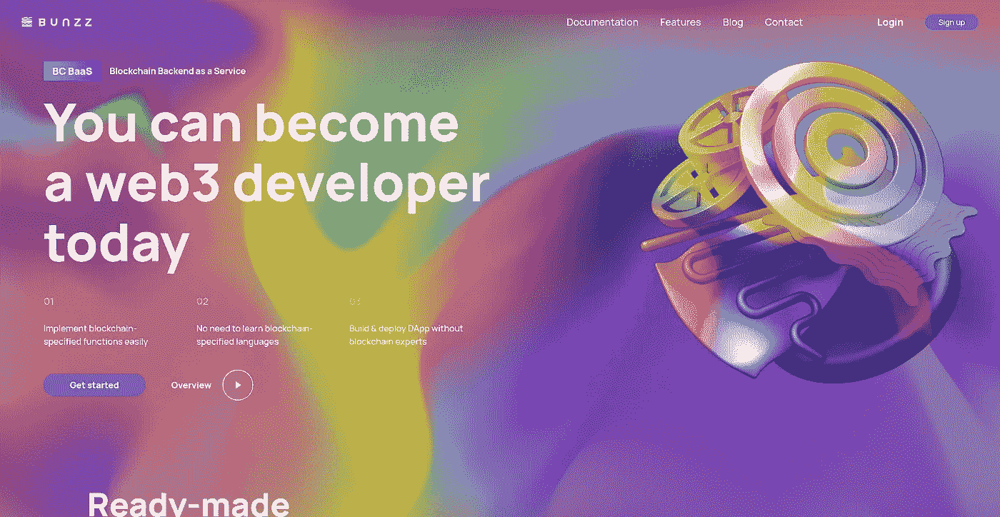
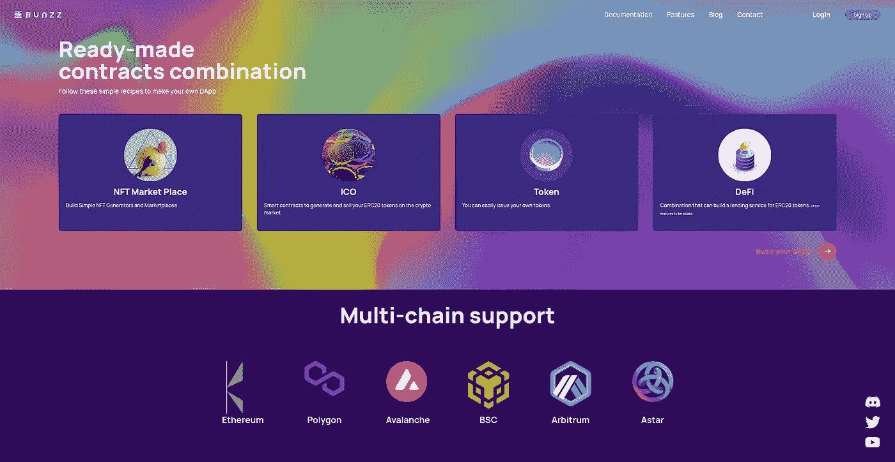
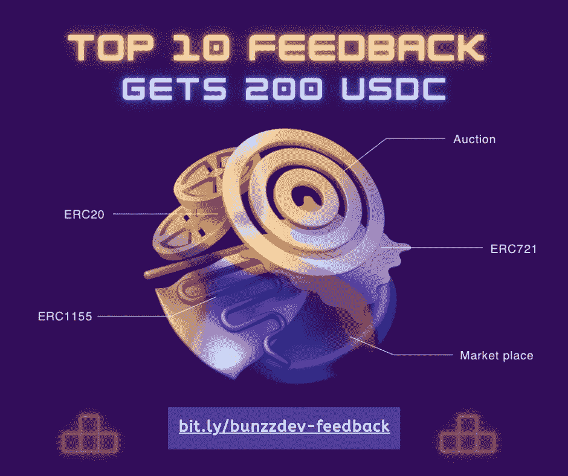
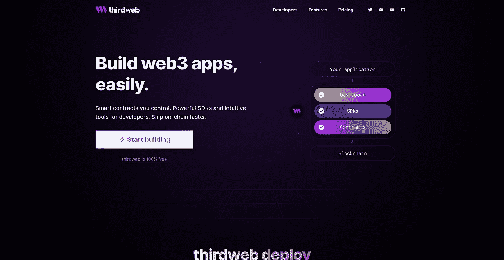
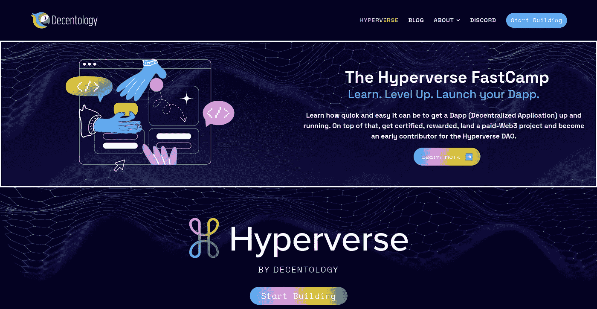

# 智能合约开发的三大无代码/低代码平台

> 原文：<https://betterprogramming.pub/3-no-code-platforms-to-build-and-deploy-smart-contracts-11a51196796a>

## 无需代码即可构建和部署智能合约。

无代码或低代码智能合约开发平台已经被创建，以使其更容易成为区块链开发人员。

然而，随着无代码和低代码平台的出现，现在几乎可以立即创建高端智能合约应用程序。我们几乎可以构建任何东西，而且将区块链驱动的应用程序与无缝的低代码解决方案集成起来也更简单。

这种软件开发方法也提高了生产率，因为我们可以在更短的时间内完成更多的工作。创造这些产品的公司已经为最终用户做了调查。这使得广大用户能够快速部署他们的区块链网络。

低代码和无代码智能合约开发也旨在促进各种区块链应用程序集成到现实环境中。

有很多可用的无代码智能合约和 DApp 开发平台，但这是我最喜欢的三个，尤其是对于不熟悉 web3 的 web2 开发者:

# **Bunzz**

[Bunzz](https://www.bunzz.dev/) 让你轻松构建 web3 应用。它是一个智能合约，即开发人员无需编写一行代码即可快速、轻松地构建 DApps 的服务平台。

[Bunzz](https://www.bunzz.dev/) 平台截图。

Bunzz 开发人员无需编写一行代码，即可轻松构建 DApp 开发的智能合约，并将其部署到 EVM 兼容的区块链网络中。

邦兹支持的 EVM 链。

该平台通过提供易于实施的 SDK，简化了需要高级知识的智能合同的开发，使开发人员能够更加专注于增值工作。

Bunzz Dev 目前向在平台中反馈体验的开发者提供 200 个 USDC。

给予反馈并获得回报。200 USDC 的前 10 个反馈。点击了解更多信息并给出您的反馈

# **第三网页**

[Thirdweb](https://thirdweb.com/) 是一个平台，它为创作者、艺术家和企业家提供一套工具来轻松构建、启动和管理 Web3 项目。它使用户无需编写一行代码就可以在他们的 Web3 项目中添加诸如 NFT、市场和社交令牌之类的特性。

Thirdweb 平台截图

# **Decentology**

[Decentology](https://www.decentology.com/) 是一家 web3 初创公司，致力于让 JavaScript 开发者更容易获得区块链开发。他们打算将第一批 1000 万名 JavaScript 开发者带到区块链。

Decentology 平台截图。

Decentology 有两种产品:

*   [Hyperverse](https://www.decentology.com/blog/composing-the-hyperverse) :一个让开发人员像 web2 APIs 一样轻松构建和消费智能合约原语的平台，具有货币化和由审计员提供的保险层。
*   [DappStarter](https://dappstarter.decentology.com/) —面向区块链的全栈开发环境。

你可以选择并使用上面的任何平台来开始构建 web3 应用程序，即使你对 Solidity 或核心区块链编程概念没有任何概念，这些平台消除了这些痛苦，并允许你快速构建和部署 DApps！