# 3 Pandas 功能用于分组和汇总数据

> 原文：<https://betterprogramming.pub/3-pandas-functions-to-group-and-aggregate-data-9763a32583bb>

## 导入数据并进行简单和多重聚合


约翰-马克·史密斯在 [Unsplash](https://unsplash.com/) 上拍摄的照片。

当你用 Python 处理数据时，肯定有一个库永远不会离开你: [pandas](https://pandas.pydata.org/) 。这是一个非常强大和直观的开源库，提供了对处理高维数据集有用的数据结构。

有两种主要的数据结构:

*   `Series`为一维数组。
*   `DataFrame`用于包含行和列的二维表格。

在本文中，我将重点介绍将数据集分组的最有用的函数。然后，您可以计算统计数据，如平均值、标准差、最大值、最小值等等。

您将学会使用`apply`、`cut`、`groupby`和`agg`功能。通过图形表示获得关于数据的新见解非常有用。

```
**Table of contents**:1\. [Import data](#5a1e)2\. [Simple aggregations](#99f9)3\. [Multiple aggregations](#b16c)
```

# 1.输入数据

让我们导入库和数据集。我们将使用 sklearn 库中的波士顿房价数据集。


这个`DataFrame`只包含数字特征，但是我们需要分类变量来将数据集分成组。因此，我们将使用数据集的描述性统计数据创建这些分类变量:

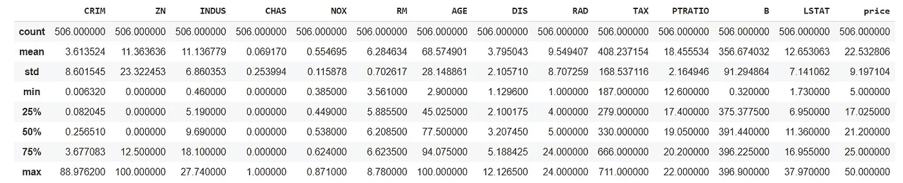

假设我们需要 RM 和 price 的分类特征，它们分别是每所住宅的平均房间数和房价的中值(10，000 美元)。根据这些数字特征的值的范围，这些变量应该具有不同的级别。我们将使用第一个和第三个分位数的值来创建分类特征的级别。这些新变量将使用`apply`函数创建。

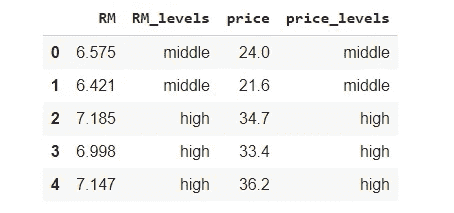

为了创建这些新列，我使用了`apply`函数，默认情况下，它沿着数据集的每一行工作。它按顺序检查条件。第一个级别将包含被视为小于第一个分位数的数值特征的值。“中间”级别的数值特征介于第一个分位数和第三个分位数之间。第三和最后一个级别的值将仅大于第三个分位数。

构建这些因素的另一种方法是利用`cut`函数。当你需要建立多层次的变量时，这是一个更有效的方法。和之前一样，我们可以将价格值分为三组:[3，5.8]、[5.8，6.6]、[6.6，9]。值 *3* 和 *9* 对应于该变量的最小值和最大值。对于房间的数量，将进行相同的推理。通过只传递 bin 值和`right=False`参数来忽略右边的极值，我们将看到一组值:

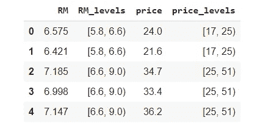

如果你想保留这些标签，你应该小心。即使这些新列的类型是分类的，但是**单个元素是区间对象，而不是字符串**！如果您尝试过滤特定类别的价格值，搜索将不会返回任何内容。

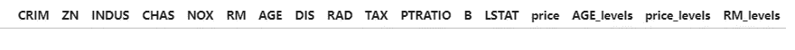

如果您检查 price_levels 列的类型，仅取第一行，您可以用眼睛看到您真正拥有的内容:

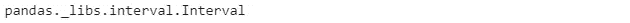

然后，如果你想保持这些间隔，我建议你一招，以避免任何并发症。我们可以为每个组传递标签，用字符串列表设置参数标签。

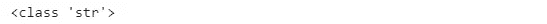

现在你有了字符串对象！无论如何，在本教程中，我将保留标签，如下所示，始终指定参数标签:

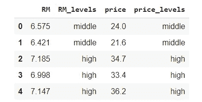

# 2.简单聚合

一旦我们完成了前面的步骤，我们终于可以开始根据一些特征对数据集进行分组了。假设我们想知道每种价格类型的每一列的平均值:

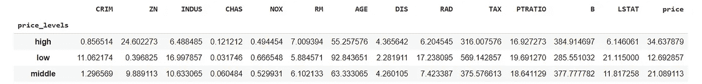

如您所见，每个级别都有一行，其中包含数据集中所有变量的相应平均值。`price_levels`变量被认为是索引，因为默认情况下`groupby`返回组标签作为索引。我们可以看到层次的顺序似乎是随意的。让我们看看为什么:

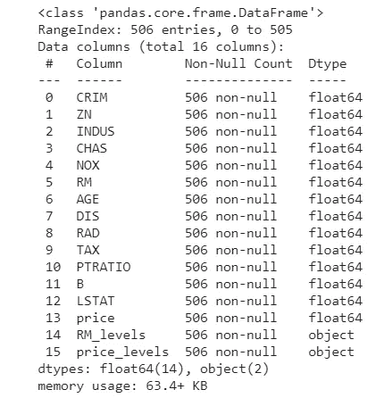

目前，新变量只是作为对象被记忆。我们可以看到它们需要转换成类别。一旦我们转换了它们，我们最好对变量的级别进行排序。

让我们再次尝试对每个价格级别的数据集进行分组。在这种情况下，我们将`as_index`参数设置为`False`，因此组标签不再被视为索引:

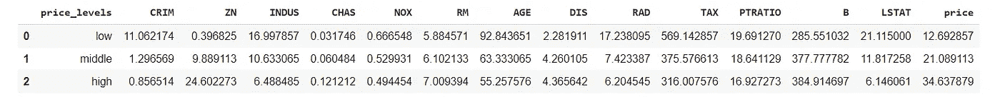

现在我们可以看到有序的级别，并且`price_levels`变量不再是一个索引。数据集中有许多列。减少列的一种可能方法是只选择一些功能(例如 RM 和 price 列)。我们也可以按价格水平降序排列。

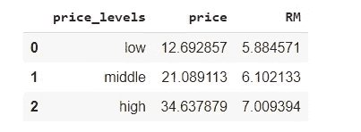

随着房间数量的增加，房价也越来越高。如果我们想使用平均值、最小值和最大值之外的统计数据怎么办？一种方法是使用`apply`函数。在这种情况下，我们想知道两个列(CRIM 和 LSTAT)的值的范围，这两个列分别是城镇的人均犯罪率和人口中较低地位的百分比。

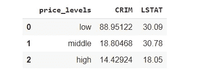

我们可以看到，随着房价的上涨，犯罪率和社会地位的下降。我们也可以通过柱状图来观察:


# 3.多重聚合

为了对几个列进行多重聚合，我们可以使用`agg`函数来应用每个所选列的平均值、最小值、最大值和标准偏差。结果将根据价格类型进行分组。

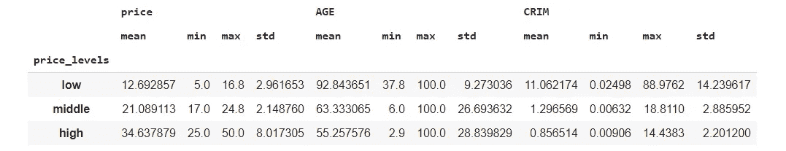

我们可以观察到，当我们添加了`agg`函数后，`as_index`参数不再有效。为了不将组标签作为索引，我们可以将`reset_index`函数放在最后:

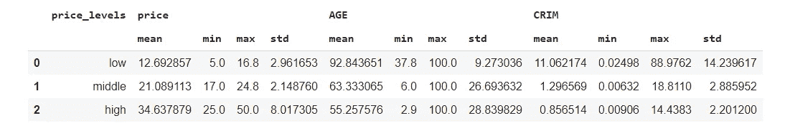

现在，您已经聚合了所有要素，但是如果您需要使用该数据集，就会出现问题。选择特定特征时，需要指定双重索引:

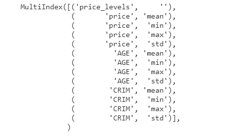

使用这些双指数可能会很复杂。我建议以这种方式更改列名，以避免任何复杂性:

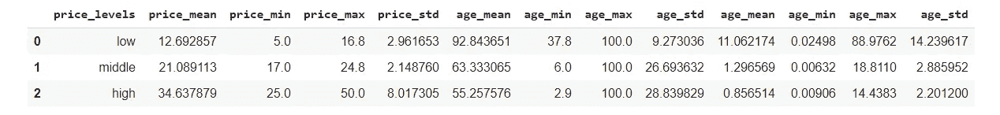

瞧，现在你有了一个更容易使用的`DataFrame`。

为了根据列应用不同的统计数据，我们可以向`agg`函数传递一个字典，其中键是列的名称，而值是我们想要测量的聚合函数。这一次，我们将使用两个要素对数据集进行分组。

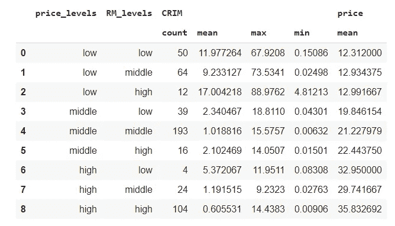

我们会试着通过柱状图寻找新的见解。第一步，我们将更改数据集的标签，然后我们将查看房间数最高的观察值。

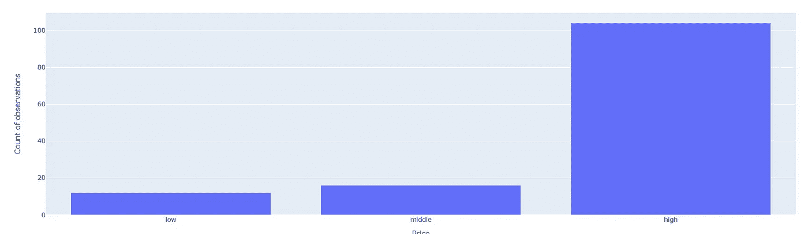

很明显，当价格高的时候，房子的数量会更多，因为我们选择了大量的房间。的确，房间数量和房子价格之间存在正相关关系。

# 最后的想法

这些是逐步理解将数据集分组的函数的步骤。希望你看完这些例子后更加自信。

感谢阅读。祝您愉快！

# **参考文献**

*   [https://pandas.pydata.org/docs/reference/api/pandas.DataFrame.apply.html](https://pandas.pydata.org/docs/reference/api/pandas.DataFrame.apply.html)
*   [https://pandas . pydata . org/docs/reference/API/pandas . cut . html](https://pandas.pydata.org/docs/reference/api/pandas.DataFrame.groupby.html)
*   https://www.google.com/search?q=groupby+pandas&OQ = group by+熊猫& aqs=chrome..69i 57j 0j 0 I 20 I 263j 0 L2 j 69 I 60j 69 I 61j 69 I 60.5962j 0j 7&sourceid = chrome&ie = UTF-8
*   【https://pandas.pydata.org/docs/reference/api/pandas. DataFrame.agg.html

**你喜欢我的文章吗？** [***成为会员***](https://eugenia-anello.medium.com/membership) ***每天无限获取数据科学新帖！这是一种间接的支持我的方式，不会给你带来任何额外的费用。如果您已经是会员，*** [***订阅***](https://eugenia-anello.medium.com/subscribe) ***每当我发布新的数据科学和 python 指南时，您都可以收到电子邮件！***